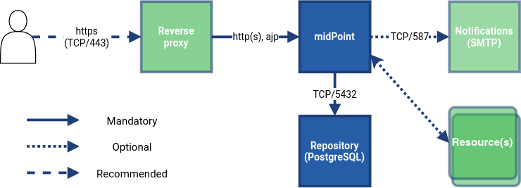

= MidPoint Installation Guides
:page-nav-title: Installation
:page-wiki-name: Installation Guide
:page-wiki-id: 1310779
:page-wiki-metadata-create-user: semancik
:page-wiki-metadata-create-date: 2011-05-11T13:48:08.155+02:00
:page-wiki-metadata-modify-user: semancik
:page-wiki-metadata-modify-date: 2019-02-27T18:38:20.663+01:00
:page-display-order: 80
:page-upkeep-status: green
:page-toc: top
:page-keywords:  [ 'install', 'guide' ]



This section describes how to install midPoint.

If this is your first time installing midPoint, see xref:../quickstart/[].

== Installation options

There are several ways to install midPoint.

Before you start installing, consider the following questions:

* Do you want to start from scratch?
* Do you already have a part of your environment up and running?
* Do you only want to test midPoint?

All these aspects may impact your choice of the installation option.
You can choose from the following:

* <<containerized,Containerized installation (recommended)>>
* <<traditional,Traditional installation>>
* <<build,Building from source code>>

[[containerized]]
=== Containerized installation (Recommended)

Installing midPoint in a xref:./containers/[container] is the most suitable option for the purposes of demos, testing, proofs of concept, or development.
With containers, you can deploy midPoint quickly.

You can use "ready to run" containers with system dependencies that enable you to quickly address the most common use cases.

These containers can also be installed in cloud.

[TIP]
====
The quickest way to deploy midPoint is to use the xref:../quickstart/[midpoint-quickstart script] setup which is based on containers.
This is a pre-configured setup that includes everything you need to start using midPoint right away.
It is ideal for testing, demos, and learning purposes.
====

[[traditional]]
=== Traditional installation

This is used when containers do not cover your use case.

In a traditional installation, you will be installing from a xref:./bare-installation/distribution/[distribution package].

Note that this installation requires more time and effort.
You will need to address some considerations yourself, for example, if you have the correct version of JAVA.

You can download distribution packages from https://evolveum.com/download/.

[[build]]
=== Build from source code
We are *open source*!
If you are a developer or you are simply curious, you can install midPoint from the xref:./bare-installation/source/[source code].

We recommend this option only if you have a good reason for it.
Building from source code not only takes more time, but it also requires you to have a build environment and more storage space to support the build process.

You can obtain the source code from the Evolveum GitHub repository at https://github.com/Evolveum.

== Deployment schema

The technical components of midPoint installation are the following:

== Which version to install

When choosing a midPoint version to install, it is important to distinguish between stable releases and support branch releases.

* xref:/midpoint/versioning[Stable releases] are intended for general use.
They follow the standard versioning scheme, and are the typical choice for production environments.

* xref:/midpoint/install/bare-installation/using-support-branch/[Support branches] are continuously maintained, and new builds are produced after each committed change.
This means they contain the latest bug fixes sooner than official patch releases.
As a result, support branch builds can be preferable when you need a fix that is not yet included in the latest released version.

Support branch builds are not formal releases and may receive less comprehensive testing than official versions.
Therefore, they are best suited for situations where quick access to fixes is more important than strict release stability, while standard production deployments should generally prefer the latest official patch release unless there is a specific reason to use a support branch.

== See Also

* xref:../quickstart/[]
* xref:/book/[MidPoint Book]
* https://www.youtube.com/channel/UCSDs8qBlv7MgRKRLu1rU_FQ[Evolveum YouTube channel]
* xref:/midpoint/features/current/[]
* xref:../reference/[Configuration Reference]
* xref:/support/[Subscription and Support]