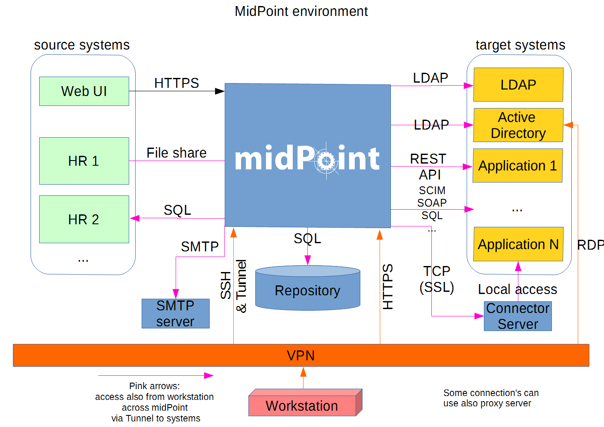
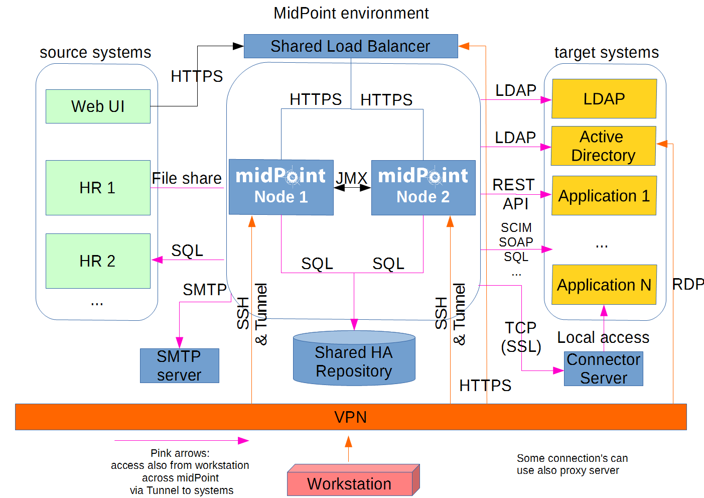

= System Requirements
:page-wiki-name: System Requirements
:page-upkeep-status: red
:page-toc: top

== Deployment Architecture

The midPoint system consists of the deployment units:

* MidPoint server

* Database system

* Connector servers (optional)

Each of these deployment units have slightly different characteristics and requirements, therefore each is described in a separate section below.

[NOTE]
.Approximation
====
Generally speaking it is very difficult to provide precise sizing of midPoint system, because the sizing will mostly depend on the usage pattern, the number and character of running tasks, connected resources, synchronization and workflow processes and so on.
It is very difficult to predict all the factors.
This document provides estimations that are based on production experience of typical deployments and general rules.
These may or may not be directly applicable to your environment.
The usual adjustment of the platform size and parameters during system operation according to the IT operation best practices is assumed in this estimation.
====

== Sizing of MidPoint Server

MidPoint server is the main part of any midPoint installation.
MidPoint server takes most of the load from user interaction and data processing.
Therefore it is most sensitive to the CPU load and RAM size.

[%autowidth]
|===
|  | Minimal | Typicalup to 5,000 users | Typicalup to 50,000 users | Typicalup to 100,000 users

| CPU
| 1 core
| 4 cores
| 8 cores
| 16 cores

| RAM
| 4GB
| 8GB
| 16GB
| 16GB

| Disk space
| 2GB
| 10GB
| 20GB
| 40GB

| Disk I/O
| negligible
| negligible
| negligible
| negligible

|===

=== Number of midPoint server instances

The sizing table above assumes that there will be a single midPoint instance (node) running.
Multi-node midpoint instances are usually deployed due to the high availability reasons and these are usually two-node systems.
In this case each node needs to be dimensioned to take a full load of the system, therefore both node should be deployed according to the table below.

Another reason for multi-node deployment is to isolate synchronous load (e.g. user interactions) and asynchronous load (e.g. tasks and processes).
However, there is no universal rule for sizing of such a system.
Case-to-case analysis and measurements are required in this case.
However the numbers provided in the table above may be used as a starting point.

== Sizing of Database System

Database system is used to store vast majority of midPoint data.

[TIP]
.Shared database
====
 For small and medium midPoint deployments *we strongly recommend to re-use existing database system* that you have already deployed.
The database load caused by midPoint is usually small and it does not justify building a dedicated database system (except for a very rare cases).
Therefore we rather recommend to reuse existing database engine and just to create new database (database schema) for midPoint to isolate it from other applications.

There are substantial deployment and operational advantages if existing database system is reused:

* The operations staff do not need to learn new technology.
MidPoint supports all the major database engines therefore your previous investment into the technology can be reused.

* The operations staff do not need to configure and maintain yet another database engine.

* The highly-available (HA) database configuration are not easy to set up and maintain and they are usually underutilized.
By reusing your existing HA database you are saving the cost new HA configuration and you are improving the utilization of an existing system.

====

The load on the database system is the most sensitive to the size and character of the data and on the usage patterns and also on the type and configuration of the database system used.
Therefore use the following number with care.
For a more precise estimate please consult the database engineers.

[%autowidth]
|===
|  | Minimal | Typicalup to 5,000 users | Typicalup to 100,000 users

| CPU
| 1 core
| 2 cores
| 8 cores

| RAM
| 2GB
| 3GB
| 12GB

| Disk space
| 1GB
| 5GB
| 20GB100GB for 3 months audit

| Disk I/O
| small
| medium
| medium to high

|===

The numbers above assume that midPoint will be used only to store operational data and only a reasonably small amount of historical data (e.g. audit records).
In case that you plan using midPoint to store historical data then proper data retention and capacity planning must take place before evaluating the database sizing.

== Connector Servers (optional)

wiki:Connector+Server[Connector Servers] are small software components that act as a proxy for connectors that cannot run inside midPoint.
Deployment of these components is quite rare.
However the resource requirements of connector servers are extremely small.
It is usually too small to measure: tiny portion of CPU, RAM and disk space measured in megabytes.
We strongly recommend deploying these components on shared servers.

== High Availability

There are several approaches to implement high availability (HA) for midPoint deployment.
Each strategy has different characteristics and costs:

* HA-based on virtualization

* Load balanced with shared HA database

* Load balanced with dedicated database

[TIP]
.Not business critical
====
Please note that midPoint is an identity management system and as such it is seldom a business critical system.
If midPoint fails there is usually only a negligible harm.
The integrated systems (resources) are independent from the midPoint instance (by design).
Therefore midPoint failure does not influence the operation of such systems in any significant way.
MidPoint failure can influence the management capabilities, password resets and so on.
But these functions are usually *not critical* for operation, especially if the outages of midPoint are short (minutes).
Even longer outages (hours) do not usually impact operation of the infrastructure in any significant way.
This is important to keep in mind when choosing the right HA strategy.
====

=== Virtualization-based HA

The easiest way to implement high availability is to use HA features of the underlying virtualization infrastructure.
In case that the host machine running midPoint virtual machine fails it is easy to fail over the whole virtual machine to a different host.
There is obviously some downtime while the failover takes place (usually few minutes).
However as midPoint is not critical system this is more than acceptable.

This is very cost-efficient failover strategy.
It is recommended especially if midPoint and the database runs on the same virtual machine.

In this case midPoint is set up to run in a single-node configuration (which is default) and no extra configuration is necessary.
The HA mechanisms are completely transparent.
MidPoint has internal mechanisms to recover from system outages that will be automatically used in this setup after the failover.

=== Load Balanced with Shared HA Database

In this case there are several instances of midPoint servers that are load balances on the HTTP layer by using standard HTTP load balancer (sticky mode).
All the midPoint servers are connecting to the same database which has internal HA mechanisms.
MidPoint is sharing the database engine with other applications.

This set-up assumes using a shared database instance that already had HA mechanisms.
As this database is shared with several applications then even a active-active HA mechanisms are justifiable as the cost of the HA set-up is divided among several applications.

=== Load Balanced with Dedicated Database

In this case there are several instances of midPoint servers that are load balances on the HTTP layer by using standard HTTP load balancer (sticky mode).
All the midPoint servers are connecting to the same database which has internal HA mechanisms.
The database engine installation is dedicated for midPoint.

This is the most expensive set-up and it is seldom justifiable due to the cost of the HA database system.
The usual compromise in this case is to use active-passive database HA strategies.
Due to the low criticality of midPoint this is usually acceptable from the operational point of view.

== Software requirements

Please, refer to specific wiki:midPoint+Releases[midPoint Releases] documentation for software requirements.

== Infrastructure requirements

When we start the AIM project, not only midPoint server(s), database and load balancer (if required) must be prepared.
We also need to have access to infrastructure, where these servers are running and also access to source and target systems.
In most cases, infrastructure is prepared on customer site by their administrators.
The next schema represents the basic scenario:

You can see one midPoint installation with sample connections.
In most cases, the biggest square with midPoint logo is represented as Linux virtual machine with wiki:Installation+Guide#InstallationGuide-Pre-requisites[preinstalled ]java SE development Kit (for example OpenJDK), Apache Tomcat from linux repository prepared to run as service, and tools like telnet, wget, mlocate.
Rarely a windows server is used.
Sometimes customer also wiki:Installation+Guide#InstallationGuide-Installation[installs ]the latest midPoint release, but in most cases, installation is provided by Identity engineer (supplier).

Database repository in most cases we use shared on existing DB server and have access to it over SQL protocol (for example MS SQL on default TCP port 1433, 1521 for Oracle, ...) from midPoint server - please configure also firewall(s).
Also, a new DB schema is created for midPoint with new technical user and DB owner permissions.
Sometimes we have separated DB server or can we use DB server in the same virtual machine as midPoint is installed but only in single node version.

If e-mail notifications are needed, access to SMTP server and also the new account with send privileges is required.
Sometimes it is also required access to SMS gateway and have the account privileges to send SMS.

Many development and deployments are provided remotely, the best practice is to prepare secure VPN access for each team members separately with direct access to midPoint server over SSH, enabled tunneling and with HTTPS access (8443 is default internal tomcat port, or 443 with transformation to tomcat port).
MidPoint Web UI (self service) in most cases is also accessible for all employees in customer's intranet over HTTPS.

Other source systems are HR, for example, represented as Excel table (on schema _HR 1_) when HR manager after each change (or once a day/week) save actual content to CSV file to the location, where midPoint can read, proceed & rename it (File share).
If there is a sophisticated HR system, we can access employee and organizational structure data over prepared read only DB views directly over SQL (on schema _HR 2_) prepared by HR supplier - SQL account required.
Or we can use existing SOAP or REST APIs to read these data - API account/key is required.

The most frequent target system is LDAP (for example Open LDAP with standard port 636 or 389), or Active Directory when we also need Remote Desktop Connection (RDP) - ideal is directly from the workstation, but tunneling over midPoint server is also possible.
Also, the technical account with full permissions to concerned DN or domain is required.

Connection to other target systems can be over REST API (Application 1 - HTTPS), or SOAP, SCIM (Application 2, 3, ... - HTTPS), SQL or something proprietary (for example wiki:SAP+Connector[SAP and JCo]) - need to enable API, open firewall on servers where system is running and account with concerned access to manage the identities.
Sometimes, when the customer also using cloud services (for example Office 365), access to internet is granted over the proxy server.

Sometimes, midPoint also needs to have local access to the system (Application N), in this case, a wiki:Connector+Server[connector server] component is installed on the server, where the system is already installed for example to run some scripts to prepare home directory.

If the situation requires two or more midPoint nodes, the schema looks like this:

Over VPN, identity engineer needs an access to all nodes (node 1, node2: SSH & Tunnel and also HTTP/S access to local tomcat what can be tunneled), nodes jobs are synchronized over JMX.

Each midPoint nodes needs to have an access to SMTP server (if notifications are required), shared HA DB Repository and all source and target systems to have full HA support and when one node is down, other nodes need to replace his all jobs.

End user and also identity engineer are using midPoint Web UI over load balancer (HTTPS).

All of these connections to source or target systems we can check over tools: ping, telnet and wget from midPoint server and also from the workstation (after configured tunnels).

== Environment requirements

In IAM projects we are using at least two environments: test & production.
In many cases also local midPoint installation on the identity engineers workstation or third environment for development on customers infrastructure.

The best practice is to have the same as the possible configuration in all of these environments but completely isolated without no access for example from test midPoint to production Application 1. VPN can be shared of course.

For identity development, it's ideal to have in the test environment the same operating system & version, same application version and data as you have in production for all source and target systems.
More and more differences mean more and more use cases, when something is working and well tested in the test environment, but don't work in production when the same configuration is deployed with the appropriate changed endpoints and accounts.

If data are sensitive, and is a problem to take it for the development phase, we can have obfuscated and only some sample data, but schema and all attributes what you are using we need to have filled in the same way as in production to minimize differences and need all use cases what you have in system.
What does this mean? For example, you think, all employees data in HR is correct - because HR guys say it of course - but you have some old data, when this HR guys inherited, or was migrated from old HR system, or have some new mandatory fields empty, or filled only with one space, or have a keying mistake in family name, or no diacritical characters, or in local language and not in English what your are using in other systems, or some employees are duplicated, or in wrong organizational structure, and so on.
What's happened when you have these discrepancies? User can have wrong login name, wrong access, paired login in one target system with account of another employee, or don't disabled or deleted accounts for old employees and so on.

If we are also deploying the solution to production, we have access to the production environment and his data, it is not necessary to obfuscate data for test or development environment, because the same identity engineer is doing the development, testing and deploy part.

We have many and many and many bad experiences when in test environment we don't have access to production data in the development phase.
In deployment phase to production, we must do quick fixes in configuration and connector's because the ideal word about sample data consistency and the real word and production data is too different and all your clear presumptions in practice are uprooted.
Please don't waste our time and your money and our nerves with pseudo security decisions.

IDM project is at least about consolidating user, organizational structure, and access data, and we will found every discrepancies and exception in production (if will do it) and you need to decide what will be done with it and need to resolve it, and is not a good choice to do this when you are doing acceptance testing or have problems in production and hard deadlines.

== See Also

* wiki:midPoint+Releases[midPoint Releases]

* wiki:High+Availability+and+Load+Balancing[High Availability and Load Balancing]

