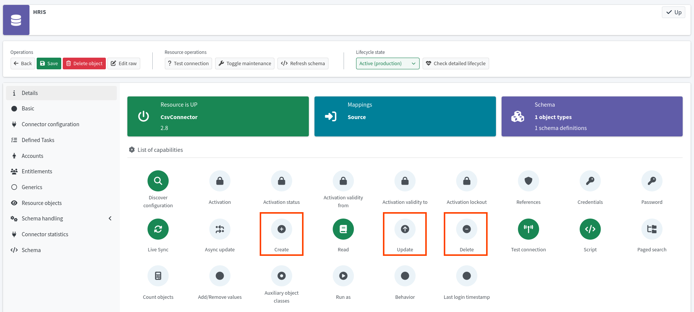

= Define mapping and synchronization rules
:page-nav-title: Define mapping and synchronization rules
:page-display-order: 120
:page-toc: top
:experimental:
:icons: font

Before you can import any user accounts, you need to define user data handling rules,
as well as specify synchronization rules on how to behave when users are discovered, updated, deleted, and so on.

== What awaits you in this module

You are about to create two sets of rules telling midPoint how to manage the HRIS application data.
Firstly, you need to define synchronization rules.

Synchronization situation is what happens when midPoint correlates (synchronizes) its object repository with a remote resource, such as the HRIS.
Newly discovered accounts not yet seen by midPoint are unmatched, accounts removed from the resource are deleted, etc.
Read more on the topic:

* xref:/midpoint/reference/synchronization/introduction/[]
* xref:/midpoint/reference/synchronization/situations/[]

Each synchronization situation can have some reaction from midPoint, such as linking a new xref:/midpoint/reference/schema/focus-and-projections/[focal object] to a discovered account.
You are now about to define reactions to synchronization situations.

Secondly, you will create mapping rules, telling midPoint which source attribute maps to which focal object attribute.
Mapping rules are basically a mapping table telling midPoint which "external" (application resource) attribute (e.g., `surname`) corresponds to which "internal" (focus) attribute (e.g., `familyName`).

See xref:/midpoint/features/current/mapping/[] to learn more about the topic.

Lastly, you will configure midPoint so that it can only read from the HRIS application, not write to it.
This is an additional data protection layer should you make a mistake when you deploy the configuration to production.

:sectnums:

== Set synchronization rules

Firstly, tell midPoint what to do in what synchronization situation.

*Follow this configuration guide: xref:/midpoint/reference/admin-gui/resource-wizard/object-type/synchronization/[]*

Define these rules:

[cols="2,1,1,1,4"]
|====
| Name | Situation | Reaction | Lifecycle state | Comments

| add-focus-for-unmatched
| Unmatched
| Add focus
| Active
| The account from CSV does not exist in midPoint yet, so create the user (focus) in midPoint.

// technically not needed in clean MP but they need to add it later anyway so I'm putting it here already @dakle
| link-unlinked
| Unlinked
| Link
| Active
| There is a focus for the account but it is not linked to the shadow of the account yet, let us link it. This is not used during the first import, but it is necessary for later when the account shadows are in midPoint already.

| synchronize-linked
| Linked
| Synchronize
| Active
| Synchronize the data between the remote account and the focus based on mappings.

|====

[TIP]
====
At this point, both the synchronization and mapping rules can be set as _Active_ because the whole resource is still in the _Proposed_ lifecycle state.
You can consider lifecycle states as hierarchical.
Refer to xref:/midpoint/reference/concepts/object-lifecycle/[] for more details about lifecycle states.
====

== Map user data

Secondly, you need to map the resource-side account attributes to the attributes of user focal objects in midPoint.

*Follow this configuration guide: xref:/midpoint/reference/admin-gui/resource-wizard/object-type/mapping/[]*

Use *inbound mappings* because you are pulling attributes _from_ the HRIS application _to_ midPoint.

Below are the rules to define.

[NOTE]
====
The resource-side attribute names (ie., Source) match those used in the xref:/midpoint/methodology/first-steps-training/connect-source-system/#playground-data-used-in-this-guide[MID-301 course training data].
If you use your own systems, adjust the source names as needed.
====

.Mappings for HRIS accounts data manipulation
[cols="2,1,1,1,1,5"]
|====
| Name | Source | Expression | Target | Lifecycle state | Comments

| empnum-to-name
| `empnum`
| As is
| `name`
| Active
| The `name` attribute values must be unique, hence the employee number is the best choice now.
    Later, you will generate unique usernames.

| empnum-to-personalNumber
| `empnum`
| As is
| `personalNumber`
| Active
| `empnum` is also important for employee identification, so we map it to a dedicated attribute. It will stay there even after you create unique usernames.

| firstName-to-givenName
| `firstName`
| As is
| `givenName`
| Active
.2+<.^| First and last names are used to construct a full name.

| surname-to-familyName
| `surname`
| As is
| `familyName`
| Active

| locality-to-locality
| `locality`
| As is
| `locality`
| Active
| User location will be later used with the full name for a last-resort correlation.

| status-to-lifecycleState
| `status`
| Script
| `lifecycleState`
| Active
| Translate textual status to midPoint user lifecycle state.
    Find the script to use beneath the table.
    Click btn:[Show script] to edit the script.

|====

[[mapping-script]]
.The status-to-lifecycleState mapping conversion script
[source,groovy]
----
switch (input) {
   case 'In': <1>
      'active'
      break

   case 'Long-term leave': <1>
      'suspended'
      break

   case 'Former employee': <1>
      'archived'
      break
}
----
<1> Adjust to the corresponding values of the attribute in your system.
    These values are used in the MID-301 training data.

.Inbound mappings for the HR resource
image::hris-inbound-mappings.webp["Inbound mappings for the HR resource"]

.Naming conventions for mapping names
[NOTE]
====
You may be curious about why we name the mappings as shown above.
At first glance, it seems unnecessary to name the mapping _surname-to-familyName_
since it is evident that it takes _surname_ as input and outputs its content to _familyName_.

You are correct, but the rationale behind this naming convention is that *mapping names must be unique within the object type*.
This approach helps to ensure that.

As for spaces vs. dashes—you can use either, but dash signs are generally the saver option.
Treat mapping names as filenames.
====

== Make the resource read-only

If you are dealing with a resource the data of which you do not want to change, it is best to adjust the xref:/midpoint/reference/resources/resource-configuration/capabilities/[configured capabilities] of the resource so that mistakes cannot happen.

. In your HR resource, go to icon:info[] *Details*.
. Disable the *Create*, *Update*, and *Delete* capabilites.
	** You can disable Create and Delete by clicking their respective buttons.
		As for the Update capability, you need to select *Enabled*: _False_ in the modal that appears after clicking the capability button.
. Click [.nowrap]#icon:save[] btn:[Save]# at the top left.

.Resource capabilities screen with the Create, Update, and Delete capabilities highlighted and disabled as per the instructions above

:sectnums!:

== Next steps

With this configuration finished, you are now ready to import users to midPoint.

[.nowrap]#icon:arrow-right[] *xref:/midpoint/methodology/first-steps-training/connect-source-system/import-accounts-from-hris/[]*#