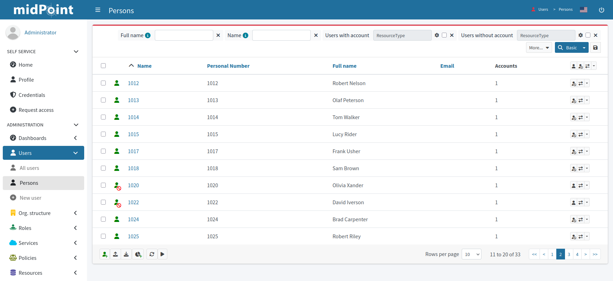

= Import users from the HR system
:page-nav-title: Import users from HRIS
:page-display-order: 130
:page-toc: top
:experimental:
:icons: font

With the mapping and synchronization configuration from the previous module finished, you are now ready to import users from the source HRIS application to midPoint.

== What awaits you in this module

Your goal in this module is to import accounts from the HRIS application to midPoint.
Before the actual import, you will verify that your midPoint configuration behaves as expected, and then import the accounts.

First, you will simulate import of one user to do the basic check of mapping and synchronization rules behavior.

After that, you will simulate importing all user accounts.
This time, you will see the number of user accounts imported and what data would be pulled from the HRIS appliaction to midPoint.
If need be, you will amend the configuration of the HRIS resource in midPoint and run the simulation again.

Having confirmed the correctness of the configuration, you will then import the user accounts to midPoint for real.

[TIP]
====
We strongly suggest you *never skip simulations*.
It is the best way to make sure your resource configuration behaves as expected, and fix it if needed.
====

:sectnums:

== Simulate a single account import

You first simulate importing one account.
This is useful for catching the most basic configuration errors, and it is fast because midPoint does not have to fetch _all_ the users from the source application.

*Follow this guide: xref:/midpoint/reference/tasks/synchronization-tasks/import-and-reconciliation/gui/#simulate-import-of-a-single-object[Simulate import of a single object]*

Once the simulation is done, inspect the results and verify the source application user attributes are mapped correctly to midPoint.
If not, adjust the mapping configuration.
Once everything looks good, proceed to the full import simulation.

== Simulate importing all users

The next step is to simulate importing all users.

*Follow this guide: xref:/midpoint/reference/tasks/synchronization-tasks/import-and-reconciliation/gui/[]*

. Select [.nowrap]#icon:upload[] btn:[Import task]#.
. Switch on the *Simulate task* toggle to activate simulation mode.
. Select the _Preview_ mode with the _Development_ configuration in the xref:/midpoint/reference/tasks/synchronization-tasks/import-and-reconciliation/gui#execution[execution setup screen].
. Run the task.
. xref:/midpoint/reference/tasks/synchronization-tasks/import-and-reconciliation/gui/#read-simulation-results[Inspect the simulation results]
. Rectify the mapping and synchronization rules configuration if needed.

Refer to xref:/midpoint/reference/simulation/[] for more details on simulations.

[NOTE]
====
You may notice a discrepancy between the number of activated focal objects (users) and the total number of added accounts.
That is expected if xref:/midpoint/methodology/first-steps-training/connect-source-system/define-mapping-and-synchronization-rules/#map-user-data[your _status-to-lifecycleState_ mapping sets some people as inactive].

All HRIS application accounts (with xref:/midpoint/methodology/first-steps-training/connect-source-system/connect-hris/#filter-out-irrelevant-hr-entries[some exceptions]) get shadows and focal objects in midPoint, but only the current employees are activated as per the mapping.

In the simulation results screen:

    * Click btn:[More info] in the *Focus activated* tile to see all users that would be activated (current employees).
    * Click the number in the *Added objects* row in the [.nowrap]#icon:flask[] *Simulation task details*# sidebar to view all accounts that would be added.
====

== Import users for real

Once you confirm you get the expected results during the simulations, you can import the HRIS user accounts for real.

=== Activate your configuration

Make sure you have all the relevant items in the _Active_ lifecycle state because you are not simulating anymore:

* The whole resource
* The object type for accounts
* The mapping rules
* The synchronization rules

*Follow this guide: xref:/midpoint/reference/admin-gui/resource-wizard/create-resource-using-wizard/#activate-proposed-resource[Activate proposed resource]*

=== Create production import task

Create an import task similar to the simulation one, but this time for production—do not switch on the simulation toggle.

*Follow this guide: xref:/midpoint/reference/tasks/synchronization-tasks/import-and-reconciliation/gui/[]*

=== Check the import results

Once you run the production import task and it finishes, you can check the results in two places in midPoint:

. [.nowrap]#icon:male[] *Accounts*# section in the HRIS resource contains the accounts imported from your HRIS application.
. [.nowrap]#icon:user[] *Users*# > [.nowrap]#icon:user[] *Persons*# lists focal objects (i.e., users) created based on the accounts in the HRIS application.

.List of focal objects (users) with the Person archetype

If you see a list similar to the one above―congratulations, you have imported your users to midPoint and you are ready to connect a target system to midPoint.
If not, revisit the mapping and synchronization settings to investigate possible misconfiguration.

.Do you really suggest using numbers as usernames?
[TIP]
====
Good and timely question.
Technically, it is fine to use employee numbers as usernames, but you are right.
It is better to use actual names for user identifiers.
You will learn how to do that later in the guide.
====

:sectnums!:

== Next steps

Accounts from the source application are imported.
It is time to integrate the target system.

[.nowrap]#icon:arrow-right[] *xref:/midpoint/methodology/first-steps-training/integrate-target-system/[]*#