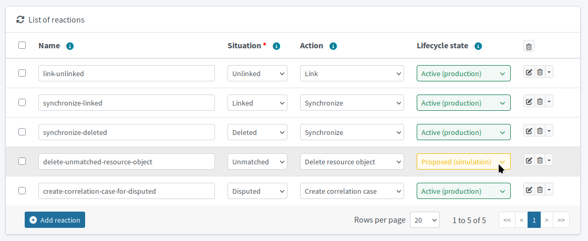
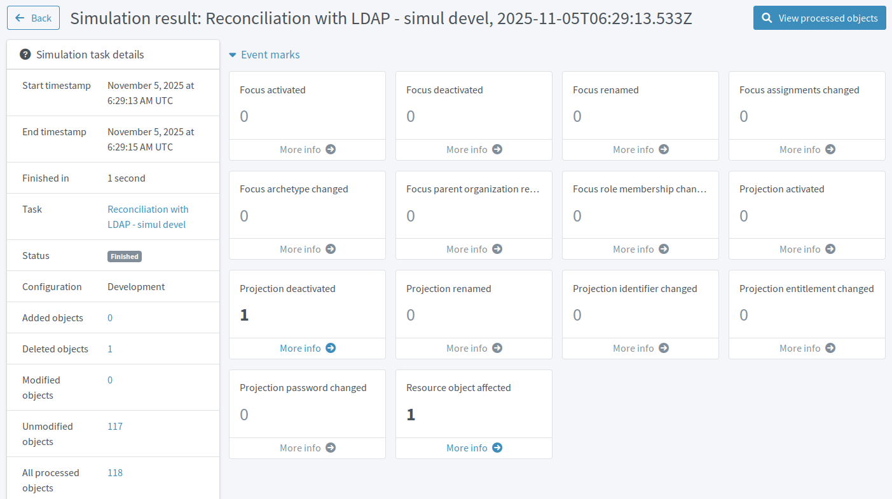

= Delete orphaned Active Directory accounts
:page-nav-title: Delete orphaned AD accounts
:page-display-order: 250
:page-toc: top
:experimental:
:icons: font
:page-description: Configure midPoint to eradicate orphaned and malicious target system accounts from the target AD application.

When integrating the AD application into your new midPoint ecosystem, you found some AD accounts that are either leftovers of unknown purpose from the past or even obviously malicious attack attempts.
You have marked some of them for later resolution, but you kept the obviously malicious one unmarked because it should be removed from Active Directory for security reasons.

== What awaits you in this module

Previously, you have prepared but kept inactive a synchronization rule to delete orphaned accounts from the AD server.
In this module, you will activate this rule and eradicate any unmatched accounts without marks.

You will, of course, simulate the effects of the change before activating the rule on production to see if it does not do anything destructive.
You need to be extra careful with these rules that delete objects on remote systems because, if misconfigured, they can be irreversibly destructive.

In the future, when a similar "illegal" account without a counterpart in HRIS appears, midPoint will delete it during reconciliation.
And any legitimate accounts that are not in HRIS will need to be protected with marks.

:sectnums:

== Prepare resource-side account deletion for testing

In xref:/midpoint/methodology/first-steps/integrate-target-system/define-rules-for-data-handling/#define-synchronization-rules[], you have created an AD synchronization rule called _delete-unmatched-resource-object_ to delete unmatched accounts.
You kept this rule in the _Draft_ lifecycle state to avoid deleting legitimate accounts before you ensure their preservation by marking them accordingly.

Now that the marks are in place, you can safely activate the synchronization rule.
First, put it to the _Proposed_ lifecycle state to test it.

*Follow this guide: xref:/midpoint/reference/admin-gui/resource-wizard/object-type/synchronization/[]*

. In the AD resource synchronization rules, find the _delete-unmatched-resource-object_ rule.
    ** It is the _Delete resource object_ reaction to the _Unmatched_ situation
. Set its lifecycle state to _Proposed_.

.List of target AD resource synchronization rules with the delete-unmatched-resource-object now in the Proposed state

== Simulate behavior of the new configuration

You are now ready to simulate the behavior the updated configuration before you put it to production.

. Use the _Reconcile AD - development simulation_ reconciliation task you have set up and used in xref:/midpoint/methodology/first-steps/integrate-target-system/reconcile-ad-accounts/[].
. Inspect the simulation results to see if the configuration behaves as expected.

If you changed nothing else on the resource or in midPoint in the meantime, only the unmatched & unmarked accounts you need to get rid of are affected.
Verify the affected accounts are really the ones you want deleted.

.Synchronization simulation results showing that one account would be deleted from the resource.

== Delete unwanted accounts from Active Directory

Once tested and verified, activate the whole configuration on production.

. Switch the lifecycle state of the _delete-unmatched-resource-object_ synchronization rule to _Active_.
. Run the _Reconcile AD - real production_ reconciliation task you have set up and used in xref:/midpoint/methodology/first-steps/integrate-target-system/reconcile-ad-accounts/[].

After the task finishes, check the accounts on the AD resource in midPoint—the unmatched & unmarked accounts, such as the malicious `cn=Secret Admin`, are no longer in the list.
You can also navigate to the link:http://localhost/phpldapadmin[training AD application user interface] (i.e., the LDAP server) and check the results there because for the first time now, you are making changes to the data in the target application.

:sectnums!:

== Next steps

With the unwanted accounts evicted from Active Directory, you are one step closer to the clean and secure IGA setup you are striving for.
The next logical step is to enable data delivery to the target system which will then seamlessly lead you to automating your setup.

[.nowrap]#icon:arrow-right[] *xref:/midpoint/methodology/first-steps/enable-target-system-provisioning/[]*#