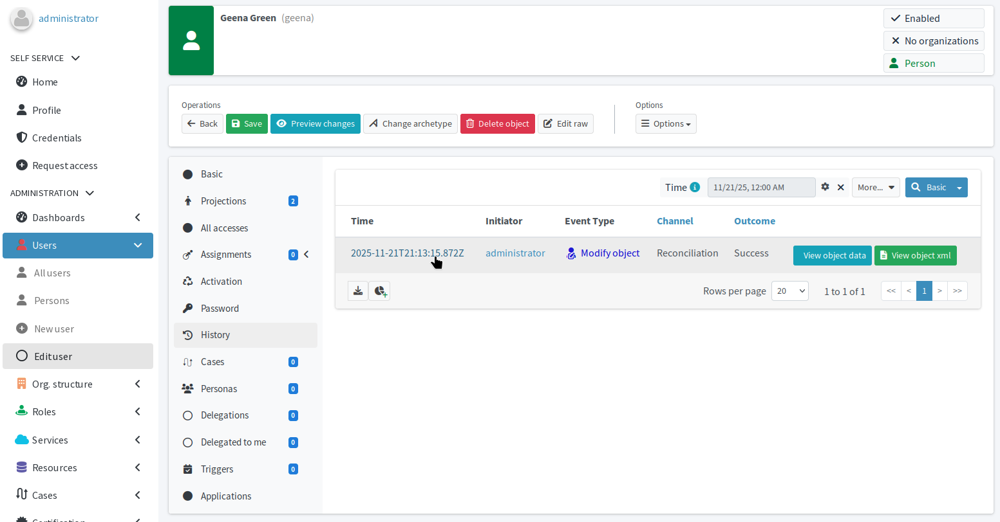
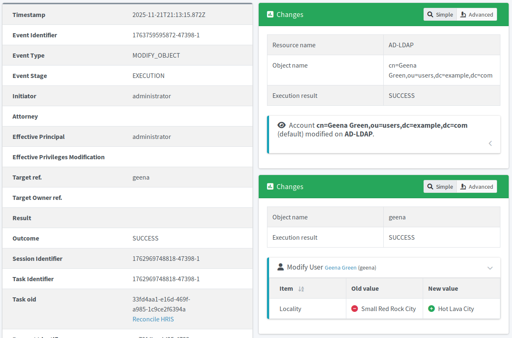

= Verify handling source system data updates
:page-nav-title: Handle source data updates
:page-display-order: 520
:page-toc: top
:experimental:
:icons: font
:page-description: Verify that changes to user accounts in the source system propagate correctly through midPoint to the target system.

You have already confirmed that creating new users works.
In this module, you will verify that you can actually change data in the source HR information system and that these changes are picked up by midPoint correctly.

== What awaits you this module

This exercise is short:

. Update an attribute of a user in the HRIS.
. Wait for the recurring reconciliation task to run.
. Inspect how midPoint handled the change across the systems.

:sectnums:
== Update user in HRIS

. Navigate to the link:http://localhost/hr/[HR demo app web UI].
. Click btn:[Show users] in the top navigation bar.
. Pick whichever user you like, e.g., _Geena Green_.
. Click btn:[Modify] in right-most column of the listing table.
. In the form that appears, rewrite *Locality* to _Hot Lava City_.
. Click btn:[Modify user].
. Click btn:[Export users to csv file] at the bottom of the user listing page.

== Let automation handle the updates

Wait for the xref:/midpoint/methodology/first-steps-training/automate-target-system-integration/generate-usernames-in-midpoint/#automate-importing-users-to-midpoint[recurring HRIS reconciliation task] you have already up and running to pick up the changes.

== Inspect the results

To verify that the change has propagated to both midPoint and Active Directory:

. In [.nowrap]#icon:user[] *Users*# > [.nowrap]#icon:user[] *Persons*#, search for _geena_ and click the name to open Geena Green's profile.
. Select [.nowrap]#icon:history[] *History*# in Geena's profile on the left. +
+
.You can see here that the user has been modified through the reconciliation xref:/midpoint/reference/concepts/channel/[channel].

. Click the time stamp of the last change in the [.nowrap]#icon:history[] *History*# screen to open the audit log entry with the details of the change.
+
.On the right, you can see that both the focus and the AD account of Geena have been modified.

. You can check the data on the target AD system by two means:
    ** In Geena's midPoint user profile, go to [.nowrap]#icon:male[] *Projections*#, select the AD resource, and inspect the attribute values.
    ** Go directly to the link:http://localhost/phpldapadmin[target AD server administration interface], open Geena's account details, and confirm the changes there.

=== Audit log: Canonical approach to keeping track of changes

Finding out what the scheduled reconciliation task did was easy this time, because you knew exactly on which user to expect changes.
In case you do not know which user to inspect and want to review what is happening in your IGA ecosystem, *use the audit log*:

. Select [.nowrap]#icon:magnifying-glass-chart[] *Audit Log Viewer*# in the main midPoint navigation menu.
. Inspect entries with an appropriate value in the *xref:/midpoint/reference/concepts/channel/[Channel]* column.
    ** In the case of this module, it is _Reconciliation_.
. There are always multiple *stages* for events—open the _Execution_ or _Resource_ stage entries as those show most clearly what has actually been done.

.Audit log entries
image::midpoint-audit-log-geena-reconciled.webp["Audit log entries"]

:sectnums!:

== Summary

This experiment has proven beyond doubt that your setup works as expected.
The changes you made in the source system propagate to midPoint and then to the target system.

== Next steps

Having successfully covered two out of the three basic IGA transitions (*join*, *move,* leave), you have yet left to confirm your configuration performs correctly for *leavers.*
In the next module, you will do exactly that.

[.nowrap]#icon:arrow-right[] *xref:/midpoint/methodology/first-steps-training/verify-configuration-behavior/manage-former-employees/[]*#

You may also find it interesting to read a related IAM myth: xref:/iam/myths/iga-means-accounts/[]