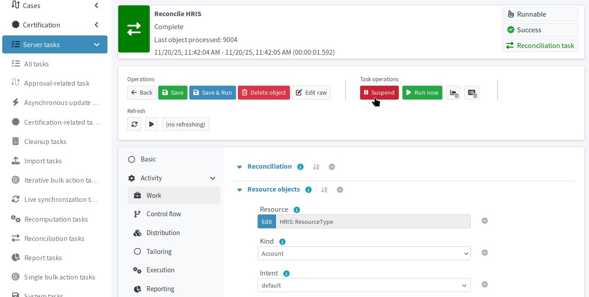
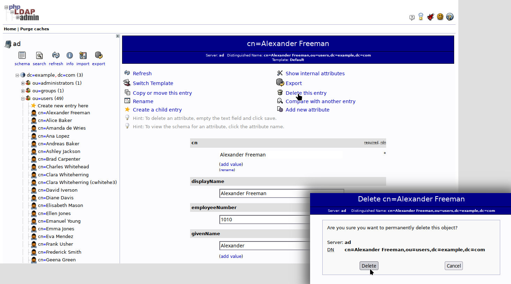
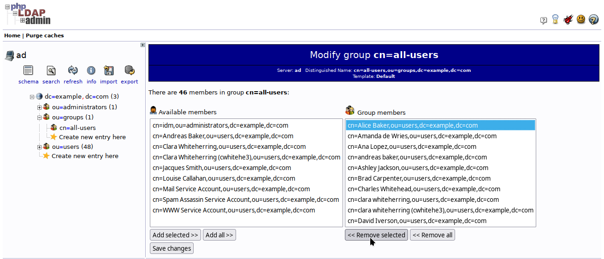
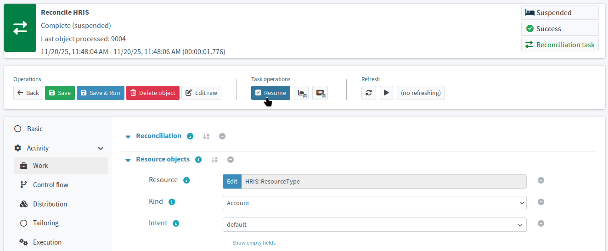

= Rectify unauthorized changes in Active Directory
:page-nav-title: Rectify unauthorized changes
:page-display-order: 510
:page-toc: top
:experimental:
:icons: font
// This redirect is here to move visitors directly to the first child of the section
:page-moved-from: /midpoint/methodology/first-steps-training/verify-configuration-behavior/
:page-description: Test how your midPoint configuration enforces data consistency across connected applications.

Test how your midPoint configuration enforces data consistency across connected applications.
You have already seen how midPoint detects orphaned accounts and deletes them unless explicitly told otherwise.
However, what about unauthorized changes to legitimate accounts made directly on the Active Directory server?

== What awaits you in this module

You will make several "mistakes" or "malicious attacks" on the target AD system without changing the source HRIS data.
You will then observe how midPoint fixes the data inconsistencies you will have introduced:

. Pause the recurring HRIS reconciliation task to so that it does not fix all the issues immediately without you knowing what exactly happened.
. "Make a mistake" and delete an account on the AD server.
. "Malevolently" edit a few account attributes on the AD server, as well as remove someone from the _all-users_ group.
. Simulate production reconciliation to confirm midPoint reverts your edits according to your configuration rules.
. Resume the HRIS reconciliation task to make the disaster recovery setup automated again.

:sectnums:

== Put automatic HRIS reconciliation on hold

In order to observe midPoint behavior in detail, you need to stop the recurring HRIS reconciliation task that automatically synchronizes HRIS accounts with the rest of your IGA ecosystem (midPoint and AD).

. In the HRIS resource, go to [.nowrap]#icon:tasks[] *Defined Tasks*# and open the production HRIS reconciliation task for editing.
    ** You can easily identify the task by the *Execution state*—it should be the only one in the _Runnable_ state.
. In the top task bar, under *Task operations*, click the red [.nowrap]#icon:pause[] btn:[Suspend]# button.

.Suspend the recurring reconciliation task on the HRIS resource before you start testing your configuration

With the task suspended, accounts added or changed in the HRIS cannot be picked up and provisioned automatically,
and changes performed directly in Active Directory cannot be overwritten with the correct HRIS data.

== Delete an account directly in Active Directory

Now, make the first "mistake": Delete one account directly on the AD server.
Such an action is certainly possible, as an AD administrator may, in error or not, delete an account managed by midPoint.

. Navigate to the link:http://localhost/phpldapadmin/[AD server web UI].
. In the left-side navigation, expand `dc=example,dc=com`.
. Expand `ou=users`.
. Pick whichever user you like, e.g., `cn=Alexander Freeman`, and click the item to edit the user.
. In the toolbar at the top, click *Delete this entry* to delete the user.
. Click btn:[Delete] on the confirmation screen.

.Delete an arbitrary user directly on the AD to test midPoint provisioning configuration

== Change account data directly in Active Directory

The next step is to edit some user's data directly on the target AD server.
This action is fairly realistic as well, for an AD admin may make a mistake or even go rogue and start making malevolent changes all over the place.
Your goal is to test the resiliency of your setup against such actions.

. In the AD user interface, open a whichever user for editing, e.g., `cn=Alice Baker`.
. Change some attributes of hers. For example:
    ** `l` (locality) to _Black Ash City_
    ** `givenName` to _Rabbit_
. Click btn:[Update Object].

Next, remove the user (or any other user) from the `all-users` group:

. Under `dc=example,dc=com`, expand `ou=groups`.
. Click `cn=all-users` to open the group for editing.
. Scroll down and click btn:[modify group members] beneath the group member list.
. Select the user you want to remove from the group
. Click btn:[<<< Remove selected].
. Click btn:[Save changes].
. The confirmation screen that appears highlights the removed member. Click btn:[Update Object] to confirm the change.

Now, this is enough sabotage activities, let us see what midPoint does about the situation.

== Simulate reclassification to observe data rectification

To get the opportunity to observe how midPoint deals with the new discrepancies on the target system, run a simulated production reconciliation task on the HRIS resource.
The simulation needs to use the production configuration because all your settings are in the _Active_ lifecycle state.

If you do not yet have a task to simulate reconciliation on production, create one.

*Follow this guide: xref:/midpoint/reference/tasks/synchronization-tasks/import-and-reconciliation/gui/[]*

. In the HRIS resource, create a new *reconciliation* task with the *simulation* toggle on.
. Name the task, e.g., _HRIS reconciliation - production simulation_
. Keep kind and intent to their default (_Account_, _default_).
. On the *Execution* screen, set *Mode* to _Preview_ and *Configuration* to _Production_.
. Save the task and run it.

After it finishes, click btn:[Show simulation result] to observe the outcome.

* You should see that one projection entitlement has changed—that means Alice Baker would get back her membership in the _all-users_ group.
* There should be two resource objects affected—Alice Baker getting the changed attributes corrected, and Alexander Freeman getting his account in AD back.

.Simulated production reconciliation of the HRIS resource fixed all unauthorized changes made directly on the AD server
image::hris-reconcile-simul-prod-fixed-malevolent-ldap-changes.webp["Simulated production reconciliation of the HRIS resource fixed all unauthorized changes made directly on the AD server"]

Obviously, the numbers may differ based on the number of changes you have actually made.
Nevertheless, the end result should be the same:
All accounts impacted by unauthorized changes made directly on the target AD server
should have their data corrected based on the HRIS resource data.

.What if I need to make changes in AD and keep them?
[TIP]
====
If you find yourself in need of changing the AD data directly, then *mark the affected accounts* in midPoint as _Do not touch_, for example.
With that, the reconciliation task will not touch their data on AD.
====

== Put the disaster recovery plan to production

You have verified your configuration acts exactly as it should:
It rectifies illegally edited attributes,
recreates wrongfully deleted accounts,
and places users back to groups of which they are supposed to be members.
With this confirmed, resume the recurring HRIS reconciliation task:

. Open the production HRIS reconciliation task for editing as you did when suspending it.
. Click [.nowrap]#icon:check-square[] btn:[Resume]#

.Resume the recurring HRIS reconciliation task

:sectnums!:

== Next steps

You now know that your midPoint setup handles unauthorized changes on the target system well.
It puts everything back in line automatically with every run of the HRIS reconciliation task.

With the possible damage done by a deranged or simply tired AD administrator mitigated, it is now time to verify that changes done on existing users in the source HR information system propagate well into the target AD system.
This may sound similar to what you have already confirmed—that is, that you can create new users in the HRIS and they get into the AD system fine—but you have yet to confirm the same happens for changes on existing users.

[.nowrap]#icon:arrow-right[] *xref:/midpoint/methodology/first-steps/verify-configuration-behavior/handle-source-system-data-updates/[]*#