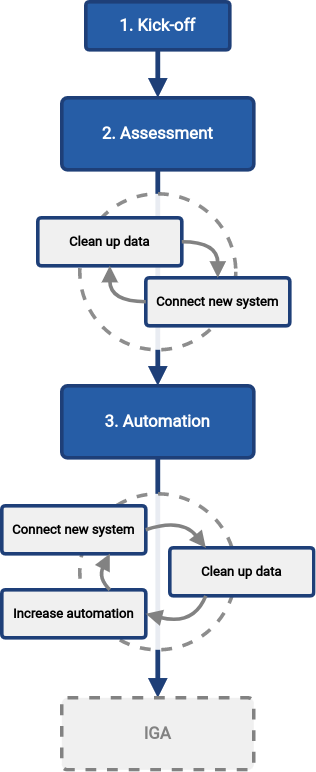

= Methodology: First Steps With MidPoint
:page-toc: top
:experimental:

WARNING: Work in progress

== Introduction

This is a description of simplified midPoint deployment methodology, guiding quick deployment of simple midPoint configurations.

This document is a guide to identity management deployment for small to mid-size organizations.
It describes an _iterative_ approach, providing value in small steps.

TODO: few more lines introducing the process, set expectations.

== Audience

This guide is targeted at an organization that fits following description:

* Managing hundreds to thousands of identities.

* Existing identity processes are mostly manual, possibly with some simple (homebrewed) automation (e.g. scripts or ancient identity management systems).

* There is no dedicated identity management team.
Identity management tasks are executed by general IT staff, as part of their day-to-day responsibilities.
However, there is some basic understanding of identity management concepts in IT team.

* No strict regulation compliance requirements.
Alternatively, there may be compliance requirements, yet addressing them is not immediate priority.

* There is a motivation to improve identity management, with some support from the management and reasonable budget.

* Typical organizations: mid-size enterprise, smaller government or academic institution, municipality

IT environment of the organization:

* There is a feasible source of identity data, such as human resources (HR) system.
This source has authoritative data on most of the identities.
(There is no requirement for the data to be complete or 100% exact).
There is a simple way to get the data out of the system, such as structured text export (CSV), or a database view.

* There is one "main" system that need to be managed, such as Active Directory.
Automatic management of identities in this system will provide significant benefits for the organization.
Also, there may be several such systems in the organization.

* There are some operational procedures and conventions in place, such as a convention to systematically generate a username and e-mail address.
However, there are likely exceptions, e.g. e-mail address of top management, usernames generated before the convention was in place and so on.

Which means that:

* Quality of identity data is probably low.
The HR system was maintained manually, without any automated validation of the data.
There will be typos, outdated and incomplete data.
The accounts in Active Directory (or equivalent system) were managed manually, without any regular and automated checks.
There will be accounts that belonged to employees that left several years ago.
There will be accounts still using maiden names of women that got married years ago.
There will be non-conventional usernames and account names.

* There are limited human resources that can be dedicated for identity management.
The implementation must proceed in parallel to the usual IT operation routines, requiring only a reasonable amount of effort.

* The management will want to see tangible results quite soon.
Identity management deployment cannot be executed in a "big bang" way, spending years on analysis and implementation.

* The ideal plan would be to proceed in iterations, providing value in small steps.
Each step taking several months, at most.

.No free lunch
TIP: We live in a material world.
Money are needed to do almost anything.
Identity management is no exception.
Even though midPoint is an open source _platform_ and there are no licence costs or any other costs directly associated with use of midPoint, the identity management _deployment_ is not free.
You will need money to pay your staff, pay for trainings, assistance and support.
Reasonably-sized budget is needed to get tangible results.

== Big Picture

TODO: intro, iterations, etc.

We propose to proceed in following steps:

. *Kick-off*: Start the project.
Set goals.
Identify crucial data sources and targets.
Make a plan.
Secure budget.

. *Assessment*: Set up midPoint.
Load data from the source.
Compare the data with the target.
Assess data quality.
Decide next steps.

. *Automation*: Automate management of identities (to a reasonable degree).
Speed up on-boarding processes.
Make off-boarding process more reliable, improving security.
Keep data up to date.

These three steps start up a *program*, a never-ending process to maintain and expand the solution.
The progress of the program may be as fast or as slow as you need.
It is an endless iteration of several on-demand activities, executed as needed:

* Connect new systems.
Add more systems to your solution, much like you did in the _assessment_ step before.
This is increasing _breadth_ (scope) of your solution.

* Increase automation.
Add automated data mappings, processes and basic policies.
Your processes will run faster, more reliably, with less manual steps.
This is increasing _depth_ of your solution.

* Clean up the data.
Your data were created and maintained manually.
They often do really match exactly between systems, the data are often out of date, there are inaccuracies and errors.
Manual processes can often tolerate quite a high degree of data disorganization.
However, increased automation heavily relies on accurate data.
There is a constant need to monitor and improved data quality, correct errors, resolve inaccuracies and inconsistencies.
This is increasing _quality_ of your solution.

Apart from the three main steps, there are many optional iterations to add new systems, clean up data and increase automation.
The iterations can be repeated as many times as needed, with as big or as small scope as needed.
The overall goal of the program is to bring convergence: convergence of the data, processes and policies.

There is no pre-determined number of iterations.
The iterations should be executed as long as they bring sufficient value.
However, as the business and IT environment is ever-changing, it is very likely that at least some part of the program will become part of ordinary operational routine.

Once the first steps are complete, data are reasonably reliable, important systems are covered and processes are automated to appropriate degree, it is time to move to the next steps.
The next logical step is to focus on identity _governance_, managing entitlements, identity-related policies and business processes.

== Initial Steps

TODO: following sections provide detailed description of the steps.

TODO: Each step has a specific goal. The goal is summarized at the end of step description.

=== Step 1: Kick-Off

You have to start somewhere.
At this point, you probably have a very rough idea what you want to achieve.
However, all the details are missing.
The goal of this step is to fill some details in, make a plan, set up project structure and secure necessary resources.

Start with a brainstorming or "kick-off" meeting.
Gather all the people in your organization interested in identity management.
This does not have to be a formal team.
The project is not formally established anyway.
Gather all the people that have something to say.

You will probably need to engage following persons:

* Senior IT engineer or an architect.
Identity management is touching many things, you want someone with broad perspective and IT experience.

* Active Directory administrator, or an administrator of a critical IT systems that you want to manage.

* Someone from HR, or any person that is somehow familiar with HR practices.
HR is going to be your information source, you need someone that can help you assess impact of HR practices on your project.

* Security professional.
Identity management is intimately related to information security.
There may be policies, constraints and goals given by company security policy, which you should definitely consider in your plans.

In fact, especially in smaller organizations, this can a "meeting" of just a couple of people over the cup of coffee.
This can be a series of meetings.
Do whatever suits your organizational culture the best.

The results of the initial meeting/kickoff/brainstorming should be:

* Identify *data source*, which will probably be HR system.
Discuss the data the HR has, their scope and quality.
Do they have data on all employees?
Do they have also a data on contractors?
How and how often are the data updated and maintained.
E.g. how are records of new employees enrolled?
How are data of former employees handled?
Are the records deleted, marked as inactive, set a lay-off date or something else?
What is the unique identifier of HR record?
Is its uniqueness guaranteed?
What happens if former employees return to the organization again? Are they considered new record with new identifiers or are their original HR records reused?

+
You will probably get CSV export of HR data, or perhaps a database table/view.
Both are perfectly fine, at least for now.
Request a sample data from the HR people, to make sure data formats will work for you.
If possible, request several sample data exports from HR (e.g. daily, weekly) to see the trends in data (e.g. if it contains also former employees, approximate number of changes etc.)

* Identify *data target*, which will probably be Active Directory (AD).
Discuss the structure of AD users with the administrator.
Are all the users in a single organizational unit in the AD?
Are there several organizational units?
How is the AD username created?
Are there any conventions to generate username?
Are there exceptions to these conventions?
Is there a reliable identifier stored somewhere in the user account?
Maybe an employee number is conveniently stored in `employeeNumber` attribute?
Have a look at live AD data, selecting few examples (such as your own account), roughly assessing the situation.
Compare that with the HR data sample. This may help you to see how much HR data is actually part of AD attributes, and you should have at least some data transformation ideas.
+
Discuss the practices of creating an AD account.
Are there any special procedures or manual steps that take place?
How is the initial password set, how is it delivered to the user?
Is there a need to create a home directory, file share, mailbox?
What is the procedure to delete/archive account?
Discuss which steps would be nice to automate, and which are best left for manual action.

* Discuss *security*.
Discuss the limitations, requirements and wishes given by the information security policies.
+
Do not overdo it.
This is very important.
Security professionals tend to provide long lists of non-negotiable security requirements that need to be satisfied right now.
Do not get distracted to theoretical discussions of information security.
Discuss the practice, the current state, the day-to-day reality.
Be honest to yourself.
Do not pretend that you have perfect security while the reality is vastly different.
+
Goal of identity management is to _improve real security_, not to pretend that the security is perfect while it is not.
Do not try to satisfy all the security requirements and requests immediately.
Make a plan to address the requirements in iterations.
It is too early to focus solely on security at this point.
Basing security on wrong data is no security anyway, it is just false sense of security.
You need to put your data back in line first, then built up from there.

* Discuss other data targets (optional).
What other systems would you like to connect to your identity management deployment in the future?
Consider just the big picture for now.
You do not need to go to all the details.
Just roughly set the scope, listing and prioritizing the systems.
Although this kind of perspective is completely optional, it is a huge benefit for planning and budgeting.

* Discuss *resources, timing and rough plan*.
Keep you plan realistic.
Identity management requires systematic approach, time and a lot of patience.
Too many projects have failed due to unrealistic plans and expectations.
Plan modest results, delivered in few months.
Then proceed in iterations, delivering improvements every few months.
Prepare for a long run.
This is not a project, with a specific start and end.
This is a _program_.
It starts now, yet it has no end.
Discuss who will lead the program, what people will need to be involved, other resource that you will need.

* Discuss *money*.
You will need money, even if you plan to do most of the work internally.
You will need training, assistance and support.
Plan a recurring budget, sustainable funding for many years to come.
Having a modest budget every year can lead to a successful identity management program.
Having a generous budget for year one and no budget after that is a certain way to an expensive failure.

You do not need to have all the answers to all the questions at this point.
We will get to that later.
What you need is an _overview_ of your situation.
It is perfectly OK to leave a lot of blank spaces in your plan now.
The important thing is to know that you have a lot of black spaces that need to be filled in later.

Maybe you will need some time to get your plan straight.
Take your time.
Learn and explore in the meantime.
Do some read-up on identity management.
Watch videos.
Download midPoint and have some fun.
If you are a hands-on type, create a small prototype.
All of that will help you better understand your problems, and also the tools that you have at hand.
Gather your collaborators again, update your plan as necessary.

Now comes the most important step.
*Talk to your management*.
Make sure that the management understands importance of identity management for your organization.
As identity management touches many parts of the IT infrastructure as well as business processes and organizational procedures, support from your management is critical for success.
You will also need time and money.
Make sure there are human resources and appropriate budget allocated for your project.
Do not exaggerate, do not oversell.
Provide honest plan and estimates, set realistic expectations.
Identity management is a long run, any kind of hype or exaggeration is very likely to backfire in the future.
Get a green light - for a long program, not just for a short project.

Now, you are ready to go.

*Goal*: Assess your resources, capabilities and goals.
Set your target.
Decide whether the project is feasible.
Make a rough plan.
Get long-term support from management.
Secure budget.

=== Step 2: Assessment

You have some kind of HR data now.
In theory, you should use the HR data to create and manage accounts in target system, such as your Active Directory.
However, in practice, this is not entirely straightforward.

Firstly, it is almost certain that there are errors and inaccuracies in the HR data.
The data were maintained manually for a long time, with no way for automatic validation.
Mistakes in the data might be buried deep, surviving undetected for decades.
Having nothing to compare the data with, there is no telling how good or bad the data are.

Secondly, the data in your target systems (especially Active Directory) certainly leave a lot to be desired.
These were managed manually for years, with no automatic way to make sure they are correct.
There will be account belonging to people that left your organizations years ago.
There will be accounts using maiden names of women that are married now.
There will be strange accounts and identifiers that originated ages ago when your organization was still small and system administration was fun.
There may be all kinds of weirdness and historical baggage frozen in time because nobody remembers what it does and everybody is scared to touch it.

Taking HR data and simply forcing them to Active Directory will never work.
We need much smarter approach.

// TODO: bridge to the following text

This is what you have to do:

. *Connect HR* data source to midPoint.
Set up your HR identity resource in midPoint, using CSV or DatabaseTable connector.
Deal with just the very basic data items for now:
* Names (given name, family name)
* Employee number, student number or similar identifier
* Status (active, former employee, alumni, etc.) and/or validity date/time (based on contract etc.)
+
Ignore other fields for now.
We will get back to them later.

. *Import users* to midPoint, using HR data.
Select appropriate algorithm for midPoint username.
You surely have some username convention (such as `jsmith`) in place.
Then import the HR data, creating user objects in midPoint.
As we are working with simple data for now, the import should go well.

. *Connect Active Directory*.
Set up your Active Directory (or perhaps LDAP) identity resource in midPoint.
Set up mappings for the small data set that you have (given name, username and so on).
Set the mappings in _comparison_ (TODO!) mode.
We do not want to change any data yet.

. *Correlate Active Directory accounts* with midPoint users.
If you have employee numbers stored in your Active Directory, then use that for correlation.
If you do not, use generated midPoint usernames (e.g. `jsmith` convention) as the correlation identifier to match (assumed) majority of the accounts to their corresponding owners in midPoint:
.. Run the _reconciliation_ task on AD resource (TODO! Something more user-friendly in the resource rather than creating a task?).
.. Then have a look at the results in midPoint GUI (interactively).

+
If you maintained your identifier assignment conventions reasonably well, most identities should correlate well.
MidPoint will show you correlation statistics for your accounts.
Of course, there will be problems of `John Smith` and `Josh Smith` with their `jsmith` and `jsmith42` accounts.
Let's leave that for later.
For now just focus on correlating the bulk of users.
If you get 80-90% users to correlate well, you are done here.
Activate the correlation action (TODO: turning on `UNLINKED` -> `link` reaction) and correlate the majority of your accounts now.

+
Of course, you are doing this for the first time.
Chances are that you have not got all your configuration exactly right at the first try.
If you need to make configuration adjustments, just make them and re-run the reconciliation task.
In case of deeper problem, it is still OK to scrap your AD resource and do it again (go back to step 3).
Maybe you need to grab more data from HR feed (e.g. you have not mapped employee number to midPoint, did you?).
In that case you still can purge all identity data from midPoint, adjust HR configuration and import everything again (go back to step 2).

. *Clean up the orphaned accounts*:
Review the list of orphaned accounts (accounts in Active Directory not having an owner in midPoint which should mean they are not related to HR data on which midPoint data is based) and identify the following cases:

* *orphaned accounts*: accounts which were not matched to midPoint data during correlation, and should not be in Active Directory. Review these accounts one by one and <<explicitly_marking_accounts_for_decommissioning,_mark_ the undesired ones as decommisioned>>.
* *system (service) accounts*: accounts which are not based on HR data, but are crucial for Active Directory. Review these accounts one by one and <<explicitly_marking_accounts_as_protected,_mark_ the system accounts as protected in midPoint>>.
+
The accounts need to be reviewed manually and actions can take place either in the AD (by its administrators), or in midPoint (e.g. by configuring the system accounts as protected).
+
TIP: You can clean up the data in several iterations.

. *Clean up the accounts with data inconsistencies.*
Review the rest of accounts which have not been matched or decided in the previous steps.
This is the time to take care of the Smiths, Johnsons and Browns.
Have a look at all the `jsmith`, `smithj` and `jsmith2` accounts.
Try to figure out which account belongs to which user and correlate them manually.
If you did the last steps well, there should be just a handful of them.
+
TIP: You can clean up the data in several iterations.

. *Clean up the incorrect mappings* to avoid undesired changes in AD accounts.
Review the accounts where midPoint indicates a change of account attributes.
This means there are differences between the account attribute values in the target system and the values computed by midPoint for these accounts in _comparison_ (TODO!) mode.
Review the mappings.
Chances are that the mappings are working correctly, but data in Active Directory does not correspond to them because it was previously managed manually and can contain errors.
Adapt the mappings in midPoint to not cause undesired changes in Active Directory.
+
TIP: You can clean up the mappings in several iterations.
+

This may seem as a pointless phase.
Why not just go directly to automation?
That is what we really want!
However, assessment is all but pointless.
Automation can be done only after the assessment phase is done.
Attempts to automate processes with unreliable data are futile, they invariably lead to failures, usually a very expensive failures.
Speaking from a couple of decades of identity management experience, there is no such thing as reliable data, unless the data are cleaned up and systematically maintained with an assistance of identity management platform.
Simply speaking: you may think that our data is good, but they are not.

TODO

*Goal*: Asses the _real_ data quality, determine practical next steps.
At this point we know what we _really_ have, what we can build on, what needs to be improved.
We can identify the most severe security risks, such as orphaned accounts.
Now we can improve our plan, adding more details based on the _real_ data.

=== Step 3: Automation

Finally, we have reliable data to build on.
What are we waiting for?

TODO

TODO When to actually clean up the orphaned/inconsistent data?
[loweralpha]
. at the end of Step 2 (Assessment)
. in Step 3 (Automation, Off-boarding phase)

TODO It makes sense in Step 2, as we are doing clean up, but deleting orphaned accounts is irreversible.
It also makes sense in Step 3, as this is where we already intend to modify the AD.

. *On-boarding automation* (provisioning).
TODO
Create new accounts for users. (Mappings only for create.)
Leave existing accounts "as is".
If your data are good, you may roll-out automatic account updates as well.
This is the right time to suspend your legacy on-boarding/provisioning process (e.g. scripts or manual processes).
+
TODO: in order to "create new accounts for users" we need to know fow who, i.e. we already need to have some conditions.
Even if we don't have roles and simply assign accounts in AD.
E.g. we may want to assign AD accounts for all active employees.
+
TODO where will administrator enter the condition(s) for automatic assignments? Certainly not using object template with XML...
We cannot use role autoassignment, as we do not have any role yet.
+
TODO: if we want to allow updates only for accounts created by midPoint (not linked during initial reconciliations), we need to have some additional information/metadata in the shadows.
Maybe even some marking.
+
TODO: maybe start with reconciliation instead of Live Synchronization to allow thresholds. (Thresholds for Create-only are maybe not relevant, but for updates...) For small organizations, reconciliation should be fast enough to run daily/more often. Batch vs event-driven. In case the source data is deleted instead of disabled, we may need reconciliation for off-boarding phase anyway.

. *Off-boarding automation* (de-provisioning).
* TODO we need to distinguish when to do off-boarding by some conditions (i.e. account assignment should be unassigned when employee is inactive)
* TODO we prefer disabling users in midPoint rather than deleting
* TODO we prefer disabling accounts rather than deleting
* TODO archive midPoint users instead of just disabling?
** This would not be possible using synchronization reaction. If we could distinguish that that account should be considered `archived` in HR (e.g. via configured capability?) we could have a new situation + new reaction *NEW FEATURE REQUIRED*
** lifecycle transition to `archived` can clean up some attributes (GDPR)
** delayed user deletion after X years in `archived`

. *Automate scans* for orphaned accounts.

. *Switch from batch mode to event-driven synchronization from HR*.

*Goal*: Make on-boarding and off-boarding processes more efficient and reliable.
Save some money and improve efficiency by speeding up the processes.
However, the most important goal is enabled by _reliability_ of the automated processes.
Accounts belonging to off-boarded people are automatically disabled.
Orphaned accounts are reliably detected.
The most severe identity-related risks are addressed.

=== Iterations

TODO: describe how the add-clean-automate iterations work.

=== Things to be resolved later

* *TODO* what about self-service? If no roles are used (yet) in midPoint, we may need only password change; but if external authentication (e.g. AD) is used, we don't need password change via midPoint either...
* *TODO* what about any automatically assigned roles?
** This might be related to the source system as well - for conditions
** This requires role model to exist - at least application roles
* *TODO* what about role requesting and approvals?
** Even if this is done outside midPoint initially, or via manual / ticket
requests, the roles are represented by group membership or something similar
in the target systems
** MidPoint should not conflict with the roles/groups assigned by other means
** More specifically, midPoint should tolerate them
* *TODO* multiple account intents
* *TODO* related to notifications: process to warn users before their user expire (`validTo`)

== Current Situation

Summary of what is happening before they go for a solution like midPoint, what are they typical activities, what are the struggles.

Automatic scripts, on-demand executed scripts or manual intervention is used to support provisioning.
The processes are usually managed using tickets (or e-mails, in worst case).
Automation is partial, because is usually limited to the accounts and not to users (account owners).
Scripts are usually used "as is", they can be created by people no longer working in the company.
In that case, script modification/improvements can be costly.
Scripts can be executed in an automatic way = scheduled, if there is some connection to HR system.
On-demand executed scripts rely on decisions tracked in ticketing system.

Reaction to security incidents (e.g. bad leaver) can take long time (ticket)
or may require non-systematic solution (urgent phone call and later ticket - for evidence).

Account rename may be painful: some systems do not support rename at all, other require change of many attributes (e.g. AD: `sn`, `cn`, `dn`, `userPrincipalName`, `sAMAccountName`, `mail` / `proxyAddresses` including previous e-mail value as an alias...)

For leavers, some accounts are immediately deleted, some are disabled and/or moved within the directory tree and deferred actions need to be executed (allowing user's manager to access the mailbox, delayed delete, ...)

TODO yet more

=== Typical analysis process

The typical analysis is very limited in scope. It is mostly scratching the surface.

They are thinking about HR records as clean identities. Mostly thinking about people first, last names and how they are identified (not correlated).
Some are identifying by employee numbers. When connecting (correlating) records, even when employee number is entered into systems, there are typos or forgotten.
Sometimes they are identifying by first and last names or by loginname at best.

They are thinking about target system accounts, usually not as accounts owned by some users.
The accounts are managed by administrators of that resource or support teams,
their management is often isolated from the other provisioning teams.
There might be long unused (orphaned) accounts mixed with service and testing accounts.
Some scenarios are resolved "when they happen", e.g. what to do if account
name is already taken.

=== Obstacles (Problem Definition)

Why midPoint in its current state does not satisfy target customers?

Overall (high-level) obstacles:

* *High entry barrier*. Customer engineers have to learn too much. They won't. They do not have time/resources/skills for that.
+
High entry barrier makes midPoint *expensive* to deploy and operate, as _skilled_ people need to find a lot of time to dedicate midPoint.
This ruins the business case for midPoint deployment, i.e. midPoint total cost of ownership (*TCO*) is too high.
+
*Questions:* Can partners help? Can the customer afford assistance of partner? Is that enough? E.g. will partner _operate_ the system after deployment?

* *Missing methodology*. We do not have clear, simple and consistent set of instruction to deploy and use midPoint.
MidPoint is a chameleon, adapting to many situations.
This is confusing the engineers, they do not know _what_ to do, _where_ to start.

* *Old world vs new world*.
MidPoint is designed for _old world_ (servers, on-premise, integration, customization, scripting).
Yet, there is a brave _new world_ (cloud, services, plug-and-play drag-and-drop do-it-all as a service).
Some midPoint concepts fit well in the new world (e.g. git/devops/JSON), others do not (complexity, _need_ for customization).

* *Abstract thinking*:
MidPoint _requires_ abstract thinking.
Understanding to many abstract concepts (focus, shadow, abstract roles, assignments/inducements, policy rules) is essential to use midPoint efficiently.
However, this is too much to be handles by most engineers.
IT is much more complex than 10 years ago, engineers do not have time to understand each system intimately.
The result is that vast majority engineers that work with midPoint will not have sufficient understanding of the underlying concepts.
How to make them efficient even with such limited understanding?

Technological (low-level) obstacles:

* *Terminology*: MidPoint has its own vocabulary (shadow, focus, projection, ...), which is not common in IT field.
MidPoint has to have its own vocabulary, otherwise we could not develop/maintain it.
However, this is an obstacle for engineers.
MidPoint is meant to be used by _humans_ (engineers), presentation and usability is important.
How to align midPoint _development_ needs with the _usage_ needs?

* *Configuration vs Data*: part of the things that we store in midPoint are configuration (e.g. system config), which should be managed by devops configuration management.
Other part are data (e.g. users, accounts) that should NOT be managed by version control.
However, there is a big *gray zone*: roles, policy rules, object templates, mappings. It is not clear how to manage the _policies_.

* *Managing multiple environments*: customers usually need to deploy midPoint in multiple environments (e.g. `DEV`, `TEST`, `ACC`, `PROD`).
This basically means there are multiple midPoint deployments as midPoint in `DEV` is usually responsible for managing identities in `DEV` environment.
Management of configuration and data and their transfer/transformation between environments may be required.
E.g. (subset of) identity data from `PROD` should be transferred to `ACC` (after some anonymization) on a regular basis.

* *Complexity of schema*: There are too many configuration options and possibilities, many of them poorly documented.
It is difficult to figure out which option to use when.
It is difficult to find that some functionality/feature even exists at all.

* *Data representation (XML/JSON)*: Engineers are not used to write XML any more.
JSON is better, but it is still a problem (see the "schema" problem above).
Engineers should be able to do all the common tasks in GUI, without need for XML/JSON.

* *Hard to troubleshoot*: Error messages are often incomprehensible for average engineer and require deep understanding of midPoint (ability to analyze stack traces) or extremely large body of experiences from previous troubleshooting attempts (many times hours of trial-and-errors).
Typical example: using q:equal (instead of q:ref) when comparing references leads to cryptic ClassCastException or something like that.
And there are zillions of similar cases.

== Solution Ideas

Unstructured notes. Move to other parts/documents as necessary.

* *Allow direct access to database* (PostgreSQL only, read-only, with upgradeability disclaimers).
This may help to address unforeseen use-cases, with technology/toolset that the engineers already know (SQL).
The risk to upgradeability is relatively low, as we have to keep DB data model (mostly) backwards-compatible anyway.

* *Improved default configuration*: pre-configure midPoint for the usual use-cases.
How exactly?
Better _samples_? Pre-configured _profiles_?
** Resource mappings-related: we can prepare function libraries (see also below) with most-common code usable for mappings. Admin will simply select one of the functions.

* *Improved user experience*: How exactly? For who? Engineers? End users? How skilled? What use-cases?

* *Improved documentation*: how exactly? What documentation? For who? Which format? text? video?

* *"Complexity spectrum" approach*: +
Simple and common tasks should be very easy to do (few click in GUI). +
Medium-complexity and less-common tasks should still be relatively easy (still GUI, but may be more click and complex forms/flows, even writing one-liner expression, but still in GUI). +
Complex and uncommon tasks may need deeper expertise/experience (e.g. editing JSON/XML). +
Exotic tasks should still be possible, but may require programming (e.g. complex scripts, plugins, Maven overlay, etc.). +
This approach was there since the beginning of midPoint, it is one of the design principles.
Yet, it may not be well documented, and it might have been neglected sometime.

* *From scientific to engineering approach*:
+
[source]
----
Mapping definition
[x] Use reasonable defaults
----
+
[source]
----
MidPoint attribute mappings will be by default:
(*) Tolerant
        Other values of single-value attributes are permitted
        Other values of multi-value attributes are permitted
( ) Enforcing
        Other values of single-value attributes are not permitted (midPoint overwrites such values)
        Other values of multi-value attributes are not permitted (midPoint removes such values)

MidPoint group membership mappings will be by default:
(*) Tolerant
        Group membership managed by other means is permitted and tolerated
( ) Enforcing
        Group membership managed by other means is not permitted (midPoint removes such values)
----

* *Complete automation* vs *Human task automation*:
Do we want midPoint to do everything automatically (read from HR, process policies, create accounts).
Or do we want midPoint to manage people that do it manually (review HR data, approve requests, create tickets for admins to create accounts)?
We probably want both, but to what degree? What we will be recommending? (methodology)

[#how_to_connect_hr_to_midpoint]
=== How to connect HR to midPoint

. Go to menu:Resources[New resource]
. Select the connector: either CSV or DatabaseTable connector
. Configure the connection (CSV file path etc. or database connection)
. Test the connection
. Configure Schema/schema handling part using "drag&drop" to indicate:
* which resource account attribute should correspond to which midPoint user attribute
** left side: midPoint attributes
** right side: resource attributes
** dragging from left -> right: outbound
** dragging from right -> left: inbound
* *indicate (e.g. bold, background color etc.) which attribute(s) is (are) used for naming convention in midPoint (`name`, `candidateUserName` etc.) in the list of attributes*
* how is the value transformed (default: as is)
** other options accessible as a predefined list of options (functions of functional library referenced from the resource configuration)
** example: `Lowercase attribute value`

. Configure correlation: which resource account attribute should correspond to which midPoint user attribute for unique match
. Save the resource
. Edit the resource
. List resource accounts
. Import a single resource account with <<import_single_account_preview,simulation option>> to see how the user would be created. Confirm the import or go back to resource configuration if needed.
. Import accounts from resource

The *Import* step can be repeated several times to iteratively fix the content in midPoint.
If correlation configuration is changed during the iterations, the existing midPoint data may need to be purged (shadows) using the feature *Delete all identities* (*##NEW FEATURE REQUIRED##*: put this somewhere in resource configuration with proper warning/confirmation)

midPoint is now filled with authoritative data from HR.

[#new-resource-wizard]
=== How to connect target (AD) to midPoint

Assumption: AD resource would be already pre-configured (except the connection parameters).

. Go to menu:Resources[List resources]
. Edit `AD` resource
. Configure connection (AD parameters - as few as possible, use defaults for everything else)
. Test connection
. Review schema/schema handling configuration. If changes are needed, use "drag&drop" to indicate:
* which resource account attribute should correspond to which midPoint user attribute
** left side: midPoint attributes
** right side: resource attributes
** dragging from left -> right: outbound
** dragging from right -> left: inbound
* *indicate (e.g. bold, background color etc.) which attribute(s) is (are) used for naming convention in midPoint (`name`, `candidateUserName` etc.) in the list of attributes*
* how is the value transformed:
** `cn`: default: as is
** `sn`: default: as is
** `givenName`: default: as is
** `userPrincipalName`: default: TODO
** `dn`: default: predefined function from functional library referenced from the resource configuration, example: `Generate Distinguished Name from Given Name and Family Name`)
// basic.getResourceIcfConfigurationPropertyValue(resource, 'baseSuffix') can be used in that function
*** other options accessible as a predefined list of options (functions of functional library referenced from the resource configuration)
*** example: `Lowercase attribute value`
*** example: `DN with cn=GivenName FamilyName`
*** when selecting a function from the list, description and example should be displayed

. Review Correlation / confirmation / identity matching step
* preconfigured, e.g. `userPrincipalName` equals midPoint
`extension/candidateUserName` or `employeeNumber` equals `employeeNumber`
* possibly preconfigured for "reverse identity matching" by selecting which
attribute mappings should match the existing resource values (e.g. `cn`, `sn`
and `givenName`)
* mapping "guessing" based on correlation:
** midPoint will compare e.g. 50 users and 50 accounts to see if the correlation expression matches
** mappings for simple cases can be derived from these matches
** midPoint can make sure the mappings are OK as configured (that they provide the same values as there are on resource already)

. Save resource
. Run reconciliation (no outbound mappings activated yet)
. Run reconciliation report / review accounts using midPoint

The *Reconciliation* / *reconciliation report* steps can be repeated several times to iteratively fix the content in midPoint.

==== Correlation vs Mapping Guessing Mode

NOTE: Rough idea...

If we have a known user (list of users) in midPoint and their corresponding account(s), we can let midPoint to guess either the correlation or the mappings.

Guessing correlation:

. specify user in midPoint
. specify account in AD (owned but not linked to that user in midPoint yet)
. midPoint will check if there is one or more attributes that could be used for matching (ideally: 1:1)

Guessing mappings:

. specify user in midPoint which is already linked to his/her AD account
. midPoint will check which mappings can be created from this user/account information - which user attributes vs which account attribute
* `asIs` mappings, possibly some simple upper/lowercase mappings

=== Reporting Notes

We need the following types of report:

. *What is in target system and is not in midPoint?* This allows detection of orphaned accounts, system accounts etc. This is more or less a reconciliation report.
. *What is in midPoint but not in target system?* This allows detection of missing rules between midPoint and target system, e.g. missing conditions for automatic provisioning for certain populations etc. This is more or less a simulation report.
* *TODO* but we won't have any automatic provisioning at the beginning. No automatic rules yet. This report may be more relevant for later phases...?
. *What will midPoint change in the target system?* This allows detection of incorrect/missing mappings between midPoint and target system as well as between midPoint and source system. This is more or less a simulation report.

For all reports: how to execute actions (manual correlation etc.) from the reports?
Using interactive pages a'la menu:Resource[Accounts]?

TODO: new idea based on M. Spanik's idea: side-by-side report. See <<side-by-side-report,below>>.

==== What is in target system (AD) and is not in midPoint?

Implementation in midPoint: target system reconciliation + reconciliation report.

The report (ideally interactive in Resource/Accounts, exportable to Excel) should contain the following information:

Query:

* just like reconciliation report (working with Shadows of certain resource)

Columns:

* Account identifier (TODO which one in case of AD? `dn` or `userPrincipalName`?)
* Situation
** (with some tooltip/help for administrators about meaning)
** (display also what would happen if this is not dry-run!!! e.g. account would be deleted (situations/reactions)
* *TODO what about identity matching? Some kind of probability...? And reason?*
** *TODO* if situation is `DISPUTED`, we could perhaps indicate potencial owners in the report?
** *TODO* if situation is `DISPUTED`, *Change owner* action should perhaps use the potential owners instead of showing all users in midPoint?
* Intent *TODO may be confusing for beginners!*
* Owner or *Potential owner* (in case we have dry-run) (TODO maybe also indicate why it was matched?)
** Maybe rename `Owner` to `Matched user` or `MidPoint User` or something like that...
* Pending operations *TODO not necessarily needed for this case - read-only reconciliation*

.Example report
|===
|Account identifier TODO which one in AD?|Situation|Owner/Candidate owner

|jsmith@example.com
|UNMATCHED (tooltip: Account in target system without owner in midPoint)
|(none)

|jdoe@example.com
|UNLINKED (tooltip: Account in target system with candidate owner in midPoint)
|John Doe (jdoe)

|jsmith24@example.com
|LINKED (tooltip: Account in target system owned by midPoint user)
|John Smith (jsmith24)

|jsmith48@example.com
|DISPUTED (tooltip: Account cannot be correlated to one midPoint user)
|
John Smith (jsmith2) - 33%

Joe Smith (jsmith7) - 33%

Jack Smith (jsmith98) - 33%

|===

Visualisation notes:

* TODO: Either use *Repository* or *Resource* view, but do not confuse user. If we use passive caching...?
* Search: ability to hide rows based on at least `SITUATION`, `protected` but not only that
* Ability to export the (interactive) view to Excel for further processing outside midPoint
* Top part of report ("summary panel"):
** Show some kind of "pie graph" or something similar to graphically represent the state to see how optimistic/pesimistic the situation is.
** The colors for situations `UNMATCHED`, `DISPUTED` (possibly others) can be emphasized to indicate problems or need for decisions.
** Percentages of `UNMATCHED`, `DISPUTED` (possibly others) can help to distinguish if the problem is caused by *correlation misconfiguration* (many `UNMATCHED`) or *data quality issues* (many `DISPUTED`). Some suggestions based on this may be displayed.
** Display if this is a result of dry-run (? TODO ?)
** Display how was the correlation done (maybe descriptions from correlation settings, identity matching etc.). Human-readable! Maybe Axiom query, but not sure about it...
* Protected accounts part:
** List of accounts that are currently protected. If there are none, maybe we should indicate this too, as we usually need some protected accounts anyway.
* List of accounts part:
** see the notes for *Columns* above

==== What is in midPoint and is not in target system (AD)?

NOTE: This report should be executed after the reconciliation to have information about existing state.

TODO Implementation in midPoint: ? recomputation limited to target system (AD) with simulation mode ? Special mapping mode?

The report (ideally interactive in Resource/Accounts, exportable to Excel) should contain the following information:

Query: ? TODO ? focus oriented

Columns:

* User name
* User Full name (or Given Name and Family Name)
* User status (`activation/effectiveStatus` or something else?)
** This can help to diagnose issue when disabled users would be provisioned to AD
* Target system account that would be created (identifier)

.Example report
|===
|User name|Full name|User status|Account identifier to be created

|jdoe
|John Doe
|##Disabled##
|jdoe

|jsmith
|John Smith
|Enabled
|jsmith

|===

Visualisation notes:

* Search: filter uses as supported by standard user listing + ability to hide rows which are "OK"
* Ability to export the (interactive) view to Excel for further processing outside midPoint
* Top part of report ("summary panel"):
** How many accounts are missing (at least what midPoint thinks) and will be created (add operation)
** Display information that this is a simulation (? TODO ?)
* List of users:
** see the notes for *Columns* above

==== What will midPoint change in target system (AD)?

NOTE: This report should be executed after the reconciliation to have information about existing state.

TODO Implementation in midPoint: ? recomputation limited to target system (AD) with simulation mode ?

TODO Or could this perhaps use passive caching (reconciliation will be executed before this report anyway)?

The report (ideally interactive in Resource/Accounts, exportable to Excel) should contain the following information:

Query: ? TODO ? focus oriented

Columns:

|===
|User name |Full name |User status|Account identifier|Changes to be made|Changes

|0001
|Joe Doe
|Enabled
|jdoe
|To be updated
|%sn

|0002
|Joe Blue
|Enabled
|jblue
|No change
|

|0123
|John Smith
|Enabled
|jsmith
|To be updated
|
%dn

%sn

+MemberOf

%description
|===

** Legend (example):
*** *+*: attribute value to be added (multi-value attribute)
*** *%*: attribute value to be replaced (single-value attribute)
*** *-*: attribute value to be removed (multi-value attribute)
** Maybe we could show at most X changes, to display more, administrator could "zoom in" by clicking. (Would need to be interactive report.)
** Maybe we could display even the values, but that would require multiple "zoom in". (Would need to be interactive report.)

Some kind of statistics, which account attributes are being added/deleted/changed to see the trends.

Visualisation notes:

* Top part of report ("summary panel"):
** How many accounts will be updated and will be created (modify operation)
** Which attributes (statistics) are to be updated most? We want to see the trends to diagnose possible problems in mappings.
** Display information that this is a simulation (? TODO ?)
* List of users:
** see the notes for *Columns* above

NOTE: The two reports for showing what midPoint would create and update can be also merged to one.
In that case some summary panel with statistics (no changes / additions / removals / updates) would be nice in report "summary panel".

[#side-by-side-report]
==== Side by side report (idea)

Started brainstorming with M. Spanik 10.3.2022.

Users (left) vs _their_ accounts (right).

Accounts without owners have empty user columns.

NOTE: For situations with many `DISPUTED` or `UNMATCHED` accounts, the table would be on multiple pages. Problem with matching accounts to users unless some searching is used on both panels (allowing administrator to work with specific subsets, e.g. John Smiths vs accounts containing smith in their usernames.)

Grouped by `SITUATION`, different background colors:

* linked with owner
* unlinked with showing _potential_ owner
* protected
* unmatched
* disputed
* deleted: not shown here, this is initial reconciliation
* *TODO for attribute changes (differences between user and account): new situation/color*

Columns left: configurable (view).

Columns right: configurable (view) if we can use data from shadows (passive caching).

Ability to search and hide rows to concentrate on problems. Example:

* hide all linked
* hide all linked and protected
* show only users matching `jsmith`

The list will be very long, so we need some filtering/searching.

*Ability to display details in both left and right views (ideally: together!)*

* when editing user (left) and account (right): action to link them together (*Link together*)

Ability to execute actions (later iterations) from resource definition (situations and reactions):

* unlinked, unmatched etc.
* disputed: specify owner (e.g. drag & drop) or whatever Identity Matching will allow us to do
** here Identity Matching can help
** *TODO how to display the columns users vs accounts for disputed without repeating either users or accounts? Below we have three categories: `UNMATCHED`, `DISPUTED` and `NO ACCOUNT`*
* no account: account can be created (assignments, policy etc.) or nothing will be done. Creation of account _may cause conflict_ as `extension/candidateUserName` is not guaranteed to be unique. ##This should be indicated here.##

[cols="1,1,1,1,1,2"]
|===
3+^h|Midpoint user
2+^h|Account
.2+^h|Action to happen

h|SITUATION
h|Full name
h|Candidate user name
h|Account identifier
h|Other attributes...

|LINKED
|Arnold Rimmer
|arimmer
|arimmer@example.com
|
|(nothing)

|LINKED
|Dave Lister
|dlister
|dlister@example.com
|
|(nothing)

|UNLINKED
|Elliot Frost
|efrost
|efrost@example.com
|
|(account will be linked to potential owner)

|UNLINKED
|James Taylor
|jtaylor
|jtaylor@example.com
|
|(account will be linked to potential owner)

|PROTECTED
|
|
|administrator@example.com
|
|(nothing)

|PROTECTED
|
|
|exchange@example.com
|
|(nothing)

|UNMATCHED
|
|
|ttest@example.com
|
|(account will be disabled)

|UNMATCHED
|
|
|adoe@example.com
|
|(account will be disabled)

|DISPUTED
|
|
|afoley@example.com
|
|(no automatic action)

|DISPUTED
|
|
|afoley2@example.com
|
|(no automatic action)

|DISPUTED
|
|
|jdoe2@example.com
|
|(no automatic action)

|DISPUTED
|
|
|jdoe4@example.com
|
|(no automatic action)

|DISPUTED
|
|
|jsmith@example.com
|
|(no automatic action)

|DISPUTED
|
|
|jsmith2@example.com
|
|(no automatic action)

|DISPUTED
|
|
|jsmith47@example.com
|
|(no automatic action)

|DISPUTED
|
|
|jsmith31@example.com
|
|(no automatic action)

|NO ACCOUNT
|John Smith
|jsmith
|
|
|(account for user will be created with identifier `jsmith` ##potentially causing conflict##)

|NO ACCOUNT
|Jim Smith
|jsmith
|
|
|(account for user will be created with identifier `jsmith` ##potentially causing conflict##)

|NO ACCOUNT
|Alex Foley
|afoley
|
|
|(account for user will be created with identifier `afoley` ##potentially causing conflict##)

|NO ACCOUNT
|Axel Foley
|afoley
|
|
|(account for user will be created with identifier `afoley` ##potentially causing conflict##)

|NO ACCOUNT
|John Doe
|jdoe
|
|
|(account for user will be created with identifier `jdoe` ##potentially causing conflict##)

|NO ACCOUNT
|James Smith
|jsmith
|
|
|(account for user will be created with identifier `jsmith` ##potentially causing conflict##)

|NO ACCOUNT
|Jean Smith
|jsmith
|
|
|(account for user will be created with identifier `jsmith` ##potentially causing conflict##)

|NO ACCOUNT
|Jacob Doe
|jdoe
|
|
|(account for user will be created with identifier `jdoe` ##potentially causing conflict##)

|NO ACCOUNT
|Joachim Popol
|jpopol
|
|
|(account for user will be created with identifier `jpopol`)

|===

=== Notifications

TODO maybe more

==== Password expiration

We do not have password expiration notification at all.
To be more precise, we do not have a process checking the passwords to be expired soon.
There should be a process + notification to the user's e-mail address some (preconfigured) time before the password is expired as user cannot log in to midPoint with expired password.

The e-mail should contain a link to midPoint.

==== TODO User expiration

If user is created with `validTo`, there should be a process + notification to the user's e-mail address some (preconfigured) time before the user is expired.

TODO: user's manager instead of user?

TODO: what should user do?

==== Approvals / Manual provisioning / Identity Matching?

We have notifications (at least for approvals, did not check Manual provisioning) for actors, but the defaults are too technical.
(Mentioning process instance etc.)

We should embed information about previous steps in multi-stage environment.

Work item allocations need to embed a link to midPoint to act upon the work item.

TODO: consider using HTML (tables and images).

==== Add/Modify/Delete events notifications

We have notifications, but the defaults are too technical.

What could help is to print the information about properties/attributes in tables and make sure we are using Display names everywhere.

TODO: what about assignments and their parameters?

==== Password reset

We can re-use the functionality we have.
Link for password reset will be sent to user's e-mail

== Why MidPoint?

Why we think midPoint is the best tool for this kind of approach?

* MidPoint is open source platform.
There is a very little up-front investment.
There are no licence costs that need to be paid before project starts.

* MidPoint is completely open.
All the software is publicly available as well as all the documentation.
The very first steps (e.g. prototyping) can be done by internal staff, without a need for expensive consulting services.

* MidPoint is available immediately.
Just xref:https://evolveum.com/download/[download it] and try it out.
No need to do any paperwork, no need to sign any contracts, no need to request access to software.
You do not even have to register, or agree to unintelligible terms of use.
Just go ahead, click the link and try it now.

* Professional support. TODO.

== What's Next

Where does it lead? -> IGA (Set up roles and policies, manage applications, entitlements, organizational structure, etc.) ... once the solution is mature enough

== Notes

This section is for misc notes, mostly on work in progress and current state of midPoint.
This will be probably moved to other documents when this document is finished.

=== Missing Features and Ideas

List of features missing in midPoint, and ideas for improvements.

====  Correlation: Candidate Identifier

*Environment*: Taking data from HR, correlating with AD.
There are no employee numbers in AD.
There is a username convention: `jsmith`, `jsmith2`, `jsmith3`

*Problem*: How do we correlate John Smith, Joe Smith and Jack Smith?
We cannot generate username `jsmith` for John, because he may in fact use `jsmith2` in AD.
We cannot generate `jsmith2` for Joe, as he may in fact use `jsmith` in AD.
This would be a mess.

Moreover, how do we set up a correlation rule? We can figure out that a "canonical" username for John Smith is `jsmith`, but there is nothing in midPoint users to reliably compare that with, hence no easy way to find correlation candidates.

*Solution*: Do not generate usernames on HR import.
Leave user's `name` empty.
Instead, generate a "canonical" username (`jsmith`) in `candidateIdentifier` property.
John, Joe and Jack will all have the same value `jsmith` here.
When correlating users with AD, we will look for `jsmith` in the `candidateIdentifier` property, find all three candidates.
Once the account are (manually) correlated, inbound mapping from AD username to user's `name` will set the correct username.

*Changes in midPoint:*

. Make user `name` optional (as a configurable option? as a default?)

. Add `candidateIdentifier` to common schema.

. Figure out a way how to easily configure this.
We do not want admin to set up the same expression in HR inbound mapping to `candidateIdentifier`, and again doing it in AD correlator.
Maybe we need some concept of "username convention" that we can refer to?
Would it work, as the schemas for user and AD account are different?
Maybe we can use midPoint->AD mappings to figure which attribute belongs to `familyName` property?
Maybe the correlator could do this.
We are thinking about correlators being able to reverse the outbound mappings anyway ...

*Thoughts*: Maybe call this `cannonicalIdentifier` instead of `candidateIdentifier`?
Probably not.

==== User-friendly Resource Wizard

*Environment*: Configuring resource mappings (drag&drop) and correlation method.

*Problem*: Using the current resource wizard is too complicated. Using XML is too complex for beginners, even for simple CSV/DB table/AD resources. We can predefine some configuration (e.g. for AD), but not all, definitely not for HR resource.

*Solution*: Some ideas are described <<new-resource-wizard,here>> and <<how_to_connect_hr_to_midpoint,here>>.

*Drawbacks*: ?

*Thoughts*: TODO idea of using some functional libraries within the resource configuration may require Resource schema change.

TODO Default mapping strength? E.g. in the default AD resource or in the wizard-created HR resource?

TODO how to change the mapping strength somehow "globally" for all mappings in the resource?

[#explicitly_marking_accounts_as_protected]
==== Explicitly Marking Protected Accounts

*Environment*: Correlating accounts on AD (or other resource), dealing with `administrator`, `root` and similar accounts.

*Problem*: We would like to mark such accounts as protected.
Yet, we cannot be bothered to change resource configuration.

*Solution*: Make a button to quickly mark an account as protected.
Store that information in the shadow.
+
Of course, we would also need an ability to "unmark" the account, mistakes happen.

*Drawbacks*: Deleting all shadows would not be a "harmless" operation anymore.
The information on protected accounts would disappear.
However, we are already manually correlating accounts at this point.
We would not delete all accounts anyway, as doing so would ruin manually-correlated links.

*Thoughts*: In fact, we would still configure accounts like `administrator` and `root` in resource configuration template, as these usernames are quite fixed.
However, we would need this explicit marking for other accounts, that we cannot predict beforehand.

Could we specify the protected account definition just by referring the shadow mark in the protected account query? (One query to match them all and that query could be also part of default resource configuration.)

*TODO* Could we allow exporting ("back up") of the shadow markings without exporting the shadow XML objects? I.e. just like we have protected accounts configured _by account identifier_ in the resource, could we export the list of account identifiers and their markings? This could also _partially_ mitigate the drawback above.

This may be related to bug:MID-761[]

[#explicitly_marking_accounts_for_decommissioning]
==== Explicitly Marking Accounts for Decommissioning

*Environment*: Correlating accounts on AD (or other resource), dealing with accounts that belong to people left the organization ages ago.

*Problem*: We are not entirely sure that such accounts are not needed any more.
We would like to mark them, report them, discuss them on long series of meetings, bury them in soft peat for three months, get an approval, signed in triplicate, then finally disable the accounts.

*Solution*: Make a button to quickly mark an account for decommissioning.
Store that information in the shadow.
However, do nothing else yet.
The marker could be used to report the accounts.
Accounts marked for decommissioning will not pop out in lists of uncorrelated accounts.
MidPoint will mostly ignore them.
Until the day comes to decommission the accounts.
Then we will run a pre-configured task that disables all accounts marked for decommissioning.

Of course, we would also need an ability to "unmark" the account, mistakes happen.

*Drawbacks*: Deleting all shadows would not be a "harmless" operation anymore.
The information on protected accounts would disappear.
However, we are already manually correlating accounts at this point.
We would not delete all accounts anyway, as doing so would ruin manually-correlated links.

*Thoughts*: Should we still report accounts marked for decommissioning as orphaned accounts?
As long as they are active, they still pose a security risk.
Therefore we should report them.
However, they are "already being processed".
Therefore we should not report them.

What situation should the accounts have?
Really, they are not linked, unlinked or disputed.
They are not really unmatched either.
Maybe a new situation?
Or just mind the decommissioning marker + unmatched combination?
Maybe if a shadow has the decommissioning marker, then the situation does not matter anyway? (similar to protected accounts).

This may be related to bug:MID-761[]

==== TODO New mapping mode/strength

*Environment*: Mapping that would return a value, but it will not be used for provisioning, only for simulation/correlation. (TODO Mentioned above as `preview` or `comparison`) TODO Radovan

*Problem*: TODO Radovan

*Solution*: TODO Radovan

*Drawbacks*: TODO Radovan

*Thoughts*: TODO Radovan

==== (Not sure yet) Password Expiration

*Environment*: Notifying users about their password being expired soon.

NOTE: This is irrelevant (low priority) for external authentication and/or if no self-service will be used in midPoint.

*Problem*: We need to notify users before their passwords are expired (password aging) as they cannot access midPoint after the password are expired.

*Solution*:

. notify users in their dashboard
. send notification to user with soon-to-be-expired password based on the password policy that applies to them (via security policies). This will require some task running periodically (each night?).

*Drawbacks*: ?

*Thoughts*: Can we avoid running the task for _whole population_ each night?
Or should we allow users to log in even with expired password and change it immediately? (Maybe within some grace period.)

[#import_single_account_preview]
==== Import (single account) from resource - simulation/preview only

*Environment*: Importing resource object (e.g. accounts) from HR resource.

*Problem*: We would like to simulate/preview the import of a single account to review the configuration of inbound mappings.

*Solution*: Create a new action when importing resource object for simulation/preview.
The output should show information if a new object in midPoint would be created or an existing would be updated (because of correlation) and how the attributes would be set in midPoint.

*Drawbacks*: ?

*Thoughts*: Would this be interesting also for bulk import with some kind of "report only"?

Show the absolute values of attributes or deltas in case the import would actually update existing user?
Maybe switch between deltas/absolute?

This may be related to bug:MID-6274[]

==== (Not sure yet) Links in Approvals Notifications

*Environment*: Insert link to the work item during approval notifications.

NOTE: This is irrelevant (low priority) if no approvals will be used in midPoint.

*Problem*: Recipients of the approval notification need to log in to midPoint and navigate to work item - they do not have the link in e-mail notification.

*Solution*: Insert link to the work item to the approval notification e-mail.

*Drawbacks*: ?

*Thoughts*: This is probably related also for other notifications, e.g. other cases (Identity matching? Manual provisioning?)