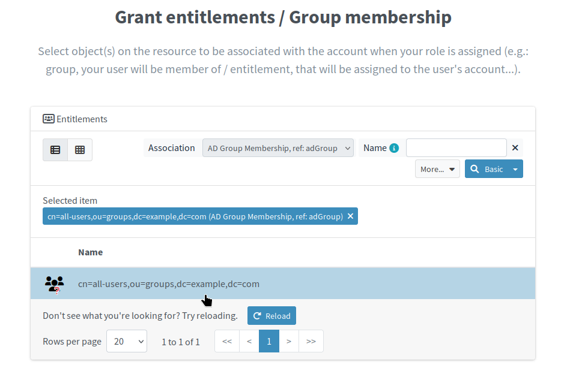
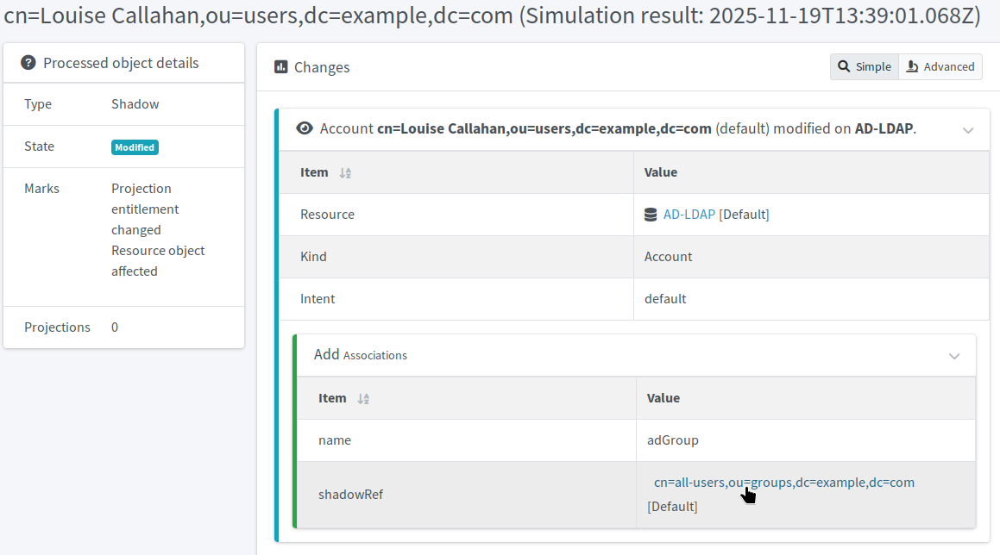
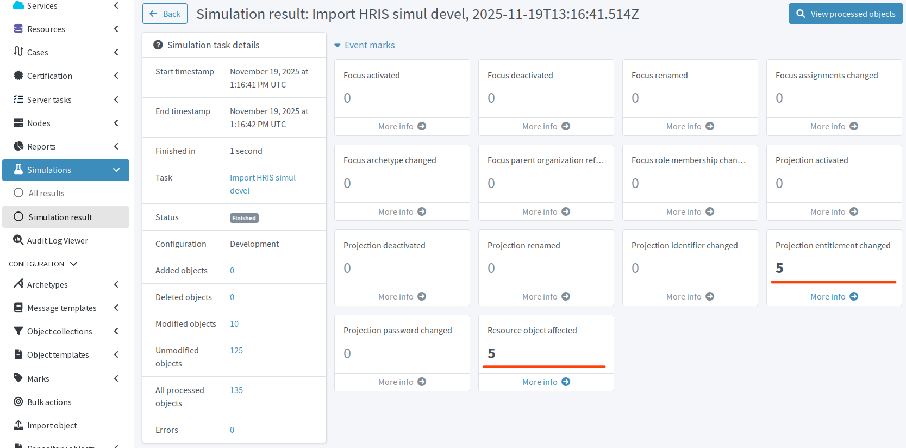

= Automate target resource group membership
:page-nav-title: Automate group membership
:page-display-order: 430
:page-toc: top
:experimental:
:icons: font

Usually, users of a certain archetype, such as employees, contractors, etc., are assigned to certain groups by default.
In this guide, we do not work with roles much and have users of only one archetype (_Person_), but all users are in the _all-users_ group in the target LDAP resource.
You have already automated username creation and target resource provisioning for new users.
It is time now to make sure new users also get assigned to the universal group in which all users are.

== What awaits you in this module

To assign new users to a group automatically, you will take these steps:

. Create an _AD Group_ resource object type in the LDAP resource.
    ** We call the type _AD Group_ because we use LDAP here intentionally to get as close as possible to the usual scenario where an actual Active Directory (AD) would be your target resource.
. Create an association between the _AD Group_ and LDAP accounts.
. Create an association construction in the _Person_ archetype to grant group membership to users of the _Person_ archetype.
. Reconcile the source HRIS resource accounts so that users get recomputed and all are granted the group membership.

[NOTE]
====
If you use the Docker images prepared for this guide, most of the settings are already preconfigured.
Follow the steps in this module and review the settings to how group assignment works.
====

:sectnums:

== Create object type for user groups

In midPoint, groups of users (or any other identities) are represented by object types of the _entitlement_ kind.
When a user is added to a group, it means the account of the user is _associated_ with the entitlement object type.

Firstly, you need to create the group entitlement object type in the target system schema handling.

. In [.nowrap]#icon:database[] *Resources*# > [.nowrap]#icon:database[] *All resources*#, go to the LDAP target resource.
. In [.nowrap]#icon:exchange-alt[] *Schema handling*#, click [.nowrap]#icon:circle-plus[] btn:[Add object type]#.
. *Basic information about the object type* screen:
    ** *Display name*: e.g., _AD Group_
    ** *Kind*: _Entitlement_
    ** *Intent*: e.g., _adgroup_
    ** *Default*: _True_
. *Specify the resource data* screen:
    ** *Object class*: _groupOfNames_
. *Specify the midPoint data* screen:
    ** Leave unchanged
. Click [.nowrap]#icon:check[] btn:[Save settings]#
. Click btn:[Back to object types].

[NOTE]
====
The new object type is in the _Active_ lifecycle state by default.
You can leave it at that because you will create the association part of the configuration in the _Proposed_ state,
meaning the xref:/midpoint/methodology/first-steps/automate-target-system-integration/generate-usernames-in-midpoint/#automate-importing-users-to-midpoint[recurring HRIS import task] you have set up earlier will not pick up your new configuration until you _activate_ the association.
====

== Associate LDAP accounts with the group

With the entitlement for the group ready, you need create an association between the entitlement and user accounts.
In short, the association definition tells midPoint the following:

* With what to associate the resource accounts (the group).
* In which direction the association works (object to subject, i.e., the group contains list of accounts belonging to the group).
* Which entitlement object attribute (i.e., which attribute of the group) holds the list of subjects, i.e., accounts.
* Which subject (i.e., account) attribute to use in the list of subjects belonging to the group—in the case here, it is the distinguished name (`dn`).

[TIP]
====
It is worth noting that when you associate accounts to an entitlement, nothing is written neither into the account shadows, nor their respective focal objects.
It is the entitlement resource object that holds the membership information and midPoint pulls this information from the resource whenever needed, and merely caches it if configured to do so.

Learn more: xref:/midpoint/reference/resources/entitlements/[]
====

To add the association:

. In the target resource, go to [.nowrap]#icon:male[] *Accounts*#.
. Click [.nowrap]#icon:cog[] btn:[Configure]# and select [.nowrap]#icon:shield[] *Associations*#.
. Click [.nowrap]#icon:circle-plus[] btn:[Add association]#.
. Fill in the form fields to define the association:
    ** *ref*: The name of the entitlement object you have created earlier: _adGroup_
    ** *Display name* A human-friendly for the association: e.g., _AD Group Membership_
    ** *Kind*: Select _Entitlement_
    ** *Intent*: Select _adGroup_
    ** *Direction*: In this case, the entitlement object holds a list of members; select _Object to subject_
    ** *Association attribute*: Which attribute in the entitlement object holds the member list: _member_
        *** This depends on the remote resource attribute naming
    ** *Value attribute*: Which account attribute to store in the association attribute of the entitlement object: _dn_
        *** This depends on the remote resource attribute naming
    ** Lifecycle state: _Proposed_
. Click [.nowrap]#icon:check[] btn:[Save association settings]# to save your changes.

.Association of LDAP accounts with the all-users group
image::ldap-adgroup-association.webp["Association of LDAP account with the all-users group"]

== Grant all _Persons_ membership in the group

In this guide, we do not use roles; however, it is necessary to have some key to determine which accounts are entitled to the group membership.
Normally, user roles would be the key.
Here, instead of roles, we can use archetypes for the classification:
Only accounts associated with users of the _Person_ archetype are eligible for the group membership.

To achieve this, you need to induce the entitlement in the _Person_ archetype:

. In [.nowrap]#+++<i class="fe fe-archetype_smooth"></i>+++ *Archetypes*# > [.nowrap]#+++<i class="fe fe-archetype_smooth"></i>+++ *All archetypes*#, open the _Person_ archetype for editing.
    ** You can filter archetypes by *Name*.
. In [.nowrap]#icon:circle[] *Inducements*# > [.nowrap]#icon:database[] *Resource*#, select the *Construction Associations* tab.
. Click [.nowrap]#icon:plus[] btn:[New]# to add a new association.
. In the modal that appears, select the group entitlement; in our case, _cn=all-users,ou=groups,dc=example,dc=com_.
    ** You may need to click [.nowrap]#icon:rotate-right[] btn:[Reload]# to refresh the list if you do not see the desired entitlement.
. Click btn:[Done] to save the settings.
. Click btn:[Done] in the Construction Associations tab to save the settings.
. Click [.nowrap]#icon:save[] btn:[Save]# in the top toolbar to save the archetype configuration.

.Select the group to entitle the Person archetype-related accounts to the group membership

== Verify your configuration

To test the new configuration, you need to reconcile the accounts.
You can either reconcile the source HRIS accounts or the target LDAP ones, the simulation results will be the same regardless, because the induced entitlement comes from the _Person_ archetype which is "above" the resources.
We suggest simulating on the HRIS, though, because it is the HRIS resource from which you import users to midPoint.

Firstly, xref:/midpoint/reference/tasks/synchronization-tasks/import-and-reconciliation/gui/#simulate-import-of-a-single-object[import preview] a single user with `empnum` 90XX (those are the xref:/midpoint/methodology/first-steps/automate-target-system-integration/generate-usernames-in-midpoint/#add-new-users-in-source-system-to-test-username-generation[new users you have added to HRIS] when testing the target system provisioning).

.Import preview of Luise Callahan on the HRIS resource, showing the projection entitlement would change on the resource object

Secondly, after you inspect the results and verify the results are as expected, run a simulated import task on HRIS.
You have there one ready for use from the time when you xref:/midpoint/methodology/first-steps/connect-source-system/import-accounts-from-hris/[imported users to midPoint].

When the import simulation task finishes, review its results:
You should see only the new accounts you have added earlier changed, and the change should only be the addition of entitlement on the LDAP resource object.

.The HRIS resource import simulation task results overview shows five resource objects would be changed due to the group membership assignment

== Put the configuration to production

Once you verify the group is assigned to the new 90XX users and nothing else changes (as it should not), you can put the configuration to production and wait for the recurring HRIS import task on production to pick up the users without the _all-users_ group membership and assign them to the group.

To put the configuration to production, trace back you steps and make sure every new piece you have added is in the _Production_ lifecycle state:

. The new LDAP resource object type for entitlements.
    ** Go to the LDAP resource > [.nowrap]#icon:exchange[] *Schema handling*# and ensure the _AD Group_ entitlement is _active_.
. The association between the entitlement and user accounts.
    ** In the LDAP resource > [.nowrap]#icon:male[] *Accounts*# > [.nowrap]#icon:cog[] btn:[Configure]# > [.nowrap]#icon:shield[] *Associations*#, ensure the association is _active_.
. The construction association in the _Person_ archetype resource inducement.
    ** You do not need to do anything here because the archetype is already _active_ and the association construction does not have its own lifecycle.

Once all is _active_, wait for the recurring HRIS import task to pick up the accounts and process them.
After it finishes, you can verify the results in two places:

. In the LDAP target resource user interface. +
+
.The all-users group member list in the LDAP user interface. The new users are shown at the bottom.
image::ldap-ui-all-users-group.webp["The all-users group member list in the LDAP user interface. The new users are shown at the bottom."]

. In [.nowrap]#icon:user[] *Users*# > [.nowrap]#icon:user[] *Persons*#,
    where you open one of the new users for inspection, go to [.nowrap]#icon:male[] *Projections*#, select the LDAP projection, and look into the *Associations* section. +
+
.The projections screen in Luise Callahan's user profile in midPoint showing the user is a member of the all-users group on LDAP
image::ldap-user-lcallahan-association-ad-group-membership.webp["The projections screen in Luise Callahan's user profile in midPoint showing the user is a member of the all-users group on LDAP"]

:sectnums!:

== Next steps

Now that you have a complete target resource provisioning configuration, it is time to think about consistency management.
In the beginning, you have decided, which resource to use as the single source of truth (SSoT).
In the case of this guide, it is the HRIS resource.
That means, data on all resources should be consistent with what is in the HRIS resource.
The next steps then are to enforce the consistency so that target systems contain the same information as the source system.

.When you are through the basics…
[TIP]
====
Should you want to pursue more complex group membership configurations, take the link:https://evolveum.com/training-and-certification/midpoint-deployment-group-synchronization-self-paced/#evo_training_description[MidPoint Deployment: Group Synchronization] group after you finish this First steps guide.
====