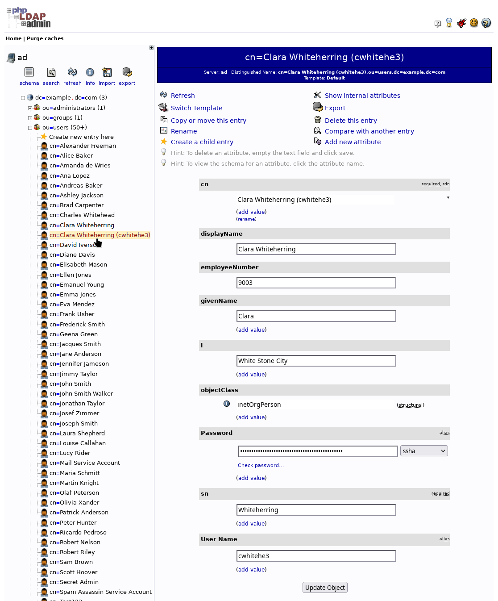

= Automate target resource account creation for all Person accounts
:page-nav-title: Automate LDAP account creation
:page-display-order: 420
:page-toc: top
:experimental:
:icons: font

At this point of your journey, your midPoint configuration can automatically generate usernames and passwords, and source HRIS resource are automatically pulled into midPoint.
In the setup we use in this guide, every _Person_ has an account on the LDAP target resource.
That is, excluding the new users you have added via the HRIS in the previous module.

And that is what you are to address in this module—configure midPoint so that every user of the _Person_ archetype automatically gets an account on LDAP.

== What awaits you in this module

Typically, resource provisioning is based on roles or organizations user has or belongs to.
We do not manage any custom role membership yet.
On the other hand, you automatically assign the _Person_ archetype to every user who arrives from the HRIS.
You will use the _Person_ archetype to create target LDAP resource accounts as a birthright of every user imported from the HRIS.

To give user of the _Person_ archetype this birthright, you will *add a new inducement to the _Person_ archetype* that will _cause_ ownership of an AD account.

Learn more about inducements, how they work and how they differ from other similar concepts in midPoint: xref:/midpoint/architecture/concepts/inducement-assignment-entitlement/[]

== Add inducement to the Person archetype

. In [.nowrap]#+++<i class="fe fe-archetype_smooth"></i>+++ *Archetypes*# > [.nowrap]#+++<i class="fe fe-archetype_smooth"></i>+++ *All archetypes*#, open the _Person_ archetype for editing.
    ** You can filter archetypes by *Name*.
. In [.nowrap]#icon:circle[] *Inducements*# > [.nowrap]#icon:database[] *Resource*#, click [.nowrap]#+++<i class="fe fe-assignment"></i>+++ btn:[New]#.
. Select your target resource.
. Click btn:[Next: Resource object type].
. Keep the selected *Default for kind: Account* and click btn:[Next: Entitlements].
. Without making any changes and click btn:[Next: Mappings] to continue.
. Do not add any mappings and click [.nowrap]#icon:check[] btn:[Save settings]# to save the configuration.

== Let scheduled HRIS reconciliation ensure provisioning

You have added an entitlement to the _Person_ archetype ensuring all _Person_-archetype users have an LDAP account.
The next step is to wait for the xref:/midpoint/methodology/first-steps/automate-target-system-integration/generate-usernames-in-midpoint/#automate-importing-users-to-midpoint[scheduled HRIS reconciliation task]
you have created earlier
to recompute all the users,
find out that some users (the 900X series) do not have an LDAP projection,
and fix that by provisioning them an account.

You can check the result in the user list under [.nowrap]#icon:male[] *Users*# > [.nowrap]#icon:male[] *Persons*#,
or see the target resource directly.

.List of LDAP accounts including the new accounts created in HRIS

== What is next

With the steps above completed, you have automated provisioning target resource accounts for all people you manage in midPoint.

The next logical step is to have all new accounts automatically assigned to a default group in which all users are.