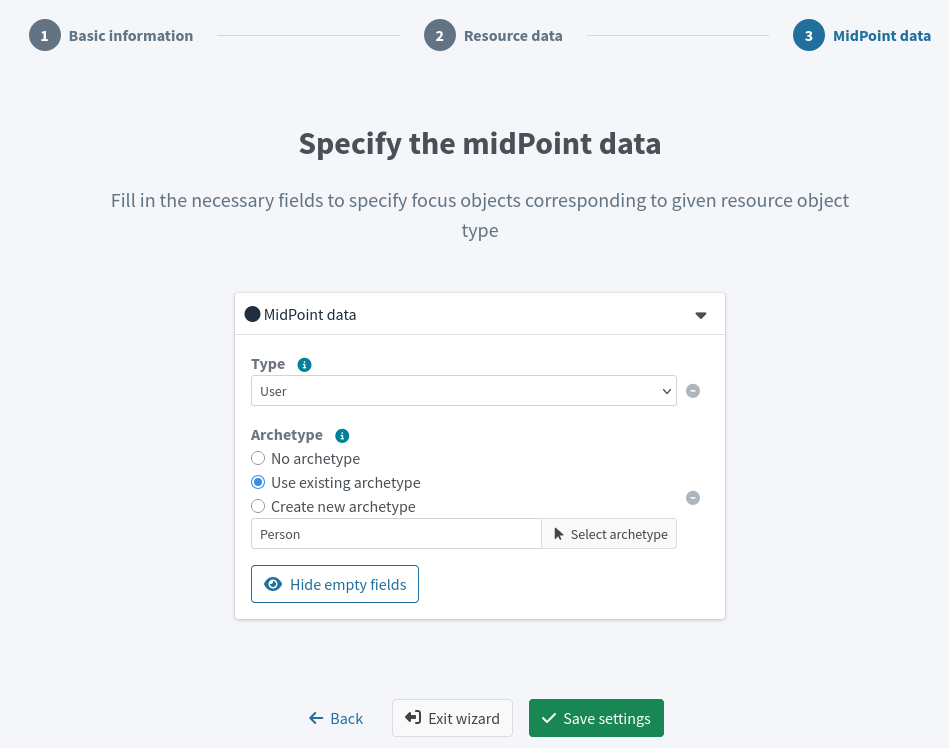

= Connect the HR system
:page-nav-title: Connect HR system
:page-display-order: 110
:page-toc: top
:experimental:
:icons: font

When starting an IGA deployment project, having covered the planning part, the first practical thing to do is to connect the authoritative source system to midPoint.
When you are done with this step, you are going to have the user accounts in midPoint and can move forth with connecting a target system, such as an Active Directory.

In this guide, we are using an HR information system as the authoritative system.

== What awaits you in this module

Connect the HR application to midPoint by creating a new resource,
define an object type as the blueprint for HRIS user accounts,
and filter out any HRIS accounts you do not wish to manage in midPoint.

:sectnums:

== Create a resource for the HR system

Our HR system exports accounts to CSV files.
A CSV file can be a resource like any other.
To get users from the CSV to midPoint, use the CSV connector and configure it according to the structure of the CSV file.

*Follow this configuration guide: xref:/midpoint/reference/admin-gui/resource-wizard/create-resource-using-wizard/[]*

. Create a new resource from scratch.
. Use the CSV connector.
. Keep the lifecycle state set to _Proposed_ until you finish the whole configuration of the resource.
. Get back here when you are done.

[NOTE]
====
For the MID-301 training Docker containers, use:

* `/opt/midpoint/var/resources/export.csv` as the CSV file path
* `empnum` as the unique attribute name
====

== Configure the HR resource object type

The next step is to configure the CSV resource object type.
In the case of HR system, each resource object represents a user account in the system.

*Follow this configuration guide: xref:/midpoint/reference/admin-gui/resource-wizard/object-type/[]*

. Name the object type _HR Person_, for example.
. Make the object type of the _Account_ kind, _default_ (or empty) intent, and with the _Default_ attribute set to _True_.
. Keep the rest of the settings to defaults.
. In the last screen, select the _User_ type, and the _Person_ archetype.
. Get back here when you are done.

.Object type configuration screen with the type set to _User_ and the archetype to _Person_

After you save your object type, you can xref:/midpoint/reference/admin-gui/resource-wizard/object-type/#further-object-type-configuration[preview the resource data] to see what you are getting from the resource.

== Filter out irrelevant HR entries

When you preview the resource objects, you may realize that there are some accounts which you do not want or need to manage using midPoint.

These may be AC technicians or people who manage your office greenery.
While their work is indispensable, they simply have no IT accounts to manage.

To prevent these accounts from being imported to midPoint:

. Find a common pattern these entries have in the HR system. +
    It may be that their employee numbers start with a different digit or their employment type is different from others…

. xref:/midpoint/reference/admin-gui/resource-wizard/object-type[Go back to the object type configuration] and select the icon:circle[] *Basic attributes* tile.

. Edit the object type you've created for the accounts and xref:/midpoint/reference/admin-gui/resource-wizard/object-type#filter-resource-objects[set up a filtering query]. +
    For instance, to exclude employees whose number (`empnum`) starts with `8`: `attributes/empnum not startsWith "8"`.
    ** If you are using the MID-301 training data, use exactly that filtering formula.

. Save the object.
    ** Note that previewing will always list _all_ the objects on the resource regardless of the object type filtering you set up.

. xref:/midpoint/reference/tasks/shadow-reclassification-task/[Reclassify the resource object shadows] to reflect your changes in the account list.

The excluded accounts no longer appear among the accounts. MidPoint is aware of them but they are no longer considered an _HR Person_ (they are of an undefined kind and intent, and not managed by midPoint).

:sectnums!:

== Next steps

Now, you are ready to proceed further with preparations to import your HRIS users to midPoint.

[.nowrap]#icon:arrow-right[] *xref:/midpoint/methodology/first-steps/connect-source-system/define-mapping-and-synchronization-rules/[]*#