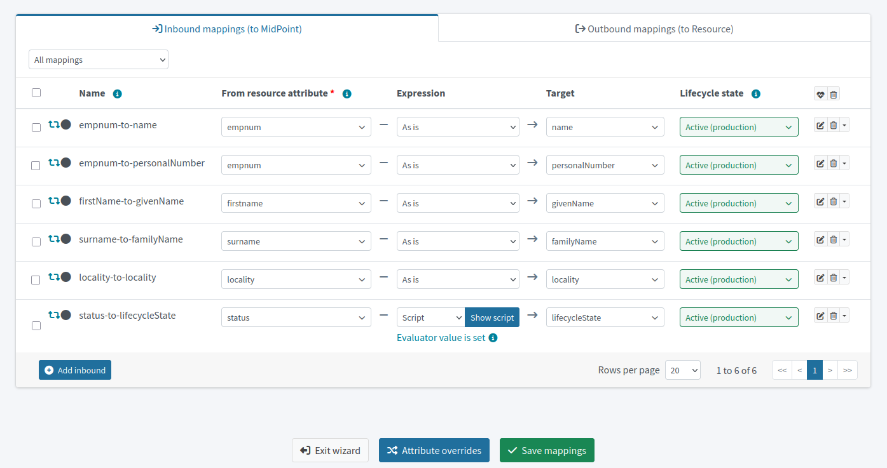

= Define mapping and synchronization rules
:page-nav-title: Define mapping and synchronization rules
:page-display-order: 120
:page-toc: top
:experimental:
:icons: font

Before you can import any user accounts, you need to define user data handling, as well as specify synchronization rules on how to behave when users are discovered, updated, deleted, and so on.
This is what mappings and synchronization policies are for.

Both the synchronization and mapping rules can be set as _Active_ because the whole resource is still in the _Proposed_ lifecycle state.
Lifecycle states can be considered hierarchical in this case.
Refer to xref:/midpoint/reference/concepts/object-lifecycle/[] for more details about lifecycle states.

== Set synchronization rules

Firstly, let's tell midPoint what to do in what situation.

* Refer to this guide on creating synchronization rules: xref:/midpoint/reference/admin-gui/resource-wizard/object-type/synchronization/[]

These are the rules to define at this stage of your project:

[cols="2,1,1,1,4"]
|====
| Name | Situation | Reaction | Lifecycle state | Comments

| add-focus-for-unmatched
| Unmatched
| Add focus
| Active
| The account from CSV doesn't exist in midPoint yet, so let's create the user in midPoint.

// technically not needed in clean MP but they need to add it later anyway so I'm putting it here already @dakle
| link-unlinked
| Unlinked
| Link
| Active
| There's a focus for the account but it's not linked to the shadow of the account yet, let's link it. This isn't used during the first import, but it's necessary for later when the account shadows are in midPoint already.

| synchronize-linked
| Linked
| Synchronize
| Active
| Synchronize the data between the remote account and the focus based on mappings.

|====

[TIP]
====
See xref:/midpoint/features/current/synchronization/[] to learn about the topic in more depth.
====

== Map user data

Secondly, you need to map various data in the user objects on the resource to user attributes in midPoint.

* Refer to this guide on creating mapping rules: xref:/midpoint/reference/admin-gui/resource-wizard/object-type/mapping/[].

* Use *inbound mappings* because you're pulling attributes _from_ the resource _to_ midPoint.

See xref:/midpoint/features/current/mapping/[] to learn about the topic in more depth.

Below are the rules to define now.
Your source attribute names may be different based on your source system attribute naming.

[cols="2,1,1,1,1,5"]
|====
| Name | Source | Expression | Target | Lifecycle state | Comments

| empnum-to-name
| `empnum`
| As is
| `name`
| Active
| Name must be unique so the employee number is the best choice now. Later, you can generate unique usernames, for example.

| empnum-to-personalNumber
| `empnum`
| As is
| `personalNumber`
| Active
| empnum is also important for employee identification so we map it to another dedicated parameter. It'll stay there even after you create unique usernames.

| firstName-to-givenName
| `firstName`
| As is
| `givenName`
| Active
| We'll construct a full name from first and last names.

| surname-to-familyName
| `surname`
| As is
| `familyName`
| Active
|

| locality-to-locality
| `locality`
| As is
| `locality`
| Active
| User location can be later used with the full name for a last-resort correlation.

| status-to-lifecycleState
| `status`
| Script
| `lifecycleState`
| Active
| Find the script to use beneath the table.

|====

[[mapping-script]]
.The status-to-lifecycleState mapping conversion script
[source,groovy]
----
switch (input) {
   case 'In':
      'active'
      break

   case 'Long-term leave':
      'suspended'
      break

   case 'Former employee':
      'archived'
      break
}
----

.Naming conventions for mapping names
[NOTE]
====
You may be curious about why we name the mappings as shown above.
At first glance, it seems unnecessary to name the mapping _surname-to-familyName_
since it is evident that it takes _surname_ as input and outputs its content to _familyName_.

You are correct, but the rationale behind this naming convention is that *mapping names must be unique within the object type*.
This approach helps to ensure that.

As for spaces vs. dashes—you can use either, but dashes are generally the saver option.
====

== Make the resource read-only

If you're dealing with a resource the data of which you don't want to change, it's best to adjust the xref:/midpoint/reference/resources/resource-configuration/capabilities/[configured capabilities] of the resource so that mistakes can't happen.

. In your HR resource, go to icon:info[] *Details*.
. Disable the *Create*, *Update*, and *Delete* capabilites.
	** You can disable Create and Delete by clicking their respective buttons.
		As for the Update capability, you need to select *Enabled*: _False_ in the modal that appears after clicking the capability button.

