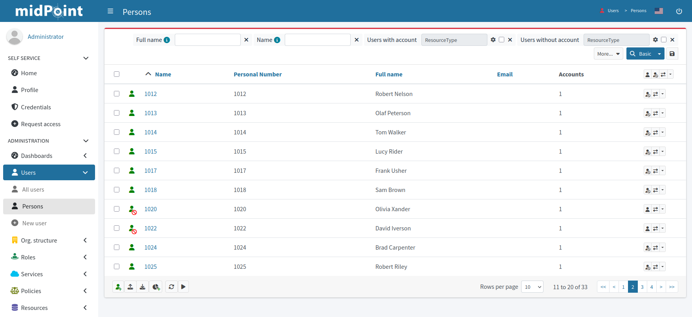

= Import users from the HR system
:page-nav-title: Import users from HRIS
:page-display-order: 130
:page-toc: top
:experimental:
:icons: font

Everything is now ready for importing accounts from HRIS.
Before you proceed with the real production import, it is best to _simulate_ the action first and see if everything behaves as expected.

== Simulate first

. You first simulate importing one account.
    Refer to the xref:/midpoint/reference/tasks/synchronization-tasks/import-and-reconciliation/gui/#simulate-import-of-a-single-object[guide on import preview] for details.
. Then, try it with all accounts.
    Refer to the xref:/midpoint/reference/tasks/synchronization-tasks/import-and-reconciliation/gui/[guide on creating tasks in GUI].
	.. Select icon:upload[] btn:[Import task] and switch on the *Simulate task* toggle to activate simulation mode.
    .. Use _Preview_ mode with the _Development_ configuration in the xref:/midpoint/reference/tasks/synchronization-tasks/import-and-reconciliation/gui#execution[execution setup screen].
    .. xref:/midpoint/reference/tasks/synchronization-tasks/import-and-reconciliation/gui/#read-simulation-results[Inspect the simulation results] and rectify the resource configuration if needed.
        *** You may notice a discrepancy between the number of your resource objects and the number of to-be imported people.
            That's expected if xref:/midpoint/methodology/first-steps/connect-source-system/define-mapping-and-synchronization-rules/#map-user-data[your mapping sets some people as inactive].
            Click the number in the *Added objects* count in the *Simulation task details* sidebar to view all the to-be-added accounts.

Refer to xref:/midpoint/reference/admin-gui/simulations/[] for more details on simulation results in the midPoint GUI.

== Import for real

Once you confirm you get the expected results during the simulations, you can *import the users for real*.

[TIP]
====
We strongly suggest you *don't skip the simulation steps*.
It's the best way to make sure your resource configuration behaves as expected and fix it if needed.
====

. Make sure you have all relevant objects in the _Active_ lifecycle state:
    ** The whole resource
    ** The object type for accounts
    ** Mapping rules
    ** Synchronization rules
	** Since midPoint 4.9, you can use the icon:heart-pulse[] btn:[Check detailed lifecycle] button in the top menu within the resource to view a list of individual resource components and their current lifecycle states.
. Create the same import task you used for simulation but this time with the *simulation toggle switched off*, i.e., use the _Undefined_ execution mode with _Production_ configuration.
    ** With the *Simulate task* toggle off, you won't see the *Execution* screen and midPoint uses the production settings automatically.
. Check the imported accounts in the icon:male[] Accounts section of your resource.
. You can find all imported users also under icon:user[role="red"] *Users* > icon:user[] *Persons*.

If you see a list similar to the one above―congratulations, you've imported your users to midPoint and you're ready to connect a target system to midPoint.

You may ask if it is OK to have employee numbers as user names instead of their real names.
Good and timely question.
It is up to you, but generally, it's better to use actual names of users as their corresponding object identifiers.
A bit later in this guide, you will learn how to get the user names from the target LDAP resource which contains them.
(Spoiler alert: Towards the end of the guide, you will learn to generate user names in midPoint).

Proceed to xref:/midpoint/methodology/first-steps/integrate-target-system/[]