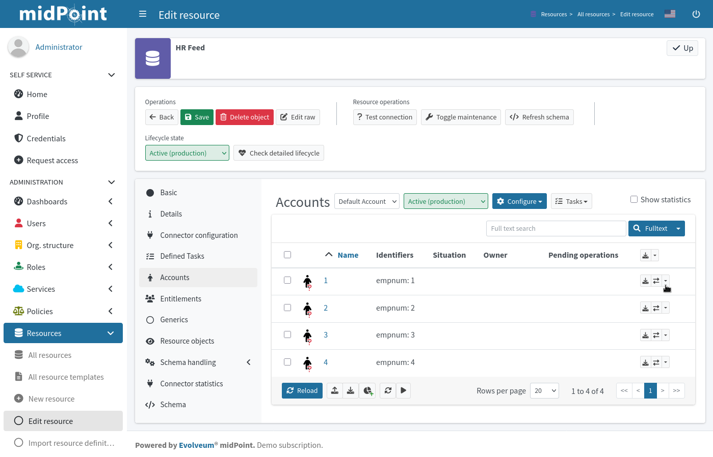

= Connect the Source and Target Systems
:page-nav-title: 'Connect Source and Target'
:page-display-order: 110
:page-toc: top
:experimental:
:icons: font

.Goal
[TIP]
====
Now that you know what systems you need to manage, it's time to connect them to midPoint and assess the quality of the data you're dealing with.
Use this step to identify serious security risks, such as orphaned accounts.
You'll also get to know how consistent your data are across the systems.
You can use this knowledge to improve your plan based on _real_ data.
====

Let us repeat that for the purposes of this guide, we suppose you have an HR system that exports CSV files with accounts and an Active Directory system implemented using LDAP.
The HR system is considered to be an authoritative source, the AD/LDAP system is considered to be a non-authoritative target system.

Whatever your actual systems are, the concepts presented in this guide are universal and you need to adjust only the implementation details, such as your resource configuration.

== Considerations Before You Connect the Source System

In theory, you should give the data in your _source_ HR system absolute authority and use it to fix any inconsistencies in other _target_ systems, such as an Active Directory or other resources.

Reality isn't so straightforward, though.

* Firstly, there are almost certainly errors in the HR data.
    They're managed manually with no automatic validation.
    Having nothing to compare the data with makes it impossible to assess their quality.

* Secondly, target systems like Active Directory are managed by different people and also manually.
    There may be outdated information, such as old names of people who changed their names.
    More serious issues like orphaned accounts of former employees can occur.
    These issues are fairly easy to fix through synchronization with the HR resource, though.

* Thirdly, not all Active Directory accounts need to exist in the HR system.
    Your AD admins may have created some service accounts.
    These aren’t employees and therefore aren't in the HR system.
    That means an HR-based synchronization without proper planning would delete these potentially business-critical accounts.

Overall, when integrating an IGA solution on top of existing account data, *you need to be vigilant*:

* You can't change *usernames* carelessly.
  Many systems in your organization may use them as the primary ID of accounts.

* You mustn't delete any *accounts* unless you're absolutely sure it's the desired action.

* You have to keep *passwords* as they are.
  Otherwise, you'd lock people out of the systems across your organization.

== Connect the HR System

The first thing to do is to connect the authoritative source system to midPoint.
When you're done with this step, you're going to have the HR accounts in midPoint and can move forth with connecting a target system, such as an Active Directory.

=== Create a Resource for the HR System

The HR system exports accounts to CSV files.
A CSV file can be a resource like any other.
To get users from CSV to midPoint, use the CSV connector and configure it according to the structure of the CSV export.

*Use the xref:/midpoint/reference/admin-gui/resource-wizard/create-resource-using-wizard/[guide on connecting a resource to midPoint] to help you with the configuration.*

. Create a new resource from scratch.
. Use the CSV connector.
. Set the lifecycle state to _Proposed_ until you finish the whole configuration of the resource.
. Get back here when you're done.

=== Configure the Resource Object Type

The next step after connecting the CSV resource is to configure the resource object type.
In your case, each resource object represents a user account in the HR system.

*Use this guide for xref:/midpoint/reference/admin-gui/resource-wizard/object-type/[instructions on object type configuration].*

. Name the object type _HR account_, for example.
. The type will be of the _Account_ kind, _default_ (or empty) intent, and with the _Default_ attribute set to _True_.
. Select the _Person_ archetype in the last step.
. Keep the rest of the settings to defaults.
. Get back here when you're done.

After you save your object type, you can preview the resource data to see what you're getting from there.

=== Filter Out Irrelevant HR Entries

// This should be a separate short tutorial that elaborates a bit more on the topic. TBD @dakle
// There's a hint on this at /midpoint/reference/master/admin-gui/resource-wizard/object-type/#specify-the-resource-data

When you preview the resource objects, you may realize there are some accounts that you don't want or need to manage using midPoint.

These may be AC technicians or people who manage your office greenery.
While their work is indispensable, they simply have no IT accounts to manage.

To prevent these accounts from being imported to midPoint:

. Find a common pattern these entries have in the HR system. +
    It may be that their employee numbers start with a different digit or their employment type is different from others…

. link:#get-back-to-config-wizard[Go back to the resource object type configuration] and select the *Basic* tile.

. In the *Specify the resource data* screen, type a filtering condition to the *Filter* field.+
    For instance, if their `employeeNumber` starts with `8`, unlike anyone else's: `attributes/employeeNumber not startsWith "8"`.

. Save the object and link:#get-back-to-config-wizard[view the resource objects again].

. Click *Reclassify* at the bottom of the resource object list.
. You should see that the `8XXX` accounts no longer appear listed among the resource objects.

Now, you're ready to proceed to the next steps before you can finally import your users from the HR system to midPoint.

[TIP]
====
Up until now, you didn't import anything to midPoint.
When you viewed the resource objects, you were looking at real data at the remote end of the connector (i.e., the CSV file).
That's why it's called preview and why it's important to preview the data before you import them to avoid needless clean-up maintenance later on.
====

=== Define Mappings and Synchronization Policies to Prepare for Import

Before you can import any user accounts, you need to define how to handle the user data in the resource objects, as well as specify rules on how to behave when users are discovered, updated, deleted, and so on.
This is what mappings and synchronization policies are for.

==== Set synchronization rules

Firstly, let's tell midPoint what to do in what situation.

Refer to this guide on how to create synchronization rules: xref:/midpoint/reference/admin-gui/resource-wizard/object-type/synchronization/[]

The rules you want to define at this stage of your project in particular:

[cols="1,1,3"]
|====
| Situation | Reaction | Comments

| Unmatched
| Add focus
| The account from CSV doesn't exist in midPoint yet, so let's create the user in midPoint.

// technically not needed in clean MP but they need to add it later anyway so I'm putting it here already @dakle
| Unlinked
| Link
| There's a focus for the account but it's not linked to the shadow of the account yet, let's link it. This isn't used during the first import, but it's necessary for later when the account shadows are in midPoint already.

| Linked
| Synchronize
| Synchronize the data between the remote account and the focus based on mappings.

|====

==== Map user data

Secondly, let's map various data in the user objects on the resource to user attributes in midPoint.

Refer to xref:/midpoint/reference/admin-gui/resource-wizard/object-type/mapping/[] on how to define mappings.
You want to use *inbound mappings* because you're pulling attributes _from_ the resource _to_ midPoint.

The xref:/midpoint/features/current/mapping/[] feature page may be useful to you if you wish to dive deeper into the mapping mechanisms.

These are the rules you want to define.
Your source attribute names may, of course, be different based on your internal naming convention.

[cols="2,1,1,1,1,5"]
|====
| Name | Source | Expression | Target | Lifecycle state | Comments

| empnum-to-name
| `empnum`
| As is
| `name`
| Active
| Name must be unique so the employee number is the best choice now. Later, you can generate unique usernames, for example.

| empnum-to-personalNumber
| `empnum`
| As is
| `personalNumber`
| Active
| empnum is also important for employee identification so we map it to another dedicated parameter. It'll stay there even after you create unique usernames.

| firstName-to-givenName
| `firstName`
| As is
| `givenName`
| Active
| We'll construct a full name from first and last names.

| surname-to-familyName
| `surname`
| As is
| `familyName`
| Active
|

| locality-to-locality
| `locality`
| As is
| `locality`
| Active
| User location can be later used with the full name for a last-resort correlation.

|====

The mappings can be set as _Active_ because the whole resource is still in the _Proposed_ lifecycle state.

.Naming conventions for mapping names
[TIP]
====
You may be wondering why name the mappings the way we do above.
On the first sight, it seems redundant to name a mapping _surname-to-familyName_ because it's clearly visible in the mapping ingests surname and outputs its content to familyName.

You're right, of course, but the reason for this naming convention is that *mapping names need to be unique throughout the object type*.
This convention helps to ensure that.

As for spaces vs. dashes—you can use either, but dashes are generally the saver option.
====

=== Import Users From the HR System

// This is covered in [First Steps With MidPoint: Assessment - Evolveum Docs](https://docs.evolveum.com/midpoint/methodology/first-steps/assessment/) but we need this for GUI

Everything is now ready for import.
Before you proceed with the real import, it's best to _simulate_ the action first and see if everything behaves as expected.

* You first simulate import of one account.
* Then, try it with all accounts.
* Finally, run the actual real import.

==== Preview Import on a Single Account

. In *Resources* > *All resources* > <your resource>, select *Accounts*.
. Pick one object (account) and click the dropdown menu on the far right of the row.
. Select *Import preview*.
. In the popup that appears, select *Simulated development* as the task execution mode.
. Click btn:[Select].
. Review the data in the simulated import.

You haven't created anything in midPoint yet.
As this is only a simulation, it's the best time to review if the account data map to the right user attributes, and fix it if needed.

Once you're happy with the setup, you can import for real.

==== Simulate Full Import Before You Go All In

Create a simulation task for import.
You'll use the *preview execution mode* with the *development configuration*.
// Refer to xref:/midpoint/gui-guides/tasks/import-tasks/[] for more details on creating tasks.

Inspect the simulation results and confirm whether all is good. Refer to xref:/midpoint/reference/admin-gui/simulations/[] for guidance on interpreting simulation results.
If so, proceed to the real import.

==== Real Import

You've got everything ready to import users from the HR system to midPoint.

Firstly, make sure the resource is in the *Active* lifecycle state.
You can find this setting in the top bar when you open the resource via *Resources* > *All resources* > <your resource>.

Then, create another import task like you did for the simulation.
The only difference is that now you're going to *use production configuration* and leave the execution mode on default.

.Double-check the archetypes
[WARNING]
====
Before you launch the real import task, double check that your resource objects for accounts have the right _Person_ archetypes. It's complicated to change archetypes later.
====

The runtime of the task depends on the amount of accounts you have in your HR system.

Once you run the task and it finishes successfully, you'll see the accounts as linked under icon:male[] btn:[Accounts] in your resource.

Congratulations, you're ready to connect a target system to midPoint.

== Connect Your LDAP Target System

The next thing to do is to connect your target system.
A target system is a resource that acts as a recipient of data _from_ midPoint.
It's not authoritative, yet it has data on the same accounts that you've imported _to_ midPoint from the HR system.

When a system isn't authoritative, it means that it can't overwrite data in midPoint.
Moreover, midPoint is supposed to overwrite (read: rectify) the data on the resource if they happen to mismatch midPoint's truth.
This is useful in cases when, for example, someone creates an unauthorized account on the target system.
The account needs to be deleted and midPoint does so as soon as it find the account, if instructed so.

As mentioned in the previous chapter, the target system in this guide is an LDAP server.

[NOTE]
====
The steps you'll take to connect the target system are going to be very similar to what you did with the HR source system.

We point out the differences at the right places to ensure you don't get lost.
====

=== Summary of Steps to Connect a Target System

To connect the LDAP or any other system that contains accounts, follow the xref:#connect-the-hr-system[same steps you took to connect the HR system above]:

. Create a resource for the LDAP system.
    ** Select the LDAP connector and name the resource appropriately.
    ** Create the resource in the _Proposed_ lifecycle state.
    ** The connector configuration is more complex.
        If you're unsure, your LDAP server admins can help you fill in the right values.
. Configure the resource object type.
    ** First, configure an object type with the account kind with default intent.
        You'll likely add more object types later, but start simple now.
. Define mappings and synchronization policies.
    ** Refer to the sections below for details.

=== Create Inbound Mappings for Correlation

As the LDAP resource is currently a strictly outbound resource, meaning that it can't push any data _to_ midPoint, you're going to define a new kind of mapping.
The thing is, to successfully correlate accounts on the LDAP server with the users in midPoint, you need _inbound_ mappings for the LDAP resource, i.e., _from_ LDAP _to_ midPoint.
However, as you don't want any data coming from LDAP to midPoint, the regular inbound mappings aren't the best fit.

That's why you're going to define inbound mappings _strictly for correlation_ purposes.
MidPoint will use these mapping rules only to know which resource attribute to correlate with which _internal_ (focus) user attribute.

The are the mappings you want to use:

[cols="2,1,1,1,1,5"]
|====
| Name | Source | Expression | Target | Lifecycle state | Comments

| inbound-employeeNumber-for-correlation
| `empnum`
| As is
| `personalNumber`
| Active
| Used for correlating employee number in the resource with the personal number in midPoint.

| inbound-surname-for-correlation
| `surname`
| As is
| `familyName`
| Active
| Used for the second correlation rule when the default employee number correlation fails.

| inbound-givenName-for-correlation
| `givenName`
| As is
| `givenName`
| Active
| Used for the second correlation.

| inbound-locality-for-correlation
| `locality`
| As is
| `locality`
| Active
| Used for the second correlation.

|====

Refer to this guide on how to define mappings: xref:/midpoint/reference/admin-gui/resource-wizard/object-type/mapping/[].
You want to use *inbound mappings* and set them to be used for correlation only:

. Click icon:edit[] btn:[Edit] on the far-right side of the mapping row.
. In *Use for*, select _Correlation_.
. Click icon:arrow-right-from-bracket[rotate=180] btn:[Exit wizard].

// TODO: task 12 - rework /midpoint/reference/master/admin-gui/resource-wizard/object-type/mapping/
// to be better structured and contain more info on advanced mapping settings,
// so that I can just link it from here instead of writing the whole guide on correlation-only setting.

=== Define LDAP correlation rules

Next up are the correlation rules.
Correlation in the case of an outbound (target) systems ensures that midPoint can bind together accounts on the target resource (or rather their xref:/glossary/#shadow[shadows] in midPoint) and the users in midPoint.

There is one obvious correlator, and that's the employee number.
If an entry in LDAP has the same employee number as a user in midPoint, they're surely a match.

As a less reliable indicator, you can use, for example, matching first name and surname.
However, two people can bear the same name, so you can't connect such entries automatically.
More on that later.

Here are the correlation rules.
To edit the correlators:

. Click icon:edit[] btn:[Edit] on the far-right side of the correlation rule row.
. Click icon:circle-plus[] btn:[Add correlator]
. Fill in the *Item* and select the *Search method*.
    Repeat for every correlator.
. Click icon:check[] btn:[Confirm settings] when you're done.

Refer to xref:/midpoint/reference/admin-gui/resource-wizard/object-type/correlation/[] for more detailed guide on setting up correlation rules.
The xref:/midpoint/features/current/correlation/[] feature page may be useful to you if you wish to dive deeper into the correlation mechanisms.

[cols="2,5,1,1,1,5"]
|====
| Rule name | Description | Weight | Tier | Enabled | Correlators (Item : Search method)

| personalNumber-correlation
| Correlation using `personalNumber`. Doesn't require human intervention.
|
| 1
| True
| `personalNumber` : Exact match

| last-resort-correlation
| Correlation using givenName, familyName and locality. Trusted only by 50%, human intervention is needed.
| 0.5
| 10
| True
| `givenName` : Exact match +
    `familyName` : Exact match +
    `locality`: Exact match

|====

[NOTE]
====
The attributes used in the correlation rules are acquired by the correlation-only inbound mappings.
====

=== Simulate LDAP Reconciliation

To test your configuration, run a simulated reconciliation task on the development environment.

. Create

1. Create simul-devel task for the LDAP resource
2. Inspect the results
3. Adjust the rules so that MP doesn't delete what you don't want deleted and so on...
// t=2060

---
= The old original content follows
---

.Goal
TIP: Asses the _real_ data quality, determine practical next steps.
At this point we know what we _really_ have, what we can build on, what needs to be improved.
We can identify the most severe security risks, such as orphaned accounts.
Now we can improve our plan, adding more details based on the _real_ data.

You have some kind of HR data now.
In theory, you should use the HR data to create and manage accounts in target system, such as your Active Directory.
However, in practice, this is not entirely straightforward.

Firstly, it is almost certain that there are errors and inaccuracies in the HR data.
The data were maintained manually for a long time, with no way for automatic validation.
Mistakes in the data might be buried deep, surviving undetected for decades.
Having nothing to compare the data with, there is no telling how good or bad the data are.

Secondly, the data in your target systems (especially Active Directory) certainly leave a lot to be desired.
These were managed manually for years, with no automatic way to make sure they’re correct.
There will be account belonging to people that left your organizations years ago.
There will be accounts using maiden names of women that are married now.
There will be strange accounts and identifiers that originated ages ago when your organization was still small and system administration was fun.
There may be all kinds of weirdness and historical baggage frozen in time because nobody remembers what it does and everybody is scared to touch it.

In general, when deploying identity management system to an existing environment, we need to take extra care of the following:

. *usernames*: midPoint usernames should be the same as for the principal authentication system. In this methodology, we assume that company's Active Directory or LDAP which will be connected as the first target system is used as the source of usernames.
. *accounts*: we shouldn’t harm any existing accounts in an unexpected way
. *passwords*: we shouldn’t alter (e.g. re-generate) any existing account password

Taking HR data and simply forcing them to Active Directory will never work.
We need much smarter approach.

// TODO: short summary of the process

This is what you have to do:

== Connect HR System

*Connect HR* data source to midPoint.
Set up your HR identity resource in midPoint, using CSV or DatabaseTable connector.

.Please refer to the following documentation:

* xref:/midpoint/reference/admin-gui/resource-wizard/[]

You can see this step in action in the First Steps Methodology webinar video:

video::suo775ym_PE[youtube,title="Step 2: Connect Source System (HR)",start="1216"]

Deal with just the very basic data items for now:

* Names (given name, family name)
* Employee number, student number or similar identifier
* Status (active, former employee, alumni, etc.) and/or validity date/time (based on contract etc.)

You can ignore other fields for now.
We can get back to them later.

The resource is created in `Proposed` lifecycle status by default.
Keep it that way at this stage.

We recommend to use resource capabilities to disable `Create`, `Update` and `Delete` operations on the resource.

Create a new object type for HR accounts to allow creation of users in midPoint with `Person` archetype assigned.

.Please refer to the following documentation:

* xref:/midpoint/reference/admin-gui/resource-wizard/#object-type-configuration[Resource wizard - part Object type configuration]

WARNING: Make sure you select the proper archetype before importing the users. Change of archetype is not supposed to be a straightforward process as archetypes are expected to work as object classes in the future.

Preview your HR records which will be imported to see if you want to import all of them, or you want to import only a subset of them using a classification filter (e.g. if you want to ignore non-IT personnel).
While the resource is in `Proposed` lifecycle state, you can redefine classification filters and reclassify your HR accounts as many times as you wish.

[#import-users-from-hr]
==  Import Users From HR To MidPoint

*Import users* to midPoint, using HR data.
For simplicity, use HR person identifier (e.g. employee number) as the midPoint username.
We will import the usernames from AD/LDAP later.

.Please refer to the following documentation:

* xref:/midpoint/reference/admin-gui/resource-wizard/#wizard-for-task-creation[Resource wizard - part Wizard for task creation]

You can see this step in action in the First Steps Methodology webinar video:

video::suo775ym_PE[youtube,title="Step 3: Import from HR",start="1541"]

//Select appropriate algorithm for midPoint username.
//You surely have some username convention (such as `jsmith`) in place.

Start with importing a single HR account with preview option to see how the user would be created in midPoint.
Then you can xref:/midpoint/reference/simulation/[simulate] the import of all HR accounts using a simulated import task running with _Development_ configuration to see how all the users would be created in midPoint.

You can continually improve your imported data by adding more attribute mappings.

When finished, switch the HR resource to `Active` lifecycle state.

.Please refer to the following documentation:

* xref:/midpoint/reference/admin-gui/resource-wizard/#how-to-use-lifecycle-state[Resource wizard - part How to use lifecycle state]

WARNING: Make sure you’ve selected the proper archetype for users before importing them. Change of archetype is not supposed to be a straightforward process as archetypes are expected to work as object classes in the future.

Now you can import the HR data, creating user objects in midPoint.
As we’re working with simple data for now, the import should go well.

.User lifecycle
[NOTE]
====
This is where user lifecycle management starts.

We need at least some basic framework for user lifecycle management at this point.

If we can identify inactive (former) HR persons, we can utilize this information when checking for accounts in target systems that shouldn’t be there (if we don’t import inactive users from HR, we will see their accounts in target systems as simply orphaned).
====

Instead of setting user's `administrativeStatus`, we recommend to set midPoint user's `lifecycleState` property based on HR data as either:

* active
* suspended (e.g. temporarily inactive employees - parental leave, long-term sickness etc.)
* archived (e.g. former employees)

.If you have imported users with incorrect archetype
[NOTE]
====
If you’ve managed to import users from source system with an incorrect archetype, please do the following:

. Delete all imported users from midPoint (make sure you don’t delete `administrator` user)
.. midPoint will attempt to delete the source accounts in HR as well, if you have disabled `Create`, `Update` and `Delete` operations in resource capabilities, errors will be displayed (this is expected)
. Re-configure HR resource to use a correct archetype for user creation.
. Re-run the import task from HR resource.
====

[#connect-active-directory]
== Connect Active Directory

*Set up your Active Directory (or LDAP) identity resource* in midPoint and keep it in `Proposed` lifecycle state.
Create Object type definition for AD accounts and keep it in `Proposed` lifecycle state as well.

.Please refer to the following documentation:

* xref:/midpoint/reference/admin-gui/resource-wizard/[]

TIP: You can see this step in action in https://youtu.be/suo775ym_PE?t=1898&si=In5OAmPHUM9p7YdW[Step 4: Connect Target System in the First Steps Methodology Webinar] video.

You can see this step in action in the First Steps Methodology webinar video:

video::suo775ym_PE[youtube,title="Step 4: Connect Target System",start="1898"]

Set up outbound mappings for the small data set that you’ve (given name, username and so on) and keep them in `Draft` lifecycle state (effectively disabled).

Configure correlation rules for AD accounts.

Configure synchronization configuration in `Proposed` lifecycle state.

We don’t want to change any data in Active Directory yet.

.Please refer to the following documentation:

* xref:/midpoint/reference/admin-gui/resource-wizard/#synchronization[Resource wizard - part Synchronization]
* xref:/midpoint/reference/admin-gui/resource-wizard/#correlation[Resource wizard - part Correlation]
* xref:/midpoint/reference/admin-gui/resource-wizard/#mappings[Resource wizard - part Mappings]

.Resource templates
[NOTE]
====
Resource templates can be prepared in advance.

Creating a new resource based on resource template instead of creating it from scratch can save your time as the basic configuration would be pre-defined, and you can enable/update it as necessary.
====

TIP: Please refer to our https://github.com/Evolveum/midpoint-samples/tree/master/samples/resources/ad-ldap/AD[Active Directory resource sample] for more information. This sample was tested with our First Steps Methodology.

==  Correlate Active Directory Accounts

*Correlate Active Directory accounts* with midPoint users.
If you have employee numbers (or similar unique attributes from HR) stored in your Active Directory, then use that for correlation.
As an alternative if no such data can be used or if data is unreliable, you may want to use several attributes for _approximate_ correlation such as names, locality, department etc.
Manual confirmation using midPoint correlation cases can be used to specify midPoint user who should own the Active Directory account if the match is ambiguous.

.Please refer to the following documentation:
* xref:/midpoint/reference/admin-gui/resource-wizard/#synchronization[Resource wizard - part Synchronization]
* xref:/midpoint/reference/admin-gui/resource-wizard/#correlation[Resource wizard - part Correlation]
* xref:/midpoint/reference/admin-gui/resource-wizard/#wizard-for-task-creation[Resource wizard - part Wizard for task creation]

You can see this step in action in the First Steps Methodology webinar video:

video::suo775ym_PE[youtube,title="Step 5: Target System Integration",start="2027"]

After configuring correlation and synchronization (while the resource, object type and synchronization configuration is in `Proposed` lifecycle state):

//Otherwise, use the generated midPoint usernames (e.g. `jsmith` convention) as the correlation identifier to match //(assumed) majority of the accounts to their corresponding owners in midPoint:

. Run the simulated _reconciliation_ task on AD resource using _Development_ configuration.
. Then have a look at the task and simulation results in midPoint GUI (interactively).

If you maintained your identifier assignment conventions reasonably well, most identities should correlate well.
MidPoint will show you correlation statistics for your accounts.

Of course, if the correlation is not able to use the personal/employee numbers, just users' names, there will be problems of `John Smith` and `Josh Smith` with their `jsmith` and `jsmith42` accounts.
Let's leave that for later.
For now just focus on correlating the bulk of users.

If you get 80-90% users to correlate well, you’re done here.

There will be also orphaned accounts (`Unmatched` synchronization situation).
Based on your resource configuration, midPoint may report they will be deactivated (but we’re still in `Proposed` lifecycle state - just simulating).

We will analyze the accounts here, but we will take final decision later in <<Clean Up The Accounts>> to not stop us from progressing.

TIP: You can analyze/clean up the data in several iterations.

The orphaned accounts generally fall into the following categories:

. *Obviously orphaned accounts*:
Review the list of orphaned accounts (the accounts in Active Directory not having an owner in midPoint which should mean they aren’t related to HR data on which midPoint data is based) one by one and make sure these aren’t_ system accounts (see the _System (service) accounts_ category).
+
Be careful if your HR system doesn’t contain/export former employees data; in such situation you will not have the former employees in midPoint as users and their Active Directory accounts will be also considered orphaned.
+
If you’re absolutely sure the accounts should be deactivated, you don’t need to mark them and leave them to their (later) fate.

. *Orphaned accounts of unclear origin*:
Review the list of orphaned accounts (the accounts in Active Directory not having an owner in midPoint which should mean they aren’t related to HR data on which midPoint data is based) one by one and make sure these aren’t_ system accounts (see the _System (service) accounts_ category).
+
xref:/midpoint/reference/concepts/mark/[_Mark_ the undesired ones as Decommission later] to be deactivated eventually (but not yet).

. *System (service) accounts*:
For all accounts that are crucial for Active Directory, we need a different decision.
+
xref:/midpoint/reference/concepts/mark/[_Mark_ the system accounts as Protected in midPoint] to keep track of them, but ignore them otherwise by midPoint.

. *Accounts unmatched because of data inconsistencies.*
Review the rest of accounts which haven’t been matched or decided in the previous steps.
This is the time to take care of the Smiths, Johnsons and Browns if no reasonably unique attribute could have been used for their correlation.
If possible, update your correlation configuration to use more attributes to find matching users (e.g. Given name, Family name, Location, ...).
+
You can also try to figure out which account belongs to which user and correlate them manually.
+
Or you can mark specific accounts as "Correlate later" to ignore them now and resolve them in later iteration.
+
If you did the previous steps well, there should be just a handful of them.
+
Sometimes there are several accounts (or groups of accounts) which need to be reviewed in more detail and remedied.
To avoid getting stuck in this phase, you may simply mark these accounts for later review ("Don’t touch") and ignore any provisioning for them fow now.
(This is actually similar to the concepts of protected accounts, but having a different mark allows us to differentiate the accounts. We want them marked only temporarily, and they will be reported.)

TIP: We recommend to *review the accounts marked in previous iterations* to avoid a constant increase of their numbers.

After you’ve finished marking of your accounts, you can run the simulated _reconciliation_ task with _Development_ configuration again.
Your marked accounts shouldn’t be reported to be deactivated anymore.
Orphaned accounts which aren’t marked should be still reported as to be deactivated.

Switch the resource, object type configuration and all synchronization actions except for `Unmatched` situation to `Active` lifecycle state.
Switch the synchronization action for `Unmatched` situation to `Draft` lifecycle state (to keep the reaction temporarily disabled), and:

. Run the simulated _reconciliation_ task on AD resource using _Production_ configuration.
. Then have a look at the simulation results in midPoint GUI (interactively). Orphaned accounts shouldn’t be touched anymore - we will resolve them later, the synchronization configuration for them won't be used now (just in simulations).

Correlate the majority of your accounts now:

. Run the _reconciliation_ task on AD resource.
. Check the correlation statistics (watch for *Linked* situation)
. Majority of your accounts should be linked to their midPoint owners.

Of course, you’re doing this for the first time.
Chances are that you haven’t got all your configuration exactly right at the first try.
You may even need to update your HR resource configuration (e.g. if you forgot to import employee number) and reimport HR data.
Therefore, we assume you will work in iterations.
Simulations will guide you all the way.

== Import Active Directory usernames

Until now, users in midPoint have been created with employee number (or similar) attribute from HR.
But your users already have Active Directory usernames.
We can reuse them also for midPoint users - the advantage will be more obvious later, if we switch the midPoint authentication mechanism to use Active Directory.

.Please refer to the following documentation:
* xref:/midpoint/reference/admin-gui/resource-wizard/#mappings[Resource wizard - part Mappings]
* xref:/midpoint/reference/admin-gui/resource-wizard/#wizard-for-task-creation[Resource wizard - part Wizard for task creation]

You can see this step in action in the First Steps Methodology webinar video:

video::suo775ym_PE[youtube,title="Step 6: Import Usernames from Target System",start="2461"]

Re-configure the original HR inbound mapping for midPoint username: set its strength to _weak_.
This allows to still create midPoint users who have no Active Directory account, but AD username will have higher priority.

Re-configure your Active Directory resource: add a new _inbound_ mapping from AD's login attribute to midPoint username.
The mapping will be created as _strong_ by default, to take precedence over HR, but keep the mapping lifecycle state `Proposed` (simulation) for now.

Simulate the username import:

. Run the simulated or  _reconciliation_ task on AD resource using _Development_ configuration (as the mapping we're interested in is in `Proposed` lifecycle state).
. Then have a look at the simulation results in midPoint GUI (interactively).

For all users with Active Directory account, midPoint will indicate username change.
Inspect the changes and fix the username mapping in Active Directory if needed.

Re-configure your Active Directory inbound mapping: set it to `Active` lifecycle state.

.Optional step:
[TIP]
====

Simulate the username import once again:

. Run the simulated _reconciliation_ task on AD resource using _Production_ configuration.
. Then have a look at the simulation results in midPoint GUI (interactively).

Inspect the changes and fix the username mapping in Active Directory if needed, before you turn import them for real.
====

Import the usernames now:

. Run the _reconciliation_ task on AD resource.
. Majority of your midPoint users should be renamed according to their Active Directory usernames.
. Users without accounts in Active Directory (e.g. still uncorrelated) will keep their original usernames from HR (based on e.g. employee number). Such users (without Active Directory accounts) can be easily found in midPoint using GUI.

== Clean Up The Accounts

After the majority of the accounts have been correlated and usernames imported, we can handle the orphaned accounts (in situation `Unmatched`).
You have already marked your accounts (and intentionally not marked some of them).

.Please refer to the following documentation:

* xref:/midpoint/reference/admin-gui/resource-wizard/#synchronization[Resource wizard - part Synchronization]

You can see this step in action in the First Steps Methodology webinar video:

video::suo775ym_PE[youtube,title="Step 6.1: Clean Up Orphaned Accounts",start="2723"]

You are ready for clean up procedure:

. re-configure synchronization action for `Unmatched` situation: set it to `Active` lifecycle state.
. run _reconciliation_ task with Active Directory with _Production_ configuration to see what would happen one last time. If the simulation results correspond to what you’ve seen earlier with _Development_ configuration, continue.
. run _reconciliation_ task with Active Directory
. unmarked orphaned accounts should be deactivated
. additionally, the policy for orphaned accounts is set from now on, but the marked accounts will not be harmed.

During the clean up part (now or in one of the later iterations), you should check if there are any uncorrelatable accounts that can be correlated using additional correlation rules and/or operator intervention.

You can see this step in action in the First Steps Methodology webinar video:

video::suo775ym_PE[youtube,title="Step 6.2: Correlation with Operator Confirmation",start="2833"]

You should periodically review your xref:/midpoint/reference/concepts/mark/[marked accounts], especially those "temporary" states such as "To be decommissioned", "Don’t update" and "Correlate later".

You should also periodically run reconciliation task with your Active Directory to detect and deactivate any future orphaned accounts.
Unmarking those accounts and running _reconciliation_ task with Active Directory will remove them.

This phase may seem as pointless phase.
Why not just go directly to automation?
That is what we really want!
However, assessment is all but pointless.
Automation can be done only after the assessment phase is done.
Attempts to automate processes with unreliable data are futile, they invariably lead to failures, usually a very expensive failures.
Speaking from a couple of decades of identity management experience, there is no such thing as reliable data, unless the data are cleaned up and systematically maintained with an assistance of identity management platform.
Simply speaking: you may think that your data is good, but it is not.

== Prepare Active Directory for Provisioning

Before turning on automation, we need to ensure the provisioning configuration for Active Directory resource is correct.
Especially if you’re preparing the configuration in iterations, you need to make sure you’re going right direction.
Simulations will guide you all the way.

.Please refer to the following documentation:

* xref:/midpoint/reference/admin-gui/resource-wizard/#mappings[Resource wizard - part Mappings]
* xref:/midpoint/reference/admin-gui/resource-wizard/#activation[Resource wizard - part Activation]
* xref:/midpoint/reference/admin-gui/resource-wizard/#credentials[Resource wizard - part Credentials]
* xref:/midpoint/reference/admin-gui/resource-wizard/#wizard-for-task-creation[Resource wizard - part Wizard for task creation]

You can see this step in action in the First Steps Methodology webinar video:

video::suo775ym_PE[youtube,title="Step 7: Enable Provisioning to Target System",start="3088"]

Prepare / update outbound attribute mappings for your Active Directory attributes that you wish to provision.
If you want to force midPoint policy for attributes, you would need to make your mappings strong (this is default if you use GUI to create the mappings).
Set your mappings' lifecycle state attributes to `Proposed` to allow simulations.

Prepare / update outbound password mapping(s) for your Active Directory:

. to generate _initial_ (strength: weak) random password for any _new_ Active Directory account from now on.
The password will be forgotten; users need to cooperate with AD administrators or Helpdesk to gain their first credentials.
. to allow passing midPoint password changes to Active Directory (if you wish to use midPoint for AD password changes).
. set your credentials mappings' lifecycle state to `Proposed` to allow simulations.

Passwords may be also changed via Active Directory as usual (or both).

Prepare / update outbound activation mapping(s) for your Active Directory:

. to enable/disable Active Directory accounts based on midPoint user's Lifecycle state
. (optional) xref:/midpoint/reference/resources/resource-configuration/schema-handling/activation/#predefined-activation-mapping[configuration] for Disable instead of delete, Delayed delete etc. - if needed
. set your activation mappings(s') lifecycle state to `Proposed` to allow simulations.

NOTE: midPoint authentication against Active Directory (or LDAP) is assumed for later steps.

Then you can start your simulations:

. Run the simulated _reconciliation_ task on AD resource using _Development_ configuration.
. Then have a look at the simulation results in midPoint GUI (interactively).
. Inspect the results: if midPoint would change existing attributes, states or even passwords in Active Directory or add new values, there should be a reason for, e.g.: policy vs data inconsistency, such as:
.. Active Directory attributes are incorrect/missing, midPoint attributes based on HR data are correct.
.. Active Directory attributes are correct, midPoint attributes based on HR data are incorrect
.. mappings have errors (you need to correct them)
. Fix data vs policy inconsistency by using one or several mechanisms:
.. let midPoint to override data in Active Directory
.. fix data in HR/midPoint and reimport the user(s)
.. adjust midPoint policies (e.g. outbound attribute mappings)
.. define exceptions for specific accounts (e.g. using marks)
.. escalate the situation to let someone help (or decide)
. Repeat the process until all simulated changes make sense and can be executed for real

*When all the inconsistencies are resolved, you’re prepared.*
You can turn on the provisioning:

. Set all required outbound mappings including the mappings for activation and credentials to `Active` lifecycle state
. Run the simulated _reconciliation_ task on AD resource using _Production_ configuration
. Then have a look at the simulation results in midPoint GUI (interactively) one last time.
. Run the _reconciliation_ task on AD resource

Your Active Directory resource is now configured.
Data inconsistency has been fixed.
Policy is defined, applied and will be followed from now on.
There is no automation between HR and midPoint yet, but we’re already prepared for it.

.Simulation notes
[NOTE]
====
. When switching from `Proposed` to `Active` lifecycle state, use also simulation with _Production_ configuration before using the feature in real execution, if possible (usually when the real execution task is not yet running) - this is as close to the real task execution as possible.

. When switching the configuration from `Proposed` to `Active` lifecycle state, be sure to switch all relevant configuration. Otherwise, you might see different behaviour when simulating with _Development_ configuration and _Production_ configuration / real task execution.

. Try not to simulate several unrelated scenarios at the same time, otherwise switching just parts of the configuration from `Proposed` to `Active` lifecycle state may be challenging. You might see different behaviour when simulating with _Development_ configuration and _Production_ configuration / real task execution.

====

You can continue to xref:automation/[Automation] step or return to xref:kick-off/[Kick-off] step.