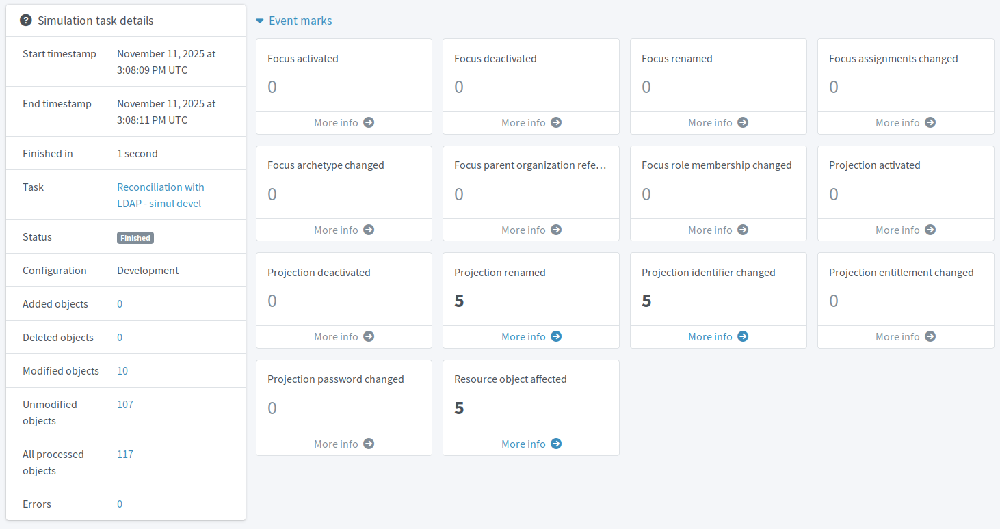

= Enable target system provisioning
:page-nav-title: 4. Provision to target system
:page-display-order: 300
:page-toc: top
:experimental:
:icons: font
:page-description: NAPIS ME

Enable data delivery to the target Active Directory application to move forth with the automation of your midPoint IGA setup.
Target application provisioning enables automation of account creation for new users, updating existing users, as well as disabling former employee accounts without undue delay.
This is also known as the joiner-mover-leaver (JML) process management.

== What awaits you in this module

You will configure midPoint so that it creates new accounts in AD after it fetches them from the HRIS,
corrects mistakes in AD based on the _truth_ in the HRIS,
and manages AD account activation based on the midPoint user status.

Here is the outline of what you are going to do:

. Create outbound AD mappings.
. Create activation rules to enable central account activation management.
. Validate the new setup using simulations.
. Put the configuration to production.

Aside the introduction of the ability to populate AD with the accounts created in the HRIS source system, the configuration has one pleasant "side effect".
That is, once deployed on production, midPoint will fix typos and other mistakes in existing AD accounts.

:sectnums:

== Create outbound Active Directory mappings

The first step is to tell midPoint which user attributes map to which AD attributes.

If you follow this guide along with the pre-configured training Docker images, you do not need to set the rules up from scratch; the midPoint Docker image is pre-configured with these rules in the _Draft_ lifecycle state.
Their names may differ.

If you use your own data sources, you need to inspect them and devise the data flow on your own.
Should your resource be an LDAP or similar, you can use the mapping scripts beneath the table for inspiration on how to transform the data appropriately.

.Inbound vs. outbound mappings
[NOTE]
====
So far, you have used only _inbound_ mappings.
Even the Active Director resource had, so far, used only inbound mappings for usernames and correlation, despite being a target system.
Now, the data flows not _to_ midPoint (_indbound_), but _from_ midPoint.
Hence, the mappings need to be _outbound_.
====

Set the mapping rules according to the table below.

*Follow this guide: xref:/midpoint/reference/admin-gui/resource-wizard/object-type/mapping/#outbound_mappings[]*

.Proposed outbound mappings for the Active Directory provisioning
[cols="5*", options="header"]
|====
| Name                                 | Source             | Expression | Target           | Lifecycle state
| out-name-fullname-to-dn              | `name`, `fullName` | Script     | `dn`             | Proposed
| out-name-fullname-to-cn-weak         | `name`, `fullName` | Script     | `cn`             | Proposed
| out-full-name-to-displayName         | `fullName`         | As is      | `displayName`    | Proposed
| out-familyName-to-sn                 | `familyName`       | As is      | `sn`             | Proposed
| out-givenName-to-givenName           | `givenName`        | As is      | `givenName`      | Proposed
| out-name-to-uid                      | `name`             | As is      | `uid`            | Proposed
| out-locality-to-l                    | `locality`         | As is      | `l`              | Proposed
| out-personalNumber-to-employeeNumber | `personalNumber`   | As is      | `employeeNumber` | Proposed
|====

.Script for _out-name-fullname-to-dn_ mapping
[source,groovy]
----
def dn
    if (iteration == 0) {
        cn = fullName
    } else {
        cn = fullName + ' (' + name + ')'
    }
    return basic.composeDnWithSuffix('cn', cn,
        'ou=users,' + basic.getResourceIcfConfigurationPropertyValue(resource, 'baseContext')
    )
----

.Script for _out-name-fullname-to-cn_ mapping
[source,groovy]
----
def cn
    if (iteration == 0) {
        cn = fullName
    } else {
        cn = fullName + ' (' + name + ')'
    }
    return cn
----

.Proposed vs. active configuration items
[TIP]
====
In the previous modules, you may have gotten used to creating mapping and other configuration items in the _Active_ lifecycle state.
It was fine as long as you had the whole resource _proposed_.
However, that is not the case anymore.
Your Active Directory resource is _active_ now which means you need to _propose_ any new configurations before you validate and _activate_ them.
====

== Handle AD accounts activation from midPoint

When provisioning to Active Directory (or any other target system), you want to equip midPoint with the ability to enable and disable AD accounts based on their respective owner's status in midPoint.

This is the purpose of the outbound administrative status activation mapping.

*Follow this guide: xref:/midpoint/reference/admin-gui/resource-wizard/object-type/activation/[]*

. Create an outbound activation rule.
. Select [.nowrap]#icon:id-card-clip[] btn:[Administrative status]#.
. *Name* the rule descriptively, such as _set-account-status-based-on-midpoint-user_.
. Set *Strength* to _Strong_ to ensure midPoint has full control over the value in the target system.
. Leave other settings at their default.

The *Source* can be left empty because midPoint infers it should use the effective status _As is_ which is exactly what you want here.
If you ever need to override the default behavior, you can specify a source using path expression to reference user (`$focus`) or shadow (`$shadow`) attributes (e.g., `<path>$focus/activation/effectiveStatus</path>`).
You could also use a Groovy script expression to compute the value dynamically.

.Technical advice on disabling accounts in AD/LDAP
[TIP]
====
Since there is no native way to disable AD or LDAP accounts, you need to write the user's effective status to an arbitrary AD/LDAP account attribute.
In the this guide, we use the `roomNumber` attribute.
This needs to be configured in the definition of the resource which is why xref:/midpoint/methodology/first-steps/integrate-target-system/connect-ldap/#create-a-new-resource-for-the-target-application[you copied the AD resource from template].
See this link:https://github.com/Evolveum/midpoint-samples/blob/b7565d9eab1cd702b2ae662f8d2e8b571cf51901/samples/group-synchronization/2024-11-07-webinar/objects/210-resource-ad.xml#L1063[configuration example] for details.
====

// TODO: Add this section to the module outline.

== Delete AD accounts with a grace period

You have already cleaned the "illegal" accounts from your AD.
However, when you are done setting up the joiner-mover-leaver process, midPoint will delete accounts that lose their raison d'être; for instance, when an employee leaves the company, he no longer has a reason to have an AD account.
Deleting accounts is, however, not to be taken lightly.
Mistakes can happen and it is a good practice to avoid hard-deleting accounts right away without any grace period.

For this reason, you will set up two outbound activation mappings:

. Disable instead of delete
. Delayed delete

The former disables accounts instead of having them deleted right away, the latter deletes the disabled accounts after a configured period of time.

*Follow this guide: xref:/midpoint/reference/admin-gui/resource-wizard/object-type/activation/[]*

. Create a new outbound activation rule.
. Select [.nowrap]#icon:user-slash[] btn:[Disable instead of delete]#.
    ** This mapping has no configurable settings.
. Create a new outbound activation rule.
. Select [.nowrap]#icon:clock[] btn:[Delayed delete]#
. Choose a period of time after which accounts should be deleted.
    ** For testing, it makes sense to set this as short as a few minutes.
        On production, reasonable values would be between days and weeks.

// TODO: Add this section to the module outline.

.Active Directory outbound activation mappings
image::ldap-outbound-activation-mappings.webp["Active Directory outbound activation mappings"]

== Generate initial password for new AD users

The accounts created in the HR information system do not have any credentials (passwords) associated with them
because the HRIS is simply a database of people, it does not deal with accesses.
AD accounts, however, cannot be created _passwordless_.

For this reason, you need to configure midPoint to create a random password for each user that arrives from HRIS and is to be pushed to AD.
In this guide, we use simplified approach where users do not know their initial AD password and, in the real world, would be expected to reset via the company help desk, for example.

*Follow this guide: xref:/midpoint/reference/admin-gui/resource-wizard/object-type/credentials/[]*

. Create a new [.nowrap]#icon:arrow-right-from-bracket[] *outbound*# credential mapping.
. *Name* it _generate-initial-password_, for instance.
. Set *Strength* to _Weak_.
. Set *Expression* to _Generate_.
. Set the lifecycle state of the mapping to _Proposed_.
. Keep other options to their default.

This mapping populates the password attribute with a random generated password only if the attribute is empty.
Under any other circumstance, the mapping does not change the password because you set it as _weak_.

== Let users change their AD password in midPoint

Unless you manage authentication and credentials using SSO or other midPoint-unrelated system,
your users may find it useful to have the option to self-manage their AD password directly in midPoint, provided you can somehow supply them with access to midPoint in the first place.
More so if a new user comes, has the initial AD password auto-generated, and needs to reset it to be able to actually access the AD server.

. Create a new [.nowrap]#icon:arrow-right-from-bracket[] *outbound*# credential mapping.
. *Name* it _change-password_, for instance.
. Set *Strength* to _Normal_.
. Set *Expression* to _As is_.
. Set the lifecycle state of the mapping to _Proposed_.
. Keep other options to their default.

The strength of this mapping dictates that it updates the target value when the source changes (i.e., user changes the value in midPoint),
but leaves it be in case the source stays the same but the target value is updated externally (user changed it directly in Active Directory, for example).

.Credential mappings overview
image::credential-mapping-overview.webp["Credential mappings overview"]

== Test your new configuration

With mappings and credential handling set up, you are ready to test the new configuration.

This is the stage when you are about to correct mistakes on the target system, such as incorrectly filled in names, wrong employee numbers (remember the xref:/midpoint/methodology/first-steps/integrate-target-system/reconcile-ldap-accounts/#resolve-correlation-cases[correlation cases]?), and so on.
The amount of changes depends on the quality of the data in your systems.

Reuse the _Reconcile AD - development simulation_ reconciliation task you have used before: xref:/midpoint/methodology/first-steps/integrate-target-system/reconcile-ldap-accounts/#simulate-ad-reconciliation[]

If you follow this guide along with the pre-configured training Docker images, you can expect results similar to this:

.Simulated reconciliation task results overview

And should you open one of the accounts under *Projection renamed*, you would see the data on AD would be corrected based on the HRIS data.
Nothing was changed yet because this was a simulation.

.Simulated correction of data on AD based on HRIS data
image::ldap-provisioning-reconcile-simul-devel-data-correction.webp["Projection renamed showing simulated changes on an AD account"]

Review the simulation results.
If all looks as expected, proceed to the next section.

If you see some unexpected or unwanted changes, now is the time to investigate:

* Which one of your resources holds correct data?
* Do your mappings point to correct attributes?
* Are lifecycle states of all required configurations (mappings, credentials) set to _Proposed_ instead of _Draft_?

Usually, you would either let midPoint change the data in the target system (AD), or fix them in the source system (HRIS) manually.
You could also mark some AD accounts as _Do not touch_ to resolve their situation later.

== Put the provisioning configuration to production

After you verify everything works as expected, the last step is to put the configuration to production.

Put everything that is in the _Proposed_ lifecycle state to the _Active_ state:

* Mapping rules
* Activation rules
* Credential rules

Use the reconciliation tasks you have used before: xref:/midpoint/methodology/first-steps/integrate-target-system/reconcile-ldap-accounts/#reconcile-your-ad-accounts[]

After the production reconciliation task finishes, check that your Active Directory data are consistent with what you have in the HRIS.
All users now have their misspelled names corrected, employee numbers fixed, and so on.

:sectnums!:

== Next steps

Now that you have data between HRIS and AD systems synchronized and consistent,
it is time to automate some processes.
In the next modules, you will learn how to generate usernames for new accounts, ensure all users have an Active Directory account, and are members of the right group.

[.nowrap]#icon:arrow-right[] *xref:/midpoint/methodology/first-steps/automate-target-system-integration/[]*#