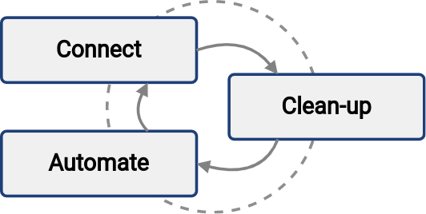

= First steps with midPoint
:page-nav-title: First steps with midPoint
:page-toc: top
:experimental:

== Introduction

This is a guide to a simplified midPoint deployment that will help you get up and running, and get tangible results soon.

We believe the best way to get started is to use an _iterative cyclic approach_.
Start with a series of *small steps that deliver the value early on*, and then repeat those steps to refine your solution.
The steps consist of connecting new systems, cleaning up the data, and automating the processes.
Each cycle should take a few days at most.
This, of course, depends on how fast other departments you need to cooperate with can work,
but allows for manageable effort and reasonable budget allocation.

While learning to use midPoint, you can *feel safe thanks to xref:/midpoint/reference/simulation/[simulations]*.
Before making any changes that could potentially damage your data, you can test them to see if you get the expected results.

However, no matter how safe midPoint is, it is still a good practice to *back up your data regularly*.

=== The concept of an iterative cyclic approach

The main concept behind this whole guide is the iterative cyclic approach.
It enables you to reach your desired solution in a series of small steps.
Each step brings new value and improves the overal solution.

* *Connect* a new system to midPoint.
At this step, you give midPoint the option to _read_ the data from the system and analyze them, possibly comparing them to what midPoint already has its database.

* The *clean-up* step is aimed at improving data quality.
Data in disconnected systems may often be in a poor state.
Accounts have to be correlated, orphaned accounts disabled, data errors corrected.
MidPoint is built to help with that.

* The *automate* step focuses on speeding up processes and improving efficiency.
Manual work can be automated, making the process faster, cheaper, and more reliable.
Onboarding (_joiners_) and offboarding (_leavers_) employees are the usual candidates for automation.

Repeat these steps as long as they bring you tangible value.
In every loop, you connect more systems with more data, align the data, automate the process, and thus make your organization more resilient to usual human errors.

You can repeat the iterations as many times as you need, with as big or small a scope as you need.
The goal is to bring together the data, processes, and policies.

The number of iterations you perform during the first deployment is finite because your time and budget are finite.
However, the first go-live is not the end.
Your policies evolve, you implement new systems, your IT ecosystem develops.
That means the connect—clean-up—automate cycles will repeat over and over, endlessly.
But, on the bright side, their cost is going to decrease significantly over time.

image::adopt-midpoint.drawio.svg[Iterative approach to midPoint deployment]
//image::first-steps-big-picture.png[Iterative midPoint deployment process big picture]

When it comes to identity management, *one size does not fit all*.
Some organizations need strict policies, perfect visibility, or high degree of automation.
Others are perfectly happy with just basic integration and automation, focusing rather on low cost of the solution.

It is virtually impossible to plan an ideal identity management project right of the bat in all its breadth and depth.
Hence, the iterative approach.
You repeat a series of small steps, focusing on areas that need to be improved at that particular point.
This is the way to satisfy the requirements while keeping the costs reasonable.

== Outline of this guide

To safely deploy midPoint on your actual company data, you'll go through the following steps:

. Decide what is it exactly that you need.
	** Which systems do you need to connect to identity management (IDM)?
	** What level of security do you need?
	** Consider your budget for long-term IDM expenses.
. Connect and integrate your first source and target systems using smart correlation.
. Map account attributes.
. Clean up the data by fixing inconsistencies and handling orphaned accounts.
. Automate some processes, such as the joiner-mover-leaver (JML) process.

You can also watch this webinar to see the process in action:

video::suo775ym_PE[youtube,title="First steps methodology webinar video",width="100%",height="350"]

== Who is this guide for?

This guide is meant to help small and mid-size organizations.
Typically, such organizations handle hundreds or lower thousands of identities, most of the processes are manual, and the IT staff doesn't have a lot of knowledge about identity governance and administration (IGA).
We expect that there's an HR system serving as a source of the identity data, as is usual for medium-sized businesses, smaller government offices, or academic institutions.

Nonetheless, most concepts in this guide are applicable to organizations of any size and type.
Even if your organization manages a considerably larger number of identities, the deployment process is the same.
It will probably cost more time and money, but that's it.

=== Key challenges and requirements

These are the usual challenges you may be facing:

* Your identity data is of low quality because it's maintained manually without automatic validation.
* You need more people to manage identities.
* You want to improve your IGA and get tangible results quickly.
* The implementation can't be a "big bang" effort because your IT staff must also continue performing their regular duties.

By going through this guide, you'll learn how to deploy midPoint iteratively and get first results in a matter of weeks, even if you face all the challenges mentioned above.

== Why midPoint?

Here are some pointers as to why midPoint is worth your attention when looking for an IGA solution:

- MidPoint is an open-source software (OSS) that requires a minimum initial investment and no licensing fees before the project begins.

- The software and documentation are open, meaning they're freely available.
You don't have to spend money on consulting services to get started.
You can do the first steps (like prototyping) yourself.

- MidPoint is available now.
No paperwork, contracts, or registration required.
Just https://evolveum.com/download/[download midPoint] and try it out.

- MidPoint is an OSS product with a dedicated team of professionals ready to provide support.
https://evolveum.com/services/[Contact us] to discover more about our services and benefits.

- link:https://evolveum.com/partners/find-a-partner/[Evolveum has a network of official partners] that are ready to deliver dedicated professional support for your project as well.