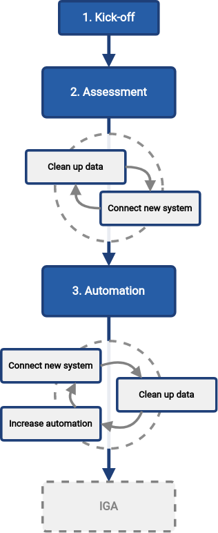

= Methodology: First Steps With MidPoint
:page-nav-title: First Steps With MidPoint
:page-toc: top
:experimental:

== Introduction

Evolveum has created a simplified midPoint deployment methodology, which will guide you through the quick deployment of simple midPoint configurations in three steps.

The methodology aims to start an _iterative_ identity governance program providing value early, in a series of small steps of connecting new systems, cleaning up data, and automating processes.
At the same time, the methodology ensures a _safe_ midPoint deployment by preventing unexpected changes or deletions of existing identity data, thanks to the simulations.
This combination makes it ideal for fast and safe midPoint deployment even in environments where data quality suffers.

This document is a blueprint to the initial identity management deployment modelling a common organization.
The methodology includes:

* adaptation of the midPoint deployment to your existing IT applications environment
* connecting and integrating first source and target systems using smart correlation
* account attribute mappings
* orphaned accounts detection and handling
* identity lifecycle management
* automation of Joiner-Mover-Leaver (JML) processes
* identity management with scope limited to identities and their accounts with ability to cover _birthright_ permissions in target systems
* data override capability for incorrect source system data

This methodology will guide you on your identity management journey towards identity governance.

Evolveum introduced the First Steps methodology also in https://www.youtube.com/watch?v=suo775ym_PE[First Steps Methodology Webinar] video, feel free to watch the recording to familiarize yourself with the approach and see live demonstration.

video::suo775ym_PE[youtube,title="First Steps Methodology Webinar Video",width="852",height="480"]

== Audience

This guide is targeted at small and mid-size organizations that are starting with identity management.
Most concepts, however, can be applied also for other organizations, given more time and effort.

Please see xref:audience.adoc[] for more detailed information.

== The Idea

The idea is to start an iterative _identity management program_.
The program allows you to reach your desired solution in a series of small steps.
Each step bringing value, improving the solution.

Simply speaking, the program repeats three steps: Connect -> Clean-up -> Automate.

image::first-steps-idea.png[]

Each of the steps have a slightly different goal:

* *Connect* step is aimed at connecting new systems to the solution.
MidPoint platform will be able to _read_ the data from the system and analyze them.

* *Clean-up* step is aimed at improving data quality.
Data in disconnected systems are often in quite a poor state.
Accounts have to be correlated, orphaned accounts have to be disabled, data errors have to be corrected.
MidPoint can help with that.

* *Automate* step is aimed at speeding up the processes and improving efficiency.
Manual work can be automated, making the process faster, cheaper and more reliable.
On-boarding (_joiners_) and off-boarding (_leavers_) processes are the usual candidates for automation.

The steps are repeated as long as they bring tangible value.

When it comes to identity management, one size does *not* fit all.
Some organizations need strict policies, perfect visibility or high degree of automation.
Yet other organizations can be perfectly happy with just basic integration and automation, as long as the cost is reasonable.
It is almost impossible to plan an ideal identity management project beforehand, in all its width and depth.
Hence the iterative approach.
Series of small steps is iterated, focusing on areas that need to be improved at that particular point.
This is the way to satisfy the requirements, while keeping the costs reasonable.

== Big Picture

The _Connect -> Clean-up -> Automate_ approach outlined above is a useful abstraction.
It illustrates the overall approach quite well.
However, practical projects and programs are slightly more complex.
They have to _start_ somewhere, set up the team, there should be checkpoints, stop/go decisions and so on.
Therefore, we propose a series of very practical steps to bootstrap the iterative approach.

We propose to proceed in following steps:

. *xref:kick-off/[Kick-off]*: Start the project.
Set goals.
Identify crucial data sources and targets.
Make a plan.
Secure budget.
+
xref:kick-off/[Read more about kick-off step]

. *xref:assessment/[Assessment]*: Set up midPoint.
Load data from the source.
Compare the data with the target.
Assess data quality.
Decide next steps.
+
xref:assessment/[Read more about assessment step]

. *xref:automation/[Automation]*: Automate management of identities (to a reasonable degree).
Speed up on-boarding processes.
Make off-boarding process more reliable, improving security.
Keep data up to date.
+
xref:automation/[Read more about automation step]

These three steps start up a *program*, a never-ending process to maintain and expand the solution.
The progress of the program may be as fast or as slow as you need.
It is an endless iteration of several on-demand activities, executed as needed:

* *Connect* new systems.
Add more systems to your solution, much like you did in the _assessment_ step before.
This is increasing _breadth_ (scope) of your solution.

* *Clean-up* the data.
Your data were created and maintained manually.
They often do really match exactly between systems, the data are often out of date, there are inaccuracies and errors.
Manual processes can often tolerate quite a high degree of data disorganization.
However, increased automation heavily relies on accurate data.
There is a constant need to monitor and improved data quality, correct errors, resolve inaccuracies and inconsistencies.
This is increasing _quality_ of your solution.

* *Automate*.
Add automated data mappings, processes and basic policies.
Your processes will run faster, more reliably, with less manual steps.
This is increasing _depth_ of your solution.

The iterations can be repeated as many times as needed, with as big or as small scope as needed.
The overall goal of the program is to bring convergence: convergence of the data, processes and policies.

There is no pre-determined number of iterations.
The iterations should be executed as long as they bring sufficient value.
However, as the business and IT environment is ever-changing, it is very likely that at least some part of the program will become part of ordinary operational routine.

Once the first steps are complete, data are reasonably reliable, important systems are covered and processes are automated to appropriate degree, it is time to move to the next steps.
The next logical step is to focus on identity _governance_, managing entitlements, identity-related policies and business processes.

=== Iterations

You can use as many iterations as you need; while the iterations bring you sufficient value.
You need to take into account that a complete perfection cannot be always achieved, or it would be too expensive.
After all, you are deploying a real project with limited scope and budget, not an academic exercise.

This does not mean that the iterations would ever stop.
New systems are added all the time, they have to be connected.
Yet, not all systems have to be necessarily connected to identity management.
Data are changing all the time, they have to cleaned up.
Yet, the data quality does not need to be perfect.
Most important of all, the amount of automation should be very reasonable.
Automation may be expensive to set up, yet it is even more expensive to maintain.

Organizational complexity has its cost, cost that is reflected in all the systems and applications.
The combined cost of organizational complexity on the entire IT infrastructure is enormous.
Try to reduce organizational complexity as much as you can.
However, chances are that this not in your hands.
Maybe all you can do is to handle the complexity.
Once again, iterations will help you to manage effort, time and costs.

== Why MidPoint?

Why we think midPoint is the best tool for this kind of approach?

* MidPoint is open source platform.
There is a very little up-front investment.
There are no licence costs that need to be paid before project starts.

* MidPoint is completely open.
All the software is publicly available as well as all the documentation.
The very first steps (e.g. prototyping) can be done by internal staff, without a need for expensive consulting services.

* MidPoint is available immediately.
Just https://evolveum.com/download/[download it] and try it out.
No need to do any paperwork, no need to sign any contracts, no need to request access to software.
You do not even have to register, or agree to unintelligible terms of use.
Just go ahead, click the link and try it now.

* Professional support. MidPoint is an OSS product with a dedicated team of professional developers and engineers ready to provide support whenever you need it.
https://evolveum.com/services/[Contact us] to discover more about our services and the exclusive benefits available to our subscribers.
+
Evolveum's network of https://evolveum.com/partners/find-a-partner/[official partners] is ready to deliver dedicated local support to your project as well.

== How to Use This Methodology

Before midPoint 4.8, we recommended our users and customers to review our samples and base their midPoint configuration on them.
These samples represented a sample _final_ configuration.
They were written in midPoint XML language and any customization required our users to understand the midPoint language.

Since midPoint 4.8, the recommended way of starting with midPoint is using GUI wizards and following this methodology.
The advantage of this approach is obvious: administrators can configure midPoint features and try them without learning another language such as midPoint XML object language.
*One significant burden is removed.*
New features such as xref:/midpoint/reference/admin-gui/simulations/[] can be used right from the beginning.
Exceptions using xref:/midpoint/reference/concepts/mark/[] can be defined directly in GUI.
This all helps to achieve a safe environment to try midPoint and avoid any unexpected modifications or even deletes in the target systems.

But there is also a small disadvantage: when using interactive wizards such as resource wizard, it's hard to prepare _complete_ examples for learning purposes.
Having a ready-to-use example in _final state_ or even for each step of the interactive process would not be efficient and would beat the purposes of the interaction entirely.

As the initial state for this methodology is basically an empty midPoint, we have decided to document the methodology by following the interactive wizards.
Therefore, be prepared that connecting and configuring a new system is an iterative and interactive _process_.
If you get lost, do not hesitate to watch the video mentioned in the <<Introduction>> chapter.

== What's Next

Where does it lead? -> IGA (Set up roles and policies, manage applications, entitlements, organizational structure, etc.) ... once the solution is mature enough
