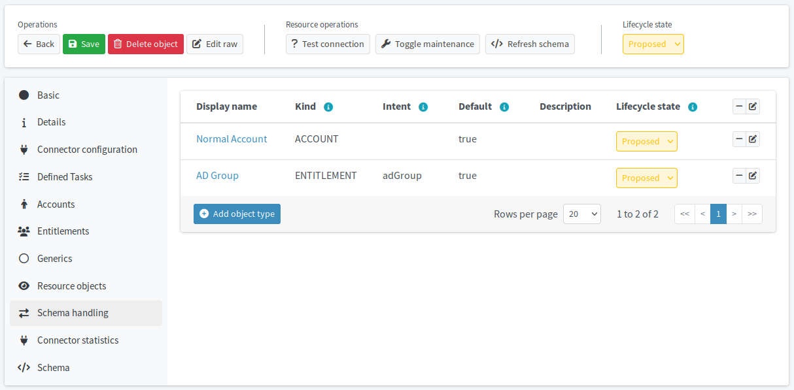

= Connect your target LDAP application
:page-nav-title: Connect target LDAP application
:page-display-order: 210
:page-toc: top
:experimental:
:icons: font
:page-description: Integrate your target LDAP application with midPoint to centralize identity governance and administration across platforms.

Integrate your target LDAP application with midPoint to establish the groundwork for centralized identity governance and administration across the HRIS and LDAP platforms.

== What awaits you in this module

As you have created the midPoint resource for the HRIS application, you will create a second resource for your target LDAP system.
After you establish connection to the LDAP application,
you will set up an object type for the accounts and groups in the application.

Since we follow here the original xref:/midpoint/methodology/first-steps/connect-source-system/#playground-data-used-in-this-guide[MID-301 training course] footsteps, you will create the resource from a pre-configured template.
If you are configuring everything on your own,
you need configure the resource so that midPoint can establish a connection with the target application.
This is out of the scope of this guide.
If you are unsure how to fill in the connection details in midPoint, ask your system administrators for help.
The xref:/connectors/connectors/com.evolveum.polygon.connector.ldap.LdapConnector/#resource-examples[LDAP resource examples] may also help.

:sectnums:

== Create a new resource for the target application

Create a new resource and copy the configuration from the template that is pre-configured in the training Docker image.
This simplified deployment is used in this guide mainly to save your time and spare you learning system management details that are potentially out of your real-life duties scope.

*Follow this guide: xref:/midpoint/reference/admin-gui/resource-wizard/create-resource-using-wizard/[]*

. Create a new resource and use the *Copy From Template* option.
. In the *Resource catalog* screen, select the *Training Active Directory Resource Template* template (it uses the xref:/connectors/connectors/com.evolveum.polygon.connector.ldap.LdapConnector/[LDAP connector]).
. Name the resource descriptively, such as _LDAP with users_.
. Keep the lifecycle state set to _Proposed_ until you finish the whole configuration of the resource.
. Configure connection to the LDAP server. +
    These are the LDAP connection details for the MID-301 training Docker images:
    ** Host: `ad`
    ** Port: `389`
    ** Bind DN: `cn=idm,ou=Administrators,dc=example,dc=com`
    ** Bind password: `secret`
. Keep the rest of the settings as pre-configured in the template.

Optionally, after you create the resource, click btn:[Preview Resource Data] and select the _inetOrgPerson_ to view the accounts in the LDAP application.

== Configure the LDAP resource object type

Similarly to the HR system, the LDAP needs a resource object type for the accounts stored on it as well.
In addition to the accounts, LDAP contains groups, so you need to define a resource object for groups as well.

Both object types are preconfigured in the MID-301 training template, meaning you can skip this section if you use the template.

If you need to define the object types on your own:

* The account object type should be of the _Account_ kind, _inetOrgPerson_ class, and _User_ type.
* The group type should be of the _Entitlement_ kind, custom-defined intent, _groupOfNames_ class, and undefined type.
* Neither should use an archetype.

*Use this guide for xref:/midpoint/reference/admin-gui/resource-wizard/object-type/[instructions on object type configuration].*

.LDAP resource object types for users and groups.

:sectnums!:

== Next steps

With the target application connected, you are ready to proceed with preparations to reconcile LDAP and HRIS accounts.

[.nowrap]#icon:arrow-right[] *xref:/midpoint/methodology/first-steps/integrate-target-system/define-rules-for-data-handling/[]*#