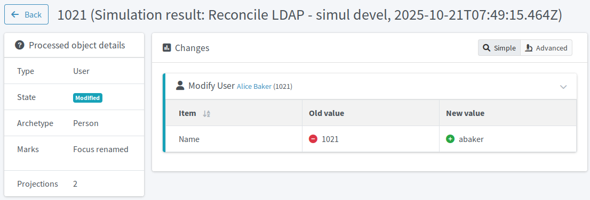

= Import usernames from Active Directory
:page-nav-title: Import usernames from AD
:page-display-order: 240
:page-toc: top
:experimental:
:icons: font
:page-description: Stop using the unfriendly employee numbers as usernames and import the AD usernames to make your deployment more accessible.

When setting up the HRIS resource, you used employee numbers (`empnum`) for account names in midPoint
because the HR system does not have any better unique identifier.
Now that you have Active Directory connected, midPoint has access to more human-friendly usernames that are in AD.

== What awaits you in this module

In this module, you will use the AD usernames as new identifiers for the focal objects (users) in midPoint.

. You will set the original HRIS mapping that fills the `name` attribute in midPoint focal objects with employee numbers as _weak_ to prevent it from overwriting the new usernames.
. You will create a new inbound mapping for AD that will copy the AD usernames to the `name` attribute.
    You will make the new mapping strong to overwrite the original employee numbers in the attribute.
. As always, you will simulate reconciliation to verify the setup before you _activate_ it.

[NOTE]
====
In general, we use Active Directory in this guide as a target application, meaning we (will) write data to it rather than use it a data source.
In this particular case, though, Active Directory serves as a data source.
As we mentioned before, xref:/midpoint/methodology/first-steps/integrate-target-system/#every-coin-has-two-sides[no coin is one-sided].
====

:sectnums:

== Adjust the mappings to prepare for username import

To use the AD usernames as the primary identifier for users in midPoint, you need to adjust mappings for both the HRIS and AD resources.

=== Make the old HRIS name mapping weak

Firstly, adjust the strenght of the HR resource _name_ mapping so that it does not overwrite non-empty values.
Refer to xref:/midpoint/reference/expressions/mappings/#_mapping_strength[] for details on mapping strength options.

*Follow this guide: xref:/midpoint/reference/admin-gui/resource-wizard/object-type/mapping/advanced-mappings/#advanced_inbound_mappings[]*

. In your HR resource, open inbound mapping settings.
. Locate the mapping populating the `name` attribute with the value of the source `empnum` attribute.
	In this guide, it is called _empnum-to-name_.
. In advanced settings of the mapping, change its *strength* to _weak_.

=== Add new mapping to AD for usernames

Secondly, add a new inbound mapping for the `name` attribute in the AD resource.
Leave this mapping set as _strong_ so that it can overwrite existing values.
This is the default.

. Look into your AD data and locate the name of the attribute that holds usernames. They have to be unique across all accounts. +
	In the training data used in this guide, the name of the attribute is `uid`.
. In your AD resource, open inbound mapping settings.
. Add a new mapping according to the table below.

[cols="3,1,1,1,2,4", options="header"]
.Strong inbound mapping to copy _uid_ parameter with usernames to _name_ parameter
|====
| Name                         | Source | Expression | Target | Lifecycle state | Comments
| inbound-uid-username-to-name | `uid`    | As is      | `name`   | Proposed        | Keep the mapping *Strength* set to _Strong_ and the *Use for* option to _Undefined_.
|====

.AD resource inbound mappings, the proposed one being the one for importing usernames
image::ldap-username-import-inbound-mapping.webp["AD resource inbound mappings"]

== Test the configuration update

To check the behavior of your new configuration, use reconciliation tasks.
Since you have already reconciled the AD accounts earlier in this guide, you have the reconciliation tasks defined and available for reuse.

* Refer to the xref:/midpoint/methodology/first-steps/integrate-target-system/reconcile-ldap-accounts/[] module for a refresher on reconciliation tasks.
    ** When you view the results of the simulation, you should see the _focus renamed_ note.
* Use the xref:/midpoint/reference/tasks/synchronization-tasks/import-and-reconciliation/gui/#simulate-import-of-a-single-object[import preview] functionality to simulate the effects of your configuration changes on a single account.
* Refer to xref:/midpoint/reference/tasks/synchronization-tasks/import-and-reconciliation/gui/[] for the guide on working with tasks in the graphical user interface.

[NOTE]
====
Make sure you run the reconciliation tasks on the AD resource.
====

.A single user import preview result showing that the username would be imported successfully and the focus object would be renamed

// TODO: is this safe to put to production if there is, e.g., Andreas Baker alongside Alice Baker? (abaker and abaker2 but we don't have the iterators yet)

== Rename users to AD usernames on production

Once you confirm the simulation yields expected results, reconcile the accounts in production:

. In AD mappings, change the lifecycle state for the _inbound-uid-username-to-name_ mapping from _Proposed_ to _Active_.
. Run the real production reconciliation task which you used to reconcile the AD accounts in xref:/midpoint/methodology/first-steps/integrate-target-system/reconcile-ldap-accounts/[].

.List of midPoint users before the import of usernames from AD
image::ldap-username-import-before-rename.webp["List of midPoint users before the import of usernames from AD"]

.List of midPoint users before and after the import of usernames from AD. Notice that their primary identifier (`name`) has changed to their respective AD usernames.
image::ldap-username-import-after-rename.webp["List of midPoint users after the import of usernames from AD. Notice that their primary identifier (`name`) has changed to their respective AD usernames."]

:sectnums!:

== Next steps

You enabled importing nice usernames to midPoint thanks to the dynamic approach to resources midPoint can take when needed.
The next step to take in the journey of integrating the target system is to automatically remove orphaned and malicious accounts.
After that, you will learn how to provision data to Active Directory to fix wrong attribute values or tackle the joiner-mover-leaver process, for instance.

[.nowrap]#icon:arrow-right[] *xref:/midpoint/methodology/first-steps/integrate-target-system/delete-orphaned-accounts/[]*#