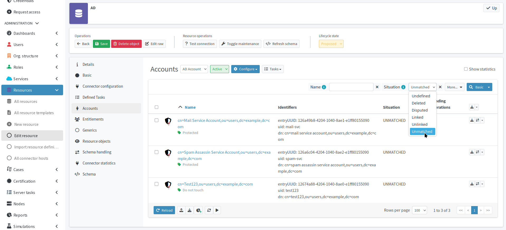
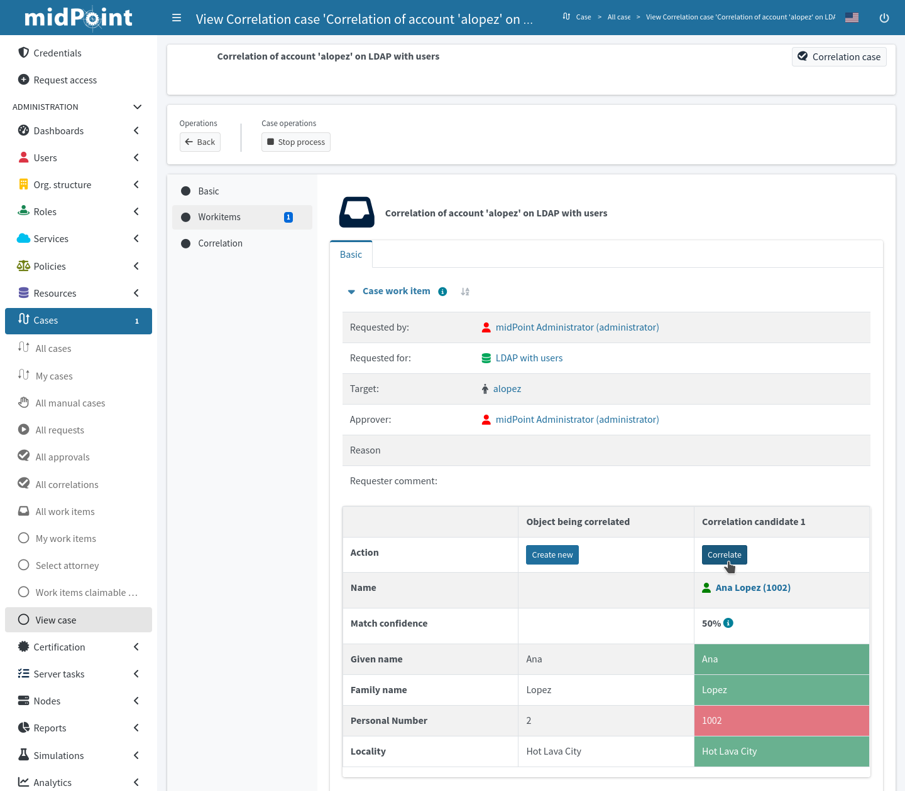

= Reconcile the Active Directory accounts
:page-nav-title: Reconcile AD accounts
:page-display-order: 230
:page-toc: top
:experimental:
:icons: font
:page-description: Reconcile the Active Directory accounts with the data midPoint has from the HRIS to align AD with the HRIS.

Reconcile the Active Directory accounts with the data midPoint has imported from HRIS to align AD accounts with their HRIS counterparts.
Use marks to label accounts that cannot be processed automatically, and resolve correction cases created where midPoint could not determine the account owners reliably.

== What awaits you in this module

You will bring your AD as close the HRIS as possible.
You will first simulate reconciliation to test your configuration and see how close the data you have in AD are to what your HRIS claims to be true.

When you analyze the simulation results, you will use account marks to prevent midPoint from deleting some accounts, such as service accounts that have no counterpart in HRIS.

Once all accounts are either marked or correlated, you will reconcile AD on production and resolve the correlation cases that arise when midPoint cannot match some HRIS and AD accounts with 100% certainty.

You will not yet delete any orphaned accounts because you have not yet activated the synchronization rule for that.

:sectnums:

== Simulate AD reconciliation

To test your configuration, run a simulated reconciliation task on the development environment.

*Follow this guide: xref:/midpoint/reference/tasks/synchronization-tasks/import-and-reconciliation/gui/[]*

. In your AD target resource, create a *Reconciliation Task*.
. Switch on the *simulation toggle*.
. Name the task, e.g., _Reconcile AD - development simulation_.
. On the *Execution* screen, select the _preview_ *mode* with the _development_ *configuration*.
. After you configure and create the simulated reconciliation task,
	run it and xref:/midpoint/reference/tasks/synchronization-tasks/import-and-reconciliation/gui/#read-simulation-results[inspect the simulation results] to see how your mapping and synchronization rules work.

When reviewing the simulation results in icon:chart-line[] *Operational statistics*, you will see a result similar to the examples below.

.Synchronization situation transitions
[cols="8*"]
|====
| Original state  | Synchronization start  | Synchronization end  | Exclusion reason  | Succeeded  | Failed  | Skipped  | Total
| No record       | Unlinked               | Linked               |                   | 47         | 0       | 0        | 47
| No record       | Disputed               | Disputed             |                   | 3          | 0       | 0        | 5
| No record       | Unmatched              | Unmatched            |                   | 5          | 0       | 0        | 7
|====

// Image not needed thanks to the tables, I think @dakle 2025-10-16
// image::../ldap-correlation-simulation-result-operational-statistics.webp[title="Operational statistics of the simulated AD reconciliation task"]

The numbers in the above examples say the following:

* 47 accounts that were found on the resource are unlinked and would be linked.
* 3 accounts cannot be correlated reliably (the `empnum` did not match, but the first name, surname, and locality did), so they are disputed and correlation case would be created.
* 5 accounts would stay unmatched because no focus object was found for them.
	According to the synchronization rules we set before, these accounts would be deleted from the AD resource.

This was simulation so none of the reactions actually happened.

[NOTE]
====
The original state of accounts that midPoint has not yet ever seen is always _No record_.
Should you run the task again without changing anything, the original state will match the synchronization start from the previous reconciliation.
This only means that midPoint already knows about the accounts, so their original state is not _No record_ anymore.
The numbers stay the same.
====

== Mark unmatched accounts to prevent deletion

Pay now closer attention to the *unmatched accounts*.
They are safe now because you have not yet activated the synchronization rule that would delete them, but you will, eventually, because that is the desired course of action for such accounts.

The unmatched accounts can be service accounts with no HRIS counterpart, legitimate normal accounts with multiple errors (e.g., wrong employee number and one of the names or the locality), or they can be malicious or obsolete orphaned accounts.
You need to decide what to do with them individually, and that is what marking is for:

* No mark means the account will be deleted (after you activate the synchronization rule for that).
* _Correlate later_ mark is for valid accounts that cannot be correlated due to erroneous data.
* _Do not touch_ mark is for accounts you are not sure about and need to investigate them.
* _Protected_ mark is for legitimate services accounts with no HRIS counterpart.

The point here is to mark the accounts you want to keep and move on with your deployment even if there are inconsistencies and unknowns in your data.
This way you get tangible results soon without having to wait for a solution to every obstacle.

*Follow this guide: xref:/midpoint/reference/admin-gui/resource-wizard/object-type/policies/#simulations[Mark accounts after simulation]*

Refer to xref:/midpoint/reference/concepts/mark/[] for more details on the topic.

[TIP]
====
Be careful if your HR system does not contain or export former employees data your target Active Directory system has data on.
In such situation, you would not have the former employees in midPoint and their AD accounts would appear as orphaned.
If you would wish to keep such accounts, mark them.
====

Now, if you run the simulated correlation task again,
you would see a new entry in the table telling you how many unmatched accounts are _excluded_ and for what reason.
The one remaining _Unmatched_ account in our training data is the malicious account that will be deleted as soon as possible.

[cols="8*""]
.Synchronization situation transitions
|====
| Original state  | Synchronization start  | Synchronization end  | Exclusion reason  | Succeeded  | Failed  | Skipped  | Total
| Unlinked        | Unlinked               | Linked               |                   | 47         | 0       | 0        | 47
| Disputed        | Disputed               | Disputed             |                   | 3          | 0       | 0        | 3
| Unmatched       | No record              | No record            | Protected         | 0          | 0       | 4        | 4
| Unmatched       | Unmatched              | Unmatched            |                   | 1          | 0       | 0        | 1
|====

// https://youtu.be/GIlr7xYi8UI?t=326
// TODO: improve the object marking GUIde

=== Use filters to check account status and marks

Aside viewing the task simulation results, you can use the resource account list to confirm your setup behaves as expected.
Even when you simulate reconciliation, the situations of the accounts in the list reflect the results of the simulation.

. Under the AD resource, go to *icon:male[] Accounts*.
. Use the *Situation* menu above the account list to select an account state you wish to filter.
. Click icon:search[] btn:[Basic] to confirm the selected search criterion.

The list also shows the marks on the accounts.
Using the menu at the far right of the account row, you can modify the marks.

Use the btn:[×] button next to the *Situation* menu to clear the filter.

.Account list showing unmatched accounts with marks

== Reconcile your AD accounts

Once you confirm that your AD configuration works as expected and you mark accounts as needed,
run the _real_ AD reconciliation.

. Switch the *lifecycle state* of the AD resource to _Active_.
    ** Ensure all the configurations are _active_ as well:
        *** Mapping rules
        *** Synchronization rules
            **** Keep the one synchronization situation reaction that deletes orphaned accounts in _Draft_ until later.
        *** Correlation rules
        *** Object types
. Create a new reconciliation task, link:#simulate-ldap-reconciliation[same as you did before].
    ** Switch on the *simulation toggle*.
    ** Name the task, e.g., _Reconcile AD - production simulation_.
    ** On the *Execution* screen, select the _preview_ *mode* with the _production_ *configuration*.
        *** This production simulation is the last check before you deploy.
    ** Run the task and xref:/midpoint/reference/tasks/synchronization-tasks/import-and-reconciliation/gui/#read-simulation-results[inspect the results].
. Lastly, create a new reconciliation task; this time, it is for production.
    ** Keep the *simulation toggle* off.
    ** Name the task, e.g., _Reconcile AD - real production_.
    ** Run the production reconciliation task.

The expected result of running the production reconciliation task is that:

* MidPoint creates correlation cases for accounts it cannot reconcile with 100% certainty (e.g., when `empnum` differs in HRIS and AD).
* All accounts that match "cleanly" between HRIS and AD are linked and their focal objects (users) have two projections now.
+
.User with two projections to the HRIS and AD systems
image::user-projections-hris-ad.webp["User with two projections to HRIS and AD systems"]
* The accounts you need to get rid of (e.g., the hacker account in our data) are not yet deleted from the AD server.

== Resolve correlation cases

As per your synchronization rules, if midPoint cannot reliably determine an AD account owner (focus), it sets the account as _disputed_ and creates a correlation case.

In the case of this guide, when the `employeeNumber` AD attribute does not match the `empnum` HRIS attribute for an account, midPoint uses the _last-resort-correlation_ rule you have set up earlier and correlates the two accounts with a lower certainty.
Accounts correlated like this are not linked automatically but are, according to the _create-correlation-case-for-disputed_ synchronization rule, rather presented in a correlation case to a human operator for a manual resolution.

A correlation case is the way for you to efficiently find an owner for disputed accounts, particularly thanks to the suggestions from which you can select.

It is now the time to resolve the correlation cases that have arisen from the production reconciliation.

*Follow this guide: xref:/midpoint/reference/correlation/correlation-cases/[]*

.Resolving a correlation case does not correct the wrong data
[NOTE]
====
In our training data, it is the CFO Anna Lopez with the employee number `1002`, who has a wrong number in Active Directory and, hence, does not get correlated automatically.
After you resolve her correlation case, her accounts are assigned correctly, yet her employee number does not get magically fixed in AD.
That will have to wait until later modules where you learn how to enable Active Directory provisioning.
====

:sectnums!:

== Next steps

You have reached another important milestone in your IGA journey and, should this be a real-world project for you in your organization, you have the next batch of tangible results to present to your peers.

The next step is to move away from using employee numbers as usernames and introduce something more human-friendly.

[.nowrap]#icon:arow-right[] *xref:/midpoint/methodology/first-steps/integrate-target-system/import-usernames-from-ldap/[]*#