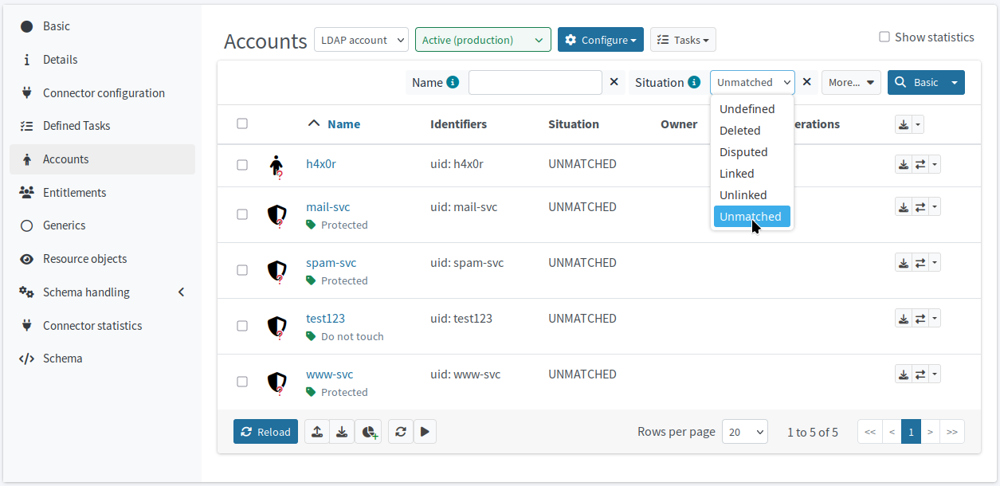
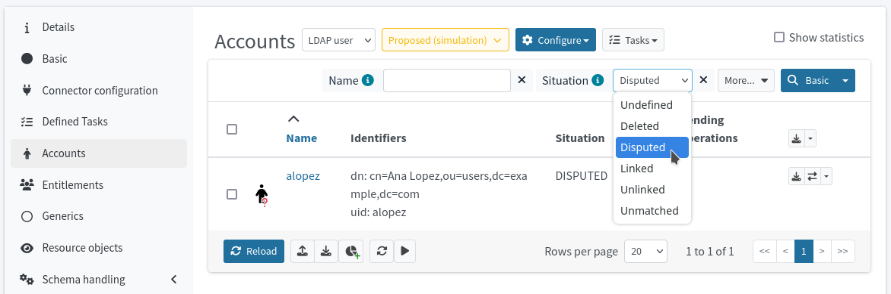

= Reconcile the LDAP accounts
:page-nav-title: Reconcile the LDAP accounts
:page-display-order: 230
:page-toc: top
:experimental:
:icons: font

== Simulate LDAP reconciliation

To test your configuration, run a simulated reconciliation task on the development environment.

*Use this guide for xref:/midpoint/reference/tasks/synchronization-tasks/import-and-reconciliation/gui/[instructions on creating tasks].*

. In your LDAP target resource, create a *Reconciliation Task*.
. Switch on the simulation toggle to first preview the changes and prevent any harm to your data.
. Name the task, e.g., _Reconciliation with LDAP - development simulation_.
. On the *Execution* screen, select the *preview mode* with *development configuration*.
. After you configure and create the simulated reconciliation task,
	run it and xref:/midpoint/reference/tasks/synchronization-tasks/import-and-reconciliation/gui/#read-simulation-results[inspect the simulation results] to see how your mapping and synchronization rules work.

When reviewing the simulation results in icon:chart-line[] *Operational statistics*, you should get a result similar to the examples below.

The content of the table depends on the data in your systems as well as your actual configuration and marks applied.
When you run the reconciliation for the first time on the resource, the original state is always _No record_.

If you use the sample data provided in this guide, these are the numbers you would get on the first CSV-simulated LDAP reconciliation simulation:

.Synchronization situation transitions
[cols="8*"]
|====
| Original state  | Synchronization start  | Synchronization end  | Exclusion reason  | Succeeded  | Failed  | Skipped  | Total
| No record       | Unlinked               | Linked               |                   | 47         | 0       | 0        | 47
| No record       | Disputed               | Disputed             |                   | 3          | 0       | 0        | 5
| No record       | Unmatched              | Unmatched            |                   | 5          | 0       | 0        | 7
|====

Should you run the task again without any changes to resource data or object marks (we will get to those shortly), the original state would match the synchronization start now:

.Synchronization situation transitions
[cols="8*"]
|====
| Original state  | Synchronization start  | Synchronization end  | Exclusion reason  | Succeeded  | Failed  | Skipped  | Total
| Unlinked        | Unlinked               | Linked               |                   | 47         | 0       | 0        | 47
| Disputed        | Disputed               | Disputed             |                   | 3          | 0       | 0        | 3
| Unmatched       | Unmatched              | Unmatched            |                   | 5          | 0       | 0        | 5
|====

// Image not needed thanks to the tables, I think @dakle 2025-10-16
// image::../ldap-correlation-simulation-result-operational-statistics.webp[title="Operational statistics of the simulated LDAP reconciliation task"]

The numbers in the above examples say the following:

* 48 accounts that were found on the resource are unlinked and would be linked.
* 2 accounts that were found cannot be correlated reliably, so they are disputed and correlation case would be created.
* 4 accounts that were found would stay unmatched because no focus object was found for them.
	According to the synchronization rules we set before, these accounts would be deleted from the LDAP resource.

The correlation was simulated so none of the synchronization end situations actually happened.

== Mark unmatched accounts to prevent deletion

In case your target LDAP resource contains accounts that cannot be correlated with the focal objects you have in midPoint from the source HR system,
you can mark some of them to protect them from being prematurely deleted.
This is useful if you are not sure about the exact purpose of some service accounts, for example,
or need to further investigate as to why an account can't be correlated.

Refer to xref:/midpoint/reference/concepts/mark/[] and xref:/midpoint/reference/admin-gui/resource-wizard/object-type/policies/#mark_manually[marking object in GUI] for details on using object marks.

Here's the marking strategy you can use:

* If you know a certain account is valid and present in HR but can't be correlated due to some error in data, mark it as _Correlate later_.
* If you need to preserve an account that's not in HR but is valid, such as service accounts, protect it using the _Protected_ mark.
* If you're not sure why an account unknown to HR exists, mark it as _Do not touch_ so that it does not get deleted and you can investigate and decide their fate later.
* If you discover LDAP accounts that should not be there at all, like legacy or obviously malicious accounts, don't mark them anyhow.
	They will get deleted as per the synchronization rules.

Be careful if your HR system doesn’t contain or export former employees data.
In such situation, you would not have the former employees in midPoint and their AD/LDAP accounts would appear as orphaned.

[TIP]
====
The point here is that you can move on with your deployment even if there are inconsistencies and unknowns in your data.

Mark these points of data and leave them for later as per the xref:../#the-concept-of-an-iterative-cyclic-approach[iterative approach].
This way you get tangible results soon without having to wait for a solution to every obstacle.
====

Now, if you run the simulated correlation task again,
you'd see a new entry in the operational statistics of the task telling you how many accounts there are with _No record_ and what's their _Exclusion reason_ (you marked them to avoid their deletion).
The one remaining _Unmatched_ account is the hacker account that needs to be deleted as soon as possible.

[cols="8*""]
.Synchronization situation transitions
|====
| Original state  | Synchronization start  | Synchronization end  | Exclusion reason  | Succeeded  | Failed  | Skipped  | Total
| Unlinked        | Unlinked               | Linked               |                   | 47         | 0       | 0        | 47
| Disputed        | Disputed               | Disputed             |                   | 3          | 0       | 0        | 3
| Unmatched       | No record              | No record            | Protected         | 0          | 0       | 4        | 4
| Unmatched       | Unmatched              | Unmatched            |                   | 1          | 0       | 0        | 1
|====

// https://youtu.be/GIlr7xYi8UI?t=326
// TODO: improve the object marking GUIde (#86)

== Check the simulated results using filters in the account list

Aside viewing the task simulation results, you can use another way to confirm your setup behaves as expect.
You can view the LDAP accounts and their *Situations*.
Even when you simulate reconciliation, the situations of the resource accounts reflect the results of the simulation, i.e., midPoint knows which accounts would be _matched_, _disputed_, etc., and updates the account situations accordingly.

. Under the LDAP resource, go to *icon:male[] Accounts*.
. Use the *Situation* filter above the account list to see accounts in various states:
	** Select _Unlinked_ to see accounts that would be linked, i.e., their respective focal object (owner) can be determined automatically under the current configuration.
	** Select _Unmatched_ to see accounts that can't be matched to their respective focal objects. +
		Some of them are marked by you as protected or for later correlation.
		Unmatched accounts that are not marked will be deleted if you have the xref:#define-synchronization-rules[synchronization rule for that] (action _Delete resource object_ for the _Unmatched_ situation)
	** Select _Disputed_ to see accounts that can't be matched with 100% certainty to their respective focal objects. +
		You'll get a correlation case to resolve these after you run real production correlation task. +
		In the sample data used in this guide, the disputed account would be Anna Lopez who has a wrong `empnum` in HRIS and has to be correlated using `givenName`, `familyName`, and `locality` as such.
. Click icon:search[] btn:[Basic] to confirm the selected search criterion.

In the list, if you see, for example, accounts that are _unmatched_ and not marked but you are not sure whether it's safe to have them deleted, xref:#mark-unmatched-accounts-to-prevent-deletion[mark them] now.
You can investigate later.

== Reconcile your LDAP accounts

Once you confirm via running simulated reconciliation tasks that your LDAP configuration works as expected
and no accounts you need to preserve are about to be deleted, you can run the _real_ reconciliation between HRIS and LDAP.

Firstly, *switch all the configurations under your LDAP resource to _Active_* with the exception of _delete-unmatched-resource-object_.
Keep that one in _Draft_ until you learn how to disable accounts instead of delete first.

[TIP]
====
Use the icon:heart-pulse[] btn:[Check detailed lifecycle] button in the top menu within the resource to view a list of individual resource components and their current lifecycle states.
====

Then, do the one last simulation, this time on production configuration:

. Create a xref:/midpoint/reference/tasks/synchronization-tasks/import-and-reconciliation/gui/[new reconciliation task] for the LDAP resource.
. Switch on the simulation toggle to first preview the changes and prevent any harm to your data.
. Name the task, e.g., _Reconciliation with LDAP - production simulation_.
. On the *Execution* screen, select the *preview mode* with *production configuration*.
. After you configure and create the simulated reconciliation task,
	run it and xref:/midpoint/reference/tasks/synchronization-tasks/import-and-reconciliation/gui/#read-simulation-results[inspect the simulation results] to see how your mapping and synchronization rules work.

The operational statistics numbers should be the same as when you ran the task in the simulated development configuration.

At last, if everything in the results shows as expected,
create yet another reconciliation task―this time with the simulation toggle switched off―and *run the reconciliation for real*.

The expected result of running the reconciliation on production is that:

* MidPoint creates correlation cases for accounts it cannot reconcile with 100% certainty (e.g., when `empnum` differs in HRIS and LDAP).
* All accounts that match "cleanly" between HRIS and LDAP are linked and their focal objects have two projections now.
* The accounts you need to get rid of (e.g., the hacker account in our data) are not yet deleted from the LDAP system because the synchronization rule is in _Draft_ state still.

== Resolve correlation cases

If any of the LDAP accounts fail to reconcile with 100% certainty and
midPoint falls back to the xref:#define-ldap-correlation-rules[_last-resort-correlation_ correlation rule],
the production correlation task (as per the xref:#define-synchronization-rules[synchronization rules]) creates a correlation case for a human operator to resolve.

A correlation case is the way for you to efficiently find an owner for disputed accounts particularly thanks to the suggested supposed owners you can select from.

You can find all active correlation cases under icon:case_thick[] *Cases*.

If you use the sample CSV data provided in this guide, you would see this list of correlation cases:

.List of correlation cases in midPoint. _CSV LDAP simulation_ is the LDAP resource simulated by using the CSV file provided in this guide.
[cols="9*"]
|====
| Name                                                        | Description  | Object               | Actors                                  | Opened | Closed | Outcome  | State | Workitems
| Correlation of account 'geena' on CSV LDAP simulation       |              | CSV LDAP simulation  | midPoint Administrator (administrator)  |        |        |          | open  | 1
| Correlation of account 'bcarpenter' on CSV LDAP simulation  |              | CSV LDAP simulation  | midPoint Administrator (administrator)  |        |        |          | open  | 1
| Correlation of account 'alopez' on CSV LDAP simulation      |              | CSV LDAP simulation  | midPoint Administrator (administrator)  |        |        |          | open  | 1
|====

When you click a case to open it for an inspection:

* icon:circle[] *Basic* shows details about the particular case.
* icon:circle[] *Correlation* lets you know how closely the resource object shadow and its suggested focal object matches.
* icon:circle[] *Workitems* is the workbench to resolve the correlation case.

Check the suggested resource object shadow owners on the icon:circle[] *Workitems* screen.
If any of them is the right one, click the the btn:[Correlate] button in the particular candidate column.
In case no suitable owner exists in the database, there is also an option to btn:[Create new] focal object in midPoint.
That's not, however, recommended for cases with an authoritative 3rd-party system like the HR system herein.

image::../ldap-hris-correlation-case-workitem-resolution.webp[title="Workitems screen in the correlation section of midPoint, showing a suggested resource object shadow owner candidate"]

If you're using our sample data to follow this guide, you have one correlation case to resolve after the production reconciliation task finishes, and that's Anna Lopez who has a wrong _empnum_ in the HR system.
