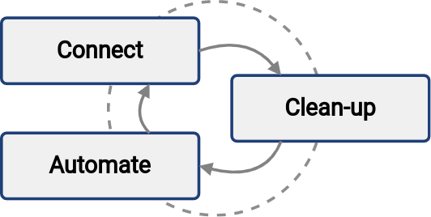

= Cyclic iterative approach concept
:page-nav-title: Iterative concept
:page-display-order: 57
:experimental:
:icons: font

The main concept behind this whole guide is the iterative cyclic approach.
It enables you to reach your desired solution in a series of small steps.
Each step brings new value and improves the overal solution.

* *Connect* a new system to midPoint.
At this step, you give midPoint the option to _read_ the data from the system and analyze them, possibly comparing them to what midPoint already has its database.

* The *clean-up* step is aimed at improving data quality.
Data in disconnected systems may often be in a poor state.
Accounts have to be correlated, orphaned accounts disabled, data errors corrected.
MidPoint is built to help with that.

* The *automate* step focuses on speeding up processes and improving efficiency.
Manual work can be automated, making the process faster, cheaper, and more reliable.
Onboarding (_joiners_) and offboarding (_leavers_) employees are the usual candidates for automation.

Repeat these steps as long as they bring you tangible value.
In every loop, you connect more systems with more data, align the data, automate the process, and thus make your organization more resilient to usual human errors.

You can repeat the iterations as many times as you need, with as big or small a scope as you need.
The goal is to bring together the data, processes, and policies.

The number of iterations you perform during the first deployment is finite because your time and budget are finite.
However, the first go-live is not the end.
Your policies evolve, you implement new systems, your IT ecosystem develops.
That means the connect—clean-up—automate cycles will repeat over and over, endlessly.
But, on the bright side, their cost is going to decrease significantly over time.

.Iterative approach to midPoint deployment
image::adopt-midpoint.drawio.svg[Diagram of the iterative approach to midPoint deployment]

When it comes to identity management, *one size does not fit all*.
Some organizations need strict policies, perfect visibility, or high degree of automation.
Others are perfectly happy with just basic integration and automation, focusing rather on low cost of the solution.

It is virtually impossible to plan an ideal identity management project right of the bat in all its breadth and depth.
Hence, the iterative approach.
You repeat a series of small steps, focusing on areas that need to be improved at that particular point.
This is the way to satisfy the requirements while keeping the costs reasonable.
