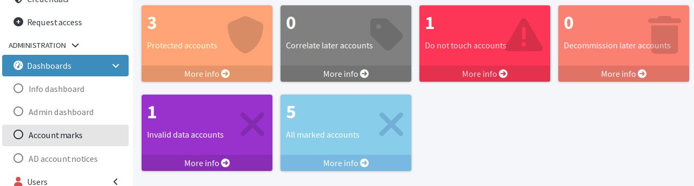

= Override incorrect attribute values
:page-nav-title: Rectify source data
:page-display-order: 620
:page-toc: top
:experimental:
:icons: font

In this module, you will use midPoint to correct source resource attribute values and enable incorrectly disabled user accounts.

Imagine the following situation: The HR department creates a user in the HRIS with some errors, e.g., incorrect locality and status.
You cannot wait until the user is fixed in the HRIS.
The user is a new member of high management who needs to work, which he cannot because his account is kept inactive due to those errors.

== What awaits you in this module

You will first act as an inattentive HR person adding a new employee with wrong data in the HR system.
Then, as an administrator, you will take steps to rectify the mistakes and enable the employee to use his accounts.
Lastly, you are going to fix the data issues in the HRIS and let the user reconcile "as usual".

In this exercise, you will learn how to use account marks when in need of overwriting the data coming from the authoritative resource.

:sectnums:

== Register new user in HRIS

First, you need to register the new hire in HRIS.
You are going to make a few mistakes there, acting as the inattentive HR person.

. In the HRIS user interface, click btn:[Register user] in the top bar.
. Fill in the form:
    ** *First name*: _John_
    ** *Surname*: _Doe_
    ** *Employee number*: _9006_
    ** *Locality*: _Fat Rover City_
    ** *Job*: _999#CXO_
    ** *EmpType*: _FTE_
    ** *Status*: _Long-term leave_
. Click btn:[Register user]
. Click btn:[Export users to csv file] at the bottom of the user list.

== Check the new user in midPoint

. In [.nowrap]#icon:user[] *Users*# > [.nowrap]#icon:user[] *Personas*#, open _John Doe_ (user _jdoe_) for editing.
. Check the user's *Lifecycle state*: It is _Disabled_.
. Check the user's AD account in [.nowrap]#icon:male[] *Projections*#: It is disabled.

Obviously, this man cannot do his job when all his accounts are disabled.

.User with wrong source data in midPoint
image::midpoint-user-with-wrong-source-data-inactive.webp["User with wrong source data in midPoint"]

== How to fix it?

Changing the *administrative status* would not work in this case because currently, the administrative status can only be used to _deactivate_ an active user.
You cannot use it to force activation.

An attempt to blindly overwrite the lifecycle state would not work either.
It would be reverted during the next scheduled HRIS reconciliation task run.

That means you need to create an exception.
But how?

Use marks.

== Mark the account as an exception

Similarly to what you did when reconciling the HRIS accounts with the AD accounts, you can use marks to "protect" an account in this case as well.

. In [.nowrap]#icon:database[] *Resources*# > [.nowrap]#icon:database[] *All resources*#, select the source HRIS resource.
. In [.nowrap]#icon:male[] *Accounts*#, find the user in question: _John Doe_ (_jdoe_) in our case.
. Click the drop-down menu button btn:[▼] at the far right of the row and select *Add Marks*.
+
.Set marks on the account for which you need to correct data manually in midPoint
image::midpoint-account-with-wrong-source-data-set-marks.webp["Set marks on the account for which you need to correct data manually in midPoint"]

. In the modal dialog that appears, select *Invalid data*.
. Click btn:[Add].

The account is now "protected", i.e., the recurring HRIS reconciliation task won't touch it and you can edit it manually in midPoint.

.Account with invalid data marked for protection
image::midpoint-account-with-wrong-source-data-marked-invalid-data.webp["Account with invalid data marked for protection"]

== Correct the data manually

Still in the [.nowrap]#icon:male[] *Accounts*# screen, click _jdoe_ in the owner column to open the corresponding focal object of the account for editing.

Edit the following properties to correct the mistakes the HR department made:

. *Locality*: _Fast River City_
. *Lifecycle state*: _Active_
. Click [.nowrap]#icon:save[] btn:[Save]#.

The user (focal object) has now correct attribute values and the AD account is enabled immediately.

Wait for the next scheduled HRIS reconciliation task to see that your changes are not reverted.
You can also test that any updates of HR data for 9006 are ignored

=== Use reports to get a quick overview of marked accounts

Dashboards and report are very useful in larger deployments to get an overview of irregularities, such as marked accounts, quickly.
If you follow this guide along with the Docker images preconfigured for the guide, there is a dashboard ready for this situation.

In the main navigation menu, select [.nowrap]#icon:tachometer-alt[] *Dashboards*# > *Account marks*:

.Dashboard showing numbers of accounts with various object marks

If you prefer a report you can save on your computer:

. Select [.nowrap]#icon:chart-pie[] *Reports*# in the main navigation menu.
. On the *Account Marks Dashboard Report* entry, click [.nowrap]#icon:play[] btn:[Run]# button at the far right.
    ** This is a report directly connected to the dashboard.
. Click *Show task* in the notification that appears at top of the screen.
. Click btn:[Download report] to save the HTML report to your computer.

You can access created reports at a later time via [.nowrap]#icon:chart-pie[] *Reports*# > [.nowrap]#icon:circle[] *Created reports*#.

Refer to xref:/midpoint/reference/admin-gui/dashboards/[] to learn more about dashboards and their relation to reports.

== Correct the HRIS data to put the situation back to normal

You used emergency means to correct the incorrect attributes in midPoint while preventing the recurring HRIS reconciliation task from overwriting your adjustments.
At some point, the HR personnel obtain the complaint regarding the wrong data in the HRIS and rectify it there.
Additionally, they realize the correct locality is completely different than what they put there in the first place.

Fix the data in HRIS:

. In the HRIS user interface, find the user _John Doe_, employee number _9005_.
. Click btn:[Modify] at the right side of their row.
. Adjust the attributes of the user:
    ** *Locality*: _White Stone River_
    ** *Status*: _In_
. Click btn:[Modify user].
. Click btn:[Export users to csv file] at the bottom of the user list.

The updates from HR are ignored for this user until you remove the _Invalid data_ mark.

. In [.nowrap]#icon:database[] *Resources*# > [.nowrap]#icon:database[] *All resources*#, select the source HRIS resource.
. In [.nowrap]#icon:male[] *Accounts*#, find the user in question: _John Doe_ (_jdoe_) in our case.
. Click the drop-down menu button btn:[▼] at the far right of the row and select *Remove Marks*.
. Select the *Invalid data* mark.
. Click btn:[Remove Marks].

In John Doe's profile and his AD account, you can observe the locality changes to _White Stone City_ after the scheduled reconciliation task runs, meaning the account can be managed by the usual means from now on.

:sectnums!:

== Next steps

The last module in the series on overwriting incorrect source data focuses on usernames.
You will learn why you might want to override the automation and how to do it correctly.