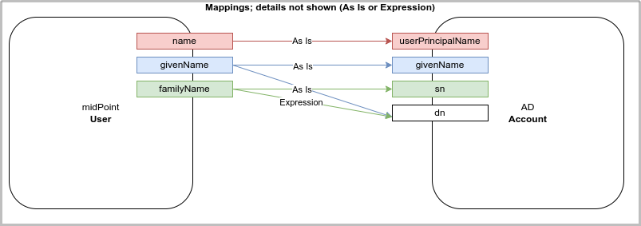
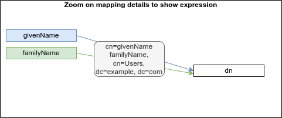
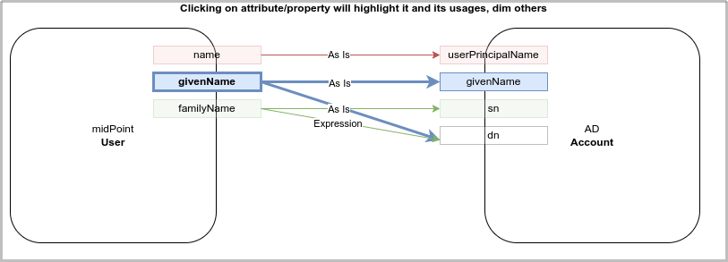

= First Steps With MidPoint: Solution Notes
:page-nav-title: Solution Notes
:page-display-order: 200
:page-toc: top
:experimental:

This will be probably moved to other documents when this document is finished.

== Solution Ideas

Unstructured notes. Move to other parts/documents as necessary.

* *Allow direct access to database* (PostgreSQL only, read-only, with upgradeability disclaimers).
This may help to address unforeseen use-cases, with technology/toolset that the engineers already know (SQL).
The risk to upgradeability is relatively low, as we have to keep DB data model (mostly) backwards-compatible anyway.

* *Improved default configuration*: pre-configure midPoint for the usual use-cases.
How exactly?
Better _samples_? Pre-configured _profiles_?
** Resource mappings-related: we can prepare function libraries (see also below) with most-common code usable for mappings. Admin will simply select one of the functions. New function can be added any time.

* *Improved user experience*: How exactly? For who? Engineers? End users? How skilled? What use-cases?

* *Improved documentation*: how exactly? What documentation? For who? Which format? text? video?

* *"Complexity spectrum" approach*: +
Simple and common tasks should be very easy to do (few click in GUI). +
Medium-complexity and less-common tasks should still be relatively easy (still GUI, but may be more click and complex forms/flows, even writing one-liner expression, but still in GUI). +
Complex and uncommon tasks may need deeper expertise/experience (e.g. editing JSON/XML). +
Exotic tasks should still be possible, but may require programming (e.g. complex scripts, plugins, Maven overlay, etc.). +
This approach was there since the beginning of midPoint, it is one of the design principles.
Yet, it may not be well documented, and it might have been neglected sometime.

* *From scientific to engineering approach*:
+
[source]
----
Mapping definition
[x] Use reasonable defaults
----
+
[source]
----
MidPoint attribute mappings will be by default:
(*) Tolerant
        Other values of single-value attributes are permitted
        Other values of multi-value attributes are permitted
( ) Enforcing
        Other values of single-value attributes are not permitted (midPoint overwrites such values)
        Other values of multi-value attributes are not permitted (midPoint removes such values)

MidPoint group membership mappings will be by default:
(*) Tolerant
        Group membership managed by other means is permitted and tolerated
( ) Enforcing
        Group membership managed by other means is not permitted (midPoint removes such values)
----

* *Complete automation* vs *Human task automation*:
Do we want midPoint to do everything automatically (read from HR, process policies, create accounts).
Or do we want midPoint to manage people that do it manually (review HR data, approve requests, create tickets for admins to create accounts)?
We probably want both, but to what degree? What we will be recommending? (methodology)

[#how_to_connect_hr_to_midpoint]
=== How to connect HR to midPoint

. Go to menu:Resources[New resource]
. Select the connector: either CSV or DatabaseTable connector
. Configure the connection (CSV file path etc. or database connection)
. Test the connection
. Configure Schema/schema handling part using "drag&drop" to indicate:
* which resource account attribute should correspond to which midPoint user attribute
** left side: midPoint attributes
** right side: resource attributes
** dragging from left -> right: outbound
** dragging from right -> left: inbound
* *indicate (e.g. bold, background color etc.) which attribute(s) is (are) used for naming convention in midPoint (`name`, `candidateUserName` etc.) in the list of attributes*
* how is the value transformed (default: as is)
** other options accessible as a predefined list of options (functions of functional library referenced from the resource configuration)
** example: `Lowercase attribute value`

. Configure correlation: which resource account attribute should correspond to which midPoint user attribute for unique match
. Save the resource
. Edit the resource
. List resource accounts
. Import a single resource account with <<import_single_account_preview,simulation option>> to see how the user would be created. Confirm the import or go back to resource configuration if needed.
. Import accounts from resource

The *Import* step can be repeated several times to iteratively fix the content in midPoint.
If correlation configuration is changed during the iterations, the existing midPoint data may need to be purged (shadows) using the feature *Delete all identities* (*##NEW FEATURE REQUIRED##*: put this somewhere in resource configuration with proper warning/confirmation)

midPoint is now filled with authoritative data from HR.

[#new-resource-wizard]
=== How to connect target (AD) to midPoint

Assumption: AD resource would be already pre-configured (except the connection parameters).

. Go to menu:Resources[List resources]
. Edit `AD` resource
. Configure connection (AD parameters - as few as possible, use defaults for everything else)
. Test connection
. Review schema/schema handling configuration. If changes are needed, use "drag&drop" to indicate:
* which resource account attribute should correspond to which midPoint user attribute
** left side: midPoint attributes
** right side: resource attributes
** dragging from left -> right: outbound
** dragging from right -> left: inbound
* *indicate (e.g. bold, background color etc.) which attribute(s) is (are) used for naming convention in midPoint (`name`, `candidateUserName` etc.) in the list of attributes*
* how is the value transformed:
** `cn`: default: as is
** `sn`: default: as is
** `givenName`: default: as is
** `userPrincipalName`: default: TODO
** `dn`: default: predefined function from functional library referenced from the resource configuration, example: `Generate Distinguished Name from Given Name and Family Name`)
// basic.getResourceIcfConfigurationPropertyValue(resource, 'baseSuffix') can be used in that function
*** other options accessible as a predefined list of options (functions of functional library referenced from the resource configuration)
*** example: `Lowercase attribute value`
*** example: `DN with cn=GivenName FamilyName`
*** when selecting a function from the list, description and example should be displayed

. Review Correlation / confirmation / identity matching step
* preconfigured, e.g. `userPrincipalName` equals midPoint
`extension/candidateUserName` or `employeeNumber` equals `employeeNumber`
* possibly preconfigured for "reverse identity matching" by selecting which
attribute mappings should match the existing resource values (e.g. `cn`, `sn`
and `givenName`)
* mapping "guessing" based on correlation:
** midPoint will compare e.g. 50 users and 50 accounts to see if the correlation expression matches
** mappings for simple cases can be derived from these matches
** midPoint can make sure the mappings are OK as configured (that they provide the same values as there are on resource already)

. Save resource
. Run reconciliation (no outbound mappings activated yet)
. Run reconciliation report / review accounts using midPoint
. Mark accounts which cannot be processed correctly at the moment. The marking must be displayed in the reconciliation report.

The *Reconciliation* / *reconciliation report* steps can be repeated several times to iteratively fix the content in midPoint.

==== Correlation vs Mapping Guessing Mode

NOTE: Rough idea...

If we have a known user (list of users) in midPoint and their corresponding account(s), we can let midPoint to guess either the correlation or the mappings.

Guessing correlation:

. specify user in midPoint
. specify account in AD (which we assume to be owned by this user, but is not linked to that user in midPoint yet)
. midPoint will check if there is one or more attributes that could be used for matching (ideally: 1:1)

Guessing mappings:

. specify user in midPoint which is already linked to his/her AD account
. midPoint will check which mappings can be created from this user/account information - which user attributes vs which account attribute
* `asIs` mappings, possibly some simple upper/lowercase mappings

=== Reporting Notes

We need the following types of report:

. *What is in target system and is not in midPoint?* This allows detection of orphaned accounts, system accounts etc. This is more or less a reconciliation report.
. *What is in midPoint but not in target system?* This allows detection of missing rules between midPoint and target system, e.g. missing conditions for automatic provisioning for certain populations etc. This is more or less a simulation report.
* *TODO* but we won't have any automatic provisioning at the beginning. No automatic rules yet. But we might have archetypes with inducements. ? This report may be more relevant for later phases...?
. *What will midPoint change in the target system?* This allows detection of incorrect/missing mappings between midPoint and target system as well as between midPoint and source system. This is more or less a *simulation report* but beyond the current implementation of thresholds. We need to preview the changes.

For all reports: how to execute actions (manual correlation etc.) from the reports?
Using interactive pages a'la menu:Resource[Accounts]?

TODO: new idea based on M. Spanik's idea: side-by-side report. See <<side-by-side-report,below>>.

==== What is in target system (AD) and is not in midPoint?

Implementation in midPoint: target system reconciliation + reconciliation report.
The report can display information about the last reconciliation for the system and can confirm tha user wants to run the reconciliation now - before the report.
(Or vice-versa, confirm that user is OK with the last reconciliation timestamp.)

The report (ideally interactive in Resource/Accounts, exportable to Excel) should contain the following information:

Query:

* just like reconciliation report (working with Shadows of certain resource)

Columns:

* Account identifier (TODO which one in case of AD? `dn` or `userPrincipalName`?)
* Account status
* Account mark
* Situation
** (with some tooltip/help for administrators about meaning)
** (display also what would happen if this is not dry-run!!! e.g. account would be deleted (situations/reactions)
* *TODO what about identity matching? Some kind of probability...? And reason?*
** *TODO* if situation is `DISPUTED`, we could perhaps indicate potencial owners in the report?
** *TODO* if situation is `DISPUTED`, *Change owner* action should perhaps use the potential owners instead of showing all users in midPoint?
* Intent *TODO may be confusing for beginners!*
* Owner
* *Candidate owner* (in case we have dry-run) (TODO maybe also indicate why it was matched?)
** Maybe rename `Owner` to `Matched user` or `MidPoint User` or something like that...
* Pending operations *TODO not necessarily needed for this case - read-only reconciliation*
* Status of the owner/candidate owner (probably part of the values of owner/candidate owner)

.Example report
|===
|Account identifier TODO which one in AD?|Status|Mark|Situation|Owner|Candidate owner

|jsmith@example.com
|enabled
|DECOMMISSION
|UNMATCHED (tooltip: Account in target system without owner in midPoint)
|(none)
|(none)

|jdoe@example.com
|enabled
|(none)
|UNLINKED (tooltip: Account in target system with candidate owner in midPoint)
|(none)
|John Doe (jdoe), ##disabled##

|jsmith24@example.com
|enabled
|(none)
|LINKED (tooltip: Account in target system owned by midPoint user)
|John Smith (jsmith24), enabled
|(none)

|jsmith48@example.com
|enabled
|DECIDE-LATER
|DISPUTED (tooltip: Account cannot be correlated to one midPoint user)
|
John Smith (jsmith2), enabled - 33%

Joe Smith (jsmith7), enabled - 33%

Jack Smith (jsmith98), ##disabled## - 33%
|(none)

|===

Visualisation notes:

* TODO: Either use *Repository* or *Resource* view, but do not confuse user. If we use passive caching...?
* Search: ability to hide rows based on at least `SITUATION`, `protected` but not only that
* Ability to export the (interactive) view to Excel for further processing outside midPoint
* Top part of report ("summary panel"):
** Show some kind of "pie graph" or something similar to graphically represent the state to see how optimistic/pesimistic the situation is.
** The colors for situations `UNMATCHED`, `DISPUTED` (possibly others) can be emphasized to indicate problems or need for decisions.
** Percentages of `UNMATCHED`, `DISPUTED` (possibly others) can help to distinguish if the problem is caused by *correlation misconfiguration* (many `UNMATCHED`) or *data quality issues* (many `DISPUTED`). Some suggestions based on this may be displayed.
** Display if this is a result of dry-run (? TODO ?)
** Display how was the correlation done (maybe descriptions from correlation settings, identity matching etc.). Human-readable! Maybe Axiom query, but not sure about it...
* Protected accounts part:
** List of accounts that are currently protected. If there are none, maybe we should indicate this too, as we usually need some protected accounts anyway.
* List of accounts part:
** see the notes for *Columns* above

==== What is in midPoint and is not in target system (AD)?

NOTE: This report should be executed after the reconciliation to have information about existing state.

TODO Implementation in midPoint: ? recomputation limited to target system (AD) with simulation mode ? Special mapping mode? It seems to be similar to the simulation of changes which midPoint is about to make.

The report (ideally interactive in Resource/Accounts, exportable to Excel) should contain the following information:

Query: ? TODO ? focus oriented

Columns:

* User name
* User Full name (or Given Name and Family Name)
* User status (`activation/effectiveStatus` or something else?)
** This can help to diagnose issue when disabled users would be provisioned to AD
* Target system account that would be created (identifier)

.Example report
|===
|User name|Full name|User status|Account identifier to be created

|jdoe
|John Doe
|##Disabled##
|jdoe

|jsmith
|John Smith
|Enabled
|jsmith

|===

Visualisation notes:

* Search: filter uses as supported by standard user listing + ability to hide rows which are "OK"
* Ability to export the (interactive) view to Excel for further processing outside midPoint
* Top part of report ("summary panel"):
** How many accounts are missing (at least what midPoint thinks) and will be created (add operation)
** Display information that this is a simulation (? TODO ?)
* List of users:
** see the notes for *Columns* above

==== What will midPoint change in target system (AD)?

NOTE: This report should be executed after the reconciliation to have information about existing state.

TODO Implementation in midPoint: ? recomputation limited to target system (AD) with simulation mode ?

TODO Or could this perhaps use passive caching (reconciliation will be executed before this report anyway)?

The report (ideally *interactive* in Resource/Accounts, exportable to Excel) should contain the following information:

* just like reconciliation report (working with Shadows of certain resource)

Columns:

* Account identifier (TODO which one in case of AD? `dn` or `userPrincipalName`?)
* Account status
* Account mark
* Situation
** (with some tooltip/help for administrators about meaning)
** (display also what would happen if this is not dry-run!!! e.g. account would be deleted (situations/reactions)
* *TODO what about identity matching? Some kind of probability...? And reason?*
** *TODO* if situation is `DISPUTED`, we could perhaps indicate potencial owners in the report?
** *TODO* if situation is `DISPUTED`, *Change owner* action should perhaps use the potential owners instead of showing all users in midPoint?
* Intent *TODO may be confusing for beginners!*
* Owner
* *Candidate owner* (in case we have dry-run) (TODO maybe also indicate why it was matched?)
** Maybe rename `Owner` to `Matched user` or `MidPoint User` or something like that...
* Pending operations *TODO not necessarily needed for this case - read-only reconciliation*
* Status of the owner/candidate owner (probably part of the values of owner/candidate owner)

.Example report
|===
|Account identifier TODO which one in AD?|Status|Mark|Situation|Owner|Owner status|Change type|Number of changed attributes|Change

|jsmith@example.com
|enabled
|
|LINKED (tooltip: Account owned by midPoint user)
|John Smith
|enabled
|Update
|1
|> Family name

|jsmith24@example.com
|enabled
|
|LINKED (tooltip: Account owned by midPoint user)
|Jeremiah Smith
|enabled
|Update
|1
|> Distinguished Name

|jsmith4@example.com
|enabled
|##REVIEW_LATER##
|LINKED (tooltip: Account owned by midPoint user)
|Jebediah Smith
|enabled
|Update
|4
|> Distinguished Name

> Family Name

+ Member Of

> Description

|===

Legend (example):

* *>*: attribute value to be replaced (single-value attribute)
* *+*: attribute value to be added (multi-value attribute, e.g. groups)
* *-*: attribute value to be removed (multi-value attribute, e.g. groups)
** Maybe we could show at most X changes, to display more, administrator could "zoom in" by clicking. (Would need to be interactive report.)
** We should display even the values, but that would require multiple "zoom in". (Would need to be interactive report.)

Example of zoomed info for specific user from the above table:

* Account identifier: jsmith4@example.com
* Status: enabled
* Mark: ##REVIEW_LATER##
* Situation: LINKED (Account owned by midPoint user)
* Owner: Jebediah Smith
* Owner status: enabled
* Change status: Update (Account will be updated by midPoint) ##but the operation will be ignored due to REVIEW_LATER marking##.

|===
|Attribute|Old value|New value

|Distinguished name
|cn=Jebediah sMith,ou=. . .
|cn=Jebediah Smith,ou= . . .

|Family Name
|sMith
|Smith

|Description
|ticket 1234
|ticket 0938

|Member Of
a|
* cn=Group1, . . .
a|
* cn=Group1, . . .
* cn=Group 9, . . .

|===

Some kind of statistics, which account attributes are being added/deleted/changed to see the trends, example:

|===
|Attribute|Number of changes

|Distinguished Name|109
|Family Name|109
|Account status|80
|Member of|75
|Description|10
|===

*TODO would it be possible to click the list of changes and preview the changes related for the attribute/resource for all affected accounts? Interactively.*

The reports should be interactive and allow operations - e.g. mark the account.

Visualisation notes:

* Top part of report ("summary panel"):
** How many accounts will be updated and will be created (modify operation)
** Which attributes (statistics) are to be updated most? We want to see the trends to diagnose possible problems in mappings.
** Display information that this is a simulation (? TODO ?)
* List of users:
** see the notes for *Columns* above

NOTE: The two reports for showing what midPoint would create and update can be also merged to one.
In that case some summary panel with statistics (no changes / additions / removals / updates) would be nice in report "summary panel".

[#side-by-side-report]
==== Side by side report (idea)

Started brainstorming with M. Spanik 10.3.2022.

Users (left) vs _their_ accounts (right).

Accounts without owners have empty user columns.

NOTE: For situations with many `DISPUTED` or `UNMATCHED` accounts, the table would be on multiple pages. Problem with matching accounts to users unless some searching is used on both panels (allowing administrator to work with specific subsets, e.g. John Smiths vs accounts containing smith in their usernames.)

Grouped by `SITUATION`, different background colors:

* linked with owner
* unlinked with showing _potential_ owner
* protected
* unmatched
* disputed
* deleted: not shown here, this is initial reconciliation
* *TODO for attribute changes (differences between user and account): new situation/color*

Columns left: configurable (view).

Columns right: configurable (view) if we can use data from shadows (passive caching).

Ability to search and hide rows to concentrate on problems. Example:

* hide all linked
* hide all linked and protected
* show only users matching `jsmith`

The list will be very long, so we need some filtering/searching.

*Ability to display details in both left and right views (ideally: together!)*

* when editing user (left) and account (right): action to link them together (*Link together*)

Ability to execute actions (later iterations) from resource definition (situations and reactions):

* unlinked, unmatched etc.
* disputed: specify owner (e.g. drag & drop) or whatever Identity Matching will allow us to do
** here Identity Matching can help
** *TODO how to display the columns users vs accounts for disputed without repeating either users or accounts? Below we have three categories: `UNMATCHED`, `DISPUTED` and `NO ACCOUNT`*
* no account: account can be created (assignments, policy etc.) or nothing will be done. Creation of account _may cause conflict_ as `extension/candidateUserName` is not guaranteed to be unique. ##This should be indicated here.##

[cols="1,1,1,1,1,2"]
|===
3+^h|Midpoint user
2+^h|Account
.2+^h|Action to happen

h|SITUATION
h|Full name
h|Candidate user name
h|Account identifier
h|Other attributes...

|LINKED
|Arnold Rimmer
|arimmer
|arimmer@example.com
|
|(nothing)

|LINKED
|Dave Lister
|dlister
|dlister@example.com
|
|(nothing)

|UNLINKED
|Elliot Frost
|efrost
|efrost@example.com
|
|(account will be linked to potential owner)

|UNLINKED
|James Taylor
|jtaylor
|jtaylor@example.com
|
|(account will be linked to potential owner)

|PROTECTED
|
|
|administrator@example.com
|
|(nothing)

|PROTECTED
|
|
|exchange@example.com
|
|(nothing)

|UNMATCHED
|
|
|ttest@example.com
|
|(account will be disabled)

|UNMATCHED
|
|
|adoe@example.com
|
|(account will be disabled)

|DISPUTED
|
|
|afoley@example.com
|
|(no automatic action)

|DISPUTED
|
|
|afoley2@example.com
|
|(no automatic action)

|DISPUTED
|
|
|jdoe2@example.com
|
|(no automatic action)

|DISPUTED
|
|
|jdoe4@example.com
|
|(no automatic action)

|DISPUTED
|
|
|jsmith@example.com
|
|(no automatic action)

|DISPUTED
|
|
|jsmith2@example.com
|
|(no automatic action)

|DISPUTED
|
|
|jsmith47@example.com
|
|(no automatic action)

|DISPUTED
|
|
|jsmith31@example.com
|
|(no automatic action)

|NO ACCOUNT
|John Smith
|jsmith
|
|
|(account for user will be created with identifier `jsmith` ##potentially causing conflict##)

|NO ACCOUNT
|Jim Smith
|jsmith
|
|
|(account for user will be created with identifier `jsmith` ##potentially causing conflict##)

|NO ACCOUNT
|Alex Foley
|afoley
|
|
|(account for user will be created with identifier `afoley` ##potentially causing conflict##)

|NO ACCOUNT
|Axel Foley
|afoley
|
|
|(account for user will be created with identifier `afoley` ##potentially causing conflict##)

|NO ACCOUNT
|John Doe
|jdoe
|
|
|(account for user will be created with identifier `jdoe` ##potentially causing conflict##)

|NO ACCOUNT
|James Smith
|jsmith
|
|
|(account for user will be created with identifier `jsmith` ##potentially causing conflict##)

|NO ACCOUNT
|Jean Smith
|jsmith
|
|
|(account for user will be created with identifier `jsmith` ##potentially causing conflict##)

|NO ACCOUNT
|Jacob Doe
|jdoe
|
|
|(account for user will be created with identifier `jdoe` ##potentially causing conflict##)

|NO ACCOUNT
|Joachim Popol
|jpopol
|
|
|(account for user will be created with identifier `jpopol`)

|===

=== Archetypes

We should assign `Person` structural archetype to all users that we import from HR.

Additional auxiliary archetypes (`Employee`, `Contractor`, `Student`) can be also assigned.
However, we want these archetypes to be auxiliary, as a person may be an employee and a student at the same time.

=== Notifications

TODO maybe more

==== Password expiration

We do not have password expiration notification at all.
To be more precise, we do not have a process checking the passwords to be expired soon.
There should be a process + notification to the user's e-mail address some (preconfigured) time before the password is expired as user cannot log in to midPoint with expired password.

The e-mail should contain a link to midPoint.

==== TODO User expiration

If user is created with `validTo`, there should be a process + notification to the user's e-mail address some (preconfigured) time before the user is expired.

TODO: user's manager instead of user?

TODO: what should user do?

==== Approvals / Manual provisioning / Identity Matching?

We have notifications (at least for approvals, did not check Manual provisioning) for actors, but the defaults are too technical.
(Mentioning process instance etc.)

We should embed information about previous steps in multi-stage environment.

Work item allocations need to embed a link to midPoint to act upon the work item.

TODO: consider using HTML (tables and images).

==== Add/Modify/Delete events notifications

We have notifications, but the defaults are too technical.

What could help is to print the information about properties/attributes in tables and make sure we are using Display names everywhere.

TODO: what about assignments and their parameters?

==== Password reset

We can re-use the functionality we have.
Link for password reset will be sent to user's e-mail

=== Lifecycle

==== Keeping Old Identities

We want to keep "old" identities in midPoint.
Motivation:

* we want to avoid identifier reuse.

* we want to revive old accounts of users that are returning to the system (e.g. former employees).

* we want to clearly see accounts that belong to former employees, to clearly see who is (was) the owner.

Therefore, we would like to import both active and inactive identities from HR.
We are going to distinguish them using `lifecycleState`.

==== Lifecycle States

|===
| State | Description | Accounts | Assignments | Archetype | Notes

| Proposed
| Users that are being prepared for on-boarding.
E.g. employees that will start working next month.
| existing, disabled
| present, active
| present, active
| We want accounts to exists, e.g. for mailbox to exist, so the new employee can receive instructions for their first days at work.

Alternatively, maybe we want accounts to exist (which requires active assignments), but no project/org/group membership yet (which requires inactive assignments).
What to do about it?

| Active
| Normal, active users.
E.g. active employees.
| existing, enabled
| present, active
| present, active
|

| Former +
(Better name? `decommissioned`?)
| Former user, no longer active.
E.g. employee that left recently.
| existing, disabled
| present, inactive
| present, active
| We want to keep accounts and assignments.
In case that a mistake was made and the employee was "fired" by mistake, it will be easy to re-activate the accounts and re-provision privileges.
No (important) information should be lost.

The HR data record (account) will probably still exist in this state.

We would like to keep user in this state for some time (months, years).
Then automatically transition to `archived` state.

This is not well aligned with `deprecated` state, as deprecated objects are formally still active.
Therefore we probably need this new state.

| Archived
| Very old users, almost forgotten.
E.g. employees that left years ago.
| non-existent (except for resources that do not support delete)
| not present (deleted when entering this state)
| not present (deleted when entering this state)
| The purpose of this state is mostly to avoid identifier reuse.
In some cases also as a data archive used to interpret OIDs in audit logs.

Entering to this state will be probably triggered by two events: 1. HR account deleted, 2. rotting in `former` state for a long time.

We probably want to reduce amount of data (GDPR) for archived identities, maybe to the very extreme (keeping only the identifier).
However, this functionality may come later.

|===

==== Temporary Inactive Users

E.g. sabbatical, maternal leave

*OPEN QUESTION*

How to handle these? Special lifecycle state?
Or just use `administrativeStatus`?

Perhaps we would like to reserve `administrativeStatus` for manual "override" by IDM admin.
Maybe we want automatic processes to use lifecycle only (and from/to dates, of course).

For temporarily inactive users we want:

* accounts should exist, disabled

* assignments present, inactive

* archetype present, active

* Keep all user and account data

* How about organizational membership?

==== Ideas and Questions

Pre-define out-of-box configuration:

* Disable instead of delete for accounts.
Maybe create a simplified "checkbox" configuration option for this, instead of writing activation expressions.

* Delayed delete for accounts?
Will we need this?
Or will we handle this with lifecycle states (former->archived)?

We may still prefer immediate delete of accounts, or delayed delete with a very short interval (few days) for resources that have expensive licenses.
Deleting accounts early can save us a lot of money.

Things to support when changing lifecycle states:

* Setting whether user is considered active (enabled) or inactive (disabled) in this state.
This affects `effectiveStatus`.

* Setting whether to consider assignments active/inactive.
Select assignments, e.g. we may want archetype assignment to be active, other assignemts inactive.

* Removal of assignments. E.g. when entering `archived` state.

* Change of archetype. Lifecycle state change seems to be ideal moment for automatic archetype change.
We can do data minimization, which can play nice with change in archetype schema.

How can we do "onboarding only? How to avoid deprovisioning users?

* Bad idea: do not put users in former/archived states.
This is bad, because I will not have information which users are supposed to be active.
All users will look like active users to me.

* Better idea: re-configure lifecycle former/archived lifecycle states to do nothing.
I can still see whether user is active or not, but user's account will be active.
I can run a report, predicting how many accunts will be disabled if I choose to automate offboarding.

How can do offboarding only for "new" users (e.g. users that were offboarded yesterday), but leave other users unchanged?
Is this even a reasonable thing to do?

== Missing Features

List of features missing in midPoint, and ideas for improvements.

===  Correlation: Candidate Identifier

*Environment*: Taking data from HR, correlating with AD.
There are no employee numbers in AD.
There is a username convention: `jsmith`, `jsmith2`, `jsmith3`

*Problem*: How do we correlate John Smith, Joe Smith and Jack Smith?
We cannot generate username `jsmith` for John, because he may in fact use `jsmith2` in AD.
We cannot generate `jsmith2` for Joe, as he may in fact use `jsmith` in AD.
This would be a mess.

Moreover, how do we set up a correlation rule? We can figure out that a "canonical" username for John Smith is `jsmith`, but there is nothing in midPoint users to reliably compare that with, hence no easy way to find correlation candidates.

*Solution*: Do not generate usernames on HR import.
Leave user's `name` empty.
Instead, generate a "canonical" username (`jsmith`) in `candidateIdentifier` property.
John, Joe and Jack will all have the same value `jsmith` here.
When correlating users with AD, we will look for `jsmith` in the `candidateIdentifier` property, find all three candidates.
Once the account are (manually) correlated, inbound mapping from AD username to user's `name` will set the correct username.

*Changes in midPoint:*

. Make user `name` optional (as a configurable option? as a default?)

. Add `candidateIdentifier` to common schema.

. Figure out a way how to easily configure this.
We do not want admin to set up the same expression in HR inbound mapping to `candidateIdentifier`, and again doing it in AD correlator.
Maybe we need some concept of "username convention" that we can refer to?
Would it work, as the schemas for user and AD account are different?
Maybe we can use midPoint->AD mappings to figure which attribute belongs to `familyName` property?
Maybe the correlator could do this.
We are thinking about correlators being able to reverse the outbound mappings anyway ...

*Thoughts*: Maybe call this `cannonicalIdentifier` instead of `candidateIdentifier`?
Probably not.

=== User-friendly Resource Wizard

*Environment*: Configuring resource mappings (drag&drop) and correlation method.

*Problem*: Using the current resource wizard is too complicated. Using XML is too complex for beginners, even for simple CSV/DB table/AD resources. We can predefine some configuration (e.g. for AD), but not all, definitely not for HR resource.

*Solution*: Some ideas are described <<new-resource-wizard,here>> and <<how_to_connect_hr_to_midpoint,here>>.

*Drawbacks*: ?

*Thoughts*: TODO idea of using some functional libraries within the resource configuration may require Resource schema change.

TODO Default mapping strength? E.g. in the default AD resource or in the wizard-created HR resource?

TODO how to change the mapping strength somehow "globally" for all mappings in the resource?

Some ideas of the outbound mappings in the "wizard":

.Resource mappings, basic view. Each property has a different color, resource attribute takes color from midPoint property in case of "as is" mappings. Mapping expressions are not expanded.

.Resource mapping, zoomed to show expression.

.Resource mappings, highlighting those depending on selected property (here: givenName). All other mappings are dimmed.

=== Shadow Marks

Explicit "marks" in shadow, meaning that shadow is:

* Protected: no modification possible, ignored by recon and other processes.
Used for emergency administration accounts such as `root` or `administrator`.

* Decommissioning: the account should be disabled/deleted eventually, but not just yet.
(TODO: we need better name for this, "decomissioning" is ugly and hard to understand)

* Remediation: the account has to be manually remediated.
E.g. remediation case should be opened, several people have to discuss what to do with the account.
It will probably end up as protected account, or be decommissioned.
(Overlap with IGA)
** This may be needed for source system account as well to ignore changes coming from that account (e.g. in case the source system has invalid data which cannot be fixed immediately.)

* Do not touch: (need better name) ignore this account.
Do not apply any mappings, do not change anything.
The account is a mess, we have to sort it out eventually, just not yet.
For the time being we just want to keep status quo, maybe include it in reports, but we are not going to do anything else.
** This may be needed for source system account as well to ignore changes coming from that account (e.g. in case the source system has invalid data which cannot be fixed immediately.)

The details are below:

[#explicitly_marking_accounts_as_protected]
==== Explicitly Marking Protected Accounts

*Environment*: Correlating accounts on AD (or other resource), dealing with `administrator`, `root` and similar accounts.

*Problem*: We would like to mark such accounts as protected.
Yet, we cannot be bothered to change resource configuration.

*Solution*: Make a button to quickly mark an account as protected.
Store that information in the shadow.
+
Of course, we would also need an ability to "unmark" the account, mistakes happen.

*Drawbacks*: Deleting all shadows would not be a "harmless" operation anymore.
The information on protected accounts would disappear.
However, we are already manually correlating accounts at this point.
We would not delete all accounts anyway, as doing so would ruin manually-correlated links.

*Thoughts*: In fact, we would still configure accounts like `administrator` and `root` in resource configuration template, as these usernames are quite fixed.
However, we would need this explicit marking for other accounts, that we cannot predict beforehand.

Could we specify the protected account definition just by referring the shadow mark in the protected account query? (One query to match them all and that query could be also part of default resource configuration.)

*TODO* Could we allow exporting ("back up") of the shadow markings without exporting the shadow XML objects? I.e. just like we have protected accounts configured _by account identifier_ in the resource, could we export the list of account identifiers and their markings? This could also _partially_ mitigate the drawback above.

This may be related to bug:MID-761[]

[#explicitly_marking_accounts_for_decommissioning]
==== Explicitly Marking Accounts for Decommissioning

*Environment*: Correlating accounts on AD (or other resource), dealing with accounts that belong to people left the organization ages ago.

*Problem*: We are not entirely sure that such accounts are not needed any more.
We would like to mark them, report them, discuss them on long series of meetings, bury them in soft peat for three months, get an approval, signed in triplicate, then finally disable the accounts.

*Solution*: Make a button to quickly mark an account for decommissioning.
Store that information in the shadow.
However, do nothing else yet.
The marker could be used to report the accounts.
Accounts marked for decommissioning will not pop out in lists of uncorrelated accounts.
MidPoint will mostly ignore them.
Until the day comes to decommission the accounts.
Then we will run a pre-configured task that disables all accounts marked for decommissioning.

Of course, we would also need an ability to "unmark" the account, mistakes happen.

*Drawbacks*: Deleting all shadows would not be a "harmless" operation anymore.
The information on protected accounts would disappear.
However, we are already manually correlating accounts at this point.
We would not delete all accounts anyway, as doing so would ruin manually-correlated links.

*Thoughts*: Should we still report accounts marked for decommissioning as orphaned accounts?
As long as they are active, they still pose a security risk.
Therefore, we should report them.
However, they are "already being processed".
Therefore we should not report them.

What situation should the accounts have?
Really, they are not linked, unlinked or disputed.
They are not really unmatched either.
Maybe a new situation?
Or just mind the decommissioning marker + unmatched combination?
Maybe if a shadow has the decommissioning marker, then the situation does not matter anyway? (similar to protected accounts).

This may be related to bug:MID-761[]

[#explicitly_marking_accounts_for_remediation]
==== Explicitly Marking Accounts for Remediation

*Environment*: Correlating accounts on AD (or other resource), dealing with accounts that nobody knows about.

*Problem*: We are not entirely sure that such accounts are needed or not needed any more, or who they belong to.
We need to work on this case, make phone calls, organize meetings and/or summon a ghost of Alan Turing to resolve the situation.
This will take time.

*Solution*: Make a button to quickly mark an account for _remediation_.
Maybe we can immediately open a remediation case.

Or perhaps we do not want to open the case just yet.
We would like to look at all the accounts that are orphaned or cannot be correlated.
Mark some of them protected, for decommissioning or remediation.
Then unmark some, mark other.
When we are happy, then we run a task to create all the remediation cases (which may also disable accounts marked for decommissioning).

*Thoughts*: We should remember the case OID in shadow, to avoid creating cases that are already created.
This can also help visibility.

Maybe this is the same as "decommissioning" case, just in the decommissioning case the remediation case is "opened" and then immediately "closed" with resolution set to "disable". In fact, we do not need to create the case at all, just mark the resolution in the shadow.

There is an overlap with IGA.

=== Custom Activation Status Override

*Environment*: Source system provides user's activation status which is stored in standard activation properties in midPoint. Administrator may need to override this information via midPoint so that user may be enabled even if he/she is indicated as disabled and vice-versa.

*Problem*: Sometimes the information from HR is not correct and needs to be overriden. If user's `activation/administrativeStatus` is set by (strong) inbound mapping from HR, it cannot be overriden by midPoint administrator.
If a custom attribute is used, e.g. `extension/customAdministrativeStatus` (ActivationStatusType) is used, all outbound mappings for `activation/administrativeStatus` need to be modified to use the custom property instead of default `activation/effectiveStatus`. But this is not enough. User's `activation/effectiveStatus` in midPoint is always computed from standard activation properties.

*Solution*: ? Maybe we need a customizable algorithm for `effectiveStatus` computation? This is AFAIK based on `activation` and `lifecycleState` by default.

*Thoughts*: I was following xref:/midpoint/reference/schema/custom-schema-extension/#using-midpoint-types[Custom Schema Extension - Using midPoint Types]. I have updated outbound mapping like this:

[source,xml]
----
<activation>
    <administrativeStatus>
        <outbound>
            <enabled>true</enabled>
            <source>
                <path>extension/customAdministrativeStatus</path>
            </source>
            <expression>
                
            </expression>
        </outbound>
    </administrativeStatus>
</activation>
----

This works, but the user in midPoint is (of course) indicated as disabled, because `activation/effectiveStatus` does not use the custom property and based on the documentation, `effectiveStatus` is not to be set explicitly.

Maybe even some reason for this - to be specified by the administrator - could be useful.

=== TODO New mapping mode/strength

*Environment*: Mapping that would return a value, but it will not be used for provisioning, only for simulation/correlation. (TODO Mentioned above as `preview` or `comparison`) TODO Radovan

*Problem*: TODO Radovan

*Solution*: TODO Radovan

*Drawbacks*: TODO Radovan

*Thoughts*: TODO Radovan

=== (Not sure yet) Password Expiration

*Environment*: Notifying users about their password being expired soon.

NOTE: This is irrelevant (low priority) for external authentication and/or if no self-service will be used in midPoint.

*Problem*: We need to notify users before their passwords are expired (password aging) as they cannot access midPoint after the password are expired.

*Solution*:

. notify users in their dashboard
. send notification to user with soon-to-be-expired password based on the password policy that applies to them (via security policies). This will require some task running periodically (each night?).

*Drawbacks*: ?

*Thoughts*: Can we avoid running the task for _whole population_ each night?
Or should we allow users to log in even with expired password and change it immediately? (Maybe within some grace period.)

[#import_single_account_preview]
=== Import (single account) from resource - simulation/preview only

*Environment*: Importing resource object (e.g. accounts) from HR resource.

*Problem*: We would like to simulate/preview the import of a single account to review the configuration of inbound mappings.

*Solution*: Create a new action when importing resource object for simulation/preview.
The output should show information if a new object in midPoint would be created or an existing would be updated (because of correlation) and how the attributes would be set in midPoint.

*Drawbacks*: ?

*Thoughts*: Would this be interesting also for bulk import with some kind of "report only"?

Show the absolute values of attributes or deltas in case the import would actually update existing user?
Maybe switch between deltas/absolute?

This may be related to bug:MID-6274[]

=== (Not sure yet) Links in Approvals Notifications

*Environment*: Insert link to the work item during approval notifications.

NOTE: This is irrelevant (low priority) if no approvals will be used in midPoint.

*Problem*: Recipients of the approval notification need to log in to midPoint and navigate to work item - they do not have the link in e-mail notification.

*Solution*: Insert link to the work item to the approval notification e-mail.

*Drawbacks*: ?

*Thoughts*: This is probably related also for other notifications, e.g. other cases (Identity matching? Manual provisioning?)

=== Simple Assignment Of Archetype (Inbound)

*Problem*: We want to assign `Person` archetype to all users that are imported from HR.
In midPoint 4.4 we have to set up a non-trivial inbound mapping for that.
Even if we do, it is difficult to find all resources that are assigning `Person` archetype.

*Solution*: Make assignment of archetype a built-in feature.
E.g. `objectType` definition may contain reference to an archetype.

*Thoughts*: Maybe we may want more that an archetype?
Could we assign a role or org in the same way?

Maybe we would like to have a condition when to do so?
However, maybe a condition when to use the entire `objectType` definition would be more appropriate?

=== User-Friendly Schema Docs

bug:MID-7759[]

=== Value Override

*Problem*: My HR system claims that my name is `Jane Doe`.
However, I have married few days ago, my name is `Jane Doe-Smith` now.
I want this name in all my systems.
If I change the name in midPoint, next recon with HR will reset it again.

*Problem*: My HR system claims that my work position code is `X1333`.
I this is a typo.
The correct value is `X1334`.
However, it will take at least an eternity for HR to fix their data.
I cannot wait that long with my project.
I want to fix the value manually.
However, if I change it manually, next sync with HR will reset it to incorrect value again.

*Problem*: My HR system claims that a person is active, because he has an active employment contract.
However, I have suspended him an hour ago, because of ongoing security incident investigation.
I want to disable this person in midPoint.
However, if I change `administrativeStatus` manually, the value will reset after the next recon with HR.

TODO: Solution

=== Mapping Preview/Warnings

*Problem*: I'm changing a mapping in resource or role.
I'm not sure what am I doing.
I would like to see what is an estimated impact of the change.
I would like to see:

* (Minimal) What objects will be affected.
E.g. "This mapping may affect data in accounts on `Foo Bar` resource", "This mapping may data in `User` objects in midPont repository, which may have effect on accounts and other objects linked to the users."

* How many objects will be affected.
E.g. "This mapping may affect 42 users that have this role assigned."

* How many objects will be affected (more details).
E.g. "This mapping may affect 42 users that have this role assigned directly, and 123 users that have it assigned indirectly."

* (Ideal) Which objects will be affected:
E.g. "This mapping would affect following users: John Black, Bill White, Jack Green."

TODO: Solution

=== Safe and Clean Removal of Resource

*Problem*: If I remove a resource, there are still leftovers in the repository: shadows and tasks.
Especially the shadows will never get deleted, as they are practically invisible without the resource.
However, first steps with midPoint may involve quiet a few create->fail->delete cycles with a resource.

*Solution*: Safe delete functionality for resource, that would give an option to delete shadows and tasks as well.
This should also remove user links to the deleted shadows.

=== Simple Resource Wizard

*Problem*: The current resource wizard is pretty much useless.
We need something simpler, usable for first steps.

*Solution*: Create wizard with just a few initial steps, just enough to connect to the resource and run connection tests.
Then lead the user through configuration steps using "calls to action".
This essentially changes the entire "resource details" page tests into one big wizard.

=== Simple Connector Management

*Problem*: Upgrading a connector means changing connector reference in all resources.
This involves use of non-trivial wizard or even less trivial XML editing.

*Solution*: The usual case seems to be "I want to use latest version of a connector".
Maybe we need an option for resource to look up and find the latest connector version?
Maybe we need automatic procedure to upgrade the connector to the latest version, except for upgrades across major versions.
We expect to have almost perfect compatibility for connector minor versions.
This can be done automatically.
Upgrade to a new major version may have compatibility issues, this should probably still be manual.

== Schema Improvements

We may want to add new items to the standard schema:

* User

** Candidate name (candidate username): username that was generated without any iteration tokens, e.g. `jsmith`.
This can be very useful in correlating existing user populations.

** Date of birth, or maybe separate year of birth and birthday (they may have different data protection properties).

** National ID number.

== New Pre-Defined Objects

We need to add following new pre-defined objects (initial objects):

* `Person` archetype (structural)

Following objects are questionable:

* Auxiliary person archetypes: `Employee`, `Contractor`, `Student`

== TODO For Discussion

These things need to further discussed:

* User lifecycle:

** Do we recommend importing active users only, or do we import all users?

** Do we recommend deleting inactivated (e.g. lay-offs) users from midPoint?
Or do we recommend keeping them in midPoint in archived state?
What about retired users?
What about data erasure?

* Correlation

** Reversibility of outbound mappings.
We have AD outbound mapping fullName -> cn.
We would like to use this mapping to correlate users.
Could we "reverse" this mapping to do it?
Probably we can, if it is `asIs`.
Can we do better with othe mappings?
How to mark which attributes/mappings even use for correlation?
Is it a good idea, anyway?

* Resource definition changes

** Merge `synchronization` section to `objectType` (design meeting for 4.6)

** Single-valued `objectClass` in `objectType`

* Self service and authentication.
What about self-service?
When is the right time for self-service?
If no roles are used (yet) in midPoint, we may need only password change; but if external authentication (e.g. AD) is used, we don't need password change via midPoint either...

* Credential management.
When is the right time?
When do we need it?

* What about roles?
We may use archetypes, of course, that is what we will recommend.
However, we may need 2-5 basic roles even at this point.
Will we assign all roles automatically, will admin assign them, or do we need access request process?
** What about automatically assigned roles? How to assign them?
** This might be related to the source system as well - for conditions
** This requires role model to exist - at least application roles

* *TODO* what about role requesting and approvals?
** Even if this is done outside midPoint initially, or via manual / ticket
requests, the roles are represented by group membership or something similar
in the target systems
** MidPoint should not conflict with the roles/groups assigned by other means
** More specifically, midPoint should tolerate them
* *TODO* multiple account intents
* *TODO* related to notifications: process to warn users before their user expire (`validTo`)

* Simplified resource wizard and mapping configuration

== Things To Work On

These things are clear on high level, we just need to add the details, or document them:

