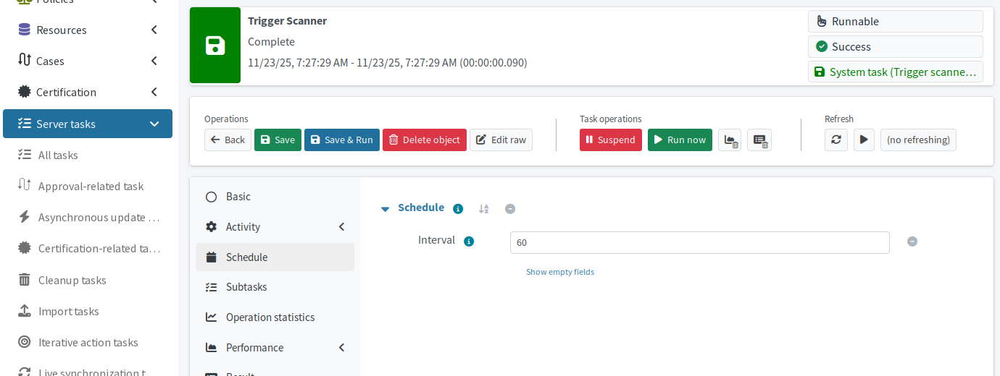
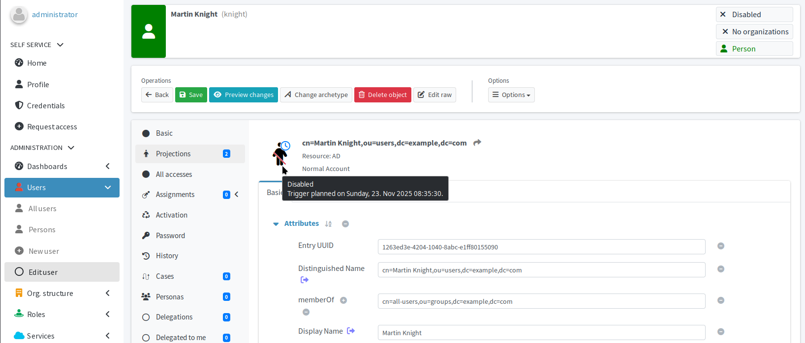

= Handle long-term leaves and former employees safely
:page-nav-title: Inactive employee accounts
:page-display-order: 530
:page-toc: top
:experimental:
:icons: font

In this module, you will test behavior of your midPoint configuration regarding leavers—be it people on long-term leave or former employees.

In this guide, long-term leave stands such cases as for parental leave.
Such users and their accounts should be disabled.
It is important, though, to avoid deleting their accounts, because the employees are expected to return after their leave ends.

In the second part of the module, you will test your midPoint configuration for former employees.
Accounts of former employees need to be disabled and their accounts should be deleted after a defined period of time automatically.
You will use _disabled instead of delete_ and _delayed delete_ activation concepts of midPoint to first disable such users and their AD account, and plan the later deletion of the AD account.

== What awaits you in this module

. Verify long-term leave handling
    .. Set a user status in the HRIS to _Long-term leave_
    .. Verify the user is _Suspended_ in midPoint and _Disabled_ in LDAP.
    .. Set the user status in the HRIS back to _In_
        and verify they are back to _Active_ and _Enabled_ in midPoint and LDAP.
. Confirm leavers are safely deleted from the LDAP server after a grace period.
    .. Set a user status in the HRIS to _Former employee_
    .. Verify the user is _Archived_ in midPoint and _Disabled_ in LDAP.
    .. Check the delayed-deletion trigger placed on the LDAP account.
    .. Confirm the user's LDAP account has been deleted after the set grace period.

:sectnums:

== Employee goes on long-term leave

The first case we are to cover is when employees leave on long-term leave.
You will update the leaving employee in HRIS and observe how midPoint handles the case.

=== Update the user in HRIS

As always, all changes are initiated in the source HR information system.
To update a user in the HRIS, use the same steps as in xref:/midpoint/methodology/first-steps/verify-configuration-behavior/handle-source-system-data-updates/[].

. Pick a user to update, e.g., _Martin Knight_ (employee number: 1006).
. Update their *Status* to _Long-term leave_.
. Export HRIS users to CSV.

=== Let automation handle the updates

Wait for the xref:/midpoint/methodology/first-steps/automate-target-system-integration/generate-usernames-in-midpoint/#automate-importing-users-to-midpoint[recurring HRIS reconciliation task] you have already up and running to pick up the changes.

=== Check the results

Verify how the change was handled using the same steps as in xref:/midpoint/methodology/first-steps/verify-configuration-behavior/handle-source-system-data-updates/#inspect-the-results[].

These should be the results:

* The *Lifecycle state* of the user Martin Knight is set to _Suspended_.
* The user's *Effective status* is _Disabled_ (displayed in the top-right corner of the screen).
* In the user's profile, go to *Projections*, select the LDAP projection, and check that the *Administrative status* is set to _Disabled_.
* You can also check the user directly on the LDAP server.
    The disabled status is mapped there to the `roomNumber` user attribute because LDAP does not support user activation natively.

.User Martin Knight has been suspended due to going on long-term leave
image::midpoint-knight-user-suspended-long-term-leave.webp["User Martin Knight is suspended due to his long-term leave"]

Users who are on the long-term leave in the HRIS are suspended in midPoint.
Users inactive in midPoint, in turn, have their LDAP accounts disabled.
That is because they should not have an access to the accounts, you cannot delete them because the users are expected to return back to work at a later time.

=== After the employee returns

When their long-term leave ends, employees are about to return to work.
They need their accounts back as they were before they left.

. Update the user who is returning in HRIS—set their *Status* back to _In_.
. Wait for the recurring reconciliation task to run.
. Check the user's *Lifecycle state*, *Effective status*, and *Administrative status* of their LDAP projection.
    They should be _Active_ and _Enabled_.

== Employee leaves for good

The second exercise in this module is similar to the first but with some added points.
For this work, pick a user on which to simulate leaving the employment.
In this module, we use _Martin Knight_ (employee number: 1006) again.

=== Update the user status in HRIS

. In the HRIS user interface, modify the user's *Status* to _Former employee_.
. Export HRIS users to CSV.
. Wait for the recurring HRIS reconciliation task to pick up the change.

=== Verify the user is deactivated and waiting for deletion on LDAP

Once the reconciliation task picks up the changed employment status of the user's account, you have configured midPoint to:

* Set the user's *Lifecycle state* to _Archived_.
* Set the user's *Effective status* to _Disabled_ (displayed in the top-right corner of the screen).
* Disable the account on the LDAP resource (mapped to the `roomNumber` user attribute).
* Set up the trigger for delayed deletion of the LDAP resource account.
    ** If you have used values suggested by this guide, the grace period before the account is actually deleted is five minutes.

[NOTE]
====
When you are on the user profile screen, it is not enough to refresh the page to see the updates made by the reconciliation task to the user (such as changed lifecycle state).
You need to go [.nowrap]#icon:arrow-left[] btn:[Back]# to the user list, and open the user profile again.
====

=== Check the delayed delete trigger

The delayed delete activation rule places a trigger on accounts that are to be deleted instead of having them deleted right away.
In laymen terms, the trigger says, for instance, "delete this AD account on 2025-11-23 07:57:19".

To act upon triggers, there is the trigger scanner task which periodically scans objects with triggers.
Once it discovers an object with a trigger the time of which is in the past, it performs the action specified in the trigger.
For a trigger to be fired, its time stamp must be in the past.
That means triggers are never fired earlier than at the time specified by their time stamp.
On the other side, the action may be delayed depending on the schedule of the trigger scanner task.

By default, the trigger scanner task is scheduled to run every 5 minutes.
In the Docker image prepared for this guide, it is set to 1 minute.
You can check and change the schedule in [.nowrap]#icon:tasks[] *Server tasks*# > [.nowrap]#icon:save[] *System tasks*# > Trigger scanner > [.nowrap]#icon:calendar[] *Schedule*#.
You can also use the [.nowrap]#icon:play[] btn:[Run now]# button there if you do not want to wait for the next scheduled run.
// TODO: We're missing an article on triggers and trigger scanners @dakle 2025-11-23

.Trigger scanner schedule configuration screen

[TIP]
====
The trigger is stored in the midPoint xref:/midpoint/architecture/concepts/shadow/[shadow object] corresponding to the resource account.
It is not stored in the user's focal object nor in the actual account on the remote resource.
====

Once the trigger is in place:

. Go to the user's profile in midPoint
. Click *Projections*
. Select the LDAP resource
. Hover your mouse over the account icon to see the timer.

.The AD account for user Martin Knight pending delete

If you are on the Docker images prepared for this guide, you can check accounts with triggers using the *AD account notices dashboard*:

. Under [.nowrap]#icon:tachometr-alt[] *Dashboards*#, select *AD account notices*.
. Click [.nowrap]#*More info* icon:arrow-circle-right[]# on the *Users with accounts with triggers* tile to list *users* with triggers on any of their accounts.
. Click [.nowrap]#*More info* icon:arrow-circle-right[]# on the *Accounts with triggers* tile to list *accounts* with triggers.
. Click [.nowrap]#*More info* icon:arrow-circle-right[]# on the *Users without AD accounts* to list users without an AD account.
    ** This number will grow by one once the grace period for Martin Knight's AD account expires.

.AD notices dashboard showing one account is pending delete
image::midpoint-dashboard-ad-notices-one-pending-delete.webp["AD notices dashboard showing one account is pending delete"]

.If you have renamed your AD/LDAP resource…
[NOTE]
====
The dashboard widget for showing the number of accounts without an AD account depends on the resource name.
If you have renamed the AD resource to anything other than `AD`, the dashboard would wrongly show that all users in midPoint are without an AD account.

Should that be your case, either rename your AD resource to `AD`, or adjust the object collection used in the dashboard as follows:

. In [.nowrap]#icon:filter[] *Object collections*#, find and open for editing the collection _Users without AD accounts_.
. Click [.nowrap]#icon:edit[] btn:[Edit raw]#.
. Edit the filter part of the collection:
+
[source,XML]
----
<filter>
    <q:text>
        linkRef/@ not matches (
        . type ShadowType
        and resourceRef/@/name = "AD" <!--1-->
        and kind = "account" )
    </q:text>
</filter>
----
<1> Rewrite the quoted string so that it matches exactly the name of your AD (LDAP) resource.
+
. Click btn:[Save] and go back to dashboards.
    The dashboard should show accurate data now.

Refer to xref:/midpoint/reference/admin-gui/dashboards/[] to learn more about dashboards.
====

=== Confirm the AD account has been deleted

After the grace period elapses, midPoint deletes the AD account projection for the user Martin Knight who is no longer entitled to have one because he left the company.
For the account to be _actually_ deleted on the resource, the recurring HRIS reconciliation task must run as well.

To verify the AD account has been deleted, check *Projections* for user _knight_ in midPoint.
He should have only the one to the HRIS; the AD projection should be deleted.

.User Martin Knight's projections contain only the HRIS now
image::midpoint-knight-ldap-projections-only-hris.webp["User Martin Knight's projections contain only the HRIS now"]

You can also use the *AD account notices* dashboard—the *Users without AD accounts* tile should now show one more account than before.

The user _knight_ remains in midPoint because in the setup we use in this guide, we keep track of all users who have ever been part of the company,
similarly to how a university keeps track of all students who have ever enrolled at the university.

Finally, you can also check the AD/LDAP server to verify the account is not there.

:sectnums!:

== Next steps

In the next module, you will test how the exiting configuration copes with adding a new outbound mapping to the target resource.