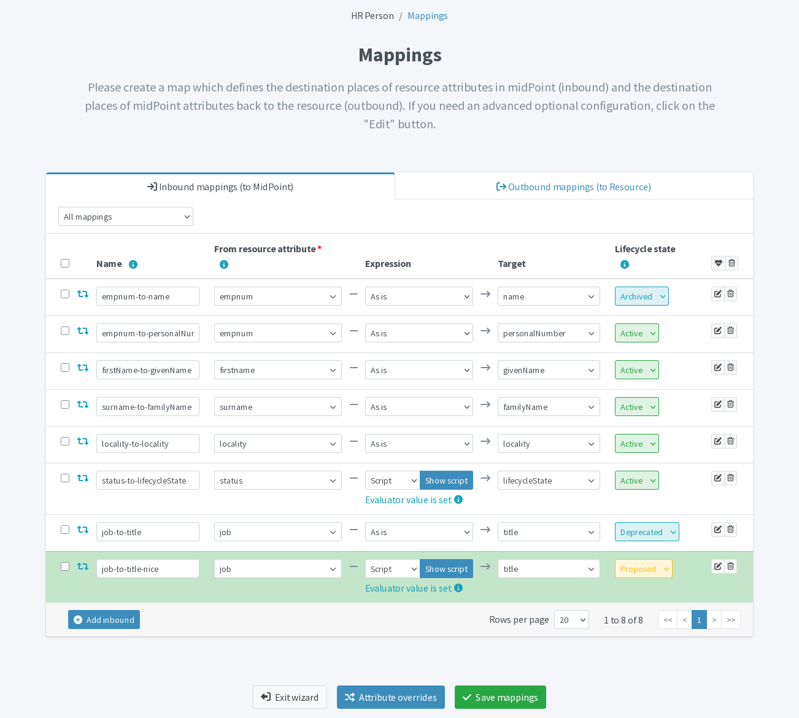
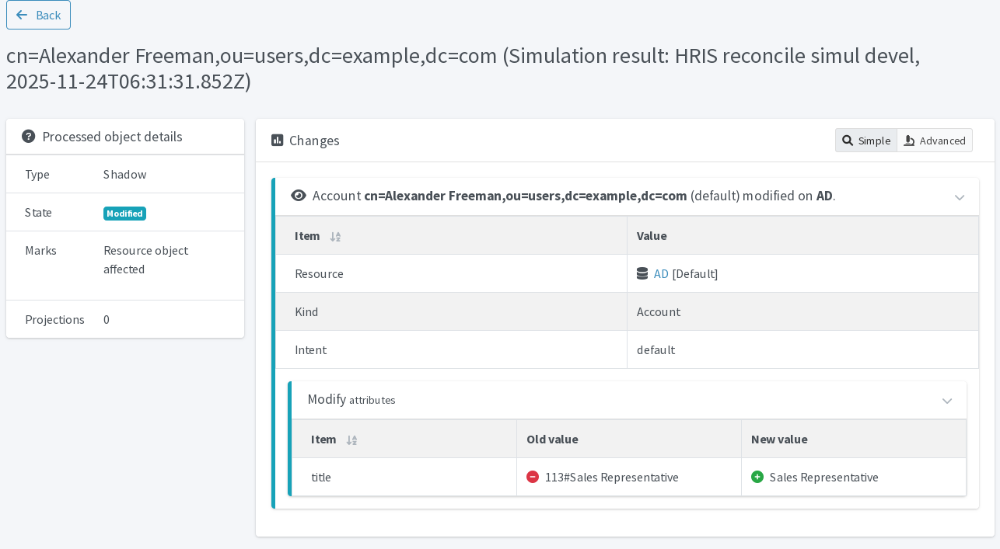
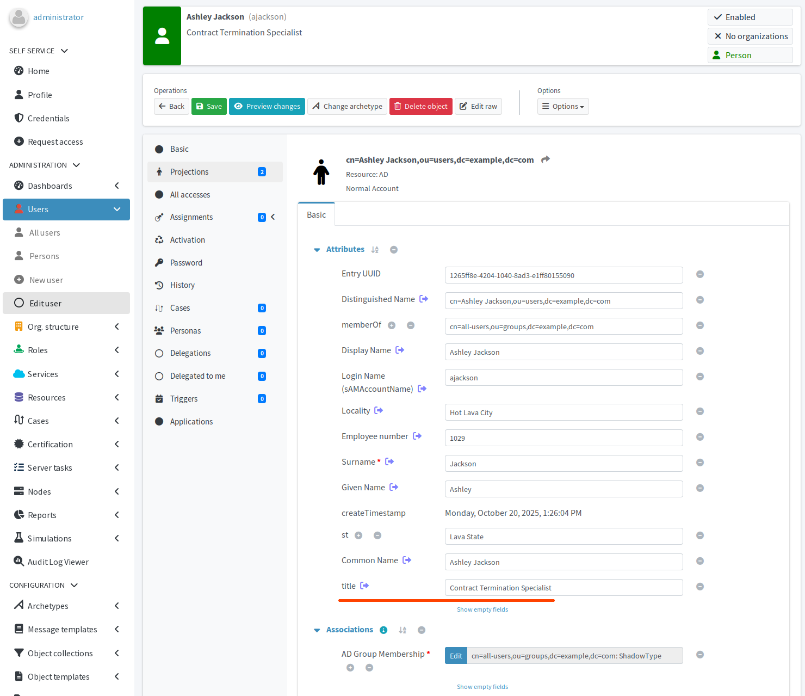
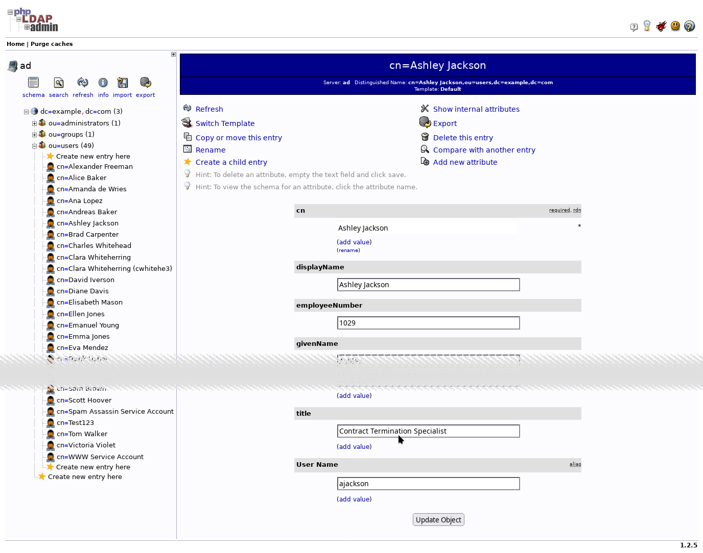

= Update existing mapping
:page-nav-title: Update existing mapping
:page-display-order: 550
:page-toc: top
:experimental:
:icons: font

In this module, you will see that mappings used in production can be safely updated, tested using simulations, and then re-deployed to production without any downtime.

== What awaits you in this module

In the previous module, you have newly imported the `job` attributed from the HRIS and provisioned it to the AD resource.
The issue with the values from HRIS is that beside the actual position name, they contain ugly internal codes, like `124#CEO`.
Your goal in this module is to remove the codes and populate the `title` attribute in midPoint and AD with clean values, such as `CEO`.

The trick to learn here is how to make such a configuration update without causing any downtime.
You need to keep the old configuration in production during the testing until you are ready to seamlessly replace it with the new configuration.
For this to work, you will use two new lifecycle states.

Suggested reading: xref:/midpoint/reference/concepts/object-lifecycle/#relation-of-task-configurations-and-lifecycle-states[Relation of task configurations and lifecycle states]

:sectnums:

== How to ensure continuity using lifecycle states

While it is true that you already have an inbound mapping in the HRIS resource for the `job` attribute, you cannot simply update it.
By doing that, you would forfeit the option to test the new configuration using simulations because the mapping is _active_, i.e., on production.
Alternatively, you could move the mapping to the _Proposed_ lifecycle state, but that would mean putting it out of production during the testing phase, i.e., downtime.

To ensure the continuity without interruption, you need to keep the old mapping on production and create a new mapping to test with.
Once the testing is over, you will swap them using the appropriate lifecycle phases:

* The old mapping that needs to stay on production goes to the _Deprecated_ lifecycle state.
* The new mapping is in the _Proposed_ lifecycle state during testing.
* Once the new mapping is tested, it goes to the _Active_ lifecycle state.
* The old mapping is then retired and goes to the _Archived_ lifecycle state.

== Adjust mappings in HRIS

Let us adjust the inbound mappings for the HRIS resource.

=== Deprecate the old mapping

Firstly, put the old inbound production mapping to the _Deprecated_ lifecycle state.
This is a purely semantic change but it is useful because it makes it clear that it is intended to go away sooner or later.
It is important to know that while _deprecated_, the configuration object is *still used on production*.

.Deprecated HRIS mapping is still used on production
[cols="5*", options="header"]
|================================================================================
| Name         | From resource attribute | Expression | Target  | Lifecycle state
| job-to-title | `job`                   | As is      | `title` | Deprecated
|================================================================================

=== Propose new mapping for cleaner title values

Secondly, create a new inbound HRIS mapping in the _Proposed_ lifecycle state.
You do not want to put it to production yet, you need to test it first—hence, _propose_ it before you _activate_ it.

.New HRIS mapping first needs to be tested. See below for the script.
[cols="5*", options="header"]
|=====================================================================================
| Name              | From resource attribute | Expression | Target  | Lifecycle state
| job-to-title-nice | `job`                   | Script     | `title` | Proposed
|=====================================================================================

Click btn:[Show script] for the _job-to-title-nice_ mapping.
Use the script below.

.Script for the job-to-title-nice mapping
[source,groovy]
----
def separator = '#'

if (input == null || input.indexOf(separator) == -1) { <1>
    return input
} else {
    return input.tokenize(separator)[1] <2>
}
----
<1> If the input string is `null`, empty, or cannot be split by the separator, return the string unchanged.
<2> Split the string by the hash character (set in the `separator` variable) and return the second part of the string.

.HRIS inbound mappings with the old job-to-title mapping deprecated and the new job-to-title-nice mapping proposed

[TIP]
====
You do not need to change the outbound mapping to the AD resource because it will use the new value produced by the HRIS inbound mapping.
====

== Test the new mapping

With the new _proposed_ configuration ready, it is time to test it.

. In the HRIS resource, run the simulated development reconciliation task you have prepared there from previous modules.
. After the task finishes, click btn:[Show simulation result].
. In the *Resource object affected* tile, you should see changes to all users mapped from the HRIS to midPoint.
    Click [.nowrap]#*More info* icon:arrow-circle-right[]#, open an item in the list, and inspect the changes made to the item.

[NOTE]
====
Simulated development task evaluates all _active_ and _proposed_ configuration items, but makes no permanent changes to the data.
At the same time, the scheduled production reconciliation task executes all _active_ and _deprecated_ configuration items,
so the old configuration is still in production.
====

.The reconciliation simulation shows the job title is going be nicer thanks to the new mapping

== Put the new configuration to production

Currently, your production HRIS reconciliation task (the recurring one) uses the _deprecated_ mapping, while the simulation reconciliation task uses the _proposed_ mapping.
To seamlessly move production from the old deprecated configuration to the new proposed one, _archive_ the _deprecated_ mapping and _activate_ the _proposed_ mapping.

. In the HRIS resource, open inbound mapping configuration.
. Set the _job-to-title_ mapping lifecycle state to _Archived_.
. Set the _job-to-title-nice_ mapping lifecycle state to _Active_.
. Wait for the recurring HRIS reconciliation task to pick up the changes and provision the nicer job titles to all accounts on LDAP.

.HRIS inbound mappings with the old job-to-title mapping archived and the new job-to-title-nice mapping active
image::hris-inbound-mapping-job-to-title-archived-job-to-title-nice-active.webp.webp["HRIS inbound mappings with the old job-to-title mapping archived and the new job-to-title-nice mapping active"]

== Verify the results on AD

Once the recurring HRIS reconciliation task processes the change, have a look at the AD projections in user profiles in midPoint to see the new prettified job titles there.

.Improved job title format shown in AD projection in midPoint

Then, navigate to the link:http://localhost/phpldapadmin/[AD server web UI] and check the job titles there.

.Improved job title format shown in user AD profile

You have successfully updated mappings using lifecycle states and simulations during normal operation (the scheduled HRIS reconciliation task was not suspended in the process).
This use of lifecycle states helped you improve and test properly your configuration thanks to simulations without disrupting the system operation.
The mapping in the _Archived_ lifecycle state can eventually be removed.

:sectnums!:

== Next steps

This module concludes this section of the First steps guide dedicated to confirming the functionality and resilience of the setup you have created.
Up next is the last section of this guide: overriding wrong source data.