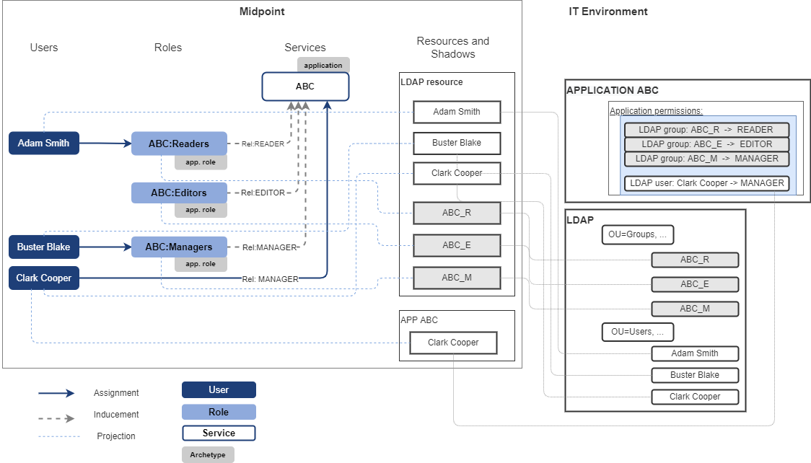
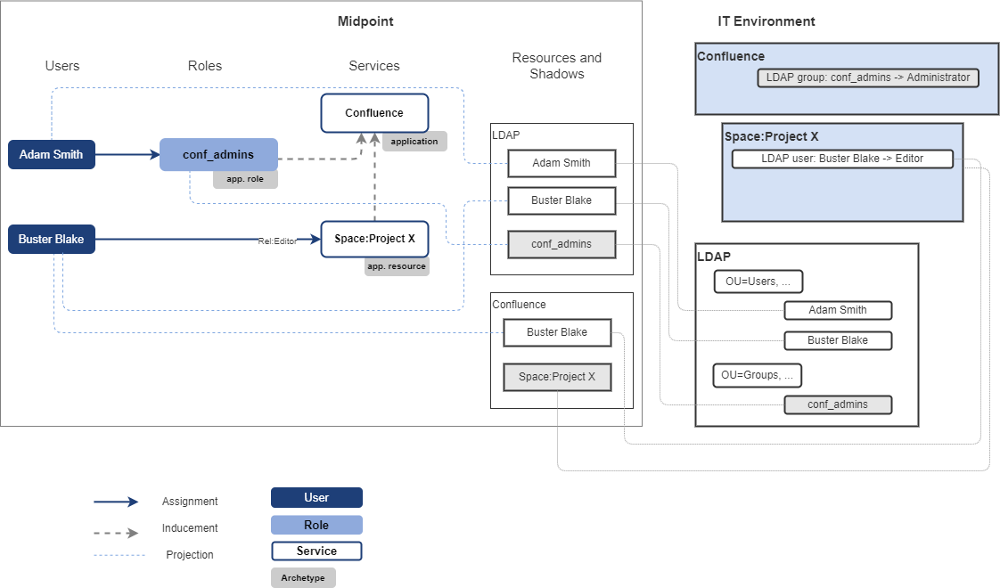
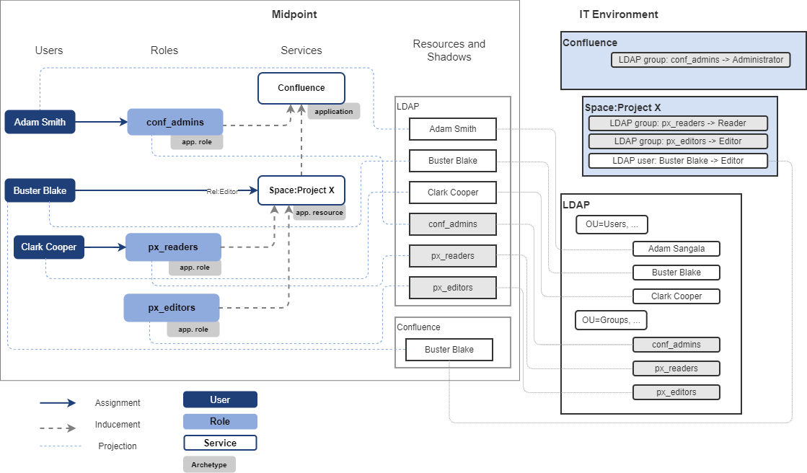

= Access Modeling Examples
:page-nav-title: Access Modeling Examples
//:page-display-order: 200
:sectnums:
:sectnumlevels: 3

How is the access represented in midPoint can be described on following examples.

[#example1_access_to_application]
== Example 1: Access to application

Following schema describes the access to application ABC. Access to the application ABC is managed via membership of LDAP groups. One user has access to the application configured directly in the application.

====
*Access model of the application ABC:*

* members of _ABC_R_ LDAP group have _Reader_ access level to application ABC,
* members of _ABC_E_ LDAP group have _Editor_ access level to application ABC,
* members of _ABC_M_ LDAP group have _Manager_ access to application ABC,
* user Clark Cooper has _Manager_ access to application ABC.

User Adam Smith is member of ABC_R LDAP group and user Buster Blake is member of ABC_M group. These groups give them access to application ABC.
====

Environment and configuration of midPoint can be described by following picture:

.Application access model
Access model of application ABC is represented by roles directly induced to ABC service representing application and direct assignment of the ABC service to user Clark Cooper. Relations are describing business description of _access level_.

Such midPoint configuration may be interpreted by technical (IAM) language or by business language.

.Technical interpretation (IAM):

* Adam Smith has role _ABC:Readers_ assigned. Therefore he has account in _LDAP_resource and is assigned in _ABC_R_ LDAP group. He has service _ABC_ assigned.
* Buster Blake has role _ABC:Managers_ assigned. Therefore he has account in _LDAP_resource and is assigned in _ABC_M_ LDAP group. He has service _ABC_ assigned.
* Clark Cooper has service _ABC_ assigned.

This technical interpretation explains information necessary for provisioning, but will not tell much about user access to the application without additional knowledge of application access model.

.Business interpretation (IGA):
This interpretation describes user access to the application. Clearly understandable by business.

* Adam Smith has _Reader_ access to application _ABC_ via application role _ABC:Readers_.
* Buster Blake has _Manager_ access to application _ABC_ via application role _ABC:Managers_.
* Clark Cooper has _Manager_ access to application _ABC_.

[#_access_to_application_resource_direct]
== Example 2: Access to application resource - direct assignment of resource

The xref:../objects-and-midpoint/index.adoc#_application_resource[application resource] increases flexibility of access modelling and enables xref:../parametric-access.adoc[parametric access].

Application resources may be assigned directly, or via roles. When application resource is assigned directly, relation of this assignment defines access level of user to the application resource.

Following schema describes the access to Confluence space _Project X_. The space is represented by application resource.
Access to the Confluence space is managed by direct assignment of user in the space.
The schema also describes one user being administrator of whole Confluence application to display difference between managing access to whole application and just to the application resource.
====
*Access model of Confluence application*

* members of _conf_admins_ LDAP group have _Administrator_ access level to _Confluence_ application

*Access model of Confluence space Project X*

* user Buster Blake has _Editor_ access to the Confluence space _Project X_
====

Environment and configuration of midPoint can be described by following picture:

The user access to confluence space described in business (IGA) terminology:

* Buster Blake has _Editor_ access to Confluence space _Project X_.
* Buster Blake has also access to Confluence application.

Additionally we can tell, that Adam Smith has _Administrator_ access level to _Confluence_ application.

====
NOTE: Probably we have missing feature - how we represent relation in shadow resource ?  Association does not have relation.
====

[#_access_to_application_resource_roles]
== Example 3: Access to application resource - utilizing roles

IGA is not being deployed on green field, but rather it must describe existing IT environment and complex access models.
In the example above, the access was assigned directly to confluence space. In some real-life situations the access model may be hybrid - access to the application resource is assigned via membership in LDAP groups and also directly.

This example describes how to model such example.

Following schema describes the access to Confluence space _Project X_. The space is represented by application resource.
Access to the Confluence space is managed by managing membership in LDAP groups. Additionaly one user are assigned to the space directly.
The schema also describes one user being administrator of whole Confluence application to display difference between managing access to whole application and just to the application resource.

====
*Access model of Confluence application*

* members of _conf_admins_ LDAP group have _Administrator_ access level to _Confluence_ application

*Access model of Confluence space Project X*

* members of _px_readers_ LDAP group have _Reader_ access level to Confluence space _Project X_
* members of _px_editors_ LDAP group have _Editor_ access level to Confluence space _Project X_
* user Buster Blake has _Editor_ access to the Confluence space _Project X_
====

Environment and configuration of midPoint can be described by following picture:

The user access to confluence space described in business (IGA) terminology:

* Clark Cooper has _Reader_ access to Confluence space _Project X_ via application role _px_readers_.
* Buster Blake has _Editor_ access to Confluence space _Project X_.

We can also tell, that Adam Smith has _Administrator_ access level to _Confluence_ application.
