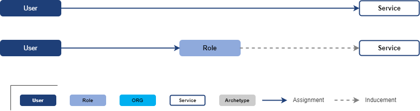
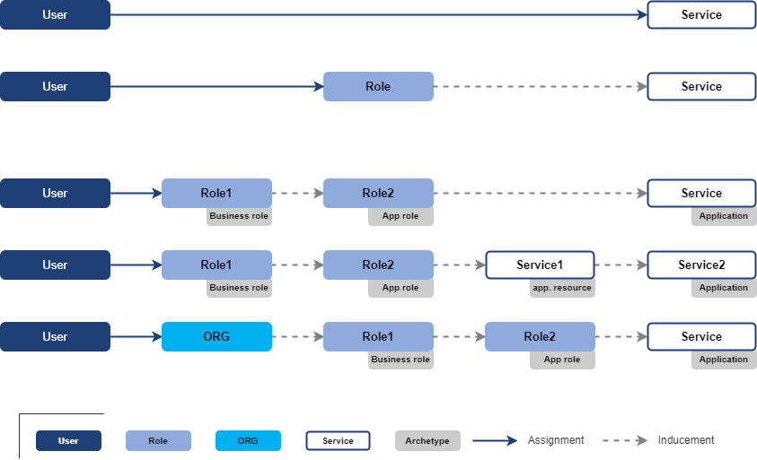

= Access Modeling
:page-nav-title: Access Modeling
:page-display-order: 200
:sectnums:
:sectnumlevels: 3

[#_access_to_application]
== Access to application

Access to xref:../objects-and-midpoint/index.adoc#_application[application] is represented in midPoint by assignment of service representing the application.

The application may be assigned directly or indirectly via application roles.

In real life, the representation is not always so clean and straightforward as in the picture above.

To correctly model specific business situation, there may be multiple levels of roles or even services in the single assignment path. Additionally, role may be assigned to organization units (represented by ORG in midPoint). Every member of the organization unit will obtain the access provided by definition of the role.

Each line of the schema below describes following business situation:

. User has access to the Application (represented by service object).
. User has assigned Role that gives him access to the Application
. User has assigned Business role which contains Application role giving him access to the Application.
. User has assigned Business role which contains Application role giving him access to Application resource that is part of the Application.
. User, being member of Organization unit has assigned Business role which contains Application role giving him access to the Application

.Schema of user access representation

.Examples
Following examples describe, how real life situation can be integrated into this model.

* Representation of xref:./examples/index.adoc#example1_access_to_application[user access to application via application roles].
* Representation of xref:./examples/index.adoc#_access_to_application_resource_direct[user access to application resources directly].
* Representation of xref:./examples/index.adoc#_access_to_application_resource_roles[user access to application resources via roles].

== Assign roles or applications ?

As shown in previous schemas and examples, user access may be described not only by assignment of roles, but also by direct assignment of applications or application resources - with definition of access level. The access level is represented in midPoint by relation of the assignment.

Typically, the access may be described as:

* Assignment of application role
* Assignment of business roles
* Assignment of application (with definition of access level)
* Assignment of application resource (with definition of access level)

It depends on actual situation what objects use to model the access.
Direct assignment of applications can decrease number of managed objects (roles are not needed) but differentiation of user roles in application just by access level (relation) may not be good enough.
The relations should be somehow standardized in the environment (editor, reader, operator, administrator, ..).

On the other hand, application resources should be in most cases assigned directly.

[#_role_hierarchy]
== Role hierarchy

In organization, business roles has inducements to application roles, another business roles or even services representing applications or application resources.
These inducements are building role hierarchy - from top level business roles, through application roles to detail metaroles.

Displaying *hierarchy of roles based on their inducements* describes the role model - structure of roles in organization.
Such structure is useful for Role manager for analysis the role structure and organization, but also for auditors or security officers for review of access that particular role or list of roles can provide.

Displaying the entire role hierarchy in the view may be resource intensive, because there can be thousands of roles and each business role can contain dozens (sometimes even hundreds) of application role or service inducements.
In addition, individual roles can be repeated in the hierarchy - an application role can occur in several business roles.
For these reasons, a report form is suitable for full display of the role hierarchy.

Such report is described in the use-case xref:../../use-cases/visibility-uc.adoc#_hierarchy_of_roles__the_role_model[hierarchy of roles - the role model].

As role hierarchy is being built during the time, it may happen that loops will be introduced into the hierarchy. Role A induces role B, that induces role C and this role induces back role A. It should be rare, but may happen. MidPoint can handle such situations during provisioning, but it is necessary to xref:../../use-cases/visibility-uc.adoc#_identification_of_loops_in_role_structure[identify loops in role structure] and handle them correctly.

.Partial display of the role hierarchy
Easier than displaying full role hierarchy is displaying just position of actual role in the hierarchy. Midpoint should display in UI for each role object:

* *all descendants* - what everything will be xref:../../use-cases/visibility-uc.adoc#_what_is_assigned_by_this_role[assigned by the role] assignment.
* *all ancestors* - in which roles xref:../../use-cases/visibility-uc.adoc#_where_is_this_role_included[is this role induced] ? For users it may be named as "included".

These 2 views can provide good overview for role manager or other IGA users while organization of roles.

As service objects representing applications and application resources may be included in hierarchy of roles, then this representation should be included also for services.

[#_defining_rules__org_units_and_roles]
== Defining rules - Org. units and roles

Roles, applications and application resources may be assigned by rules or ad-hoc by request. How these rules should be defined ?

.Organization units
Creation of inducement of roles to organization structure is preferred way of automation in role assignments.
When role is induced to org. unit, all people in the org. unit obtain the role.

Main advantage of this model is readability. Additionally, this model is easily and naturally manageable and affected scope of any role modification is quite clear (users in the org unit).

Both application or business roles and even application or application resources may be induced in org. units. It is good practice to have only small amount of inducements in one org. unit. If there are many roles induced in the org unit, the readability of the assignment rule is affected.

These rules may be displayed in xref:../../use-cases/visibility-uc.adoc#_hierarchy_of_roles__the_role_model[hierarchy of roles - the role model] report.

.Autoassignment rules
*Autoassignment rules* are _not preferred_ in IGA. Small number of rules may be defined (e.g. Employee / Contractor), but having large number of complex assignment rules is hard to read and even harder to maintain. Any exception increases complexity of environment.
+
To have autoassignment rules readable in the environment, each rule should be described in documentation.
