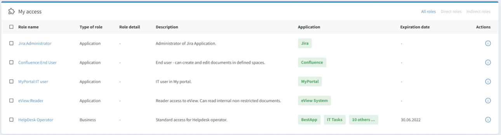

= Displaying of User Access
:page-nav-title: Displaying of User Access
:page-display-order: 250
:sectnums:
:sectnumlevels: 3

User access is represented by direct or indirect assignment of service object. The services are mostly assigned indirectly.

User needs to know where does he have access. But just listing list of applications (service objects) is not enough. When user see the access, almost immediately he can ask why he has the access. In more technical - what assignment gave him the access.

User access must provide clear overview together with enough detail information to identify the source of the access - why the access is provided.

There are 3 options to show the user access. Each of them is important for some situation or set of users. None of them can fit all situations.

NOTE: This display is resolving situation described in use-case xref:../../use-cases/visibility-uc.adoc#_what_is_the_access_of_the_user[What is the access of the user].

== Option 1: Business view - user access

User access can be displayed as list of direct assignments enhanced by indirectly assigned services.
Each assignment should contain also additional business details of the assigned role (or object) or assignment itself.

This option is probably most natural to end-user understanding. He can see what he has assigned and what access is given by each assignment.

Example of the view of user access can be displayed in the following picture.

.Picture1: User access

Such display of user access provides good balance of content overview and the details.
If the user wants to see details he can open details of the role (by clicking on the role name) or details of the assignment (by clicking on the information icon).

To provide information more efficiently, the users should be able to:

* sort and search the view according role name
* sort and search according role archetype
* sort the view according application name
* search the view by role name or application name

This view can be successfully used in environments where users are familiar with roles and role name is primary point of their access request.

Disadvantage of this view is that not all applications may be displayed for the sake of readability. If a business role provides access to a large set (e.g. a hundred) of applications, it would be hard to read the view if all of them are displayed in the view.

.Users of this view

This view is designed for end-users and the managers. It provides good readability on business level and abstracts from complexity of complex assignment paths (e.g. business role -> application role -> application).

Example of the view is described  xref:display-user-access-examples.adoc#_option_1_business_view__user_access[here].

== Option 2: Business view - user access by application

This view lists all directly or indirectly assigned applications and for each indirectly assigned application the view should display also role that provided the application.

.Example of view structure
[options="header", width=80%]
|===
| Application name | Provided by | Type of role | Description |Access level| Expiration date
|===

This view resolves disadvantage of option 1. The view will not hide part of applications if there are large set (e.g. a hundred) of application access provided by one business role.

Disadvantage is, that the display of the view is not so natural. User assignments are not primary objects and aggregation of access provided by business roles may be hidden by this view. The business role may be scattered over multiple

Therefore user may see much more lines than in , and it may be hard for him to identify all roles that provided access.

NOTE: Only applications of specific archetype may be listed here - only those that represent user access.

.Users of this view
This view should be provided to the same set of users as view "User access" in option 1.

Example of the view is described  xref:display-user-access-examples.adoc#_option_2_business_view__user_access_by_application[here].

== Option 3: Technical view - all direct and indirect assignments

On the other hand the technical users may need to see not only direct assignments and final indirect service, but also all objects that are assigned between direct assignment and final service. He needs to see `full assignment path`( e.g.:Business role X -> Application role A -> Application A).

Why the technical users need to see full assignment path? It may be needed for troubleshooting user access, comparing the assignments of two users, ...

It is technical view of the assignments. It is represented by already existing view "all direct and indirect assignments" - with added columns for `parent of indirect assignment` and `full assignment path`.

This view is less readable than the previous two. It may contain much larger number of assignments.
But, the view provides means for analysis why exactly the object was assigned. The information is provided by value of "full assignment path".

The user should have possibility to sort the assignments and search among them and applications to find particular role or application. It would be great if AXIOM search is available for IGA operators and advanced users to search in the assignments.

.Users of this view
The view is useful mostly for technical users. Typical user of the view is:

* IGA operators / administrators  - for analysis and troubleshooting of user access
* Role manager / Security manager / Security officer / Auditor - analysis of all assignments of specific user

Example of the view is described  xref:display-user-access-examples.adoc#_option_3_technical_view__all_direct_and_indirect_assignments[here].

== Technical notes
Following technical notes may be considered:

=== Actual state of the user access
midPoint should not compute the actual indirect assignments while displaying the user access. It should be read from the data in repository.

If, in meantime, some of assigned roles were modified and this can affect assigned objects, then the user with enough privileges can recompute the user and see the access again.

Main reason for this behavior is performance saving. This access should be provided not only to end-user when seeing his access, but also while reporting of user access of all users - the generation of the report should not be computing access of each user.

Idea: it could be helpful if the roleMembershipRef element contains also archetype of the reference and full assignment path. This would save recomputing of all users assignments just while displaying his indirect assignments.

=== Enable displaying indirect assignments also in other views

It would be hepful, if we could display indirectly assigned objects also in views related to specific archetypes.
e.g. by having checkbox `[ ] show indirect assignments` in each view displaying user's assignment.

=== Hide some services
Not all services should be visible. The service should have option (e.g. attribute) to identify, that this service is used in displaying user access or not.

The user access view should display only services that represent user access.

Examples of such situation:

1. Having SAP (application) and its modules as application components. I want to display that the user has access to SAP-HR. Then SAP is not needed to be displayed.

=== Display access level in user access
Displaying of relation in user access view can describe user access better.
But not only the relation of assignment, but also relation of inducement - this relation may be described as "access level".