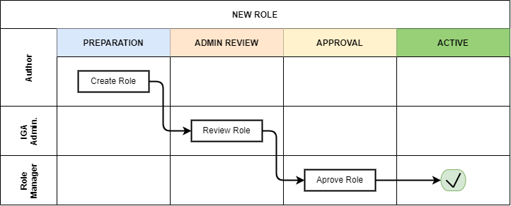
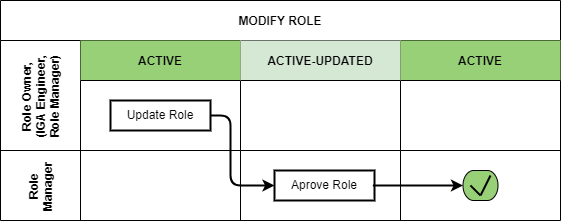
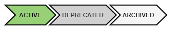

= Role Engineering and Maintenance Process
:page-nav-title: Role Engineering and Maintenance
:page-display-order: 200
:page-toc: top
:toclevels: 3
:sectnums:
:sectnumlevels: 3

WARNING: This page is a work in progress.

Role engineering and maintenance process is collection of various technical information and their transformation into business object representing way of accessing of the application - the application role. Also, this process involves collection of application roles into business role - business representation of access of business user.

This process requires a cross-team cooperation. Although some application roles may be defined by application engineers or administrators themselves, multiple people must be involved for some other roles. The individual tasks in the process are sometimes unclear. People may understand the concepts and rules differently, the applications may have different internal data models etc.

To have the process effective and manageable, it is designed with the xref:../concepts.adoc[IGA design concepts] in mind.

The Role engineering and maintenance process (sometimes just Role engineering process) is designed to be lightweight and readable, but needs to be fully documented and governed by Role manager. Exceptions are to be managed by IGA administrator or Role manager himself.

Following actors are active in the process:

* *Author* - the person, who created the request for the role.
** Application engineer is typically author of application roles.
** Business user is typically author of business roles.
* *Role Owner* - performs decisions of role modifications and assignments. Often it is application engineer for application roles and business manager for business roles.
* *IGA administrator* - reviews the roles and applications definitions and verify them from the viewpoint of technical accuracy and processing details.
* *Role manager* - governs the roles structure. Reviews the roles from the view of their position in the whole model and business functionality.

The process in high level can be described by schemas how the roles are created, updated and decommisioned. After reading the description in the chapters below, please review also details of the process in the xref:role-engineering-details.adoc[process details] page.

== Building New Roles

image::role-eng-draft-to-active.png[Role engineering - new role]

During creation, the new role flows through 4 stages from a role PREPARATION stage to the role that is in ACTIVE stage. New roles in ACTIVE state can be assigned and requested.

Author creates new role in the PREPARATION stage. In this stage he can update the definition as long as is needed. When the design is finished, he forwards the role to IGA administrator for review.

ADMIN REVIEW stage is included in the process because of the complexity of creation of the role. IGA administrator is able to help author to correct role definition to ensure that the role is technically correct. After review, the IGA administrator forwards the role definition to Role manager for final approval - the role is moved to APPROVAL stage.

In APPROVAL stage, role manager reviews the role from the view of their position in the whole model and its business functionality. If the role design fulfills the requirements, it is approved and moved to ACTIVE state. Of course, the Role manager may reject the role creation or return it for redesign.

[#_new_application_role]
=== New Application Role

Definition of application role is not an easy task. It often can't be performed by one person only.

Application roles are created by engineers of the applications that these roles are defining access to. The Application engineer is the position that has the most knowledge about technical implementation of access to the application. Even though Application engineer has knowledge about the application, he may not have enough knowledge of identity management system. So this definition is often product of cooperation of Application engineer and IGA administrator.

To offload IGA administrators, IDM must support application engineers with good interface for role definition.
As midpoint configuration may be very complex, the interface must abstract of midpoint terminology and structure and provide the application engineer structured data in a form that the skilled IT engineer is able to fill intuitively or after minimum of learning.

Following schematic interface for xref:app-role-design.adoc[application role design] provides view of what elements should be provided to application engineer for definition.

=== New Business Role

Definition of business role is easier, and therefore the business roles may be created and updated by business personnel.

The high level process for engineering of business roles is the same as for application roles. Main difference is the visual form of the role. Business role does not usually contain any technical configuration, just list of application roles together with business data.

At least at beginning the business roles definitions and configuration will be managed mostly by Role manager or IGA administrators based on his requests.

Schematic description of user interface for business role request is in the xref:business-role-design.adoc[business role design] page.

=== Deployment of New Application

By their nature, application roles are defining access to applications. So, they require applications defined prior linking new role to them. Application objects may be imported automatically from application inventory, or created manually by application engineer.

Application object can collect business information about the application. Or it may be just link to application inventory.

To clearly understand the difference between application and application role. Application is an _administrative object_ describing application as a business target that the access definition (the role) relates to. Only roles contain technical components that construct user entitlements and access to the application.

If no application definition exist in IDM, the Application engineer will create the Application and fill-in basic information. After the application is defined, Application engineer can start designing the application roles.

image::role-eng-new-app.png[]

Lifecycle of the application is mostly independent of lifecycle of the roles. Application lifecycle may be read from application inventory, or defined manually by Application engineer (as described on the schema above). The Role engineering process does not define lifecycle of applications. But modification of the application lifecycle state may be driver for modification of the role.

The separation of the application from the process is due to the reduction of complexity and increase of the flexibility of the process. Lifecycle of applications is managed in organizations in other systems that IDM.

Schematic design of an xref:application-design.adoc[application].

== Role Modification

image::role-eng-active-to-active.png[Role engineering - update role]

Of course role definition may be modified. And it can be modified even in the ways that nobody thought about during implementation. Having control over all aspects of the role modification could make the process overcomplicated. So the process should cover the modification in reasonable level. The inconsistencies are to be covered by recomputation of the role assignments or in some cases by manual intervention of IGA administrator.

The process in high level is designed so that approved user (Role owner, IGA administrator or even Role Manager himself) performs role modification and the modification is then reviewed and approved or rejected by Role manager.

When the role is modified, all modification go through approval process. While the process is running, the role assignments take original role definition. All existing assignments are updated according to the new definition only after the role modification is approved.

=== Recompute of assignments
It is important to note that modification of some components of the role affects also all users the role is assigned to.

Role owners or IGA administrators may modify different components of roles. If just business details are updated (e.g. description, owner), then the update does not affect assignments of the role. But, if the provisioning definition of the application role or roles assigned in the business role are updated, then recomputation of actual role assignments is needed.

Such update and recompute of role assignments may generate a large number of operations. This is not big issue in case of automated provisioning. The IDM systems are designed to handle this. It just may take some time and resources.

But, in case of manual provisioning tasks, the update (e.g. update of 1 new manually provisioned application assigned to 100+ users) may generate large number of manual provisioning tasks. As people make errors and different people work differently, some provisioning issues in this case may (and will) happen. These issues must be handled by the IGA administrator.

=== Approvals
Approval schema may vary in implementations based on business requirements and priorities. If the control over the process is priority, then Role owner should be included in every role modification. If the priority si speed and throughput, then the Role owner can be just notified about the updates.

There may be even different approval schemas defined for specific role modifications. E.g. adding application role into business role may require approval of both roles, but does not need approval of Role manager in some implementations.

NOTE: Some operations for roles modification (e.g. massive updates) may be performed by IGA administrator using Midpoint studio to decrease effort needed for multiple role updates.

=== Updating of Application Role

Update of application role can affect more things - if technical details of provisioning are updated, the recomputing of users with the role assignment (direct or indirect) will be needed. The recomputing may become quite resource intensive operation when the role is assigned to larger amount of users.

Another kind of issues may appear in case when definitions of manual operations are modified. Not all updates are adequately described in working procedures of operation teams or even wasn't anticipated in the design. Manual intervention and cooperation of Application engineer and IGA administrator may be needed in such cases.

=== Updating of Business Role

Update of business role is probably the most common operation in the process.

Most often it is the addition or removal of an application role from the business role. As said above, specific workflow may be defined for  this operation. Because 2 roles are affected - the business role being modified and also the application role that will be included into the business role. Owners of both roles should approve this operation.

=== Updating of Application

Application updates affect the Role engineering process only if any modification of application roles are needed. Not modification of application objects.

== Role Decommissioning

At the end of its lifecycle, each role should be correctly decommissioned. The role assignments need to be removed.

Role decommissioning is initiated by business process (e.g. decommissioning of an application, or removal of organizational units), or by Role manager based on his/her business decision.

image::role-eng-decom-role.png[]

Decommissioning in real life is often phased. Therefore, the role engineering process allows the role to be first in _deprecated state_ and only later on to be really decommissioned. The deprecated state allows the assignments to be still valid, but no new assignments can be created.

Prior to the role is being decommissioned, all role assignments should be removed. This operation is often performed by IGA administrators based on request of Role manager.

All role assignments must be removed prior the role removal. If this operation is done, no recomputation of objects with the role assignments are needed during role decommissioning.

The role that has been removed for all users is moved to _Archived_ state. The role is kept in this state for as long as we want to be sure to search for it in the audit. The Role manager decides on the deletion of such archived roles.

=== Decommissioning of Application Role

Decommissioning of application roles means that the connection to the technical components of the access (groups, profiles) in the target systems is lost. Therefore, it may be necessary to delete also these objects after decommissioning the role.

=== Decommissioning of Business Role

Reorganization or end of business activity (e.g. project) may be one of the business drivers for decommissioning of business roles.

When all role assignments are removed, decommissioning of the business role is just _administrative operation_ in IDM. No object outside IDM are deleted.

It is important to note, that even if decommissioning of business role may be technically easy and straightforward operation, it may be quite complex from business point of view. Some users may still need parts of the business role (will need to keep access to some applications) even after the role is removed. In this case, these application roles must be assigned to the users individually prior the business role decommissioning. The analysis of which components of the business role must be left assigned is a matter of IGA administrators and the Role manager.

=== Decommissioning of Application

When decommissioning an application, the IGA administrator must decommission all application roles. However, the decommissioning of application is only administrative operation in MP.

As said above, the separation of the application from the process is due to the reduction of complexity and increase of the flexibility of the process. Lifecycle of applications is managed in organizations in other systems that IDM. For this reason, it is appropriate to use decommissioning of application only as an initialization of the application roles decommissioning and remove the application object at the end.

== Troubleshooting the process

Failures in manual provisioning::
There is a non-zero chance that some manual operations will not be correctly processed and closed during manual provisioning. The reasons can be various, such as administrative error, or delayed processing and collision with other tickets. Each of these events needs to be assessed individually by the IGA administrator. If events recur, the IGA administrator (or role manager) can initiate modifications to processes, workflows, or configurations.

Issues while recompute::
During recomputing role assignments, a large number of provisioning or deprovisioning activities may be generated.
+
If those activities are automatic, the probability of an issue is minimal. However, for manual operations, it is necessary to expect that part of the operations will not be processed correctly, or it is possible that the system will generate too many tickets. Such an operation must be handled by the IGA administrator together with the operating teams.
