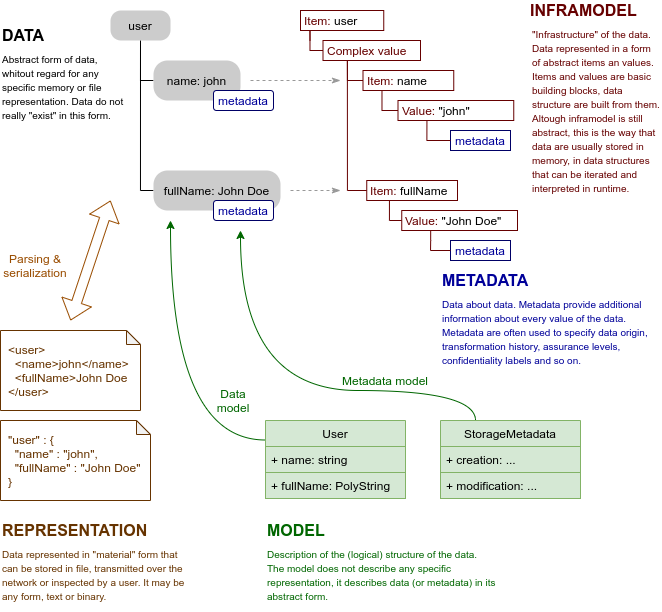

= Axiom Concepts

Axiom is a language based on the concepts that are quite abstract and may be hard to understand.
We will try to explain the concepts and their role in the Axiom world.

== Data

Data are a very abstract thing in the Axiom world.
In fact, the data are such an abstract concept that it is not even a thing.
The data almost do not exist at all, they are just something that we think about.
Axiom deals with data that are well structured, described and organized.
But this is all abstract, it is just an imagined data structure that does not really exist in any specif form.

Data are separated from their representation.
Unlike other languages, Axiom does not model data in a specific format, such as XML or JSON.
Axiom is used to model data in their abstract form.
Such data can them be represented in a variety of forms (or _representations_), all described by a single model.

== Representation

Data can be _represented_ in concrete, tangible forms.
XML file or JSON data structure transferred over the network are data representations.

Representations are used to store the data, transfer them over the network, display them to the user, record them into the database and so on.
As Axiom data are abstract and intangible, representations are often necessary to make any practical use of the data.

The concept of _abstract_ data and _concrete_ representations give us a great degree of flexibility.
Axiom data can have variety of representation formats and structures: XML, JSON, binary formats, relational databse structures and so on.
As those are representations of the same data structures, Axiom processors can seamlessly convert the data between representations.

An application can read the data from the relational database record, process them and serialize them to dense JSON format in a REST service response.
Or the application can serialize the data in YAML format to display them the user.
It won't be difficult to support new data format next year as it becomes the latest and most fashionable replacement for XML.
It is all the same data for Axiom processor.
Just the representation format is different.

== Model

_Axiom model_ describes the structure of data.
The model describes what _items_ are data composed of.
It describes data types of the item _values_, types such as _string_ or _integer_.
It describes whether the items are multi-valued, whether they are optional or mandatory.
The model describes how the data structures relate to each other, combines them to form a structure of the data.

Axiom model describes the structure of _abstract_ data.
It does not describe how the data will look in JSON or XML.
Not directly, anyway.
Of course, data model is a significant influence on how the concrete data _representation_ looks like.
But it is only an indirect influence.
Axiom model sets (abstract) structure of the data, data follows that structure and then the data are serialized to concrete representation.
This makes Axiom fundamentally different from "schema" languages such as JSON Schema or XML Schema Definition (XSD).

TODO: model and schema

TODO: metadata model

== Metadata

TODO

== Inframodel

TODO

.Metamodel, metametamodel, metadata model and other long words
TIP: TODO: The story of "inframodel"
