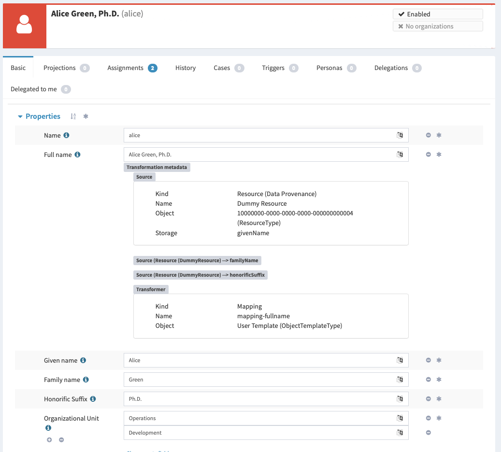
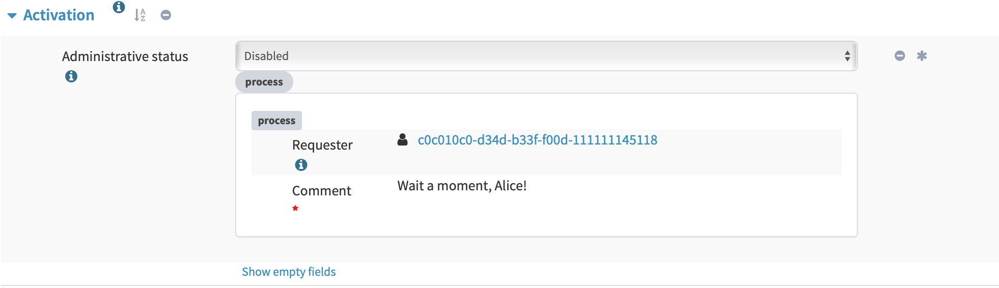
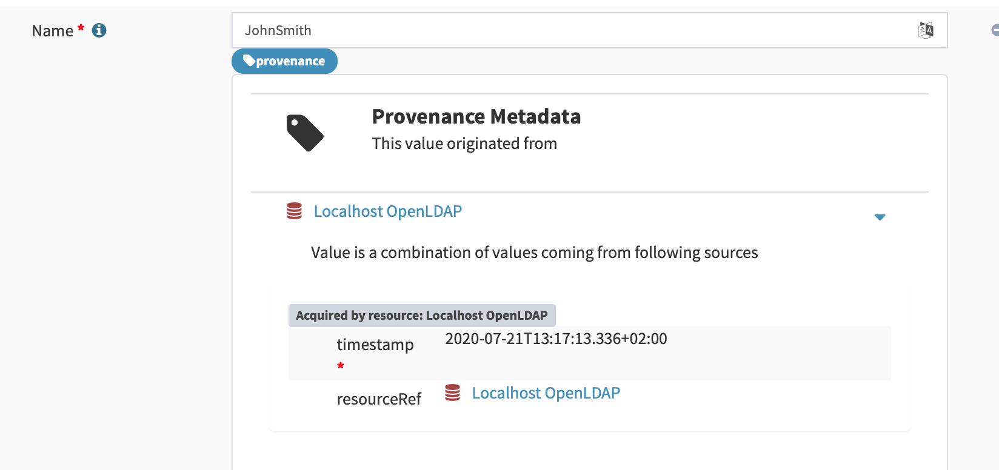
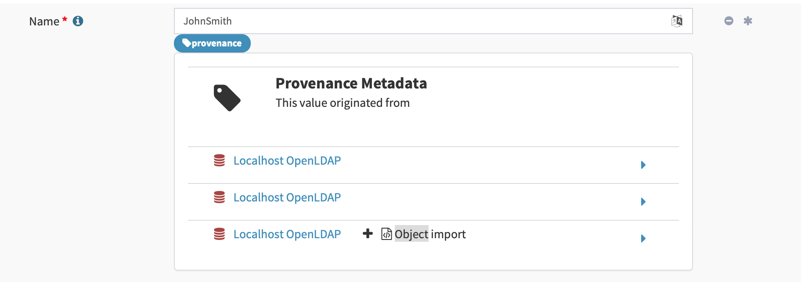
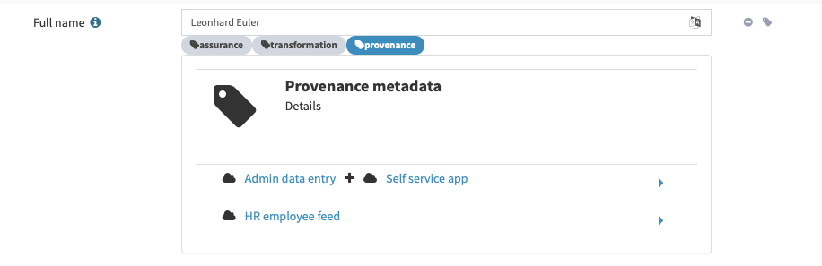

= Outcomes Of MidPrivacy: Provenance
:page-toc: top

WARNING: Work in progress

This is a summary of outcomes of first phase of link:../..[midPrivacy initiative]: link:..[Data Provenance Prototype].

== Axiom

Key component of the solution is a data modeling language capable of expressing not just data models, but also metadata models.
We have been researching for an existing data modeling language that would fit our needs.
Unfortunately, there seems to be no popular or ready-to-use data modeling language with appropriate metadata modeling support.
This result was not very surprising.
Our team is struggling to adapt XML Schema definition (XSD) language for our purposes well over a decade.
Most popular data modeling languages provide capabilities that are roughly equivalent to XSD.
We have realized that we need to make a major leap in technology to satisfy our needs.
Therefore we have designed our own data modeling language: Axiom.

Axiom is a general-purpose data modeling language.
On the surface, Axiom is similar to XSD, JSON Schema or any other modern data modeling language.
But Axiom goes much deeper.
Axiom introduces a concept of _inframodel_ that allows data models to manipulate fundamental concepts of the language and data structures.
The concept of inframodel was used to define _metadata models_.
This approach is used in Axiom to model all the metadata for midPoint.
As far as we know this is a very unique approach, an approach that we have not seen in any existing language.

We have invested significant amount of time and effort to design Axiom.
We have expected that designing a new data modeling language will not be easy.
Existing languages could not be used for inspiration when designing the crucial "meta" and "infra" concepts.
It took several design iterations and some amount of rework to get to Axiom 0.1 specification.

Overall, Axiom is a very promising development and we are very enthusiastic about the results.
We have invested significant amount of time to create Axiom design, language specifications and prototype implementation.
We are aware that this is not yet the final version of Axiom and that we will probably have to make adjustements along the way.
However, we are quite optimistic, as we have chosen one of the most challenging scenarios (metadata) to validate viability of Axiom.

Relevant links:

* link:../axiom/spec/[Axiom Language Specification]
* link:../axiom/concepts/[Axiom Concepts] explains concept of Axiom _inframodel_
* https://github.com/Evolveum/midpoint/tree/feature/axiom/infra/axiom[Implementation of Axiom processors] in midPoint source code

== Metadata Schemas

Axiom provides capability to create metadata models.
However, we still need the actual models.
Initial analysis conducted before the first milestone of the project already indicated that there is no metadata or identity provenance schema that we could readily reuse.
Therefore we had to create suitable metadata schemas.

Design of some metadata schemas was relatively straightforward, especially the schemas that were specific to midPoint.
However, design of generic identity provenance schema proved to be particularly challenging.
There does not seem to be any broad agreement what provenance really means and how provenance metadata should look like.
We have spent significant amount of time designing the schema that can both suit the way how midPoint is dealing with data and that can express generic concepts of data origin and provenance.
We had to create link:../provenance-origin-basis/[rough design of future data protection features] to make sure our provenance concepts are at least roughly correct.
We ended up with a provenance metadata design that we believe could work.

The schemas include provenance, storage, transformation, process and provisioning metadata.
Design of provenance metadata is based on our analysis and estimates of metadata requirements, as no other source was available for the design.
Previous midPoint versions did not utilize provenance metadata, therefore we could not build on our past experiences.
However, storage, process and provisioning metadata are based on metadata that were used in past midPoint versions.
Transformation metadata are based on diagnostic experiences from midPoint maintenance and deployments.

We have put metadata schemas to work by implementing prototype code for metadata mapping and transformation.
This prototyping lead to a realization, that we need to fundamentally change the way how we deal with metadata.
As each data value may originate from several sources, the link:../metadata-multiplicity-problem/[metadata need to be multi-valued] (see below).

== Prototype Code

All essential parts of the metadata functionality was prototyped in midPoint and it will be part of midPoint 4.2 release.
The solution consists of following parts:

* Axiom processing code.
Parser and processor for Axiom models were implemented in a separate component in midPoint source code.
The Axiom processors were integrated in _Prism_ component that drives the data processing in midPoint.
In midPoint 4.2, Axiom and XSD co-exist in _Prism_ layer side-by-side.
XSD is used to process bulk of midPoint data models.
Axiom is used to process metadata schemas.
+
Axiom processing code is located in `infra/axiom` components in https://github.com/Evolveum/midpoint/tree/master/infra/axiom[midPoint source code].

* Metadata schemas, including data provenance schema.
Metadata schemas were designed and specified by using Axiom language.
+
Metadata schemas are located in `infra/schema` component in https://github.com/Evolveum/midpoint/blob/master/infra/schema/src/main/resources/xml/ns/public/common/common-metadata-3.axiom[midPoint source code].

* MidPoint integration code, including functionality for metadata mapping and value consolidation.
MidPoint core processing code (a.k.a. _model subsystem_) was updated to accommodate metadata-processing code.
MidPoint is processing metadata along with the data, considering metadata being an integral part of the processing.
MidPoitn data _mappings_ are processing both data and metadata.
This approach required significant changes to midPoint data processing algorithms, especially for value _consolidation_ algorithms.
This was quite a demanding task.
Work on development, integration and testing of this code was a major contributor to discovery of metadata multiplicity and value equality issues.
Major issues were discovered in the validation part of the project and significant improvements were implemented.
There is also a new configuration schema and supporting code that allows configuration of metadata behavior for individual data items.
The configuration is still not entirely straightforward, but the mechanism is more than sufficient for the purposes of this prototype.
+
Integration code is located in several components, but most of the code is in `model/model-impl` component in https://github.com/Evolveum/midpoint/tree/master/model/model-impl[midPoint source code].

* User interface prototype for displaying the metadata.
Several development iterations of user interface code were created.
The metadata schemas evolved during the project, and our understanding of the metadata problem evolved with them.
Simple user interface that were focused on mere feasibility of metadata presentation was developed during first milestone.
This user interface was improved several times, resulting in more refined user interface that is present at the end of the project.
However, we are almost certain that even this form of user interface is not the final one and that more work is needed (see discussion of user experience below).
+
User interface code is located in `gui/admin-gui` component in https://github.com/Evolveum/midpoint/tree/master/gui/admin-gui[midPoint source code].

== Market Evaluation

TODO: There is demand, but also a lot of uncertainty and confusion.
E.g. very little interest in the survey.
We suspect that the cause may be very limited understanding of metadata concepts in the community.
We have created "link:../identity-metadata-in-a-nutshell/[Identity Metadata In A Nutshell]" document to boost understanding of metadata concepts.
However, the effects are likely to be long-term and it will require a lot of time to "sink in".

TODO: demos

== Discoveries and Challenges

Progress on the prototype was not entirely smooth.
Which was mostly expected due to the exploratory nature of this project.
However, the difficulties during project execution brought some interesting and surprising discoveries.

=== Data Equality Problem

Data equality is relatively simple matter.
Strings `John Doe` and `John Doe` are clearly the same.
There are some issues such as case sensitivity and canonization, but overall, it is not very complicated.

However, metadata significantly complicate the equality problem.
Should `John Doe` and `John Doe` be considered equal, even if such values have different metadata?
There seems to be no clear answer here.
Obviously, we want to consider the values to be equal even if the metadata differ, unless the metadata differ too much.
But how much is too much?
We have not found any theoretical data on this issue, therefore we have experimented with this problem from a practical side.
MidPoint has a built-in mechanism for value _consolidation_.
The consolidation, simply speaking, puts together values that are considered to be equal - or similar enough.
The result is an authoritative value that has to be provisioned or deprovisioned (or rather a _delta_).
The consolidation algorithm was originally used to merge values produced by midPoint _mappings_.
In midPoint 4.2 we have added metadata to the mix and made the consolidation process metadata-aware.
This moved proved to be much more complex than expected, but it resulted in a lot of "experimental data" and experiences.

It looks like that _provenance_ metadata play a crucial role in value equality evaluation.
We made our algorithms work by relying on the provenance metadata when comparing values.
If provenance metadata match, then we assume that the value was produced by the same source and it is considered to be equal.
If provenance metadata do not match, then we consider the values to be different.
Now, there is still an issue what provenance metadata _match_ means.
We have not required complete equality of the provenance metadata and we have ignored differences in some fields, such as timestamps.
This approach seems to work as a general rule.

However, this leads to an interesting situation: data values are equal, but metadata do not match.
We cannot simply eliminate one of the values, as they technically are not the same.
Yet we cannot keep the both as the data part is the same.
This problem lead to the discovery of metadata multiplicity and to the design of the concept of _yield_.

=== Metadata Multiplicity

One of the least expected discoveries was metadata multiplicity.
It looks like metadata are inherently multi-valued, as a single data value may come from several places.

See link:../metadata-multiplicity-problem/[Metadata Multiplicity Problem] for detailed explanation of the issue.

We have not suspected this issues at the beginning of the project.
There was nothing in the initial research that would suggest this kind of issues.
We have observed first signs of this issue approximately in the middle of the project, but at that time we have thought that the issues is limited to _provenance_ metadata.
It was only quite late in the project that we have realized that this multiplicity is an inherent property of all metadata.
We were already in the validation phase of the project.
However, we have decided that this is a significant discovery and that we have to adapt our data structures and algorithms, otherwise the validation phase would be much less meaningful.
We have invested our own funds to support this effort.
Improvements to prototype code worked well.
There are still some link:../future-work/[remaining issues] and inspiration for future work, but the prototype functions acceptably well.

Yet, the metadata multiplicity, the concept of _yields_ and its relation to data protection is perhaps the most surprising discoveries in this project.

=== Data Protection

It is perhaps an intuitive understanding that metadata, and especially _provenance_ metadata, are related to data protection.
However, the depth of this relationship that we have discovered during this project came as surprise nevertheless.

MidPrivacy initiative is a long-term initiative to implement data protection and privacy features in midPoint.
Also, in midPoint, we have a tradition to design data structures and mechanism in such a way that we are looking ahead to quite a long future.
Therefore we took the opportunity to validate our provenance metadata schema using a "thought experiment".
We tried to create a rough design for link:../provenance-origin-basis/[interaction of provenance metadata and data protection features].

_Basis for data processing_ is one of the fundamental concepts of data protection.
We have experimented with the concept of _basis_ in initial phase of midPrivacy initiative (phase 0).
The results were promising.
Unfortunately, we were not able to secure funding for further experiments.
Despite the limited resources, we were able to gain some insights how the concept of _basis_ can work in identity management and data protection systems.
Therefore, we have tried to explore how provenance metadata relate to the concept of _basis for data processing_.

Even though it may seem obvious in the hindsight, we have found that there is a very deep relation between data _provenance_ and the _basis for data processing_.
In fact, it almost looks like the _basis_ is part of data provenance information.

Most data protection principles mandate, that the data can be processed only if there is a valid _basis_ for the processing.
The data are acquired from the source for a particular reason, and that reason forms _basis_ form the processing.
The basis seems to be integral part of the provenance information, as the data cannot be processed for any other reasons and for any other purpose.
If there is a desire to process data for a different purpose, the data need to be _re-acquired_ -
even data values are the same and the data originate from the same source as the data that we already have.
For example, the re-acquisition may take form of securing additional consent from the user.
The re-acquisition "unlocks" the data to be used for additional purpose.

The situation may be even more complex.
When we have a _basis_ to process person's name, we can legally process the value `Jane Smith`.
And when Jane gets married, we can probably go on and update that value to `Jane Brown` and still do that legally.
The _basis_ applies to data _item_ (person's name), not to a particular _value_ of the item (`Jane Smith`).
This is relatively simple case.
We have focused on this case during the initial phase of midPrivacy initiative.
We have used concept of midPoint _assignment_ to represent the _basis for data processing_.

However, there is a different case.
There are multi-valued items that combine information from several sources.
_Affiliation_ is a good example of this case.
Each value if the _affiliation_ data item may originate from a different source.
Different _bases_ for processing may apply to every individual value.
Therefore we have to record the _basis_ in the value metadata.
An _assignment_ may still be needed to represent the _bases_ (e.g. scope of the consent, duration, etc.).
Assignment is likely to be needed to make sure that the value is properly maintained, e.g. in case that the organization is renamed.
However, the _affiliation_ item is likely to combine values referenced by several _assignments_.
It would not be feasible to distinguish the values without referencing the _basis_ in the value metadata (directly or indirectly).

Once again, this brings us back to the concept of _yield_.
There may be several _bases for data processing_ that apply to a single value.
We cannot "flatten" then, we have to manage each _basis_ individually as they may have independent lifecycle.
The obvious solution is to record the _basis_ in _yield_, and maintain separate _yield_ for each _basis_.
An elegant solution would be to reference the _basis_ in _provenance_ metadata, which would make management of overlapping _bases_ quite straightforward.

See link:../provenance-origin-basis/[Provenance, Origin and Basis] for a more detailed explanation of the concepts.

=== Relation To Data Portability

Data provenance has an obvious and significant overlap to data portability.
However, we have not dealt with data portability specifically.
Our exploration of data provenance was limited to the "scenery" as it was seen by midPoint.
We have considered the systems that are directly connected to midPoint, but we haven't explored any further.

We have prepared a proposal to NGI Data Portability and Services Incubator (DAPSI), with an intent to follow-up on our work with metadata.
Unfortunately, our proposal was not selected.
We hope that we will have better success in securing funding in the future, as our work suggests that there may be interesting opportunities for exploration in data portability area.

=== Metadata User Experience

Presentation of metadata to users is a major challenge.
We have expected that, therefore we have started to work on user interface changes ahead of schedule.
User interface went through several design and implementation iterations.

Early prototype was implemented ahead of schedule in May 2020.
The purpose of this prototype was to lay basic foundation in existing GUI code and evaluate feasibility of GUI implementation.
Perfect functionality was not expected and user experience was not the primary goal.

.Metadata GUI, Early prototype, May 2020

The work on GUI resumed in August 2020.
First usable metadata GUI was implemented.

.Metadata GUI, First update, August 2020

This implementation produced user experience feedback.
Therefore user experience improvements were implemented.

.Metadata GUI, Second update after UX feedback, August 2020

Provenance metadata schemas have evolved in parallel to the GUI implementation.
At this stage the GUI reflected the concept of _yield_ in provenance metadata.
This was still before we have discovered the link:../metadata-multiplicity-problem/[multiplicity problem].

.Metadata GUI, Third update, implemented concept of yield, before metadata multiplicity, August 2020

Implementing metadata multiplicity caused structural changes in GUI code.
Despite that, we have tried to maintain existing look and feel that seemed to work acceptably well.

.Metadata GUI, Fourth update, after metadata multiplicity, August 2020

TODO: Final look

Overall, metadata presentation proved to be very challenging.
We did not need any special user experience testing, as user experience problems were immediately obvious during internal testing of GUI prototypes.
One of the challenges was presentation of a complex metadata structures in a limited space on screen.
We have used expandable GUI elements to resolve this challenge.
However, the primary challenge was to present metadata structures in a form that is understandable to users.
Due to the limited project scope we have to focus on _provenance_ metadata only, but even that proved challenging.
The link:../metadata-multiplicity-problem/[multiplicity problem] affected user interface as well.
We have chosen to present _yield_ and _acquisition_ data structures in a simplified form and enrich the presentaion with explanation texts.
This improved understandability of the interface, at least for users that were familiar with identity management concepts.
However, we are afraid this form of metadata presentation will not be suitable to ordinary users and that the user interface will need more work in the future.

=== Other Challenges And Inspiration For Future Work

The project was full of challenges, both simple and complex.
The challenges were expected due to the prototyping nature of the project.
Significant challenges were already mentioned.
Record of other challenges can be found in a separate link:../challenges/[description of project challenges].

The challenges and discoveries provided unique inspiration for future work.
The ideas for the follow-up activities are documented in "link:../future-work/[Future Work]" document.

== Side Effects

The project produced outputs that were not entirely intended at the beginning of the project, yet they are very helpful.
Many link:../axiom/concepts/[thoughts and design details] of Axiom language concepts fall into this category.
Perhaps the most significant side effect is "link:../identity-metadata-in-a-nutshell/[Identity Metadata In A Nutshell]" document.
This document provides an easy-to-follow introduction to metadata concepts and their use in midPoint.

== See Also

* link:../identity-metadata-in-a-nutshell/[Metadata In A Nutshell]
* link:../future-work/[Future Work]
* link:../metadata-multiplicity-problem/[Metadata Multiplicity Problem]
* link:../provenance-origin-basis/[Provenance, Origin and Basis]
