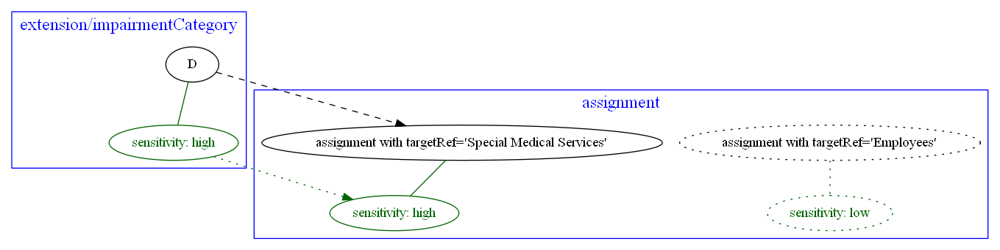
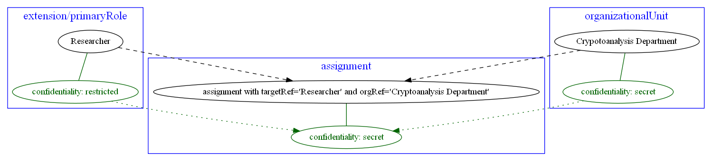
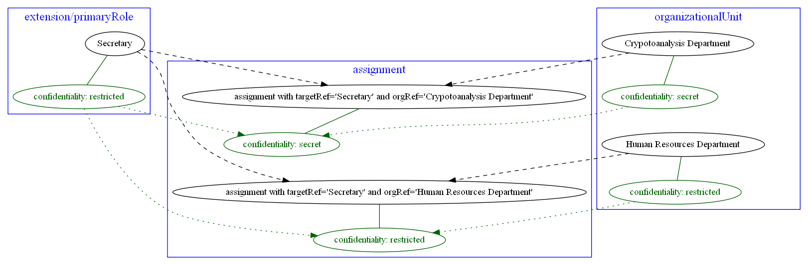
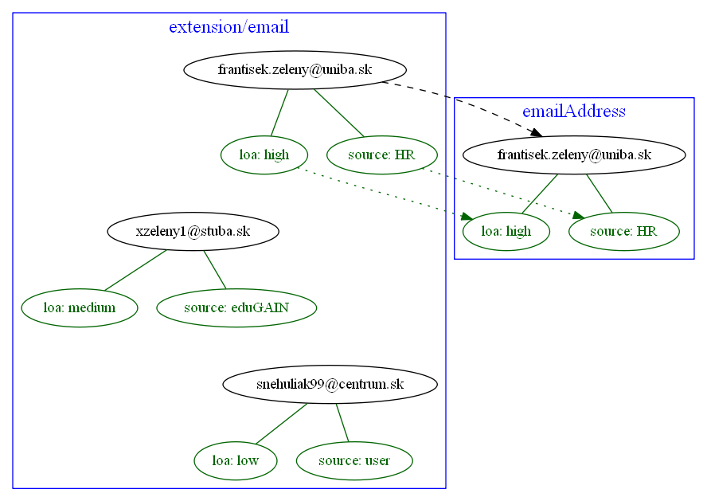
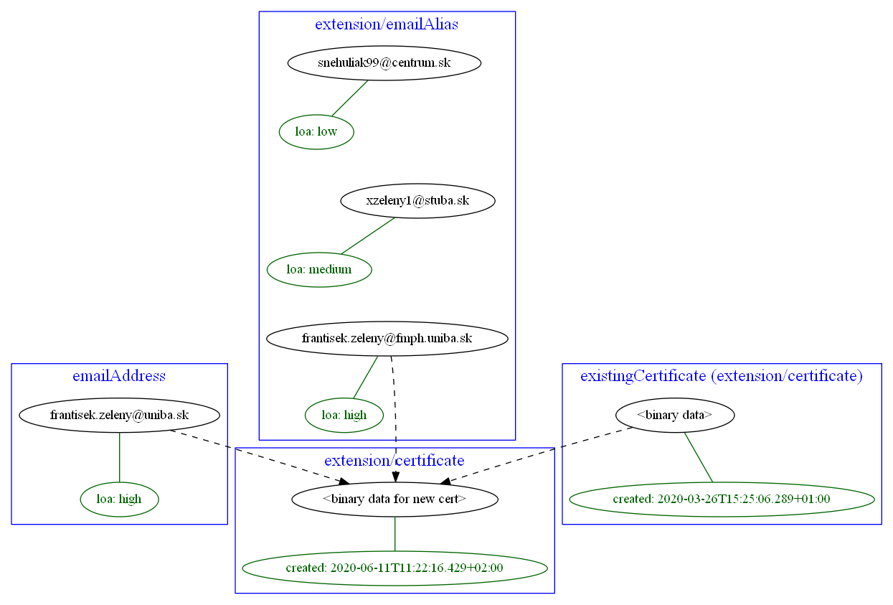
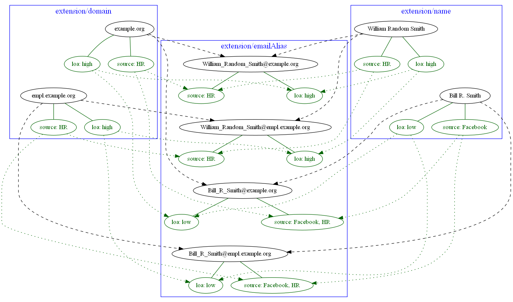
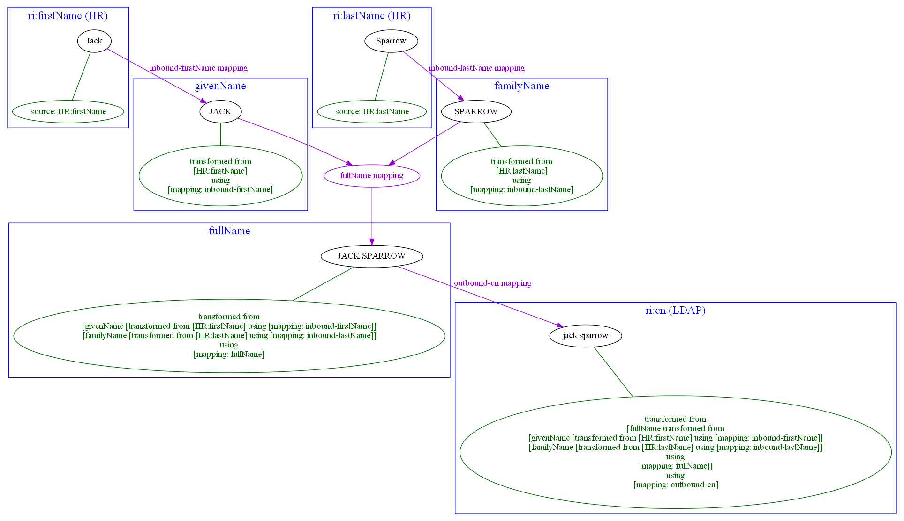
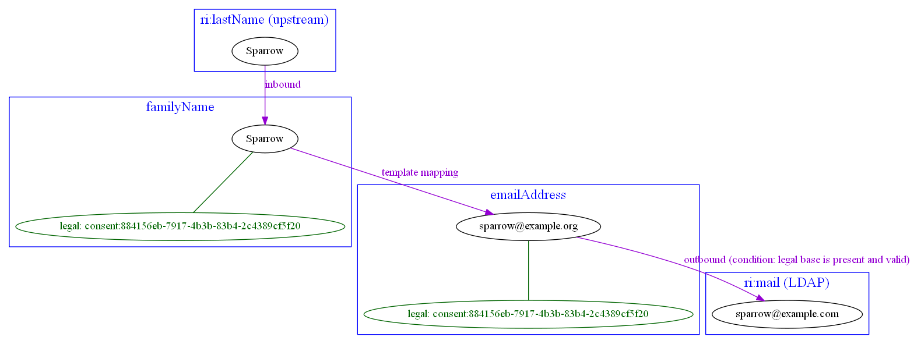

= Examples of metadata processing

Mappings used below are of "thinking aloud" kind. No schema does exist yet.

== Example 1: Propagation of data sensitivity information

Let's assume that `extension/impairmentCategory` is highly sensitive information. Then assignment of the org
`Special Medical Services` (that is created based on the `impairmentCategory` having value greater than `B`)
should be marked as highly sensitive as well.

The picture below shows that other assignments (like of `Employees` org) have low sensitivity.

// [source,xml]
----
<mapping>
    <source>
        <path>extension/impairmentCategory</path>
    </source>
    <expression>
        <assignmentTargetSearch>
            <type>OrgType</type>
            <oid>29963fc9-f494-4911-af3c-9e73fd64617f</oid> <!-- Special Medical Services -->
        </assignmentTargetSearch>
    </expression>
    <condition>
        
    </condition>
    <target>
        <path>assignment</path>
        <set> ... </set>
    </target>
</mapping>
----

We have no special needs for sensitivity metadata treatment, simply copying them from source to output:

// [source,xml]
----
<metadataMapping>
    <source>
        <path>sensitivity</path>
    </source>
    <target>
        <path>sensitivity</path>
    </target>
</metadataMapping>
----

(This could be the default mapping for any metadata. So we just should be able to declare that we want it to be
applied to sensitivity metadata here. Or maybe to all metadata.)

== Example 2: Another example of propagation of confidentiality information

HR system supplies information on user primary role (engineer, researcher, support person, manager, and so on)
and user organizational unit (or units) where he or she fulfills this role. Each role and organizational unit
value has a confidentiality information attached, e.g. `unclassified`, `restricted`, `secret`, `topSecret`.
For each combination of primary role and organizational unit midPoint creates an assignment to appropriate
role with `orgRef` pointing to related org object. We want to compute the confidentiality information for
such assignment as the highest of the confidentiality levels of source values.

Jim's primary role value of `Researcher` has confidentiality of `restricted` but his `organizationalUnit` value of
`Cryptoanalysis Department` is marked as `secret`. So the resulting assignment has confidentiality of `secret`.

Frank's primary role value of `Secretary` is also `restricted` but he serves two departments: Cryptoanalysis (`secret`)
and Human Resources (`restricted`). So his first assignment is `secret` but the second one is `restricted` only.

The data mapping looks fairly complex, although in reality it is not:

----
<mapping>
    <source>
        <path>organization</path>
    </source>
    <source>
        <path>organizationalUnit</path>
    </source>
    <expression>
        <assignmentTargetSearch>
            <targetType>RoleType</targetType>
            <filter>
                <equal>
                    <path>name</path>
                    <expression>
                        <path>$organization</path>
                    </expression>
                </equal>
            </filter>
            <populate>
                <populateItem>
                    <expression>
                        <referenceSearch>
                            <targetType>OrgType</targetType>
                            <filter>
                                <equal>
                                    <path>name</path>
                                    <expression>
                                        <path>$organizationalUnit</path>
                                    </expression>
                                </equal>
                            </filter>
                        </referenceSearch>
                    </expression>
                    <target>
                        <path>orgRef</path>
                    </target>
                </populateItem>
            </populate>
        </assignmentTargetSearch>
    </expression>
    <target>
        <path>assignment</path>
    </target>
</mapping>
----

[NOTE]
====
Multiple levels of expressions are evaluated here:

1. `assignmentTargetSearch` creating the output value/values, i.e. one or more assignments,
2. `path` when constructing the filter to be used for searching for the role by its name (`$organization`),
3. `referenceSearch` when looking for `orgRef` for the assignment,
4. `path` when constructing the filter to be used for looking for `orgRef` for the assignment (`$organizationalUnit`).

We want to set confidentiality on the assignment value itself, so the metadata mapping can be declared at the level
of the data mapping.

The situation would be different if we would like to set confidentiality for the `assignment/orgRef`
value only. This case will not be supported in midPoint 4.2 by general configuration means. Custom scripts would need
to be used.
====

Metadata mapping for the confidentiality looks like this. Note it is evaluated in the absolute mode, because it needs
to find the highest confidentiality value among all the source values.

----
<metadataMapping>
    <source>
        <path>confidentiality</path>
    </source>
    <expression>
        
    </expression>
    <target>
        <path>confidentiality</path>
    </target>
</metadataMapping>
----

(Specification of evaluation mode for metadata is an open question. We assume that the absolute mode
is the reasonable default here.)

== Example 3: Using level of assurance to select one of values

A member of academic community has a set of contact email addresses, each coming from different source
(HR, eduGAIN, user entry) and therefore having different level of assurance (high, medium, low).
We want to select the primary email address having the highest level of assurance. We also want to propagate
LoA and source information from the original value in `extension/email` to the value which is put into `emailAddress`
property.

// [source,xml]
----
<mapping>
    <source>
        <path>extension/email</path>
    </source>
    <expression>
        
    </expression>
    <target>
        <path>emailAddress</path>
    </target>
</mapping>
----

Again, no special needs in the metadata area:

----
<metadataMapping>
    <source>
        <path>loa</path>
    </source>
    <target>
        <path>loa</path>
    </target>
</metadataMapping>
----
----
<metadataMapping>
    <source>
        <path>source</path>
    </source>
    <target>
        <path>source</path>
    </target>
</metadataMapping>
----
(A more compact notation would be great.)

== Example 4: Using level of assurance to filter values

This is a variation on the example above. Let us generate certificates for users. Each user has a primary
email address but also a set of secondary addresses (aliases). We want the certificate to contain
the primary address along with those aliases that have LoA of `high`. (Also, the condition is that
emailAddress is provided and is of LoA `high` as well.)

// [source,xml]
----
<mapping>
    <source>
        <path>emailAddress</path>
    </source>
    <source>
        <path>extension/emailAlias</path>
    </source>
    <source>
        <name>existingCertificate</name>
        <path>extension/certificate</path>
    </source>
    <expression>
        
    </expression>
    <condition>
        
    </condition>
    <target>
        <path>extension/certificate</path>
    </target>
</mapping>
----

We don't need LoA information for the certificate. Let's assume we want to propagate other metadata
(except for `created` that we want to generate from the current time).

// [source,xml]
----
<metadataMapping>
    <itemSelector>
        <exclude>loa</exclude>
        <exclude>created</exclude>
    </itemSelector>
    <!-- default processing i.e. copying the values -->
</metadataMapping>
----

This shows how we can invoke custom code. Note that creation timestamp will be probably treated by the system
(at selected places) by default.
----
<metadataMapping>
    <expression>
        
    </expression>
    <target>
        <path>created</path>
    </target>
</metadataMapping>
----

== Example 5: Creating email aliases with metadata depending on metadata of their components

User's email aliases (`extension/emailAlias`) are derived from user name(s) (`extension/name`) and mail domain(s)
(`extension/domain`). Each name and domain has a source (e.g. HR, Facebook) and level of assurance. Created email
aliases carry information about the source(s) of its constituent values, and its LoA is determined as the lower one
of LoAs from the constituents.

// [source,xml]
----
<mapping>
    <source>
        <path>extension/name</path>
    </source>
    <source>
        <path>extension/domain</path>
    </source>
    <expression>
        
    </expression>
    <target>
        <path>extension/emailAlias</path>
    </target>
</mapping>
----

We need to combine `source` metadata values. But this is the default behavior, because (we assume) `source`
is multivalued metadata property.

// [source,xml]
----
<metadataMapping>
    <source>
        <path>source</path>
    </source>
    <target>
        <path>source</path>
    </target>
</metadataMapping>
----

== Example 6: Detailed tracing of origin of values

This is a slightly more complex scenario consisting of a couple of mappings (inbound, template, outbound):

1. HR provides `givenName` and `familyName` of a user.
They are processed by inbound mappings.

2. The object template creates `fullName` from these components.

3. An outbound mapping for LDAP resource puts the result into `cn` account attribute.

----
<attribute>
    <ref>ri:firstName</ref>
    <inbound>
        <name>inbound-firstName mapping</name>
        <expression>
            
        </expression>
        <target>
            <path>givenName</path>
        </target>
    </inbound>
</attribute>
----
----
<attribute>
    <ref>ri:lastName</ref>
    <inbound>
        <name>inbound-lastName mapping</name>
        <expression>
            
        </expression>
        <target>
            <path>familyName</path>
        </target>
    </inbound>
</attribute>
----

----
<mapping>
    <name>fullName mapping</name>
    <source>
        <path>givenName</path>
    </source>
    <source>
        <path>familyName</path>
    </source>
    <expression>
        
    </expression>
    <target>
        <path>fullName</path>
    </target>
</mapping>
----

----
<attribute>
    <ref>ri:cn</ref>
    <outbound>
        <name>outbound-cn mapping</name>
        <source>
            <path>fullName</path>
        </source>
        <expression>
            
        </expression>
    </outbound>
</attribute>
----

We need to manage transformation metadata container. The behavior is built into midPoint, so we
only have to specify it needs to be applied.

// [source,xml]
----
<metadataMapping>
    <itemSelector>
        <include>transformation</include>
    </itemSelector>
</metadataMapping>
----

If we want to define it explicitly, it would be something like this:
----
<metadataMapping>
    <source>
        <path>source</path>
    </source>
    <source>
        <path>transformation</path>
    </source>
        <expression>
            
        </expression>
    <target>
        <path>transformation</path>
    </target>
</metadataMapping>
----

We assume that each value has either `source` metadata item or `transformation` metadata item (never both).
The resulting `transformation` value would refer to union of `source` and `transformation` values of the
source data values. This is ensured by `metadata.createTransformedFrom` method. The mapping reference would
be obtained from the evaluation context.

An alternative would be to refer directly to source prism values. (This approach is usable if the transformational
metadata is kept only in memory i.e. during computation.)

== Example 7: Knowing legal base for data processing

Our users are employees (archetype `Employee`) and customers (`Customer`). We are entitled to work with personal data
of employees by law. But for customers we have to obtain written consent to do so. Consents are represented as
assignments to org objects with archetype `Consent`. One of them is related to processing personal information.

We obtain `givenName` and `familyName` from upstream resource.

1. Inbound mappings have to establish legal base for working with them.
2. Template mappings (e.g. generation of `emailAddress` from `familyName`) have to preserve this legal base information.
3. Outbound mappings (e.g. provisioning of email address to LDAP resource) have to check the legal base of data processing.

Inbound mapping for `familyName`:
----
<attribute>
    <ref>ri:lastName</ref>
    <inbound>
        <target>
            <path>familyName</path>
        </target>
    </inbound>
</attribute>
----

Corresponding metadata mapping:
----
<metadataMapping>
    <!-- no source -->
    <expression>
        
    </expression>
    <target>
        <path>legal</path>
    </target>
</metadataMapping>
----

Object template mapping:
----
<item>
    <ref>emailAddress</ref>
    <mapping>
        <strength>strong</strength>
        <source>
            <path>familyName</path>
        </source>
        <expression>
            
        </expression>
    </mapping>
</item>
----

Related metadata mapping (can be replaced by default):
----
<metadataMapping>
    <source>
        <path>legal</path>
    </source>
    <target>
        <path>legal</path>
    </target>
</metadataMapping>
----

Outbound mapping:

----
<attribute>
    <ref>ri:mail</ref>
    <outbound>
        <source>
            <path>emailAddress</path>
        </source>
        <condition>
            
        </condition>
    </outbound>
</attribute>
----

The `hasValidLegalBase` in the custom library method that something like this:

----
private static String PERSONAL_DATA_PROCESSING_CONSENT_OID = "884156eb-7917-4b3b-83b4-2c4389cf5f20";
private static String PERSONAL_DATA_PROCESSING_CONSENT_VALUE = "consent:" + PERSONAL_DATA_PROCESSING_CONSENT_OID;
private static String EMPLOYEE_LEGAL_BASE_VALUE = "employee";

public boolean hasValidLegalBase(PrismValue value) {
    if (value != null) {
        legal = value.valueMetadata().getPropertyRealValue(new QName("legal"), String.class);
        return EMPLOYEE_LEGAL_BASE_VALUE.equals(legal)
            || PERSONAL_DATA_PROCESSING_CONSENT_VALUE.equals(legal);
    } else {
        return false;
    }
}
----