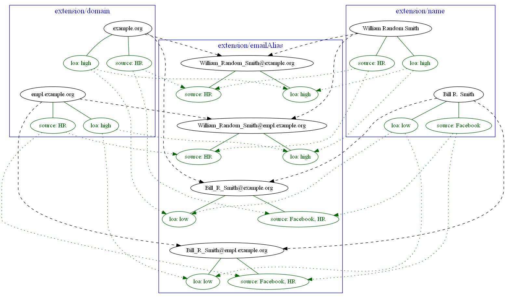

= Processing metadata in expressions and mappings

See

* link:https://wiki.evolveum.com/display/midPoint/Expression[Expression] for background information on expression evaluation,
* link:../../plain/expressions/[Processing expressions] for information on processing "simple" data expressions,
* link:../../plain/mappings/[Processing mappings] for information on processing "simple" data mappings.

To recall, an _expression evaluator_ converts _sources_ and _input variables_ to _output values_ (under given evaluation parameters).

Each value being processed can have its own _value metadata_ and, therefore, we have to process this metadata
along with the data.

Metadata can be present on values from both sources and variables but for the time being we will explicitly
deal with metadata from sources only.

== Some examples

Mappings used below are of "thinking aloud" kind. No schema does exist yet.

=== Example 1: Propagation of data sensitivity information

Let's assume that `extension/impairmentCategory` is highly sensitive information. Then assignment of the org
`Special Medical Services` (that is created based on the `impairmentCategory` having value greater than `B`)
should be marked as highly sensitive as well.

The picture below shows that other assignments (like of `Employees` org) have low sensitivity.

image::example-assignment-sensitive.png["Assignment creation based on sensitive data"]

// [source,xml]
----
<mapping>
    <source>
        <path>extension/impairmentCategory</path>
    </source>
    <expression>
        <assignmentTargetSearch>
            <type>OrgType</type>
            <oid>29963fc9-f494-4911-af3c-9e73fd64617f</oid> <!-- Special Medical Services -->
        </assignmentTargetSearch>
    </expression>
    <condition>
        
    </condition>
    <target>
        <path>assignment</path>
        <set> ... </set>
    </target>
</mapping>
----

We have no special needs for metadata treatment, simply copying them from source to output:

// [source,xml]
----
<metadataMapping>
    <itemSelector>
        <all/>
    </itemSelector>
    <!-- default source (selected), target (selected), expression (asIs) -->
</metadataMapping>
----

=== Example 2: Using level of assurance to select one of values

A member of academic community has a set of contact email addresses, each coming from different source
(HR, eduGAIN, user entry) and therefore having different level of assurance (high, medium, low).
We want to select the primary email address having the highest level of assurance. We also want to propagate
LoA and source information from the original value in `extension/email` to the value which is put into `emailAddress`
property.

// [source,xml]
----
<mapping>
    <source>
        <path>extension/email</path>
    </source>
    <expression>
        
    </expression>
    <target>
        <path>emailAddress</path>
    </target>
</mapping>
----

Again, no special needs in the metadata area:

// [source,xml]
----
<metadataMapping>
    <itemSelector>
        <all/>
    </itemSelector>
    <!-- default source (selected), target (selected), expression (asIs) -->
</metadataMapping>
----

=== Example 3: Using level of assurance to filter values

This is a variation on the example above. Let us generate certificates for users. Each user has a primary
email address but also a set of secondary addresses (aliases). We want the certificate to contain
the primary address along with those aliases that have LoA of `high`. (Also, the condition is that
emailAddress is provided and is of LoA `high` as well.)

image::example-filtering-by-loa.png["Using level of assurance to filter values"]

// [source,xml]
----
<mapping>
    <source>
        <path>emailAddress</path>
    </source>
    <source>
        <path>extension/emailAlias</path>
    </source>
    <source>
        <name>existingCertificate</name>
        <path>extension/certificate</path>
    </source>
    <expression>
        
    </expression>
    <condition>
        
    </condition>
    <target>
        <path>extension/certificate</path>
    </target>
</mapping>
----

We don't need LoA information for the certificate. Let's assume we want to propagate other metadata
(except for `created` that we want to generate from the current time).

// [source,xml]
----
<metadataMapping>
    <itemSelector>
        <exclude>loa</exclude>
        <exclude>created</exclude>
    </itemSelector>
    <!-- default processing i.e. copying the values -->
</metadataMapping>
----

This shows how we can invoke custom code. Note that creation timestamp will be probably treated by the system
(at selected places) by default.
----
<metadataMapping>
    <expression>
        
    </expression>
    <target>
        <path>created</path>
    </target>
</metadataMapping>
----

=== Example 4: Creating email aliases with metadata depending on metadata of their components

User's email aliases (`extension/emailAlias`) are derived from user name(s) (`extension/name`) and mail domain(s)
(`extension/domain`). Each name and domain has a source (e.g. HR, Facebook) and level of assurance. Created email
aliases carry information about the source(s) of its constituent values, and its LoA is determined as the lower one
of LoAs from the constituents.

// [source,xml]
----
<mapping>
    <source>
        <path>extension/name</path>
    </source>
    <source>
        <path>extension/domain</path>
    </source>
    <expression>
        
    </expression>
    <target>
        <path>extension/emailAlias</path>
    </target>
</mapping>
----

We need to combine `source` metadata values. But this is the default behavior, because (we assume) `source`
is multivalued metadata property.

// [source,xml]
----
<metadataMapping>
    <itemSelector>
        <all/>
    </itemSelector>
    <!-- default source (selected), target (selected), expression (asIs) -->
</metadataMapping>
----

== Where to put metadata support?

*Should the metadata support start at the level of expression, or it is sufficient to support it for mappings?*

The answer depends on whether there are mapping-less expressions that produce values that ultimately end
somewhere in midPoint objects. It seems like there are some:

=== Category 1: Usually covered by "outer" mapping

* `PopulatorUtil.evaluatePopulateExpression` It is called when populating assignment in auto-assignment scenarios,
and also when creating assignments and/or objects in target search expression evaluators. However, the execution of
these expressions is usually done in the context of a mapping.
* `ExpressionUtil.evaluateFilterExpressionsInternal` We use expressions to evaluate filters that might be used
e.g. for target search in other expressions. Values in the filters are not important per se. What is important are
objects that result from these searches. (Like roles when we are searching them by name.) Fortunately, the most probable
context for these filter expression evaluation (that leads to inclusion of some values in objects) is target search
expression i.e. something done in the context of a mapping.

=== Category 2: Generating item values for objects but not executing in a mapping (probably need to process metadata)

* `LensUtil.formatIterationToken` Iteration token itself can contain sensitive information.
* `ObjectMerger` It computes merged values via expressions.

=== Category 3: Generating item values for objects, but probably not requiring metadata processing, at least not now

* `VariablesUtil` - evaluation of variables for bulk actions (can somehow sneak into objects)
* `ScriptingTaskCreator` - customizes scripting task (the task will contain generated values)
* `SynchronizationExpressionEvaluator.createTag` - creates tag for a projection (multi-intents)
* `PerformerCommentsFormatterImpl` - provides approver comments in string form - this is really ugly case but still valid.
* `ClockworkAuditHelper.auditEvent` - values for custom audit columns (not important for now, maybe in the future)
* Individual scripting actions that modify objects using custom values (`execute-script`, `modify`, ...)

So, metadata processing will be declared and executed at the level of mapping evaluation.
But there will be some support from expression evaluators, mainly because of the combinatorial (relative) evaluation
of scripts and other value-transforming expression evaluators.
