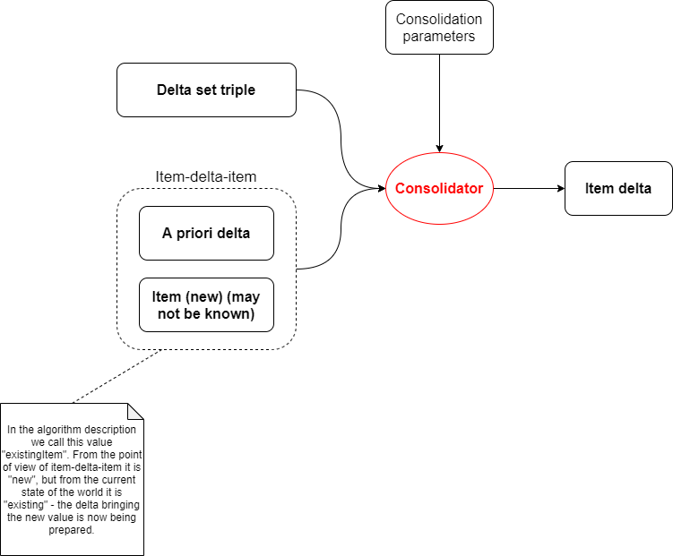

= Processing mapping sets

See link:https://wiki.evolveum.com/display/midPoint/Mapping[Mapping] for background information.

Evaluation of _mapping sets_ converts _source object_ into a set of _item deltas_ to be applied on this (or other) object.
It consists of evaluation of the mappings (probably chained because of mutual dependencies) and of _consolidation_
of output triples into item deltas.

Compared with link:../mappings/[single mapping evaluation] it provides the conversion of output triples into item deltas,
applying settings for individual mappings, namely the strength (normal, strong, weak).

image::mapping set evaluation.png["Mapping set evaluation"]

== Mapping set evaluation

This is basically repeated evaluation of individual mapping, with the only exception: _mapping chaining_.

=== Mapping chaining

Individual mappings in mapping set can have mutual dependencies: target item of mapping A can be a source of mapping B.
Such cases have two consequences:

1. A must be evaluated before B.
2. Before starting evaluation of B, we must create an intermediate version of sources for mapping B. Sources derived
from original source object are no longer adequate. When determining updated sources, interim consolidation has to be
run.

(This interim consolidation is currently implemented not very precisely. We need to analyze it in more depth eventually.)

=== Consolidation

_Consolidation_ is a process of converting _output triple map_ to _item deltas_, considering _source object_ along with
its pre-existing _delta_. Because this process is executed independently for each item in question, we can describe _item
consolidation_ that converts single _output triple_ to an _item delta_, considering source _item-delta-item_. In some cases
the actual value of item is not known: this can occur if we are consolidating values for resource object attribute, and
we do not have full shadow for the object.

==== Item consolidation

Item consolidation goes strictly "by value". In each step we take one of values present in the delta set (from plus,
minus, and zero sets) - let's call it v~0~ - and identify its presence in the delta set triples as well as in existing item.
By "presence" we mean set of values equivalent with v~0~ under specified value matcher or comparator (or `IGNORE_METADATA`
comparison if none of these two is specified). footnote:[The implementation seems to be not quite correct when it comes
to comparing values.]

image::item consolidation detailed.png["Item consolidation detailed"]

The algorithm then goes like this (slightly simplified - assuming mapping selector is ALL and exclusiveStrong is false):

Let:

[cols="4,8a"]
[%header]
|===
| Symbol(s) | Meaning
| P, M, Z
| Sets of values in plus, minus, and zero sets, respectively.
So P = { v~1~^plus^, v~2~^plus^, ..., v~k~^plus^ }, M = { v~1~^minus^, v~2~^minus^, ..., v~l~^minus^ },
Z = { v~1~^zero^, v~2~^zero^, ..., v~m~^zero^ }

| P~0~ &SubsetEqual; P, M~0~ &SubsetEqual; M, Z~0~ &SubsetEqual; Z
| Sets of values-with-origins having values equivalent with v~0~ in P, M, and Z, respectively.
Because of value equivalence we can view these as simply _origins_ or _mappings_.
In the figure above they are depicted in pink. (In real algorithm implementation they are filtered
using strength selector and construction validity check.)

| addUnchanged
| Consolidation parameter that tells that all unchanged (zero-set) values should be considered for "add" part of resulting
item delta. It is typically set to true when the whole target object is being added. (And also for attribute reconciliation
when apriori delta is REPLACE.)

| addUnchangedValuesExceptForNormalMappings
| Consolidation parameter that tells that some of the unchanged values should be considered for "add" part of resulting
item delta. In particular, all values backed by strong, weak, and sourceless normal mappings. It is set for
object template evaluation for focus or personas and assigned focus mappings evaluation. It may be renamed/changed
in the future.

| existingItemKnown
| Consolidation parameter that tells that we know the existing item. It is false for resource object mappings
that operate on non-full shadows.

| v~ex~
| Presence of v~0~ in existing item. (May be null if v~0~ is not present there or if existing item is not known.)
|===

===== Deletion of strongly-mandated values

Before the value is consolidated the following check is executed:

If v~0~ is deleted by apriori delta and, at the same time, it is present in P or Z in connection with
strong mapping (i.e. there is a strong mapping for v~0~ that thinks the value should be added or unchanged) then we
throw an exception. This is to avoid conflict between user-provided delta and a strong mapping.
footnote:unclear[It is not quite clear if this behavior is 100% correct, because in this way we prioritize
not only user-specified values but all values that were computed by (any) previously evaluated mappings. However,
we are not going to remove this behavior now.]

See `IvwoConsolidator.checkDeletionOfStrongValue()` method.

===== Value consolidation

First, we determine A~0~ - origins that suggest we need to put v~0~ to the delta "add" set.
These are:

[cols="5,8"]
[%header]
|===
| Condition | A~0~ (add-suggesting origins for v~0~)
| addUnchanged |  P~0~ &#8746; Z~0~
| &#172; addUnchanged &#8743; addUnchangedValuesExceptForNormalMappings
| P~0~ &#8746; { z &isinv; Z~0~ \| z.isStrong &or; z.isNormal &and; z.isSourceless &or; z.isWeak }

| otherwise
| P~0~
|===

There are the following cases:

[cols="5,8a,8a"]
[%header]
|===
| Condition | Description | Action
| A~0~ &#8800; &#8709;
| At least one mapping indicates that v~0~ is being added.
| We invoke "value being added" part of the algorithm (see below).

| A~0~ = &#8709;
| No mapping indicates that the value is being added.
| We invoke "value not being added" part of the algorithm (see below).
|===

===== Value being added

We have to check if we really have to add the value. See `IvwoConsolidator.shouldAddValue()` method.

[cols="2,5,8,8a"]
[%header]
|===
| ID | Condition | Description | Action
| AW | All mappings in A~0~ are weak.
| We don't know if we should apply v~0~. We can do it only if there is no other value for the item.
| We wait until all values are consolidated. Then weak mappings are considered. (I.e. we skip v~0~ now.)

| ExS | existingItemKnown &and; v~ex~&nbsp;&ne;&nbsp;null
| We _know_ the value v~0~ is present in the existing item.
| We skip addition of v~0~.

| ExA | &not;existingItemKnown &and; &exist;z &in; Z~0~: &not;z.isWeak
| We _assume_ the value v~0~ is present in the existing item. (Although we do not know the current value
of the item, we have at least one non-weak mapping that thinks the value was unchanged.)
| We skip addition of v~0~.

| NSwA | There is no strong mapping in A~0~ and there is apriori delta for this item (with any value).
| In order to prioritize user-specified values before the ones that are computed by mappings we skip
v~0~ and do not pass it to the resulting delta.
footnote:unclear[]
| We skip addition of v~0~.

| Other | (all other cases)
| We should add v~0~.
| We put v~0~ to the "add" set of the delta.
|===

NOTE: From the metadata processing perspective, cases NSwA and ExS/ExA are different. In the former, the value v~0~
is really discarded, along with its metadata. However, in the latter, metadata of v~0~ should be taken into account
and merged with the metadata of the existing value that is equivalent with v~0~.

===== Value not being added

If Z~0~ = &varnothing; &and; M~0~ &ne; &varnothing; i.e. no mapping thinks that v~0~ should be kept and at least one
thinks that v~0~ should be removed, then the following is checked. (See `IvwoConsolidator.shouldDeleteValue()` method.)

[cols="2,5,8,8a"]
[%header]
|===
| ID | Condition | Description | Action
| AW-Ex | All mappings in M~0~ are weak and existing item has a value.
| ???
| We skip deletion of v~0~.

| ExS | existingItemKnown &and; v~ex~&nbsp;=&nbsp;null
| The value v~0~ is not present in the existing item.
We are requested to delete a value that is not there.
| We skip deletion of v~0~.

| NSwA | There is no strong mapping in M~0~ and there is apriori delta for this item (with any value).
| In order to prioritize user-specified values before the ones that are computed by mappings we skip
v~0~ and do not pass it to the resulting delta.
footnote:unclear[]
| We skip deletion of v~0~.

| Other | (all other cases)
| We should delete v~0~.
| We put v~0~ to the "delete" set of the delta.
|===
