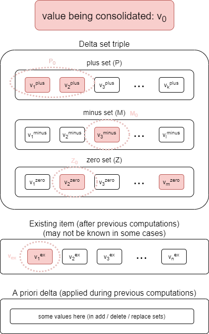

= Processing mapping sets

See link:https://wiki.evolveum.com/display/midPoint/Mapping[Mapping] for background information.

Evaluation of _mapping sets_ converts _source object_ into a set of _item deltas_ to be applied on this (or other) object.
It consists of evaluation of the mappings (probably chained because of mutual dependencies) and of _consolidation_
of output triples into item deltas.

Compared with link:../mappings/[single mapping evaluation] it provides the conversion of output triples into item deltas,
applying settings for individual mappings, namely the strength (normal, strong, weak).

== Mapping set evaluation

This is basically repeated evaluation of individual mapping, with the only exception: _mapping chaining_.

=== Mapping chaining

Individual mappings in mapping set can have mutual dependencies: target item of mapping A can be a source of mapping B.
Such cases have two consequences:

1. A must be evaluated before B.
2. Before starting evaluation of B, we must create an intermediate version of sources for mapping B. Sources derived
from original source object are no longer adequate. When determining updated sources, interim consolidation has to be
run.

(This interim consolidation is currently implemented not very precisely. We need to analyze it in more depth eventually.)

=== Consolidation

_Consolidation_ is a process of converting _output triple map_ to _item deltas_, considering _source object_ along with
its pre-existing _delta_. Because this process is executed independently for each item in question, we can describe _item
consolidation_ that converts single _output triple_ to an _item delta_, considering source _item-delta-item_.

==== Item consolidation

image::item consolidation.png["Item consolidation"]

Item consolidation goes strictly "by value". In each step we take one of values present in the delta set (from plus,
minus, and zero sets) - let's call it v~0~ - and identify its presence in the delta set triples as well as in existing item.
By "presence" we mean set of values equivalent with v~0~ under specified value matcher or comparator (or `IGNORE_METADATA`
comparison if none of these two is specified). footnote:[The implementation seems to be not quite correct when it comes
to comparing values.]

The algorithm then goes like this (slightly simplified - assuming mapping selector is ALL, filterExistingValues is true,
exclusiveStrong is false):

1. Let P, M, Z be sets of values in plus, minus, and zero sets, respectively.
So P = { v~1~^plus^, v~2~^plus^, ..., v~k~^plus^ }, M = { v~1~^minus^, v~2~^minus^, ..., v~l~^minus^ },
Z = { v~1~^zero^, v~2~^zero^, ..., v~m~^zero^ }.
2. Let P~0~ &#x2286; P, M~0~ &#x2286; M, Z~0~ &#x2286; Z be sets of values equivalent with v~0~ in P, M, and Z, respectively.
In the figure above they are depicted in red.

There are the following cases:

[cols="5,8a,8a"]
[%header]
|===
| Condition | Description | Action
| &#172; addUnchanged &#8743; Z~0~ &#8800; &#8709;
| At least one mapping thinks that v~0~ is unchanged: was present before and should be present after.
| We do not add v~0~ to the delta. Unless we execute special zero set processing (enabled for template mappings) and
one of the following is true for any z~0~ &#x2286; Z~0~ and mapping that produced z~0~:

1. mapping is strong
2. mapping is normal, has no sources, and a priori delta is empty
3. mapping is weak, and existing item is empty footnote:[and item delta does not add any values, but this is a consequence
of the fact that existing item is empty, isn't it?]

| P~0~ &#8800; &#8709;
| At least one mapping thinks that the value is being added.
| We invoke "value being added" part of the algorithm (see below).

| addUnchanged &#8743; Z~0~ &#8800; &#8709;
| At least one mapping thinks that v~0~ is unchanged: was present before and should be present after.
| We invoke "value being added" part of the algorithm (see below).

| (all other cases)
| We have no reason to think that the value should be added.
| We invoke "value not being added" part of the algorithm (see below).
|===

===== Value being added

Let R~0~ "reasons to add" be

- R~0~ = P~0~ if &#172; addUnchanged,
- R~0~ = P~0~ &#8746; Z~0~ if addUnchanged.

The meaning of R~0~ is: _mappings that think that this value should be added to the object_.

Now we decide in this way:

[cols="5,8a,8a,1a"]
[%header]
|===
| Condition | Description | Action | Code
| All mappings in R~0~ are weak.
| We don't know if we should apply this value. We can do it only if there is no other value for the item.
| We wait until all values are consolidated. Then weak mappings are considered. (I.e. we skip this value now.)
| link:https://github.com/Evolveum/midpoint/blob/d58615616b2b7b4501a31e3176c0a58c9c3ab524/model/model-impl/src/main/java/com/evolveum/midpoint/model/impl/lens/IvwoConsolidator.java#L433-L437[here]

| There is at least one strong mapping in R~0~ and we have deleted this value in apriori delta
| We thought this should cause an exception. But is it correct? Obviously, if the deletion was part of the
_original_ client-supplied delta, then the exception is OK. But our apriori delta is a composition of
client-supplied delta with all computed (secondary) deltas.
| We throw an exception. (Maybe incorrectly.)
| link:https://github.com/Evolveum/midpoint/blob/d58615616b2b7b4501a31e3176c0a58c9c3ab524/model/model-impl/src/main/java/com/evolveum/midpoint/model/impl/lens/IvwoConsolidator.java#L446-L450[here]

| There is no strong mapping in R~0~ and there is apriori delta
| We thought we should skip the value because there is a delta that is "more concrete". But again,
this assumes that apriori delta is the one supplied by the client, which is not necessarily the case.
| We skip this value. (Maybe incorrectly.)
| link:https://github.com/Evolveum/midpoint/blob/d58615616b2b7b4501a31e3176c0a58c9c3ab524/model/model-impl/src/main/java/com/evolveum/midpoint/model/impl/lens/IvwoConsolidator.java#L457-L462[here]

| The value is present in the existing item.
| We are going to add a value that is already present.
| We skip this value.
| link:https://github.com/Evolveum/midpoint/blob/d58615616b2b7b4501a31e3176c0a58c9c3ab524/model/model-impl/src/main/java/com/evolveum/midpoint/model/impl/lens/IvwoConsolidator.java#L464-L472[here]

| (all other cases)
| We should add the value.
| We put the value to the plus set.
| link:https://github.com/Evolveum/midpoint/blob/d58615616b2b7b4501a31e3176c0a58c9c3ab524/model/model-impl/src/main/java/com/evolveum/midpoint/model/impl/lens/IvwoConsolidator.java#L473[here]
|===

Illustration of the apriori delta issue (not related to the these two cases but to
link:https://github.com/Evolveum/midpoint/blob/d58615616b2b7b4501a31e3176c0a58c9c3ab524/model/model-impl/src/main/java/com/evolveum/midpoint/model/impl/lens/IvwoConsolidator.java#L366-L375[`checkDeletionOfZeroStrongValue` method]):

----
<objectTemplate>
    <mapping>
        <expression>
            
        </expression>
        <target>
            <path>description</path>
            <set>
                <predefined>all</predefined>
            </set>
        </target>
        <evaluationPhase>beforeAssignments</evaluationPhase>
    </mapping>
    <mapping>
        <strength>strong</strength>
        <expression>
            <value>after</value>
        </expression>
        <target>
            <path>description</path>
        </target>
        <evaluationPhase>afterAssignments</evaluationPhase>
    </mapping>
</objectTemplate>
----

On user recomputation we get an exception of:

`Attempt to delete value PPV(String:after) from item description but that value is mandated by a strong mapping {...common/common-3}description in objectTemplate:22e9e560-ddc5-45f8-bf1a-121042d73995(test) (for object template objectTemplate:22e9e560-ddc5-45f8-bf1a-121042d73995(test) for focus user:15221c59-1788-4c4c-a777-4d4299fbb530(t))`

TODO

===== Value not being added

TODO
