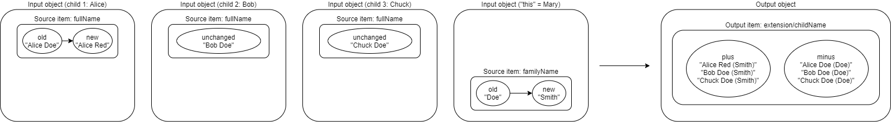
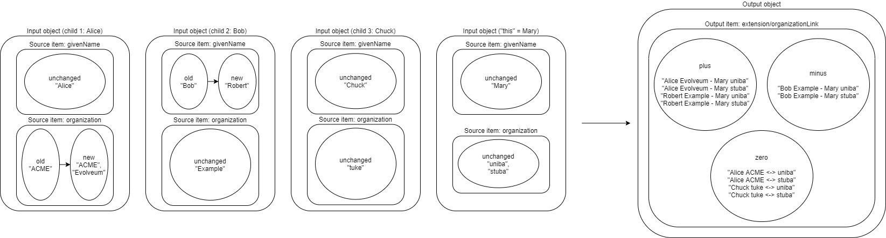

WARNING: None of the following does exist yet. These are pure speculations (for now).

Imagine a situation like this:

1. A user has zero, one, or more children. (This is a model of parent-child relationship where parent
has some rights related to his/her children.)

2. This link type is named `child` (from the parent side).

3. We want to create a mapping in a parent user that creates a value of _<child's full name> (<parent's
family name)_ in multivalued `extension/childName` property for each of the children.

The mapping would look like this:

----
<mapping>
    <source>
        <name>childFullName</name>
        <object>
            <linkSource>
                <name>child</name>
            </linkSource>
        <object>
        <path>fullName</path>
    </source>
    <source>
        <name>parentFamilyName</name>
        <path>familyName</path>
    </source>
    <expression>
        
    </expression>
    <target>
        <path>extension/childName</path>
    </target>
</mapping>
----

Notes:

1. Specification of source object (`<object>`) is currently reused from the one we use in script execution policy rules.
See link:https://wiki.evolveum.com/display/midPoint/Linked+objects#Linkedobjects-Selectingobjectstoberecomputed[here].
It is not ideal and might be reconsidered before official 4.2 release (or later).

2. Source names (`childFullName`, `parentFamilyName`) are used here only for clarity. The example would work
also without them; the expression code would be `fullName + ' (' + familyName + ')'` in that case. It is slightly
less understandable at first sight.

The situation can get more complex when multivalued items are considered. For example what if we want to
compose `extension/organizationLink` from all children's organizations and organizations of the parent?

----
<mapping>
    <object>
        <linkSource>
            <name>child</name>
        </linkSource>
        <source>
            <name>childGivenName</name>
            <path>givenName</path>
        </source>
        <source>
            <name>childOrganization</name>
            <path>organization</path>
        </source>
    </object>
    <source>
        <name>parentGivenName</name>
        <path>givenName</path>
    </source>
    <source>
        <name>parentOrganization</name>
        <path>organzation</path>
    </source>
    <expression>
        
    </expression>
    <target>
        <path>extension/organizationLink</path>
    </target>
</mapping>
----

NOTE: The `<object>` element here encompasses both sources, in order to delimit boundaries for combining individual
values. So we know that we should not combine e.g. Alice's name with Chuck's organization(s).

