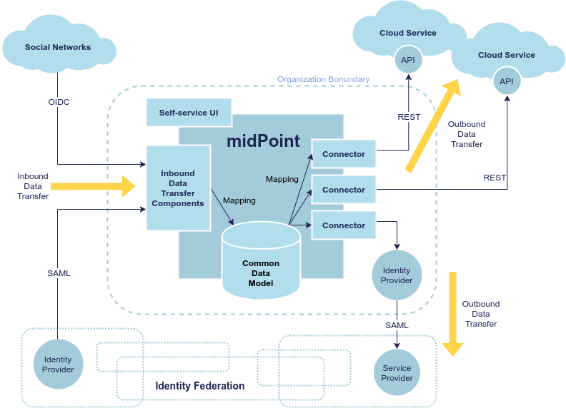

= MidConnect
:page-toc: top

.Proposed project
WARNING: This is a proposed project.
Only a preliminary design and architecture was done so far.
We are certain the project is feasible, and we are sure about general direction and big components in the project.
However, the details still need to be filled in.
There are research activities to be carried out, challenges and risks.
It is planned to add the details at the beginning of the project - and during the project.

== Executive Summary

MidConnect aims at automation of personal data portability between organizations, honoring data protection rules.
The idea is to use existing protocols such as OpenID Connect and SAML, utilizing extensible and configurable identity management engine to map the data.
Core of the solution is based on midPoint, comprehensive open source identity management and governance platform.
MidPoint is already capable of bridging the gaps between incompatible protocols and diverse data schemas, which will be necessary for practical data portability.
However, MidPoint was originally built for management of identities within a single organization.
MidConnect project aims at extending this functionality to reach out to the Internet, to connect midPoint to other organizations, facilitating controlled transfer of personal data.

The ultimate goal is to provide data sovereignty to organizations, such as universities, SMEs and government agencies.
The ambition is to allow management of personal data independent of social networks and cloud service providers.
Our focus is not just on the initial transfer of the data, as such approach does not guarantee that data are properly maintained.
We are focused on a long-term data "links" that can be used to maintain and update the data in a controlled long-term relationship.

Proposed solution is a part of xref:/midpoint/midprivacy[midPrivacy], a broader initiative to create an integrated solution that will be a fusion of identity management and data protection capabilities in one comprehensive open source platform.

== Motivation and Context

MidConnect aims at flow of personal data between organizations.

image::midconnect-context.png[Context]

The primary goal is an ordinary, self-sovereign organization.
As it is 21^st^ century, organizations are not isolated any more.
Typical organization will need to work with variety of _external identities_.
There may be cross-organizational teams, such as research teams typical for academia.
Organization may participate in an identity federation which provide technological and organizational measures to allow distributed teams.

Cross-organizational collaborations are boosting innovations, especially in the academic and research sector.
Outcome of the project will make such collaborations easier for end users.
Users are getting used to using their existing digital identities for collaboration with others.
In academia, it is mostly thanks to academic identity federations like eduGAIN or InCommon.
For others, it's social identity providers or upcoming national e-IDs of bank IDs.
Even though those standards are being evolved, which makes collaboration easier, there is still a gap how in data processing and transferred to other service, especially when users are having multiple sources of their data.
MidConnect will fill in this gap by extending those existing federation mechanisms, putting user in control and enable then do consciously decide, how their data will be processed.
All that will effectively decouple identity sources from users' home organization and services, which will enables users to seamlessly change either home organization or their identity provider without having substantial impact on services they are using and thus also not having any impact on they work or research.
These type of changes are common in academic sector and with social networks, national eID, banks ID are becoming common even outside academia.

Organizations often work with user communities, such as enthusiasts, interest groups, contributors and so on.
There is often an annoying procedure to register an account and even more troublesome procedure to maintain it.
Organizations try to make these processes easier to user, supporting "social login" to create an account based on social networks.
However, there are many identity sources, ranging from major social networks to a developer community hubs such as Github, each of them using their own set of protocols, protocol dialects and schemas.

Overall, management of external identities is much harder than it may seem.
The very nature of external identities mean there is an inherent need for data _transfer_ and _portability_.
Moreover, there is a need to adhere to data protection rules.
As it is very difficult to add data protection and privacy to an existing system, these aspects must be native part of the solution, observing the _privacy by design_ principle.

The aim of midConnect project is to make management of external user communities much easier, providing a seamless experience.
Core of the solution is based on https://midpoint.evolveum.com/[midPoint], an open source identity management and governance platform.
MidPoint has strong capabilities in identity integration, bridging incompatible protocols, mapping diverse schemas and aligning the policies.
Therefore midPoint is an ideal foundation for the solution.
However, even with midPoint at its core, the solution has to deal with several challenges:

* *Data portability*.
There are diverse protocols (OpenID Connect, OAuth2, SAML, SCIM), proprietary protocol extensions, schemas, with new protocols in development (GNAP).
Developing a solution that would provide satisfactory support for even the most popular protocols and their variants is likely to be a challenge on its own.
MidPoint provides a solid foundation for data transformation and mapping that can help bridging incompatible schemas.
However, even the capabilities of midPoint have to be extended to support full data portability.

* *Data maintenance*.
When data are transferred from one organization to another, that is not the end of the data portability problem.
It fact, it is just a beginning.
The data need to be _maintained_ during all of its lifetime.
The data need to be updated, merged with other data sources, the data may need to be validated, certified, the data may expire, there may need for the data to be refreshed.
The data may need to be expanded when new services ask for more data, the data need to be reduced when there is no need for the data.
Finally, at the end of the lifetime, the data need to be erased.
Management of the data during the lifecycle is at least as challenging as the data transfer event that starts the lifecycle.

* *Data protection and privacy*.
Personal data protection rules must be observed.
While this is the right thing to do, it complicates management of the data.
The implementation must make sure there is a valid _basis for data processing_ for every data item at all times.
This is an area where technology meets legislation and not all the details are clear yet, which makes the implementation quite challenging.

* *User experience*.
There are many complex concepts involved in data portability and data protection.
Yet, the system must interact with users that are not identity management and data protection experts.
Displaying the information in understandable and intuitive way is likely to be a major challenge.

== Project Goals

MidPoint has a significant potential for data and service portability.
Many of the basic building blocks of data portability are already part of midPoint: common data model, data mapping mechanisms and data synchronization processes.
MidPoint is also naturally designed to work with personal data, employing _privacy by design_ approach.
This was proven during several successful prototypes of data protection functionality.
We plan to take advantage of existing midPoint functionality and extend it to support personal data portability.

We plan to extend midPoint functionality in two ways (project outcomes):

. MidPoint will reach out to other organizations, providing _data portability_ mechanisms.
We plan to reuse existing IAM protocols such as OAuth2, OpenID Connect and SAML to facilitate data transfer.
Existing midPoint capabilities will be used to "integrate" the data: map data models, transform data to compatible formats, keep data up to date.
The plan is to create new "Inbound Data Transfer Components" (see the diagram) to facilitate the transfer.
We would like to make the implementation as protocol-agnostic as possible, as we expect that new protocols will be added in the future (e.g. GNAP).
As existing protocols are based on a diverse and often non-compatible set of technologies, this unification attempt may be a significant technological challenge.

. Keep users in control by providing integrated _data protection_ capabilities.
Processing of personal data cannot be done in any arbitrary way.
There needs to a valid _basis_ for data processing.
This principle applies to data transfer as well.
We have experimented with the concept of data processing _basis_ in a couple of previous projects.
Now we would like to apply the concepts to data portability mechanisms, utilizing the _privacy by design_ approach.
Although we have some idea how data protection concepts can be applied to data portability, actual implementation of the mechanisms will require significant research and innovation effort.
The mechanism will certainly include interaction with the user, making sure the user can make responsible and informed decisions about personal data.
As data protection is not a simple topic to understand, we expect user experience (UX) challenges during the project.

In addition to that, there are also secondary goals:

[start=3]
. Provide simple, intuitive user interface for end users to efficiently maintain their information.
Some concepts, especially data protection concepts, may be very difficult to manage in an understandable and intuitive way.
The goal of the project is to explore the possibilities of using some of these concepts in the context of an end-user interface for non-expert users.

. Explore possibilities of automatic data maintenance and updates.
This may be possible in the context of some protocols, such as using OpenID Connect refresh tokens, or combining identity federation protocols with provisionig protocols (e.g. SCIM).

. Provide rough design for future functionality, especially the development of data protection features, progressive user profile and more general user-user relationship management (e.g. friend-friend, student-parent, etc.)

== Solution Architecture Outline

MidPoint is a true foundation for this project.

Many existing midPoint features will be reused, most notably the mechanisms of inbound mappings and expressions.
However, there is a need for several new and significantly improved components:

* Inbound data transfer components, including user interaction components.
There are expected changes in several existing midPoint components, including midPoint administration user interface ("admin-gui") and midPoint authentication mechanism ("flexible authentication").
It is likely the existing code may need to be re-structured.

* Data protection policies, implemented in midPoint core.
Existing midPoint data model need to be extended to support concepts of _data requirement_ and _data release_.
The ideal place seems to be extension of existing concepts of _abstract role_ and _assignment_.

* Self-service user interface (prototype).
MidPoint already has some self-service functionality in its administration user interface.
However, that functionality is very "technological" and complex.
According to our feedback, existing functionality is too difficult to understand for non-expert users.
Existing self-service user interface is composed of administration user interface components, which means it is not easy to significantly change the design and behavior of the user interface.
Effort to adapt existing interface and effort needed to create a new user interface is comparable.
Therefore we have decided for a fresh start.
We plan to build a new self-service user interface, specifically aimed at non-expert end users.
Our plan is to employ user experience (UX) expertise to make the interface understandable and easy to use.

Results of this project are meant to seamlessly fit into midPoint, aligning with existing midPoint architecture and development process.
The results of first part of the project (prototype) is planned to be part of midPoint 4.4.
The results of second part of the project (product) is planned to be part of midPoint 4.5.

=== Inbound Data Transfer Components

Inbound data transfer components (a.k.a. "enrollment components") are components that take care of processing user data when a new user lands in our system.
The components will try to determine whether we can get user's data using some of the supported "identity protocols" such as SAML, OpenID Connect or OAuth2.

The key part of the solution is the component which we now call "flexible authentication".
This component implements the client side of the "identity protocols" (SAML is the only currently supported protocol).
The original purpose of this component is to authenticate user for access to midPoint administration user interface.
This component will need to be slightly re-structured and extended during this project, as we are interested in more than mere authentication.
The component will need to determine user's data, e.g. from SAML attribute assertions send in the request.

It is expected that the new user entering the system will need to be routed through an interactive "enrollment" procedure.
This may be though of as an elaborate and semi-automated user registration procedure.
Due to the data protection rules, we need to process user's data on a specific _basis_. The _basis_ specifies what data items are required, which are optional and so on.
The user has to be informed about the use of personal data, and there may be a need for user's consent to use optional data items (see below).
The interaction might perhaps be skipped, in case that the sending party (identity provider) has already cleared the data requirements and choices with the user and there is a sufficient proof that it happened.
However, even in that case, we may need to ask the user to fill in missing data items that the sending party have not provided.
The exact details of this procedure are not yet entirely clear, as understanding of all applicable data protection regulations is not easy.
Filling in the details may need to use legal services in the area of data protection to get relevant advice.
However, we are almost certain that user interaction will need to take place at least in some cases.

The components may also need to correlate the identity with a database of existing identities in a system.
This is necessary to avoid undesirable duplication of identities.
It is also necessary for user convenience, e.g. we do not want to ask user for data that the user has already provided in previous interactions.
However, identity correlation is not an easy task and there seem to be no single and simple solution.
It is likely that user interaction will be required, e.g. user confirming the correlation match, even proving the identity.
We plan to re-use identity correlation capabilities that midPoint already has.
However, those capabilities were designed for enterprise environment, therefore the existing correlation functionality is non-interactive.
Extension of those capabilities need to be considered.

=== Data Requirement And Release

It is essential the enrollment procedure - and in fact the entire personal data processing - follows the proper data protection procedures.
We can only process those data items that are necessary to carry out the service, or data items that the user explicitly allowed to use.
In other words, we must always process the data according to the _basis for data processing_.

_Basis for data processing_ is a fundamental concept of personal data protection.
We have xref:/midpoint/midprivacy/phases/01-data-provenance-prototype/provenance-origin-basis/[encoutered this concept before] and identified it as one of the most important concepts for identity management.
The _basis_ applies also in the "enrollment" case.

The fundamental insight is that enrollment/registration never happen in a vacuum.
There is always some _basis_ for registration,
e.g. user becoming community member, registration for interest group, etc.

The _basis_ specifies _data requirement_.
The _data requirement_ is a light of data items that are necessary or desirable for the purpose that the _basis_ represents.
As long as the _basis_ applies, we can store the specified data items and use them for the specific purpose.
When the _basis_ no longer applies, we have to erase the data, unless there is another basis that applies to the data.
The _basis_ effectively controls the lifecycle of data items.

In midPoint, the _basis_ can be represented by an _abstract role_, which is usually a Role, Org or a Service.
This seems to be a very good fit, which is also partially confirmed by the experiments in "phase 0" of xref:/midpoint/midprivacy/[midPrivacy initiative].
The results of xref:/midpoint/midprivacy/phases/01-data-provenance-prototype/["provenance" phase of midPrivacy] also support this choice,
as was described in xref:/midpoint/midprivacy/phases/01-data-provenance-prototype/provenance-origin-basis/[Provenance, Origin and Basis document].

While the _basis_ specifies _data requirement_, there are likely to be optional data items that the user may choose to release or choose to keep private.
Therefore, the _basis_ itself is not enough just by itself, we need a place where to record the _choices_ of individual users.
We need a place where we can record user's _data release_ information.
The _data release_ needs to be bound to a particular basis, it may be time-bound, and there will certainly be metadata (e.g. date and time of the release).
MidPoint _assignment_ data structure seems to be a suitable place to store _data release_ information.
_Assignment_ is naturally bound to _abstract role_ that represents the _basis_.
There are also metadata and time constraints.
Although the choice to use _assignment_ to record _data release_ information has to be validated, it looks like a good choice at this stage of the project.

.Consideration
TIP: We have thought about some special data structure that would bind the "data release" to the shadow.
However, this data structure looks almost exactly like assignment.
It looks easier to use assignment, bound to the user.
The account is linked to the user.
However, we would probably need to refer to the shadow in the "basis/release" assignment, to make the data source explicit.

The situation is schematically illustrated in the following diagram:

Traditionally, identity management systems worked with directory servers and databases in a single organization.
The IDM systems usually assumed that the data are always available, that the data can be fetched directly from the source.
This a fair assumption to make, it also adds a benefit of having a fresh data, which allows early detection and propagation of data changes.
However, the situation is quite different when it comes to the cross-organizational case.

When the original source of the data is in different organization then the destination of the data, we cannot assume that we have instant access to the data source.
This is amplified by the nature of current "identity protocols" such as SAML, where the data are in fact available only at the moment of user authentication.
This means that midPoint will need to store or cache the data, to have them available as needed.
MidPoint has a concept of _shadow_ objects that represent the data in a remote system.
The _shadow_ usually contains just the most essential identifiers of the remote objects.
However, there is an experimental functionality to cache all the data in midPoint, which can be re-used in this project.

In the usual intra-organizational case, midPoint stores the compiled authoritative data in the _user_ object.
In that case there is very little motivation to cache data in the shadow.
However, in intra-organizational case there is usually a very small number of data sources such as HR system or company directory.
These source are known _a priori_, and the data flow are governed by organizational-wide policies that are mostly static.
Therefore the authoritative, compiled state of the _user_ object can be easily computed as needed.
However, the cross-organizational case is vastly different.
There are diverse data sources, such as identity providers in a federation.
While the federations, social networks, community sites and similar data sources cannot appear in an entirely arbitrary way, the situation is considerably much more dynamic than it is in a typical intra-enterprise case.
However, the most significant difference is that the data flow is not controlled solely by the policies.
Choices of the users are the ultimate determinant in allowing or prohibiting a data flow.
Additionally, the same identity is likely to be present in several data sources (several social network or federations), or even in several instances of the same data source (several identity providers in the same federation).
Individual data sources may have inconsistent or even conflicting data, therefore simple policy-based mapping of the data to the _user_ object will not work.
Caching the original data in their original "raw" form may help resolve the conflicts, especially in case that user interaction will be required.
In fact, the _shadow_ may work like a "lightweight persona", enabling various approaches to merging identity data.
The exact mechanisms is still unknown, but we are reasonably certain that any viable mechanism will need the "raw" data from the shadow.

In addition to the data caching capability, the _shadow_ creates a _data link_ to the original source of the data.
Therefore the data could, theoretically, be refreshed when needed.
However, there are usually protocol limitations.
E.g. SAML protocol makes the data available only during (interactive) authentication flow.
Yet, there may be some chances, such as using OpenID Connect refresh token, or combining the primary protocols with a more CRUD-like secondary protocols (such as SCIM).
This is an avenue that is worth exploring in the project, although it is perhaps too early to commit to any tangible results.

=== Self-Service User Interface

MidPoint has a comprehensive and feature-rich user interface.
This user interface is designed for advanced users.
It can be used to manage the identities, configure and monitor midPoint platform.
However, the inherent complexity of such user interface is a limiting factor for ordinary users.
There is small "end user" part of the existing user interface that is designed for ordinary users.
However, we are constantly receiving feedback from users that the user interface is complex and non-intuitive.
We have made several attempts to improve the end user part of the interface.
However, as the interface is technologically and conceptually part of much larger functionality, it is very hard to make any dramatic change in overall approach.
We have concluded that the existing midPoint administrative user interface is not suitable for end users.

We believe that long-term data maintenance is an essential for data portability.
Transfer of data from one system to another is just a first step in the data portability flow.
An ability to maintain the data is at least as important as the initial data transfer.
As there are numerous limitations of existing protocols, complexities of identity correlation, data protection regulations and other factors, long-term maintenance of personal data will required fair amount of user interaction.

As existing MidPoint administrative user interface is not a promising development path for interaction with end users, we have decided to try a different approach.
We have decided to start working on a new user interface, targeted specifically at end users, with a strong focus on user experience.
The ultimate goal is to create an user interface that an ordinary user can understand and use in an intuitive way.
There are likely to be some challenges, as we have to deal with complex concepts of data origin, transfer, linking and data protection.

Technologically, we plan to start the work from an existing user interface of Perun, an identity management system that Masaryk University uses to manage identities.
We would like to reuse the technology and some of the concepts, which is supported by participation of some members of Masaryk University development team.
Important part of the development effort is a strong focus on user experience (UX).
The implementation will begin with requirements analysis and preliminary definition of the scope.
Some required functionality is obvious (such as modification of some user data), other functionality is not (extend of credential management, management of privileges, groups, etc.)
The scope has to be carefully chosen to avoid over-complicating the interface.
This will be accompanied by a work on UX aspects.
We plan to develop the interface in iterations, gathering feedback from users and applying user experience improvements during the development.
The goal is to have simple, but usable interface at the end, rather than complex and unusable one.

The self-service user interface will connect to midPoint server by the means of midPoint RESTful interface.
Almost all the services needed by the user interface should be already available in the existing RESTful interface of midPoint.
We plan to add the missing services or parameters as needed.

== Challenges, Questions and Ideas

The goal of the project is to develop production-ready functionality, and we are mostly certain about project feasibility, the general direction of product development and the overall solution architecture.
Despite that, there is still a significant research element.
There are unknowns, open questions, challenges and ideas to explore.
Following list summarizes the known open questions, challenges:

* Implications of data protection on identity management.
We have already xref:/midpoint/midprivacy/phases/01-data-provenance-prototype/provenance-origin-basis/[identified some challenges], which can be used as basis for potential solution.
We have considered the concepts of _origin_, _yeild_ and especially the concept of _basis for data processing_.
However, the ideas from previous project need to be validated and further refined.

* Correlation and merging of multiplied identities.
How to identify that an person that is enrolling is matching the person that we have already recorded in our database?
How to merge the data?
How to deal with conflicts?
This may lead to use of _personas_, which are already supported in midPoint, albeit the support was aimed at a different use case.
However, _personas_ may be complex, they are likely to be difficult to understand for the end users.
It is possible that using data cached in shadow may be used as a more natural "lightweight persona", as the data are naturally bound to the origin.
There are be several options worth considering.

* Data freshness.
How do we keep the data fresh?
How to update the data, given all the limitations of existing protocols?

* Exact scope of self-service functionality.
The more functionality will be there, the harder it will be to understand and use.
We have learned that lesson from existing midPoint administration UI.
What are the most essential functionality elements that are necessary for end users?
How to represent them is a simple way?

* Data protection user experience.
The process of personal data release may seem simple, but it is not.
How do we show the release options to the user in such a way, that even an untrained user will understand it?
How do we display the _basis_ (purpose of data processing) to make it readable and obvious?
We want to avoid situation as it is with _terms of service_ and _cookie consent_ dialogs today.
Having such a "legalish" dialog will completely spoil the goal of the data protection, as people will usually click on "agree" button without even thinking about it.
Good user experience is crucial.

Ideas to explore:

* We may want a special "self asserted" shadow, that would cache data entered by the user during registration flow - and even maybe during normal user profile edits.
In that case we do not lose the data if we ever have to delete/unlink source (e.g. SocNet) shadow.
This may also be easier for data merging and provenance.
This needs to be further explored.

== Approximate Project Plan

The plan is to develop a prototype solution in the first part of midConnect project.
The prototype is planned to be part of midPoint 4.4 (as _experimental_ functionality) - as long as there is no risk of destabilizing midPoint 4.4 code.
The prototype will be productized during the second part of the project.
The result of the project will be part of midPoint 4.5.

=== Milestones

|===
| Milestone | Description | Date

|
|Project start
| 1 Apr 2021 (assumed)

|M1
|Design and architecture
| 31 May 2021

|M2
|Minimal prototype
| 9 Jul 2021

|M3
|Presentable prototype, End of phase I
| 31 Aug 2021

|M4
|Minimal product
|14 Oct 2021

|M5
|Viable tested product
|30 Nov 2021

|M6
|End of phase II, End of project
|31 Dec 2021
|===

== Future Potential

MidConnect project will deliver a productized solution at its end.
However, there is still potential for future improvement and innovation after the project.
Many potential avenues for future development will be certainly uncovered during the project.
Yet, there are some possibilities that show their promise even now:

* The concept of _basis for data processing_ in a form of _abstract role_, together with _data release_ concept can be re-used for other use cases.
Most notably, such concepts can be re-used for _outbound_ data processing (provisioning).
Each service can specify _data requirements_ according to the purpose of data processing in the service.
MidPoint can check that the requirements are satisfied when the service is activated (assigned).
Similarly, midPoint can dispose of the personal data that are not longer needed when a service is deactivated.

* The concept of data requirement/release is also a step towards _progressive user profile_.
The basic idea is to maintain only those personal data items that are necessary to provide a viable service.
The data can be supplied in a _progressive_ fashion when new service is activated or upgraded and new data items are needed.
MidPoint could ask the user to supply the data, or perhaps use appropriate protocols to automatically retrieve the data on demand.

* The self-service interface can be extended to support more functionality.
There is a demand for self-service management of groups and person-to-person relations (favorite contacts, friend-friend, student-parent).
Appropriate user experience is likely to be a challenge, however the self-service user interface should be perfectly suitable for this purpose.

== See Also

* xref:/midpoint/midprivacy[MidPrivacy initiative]
