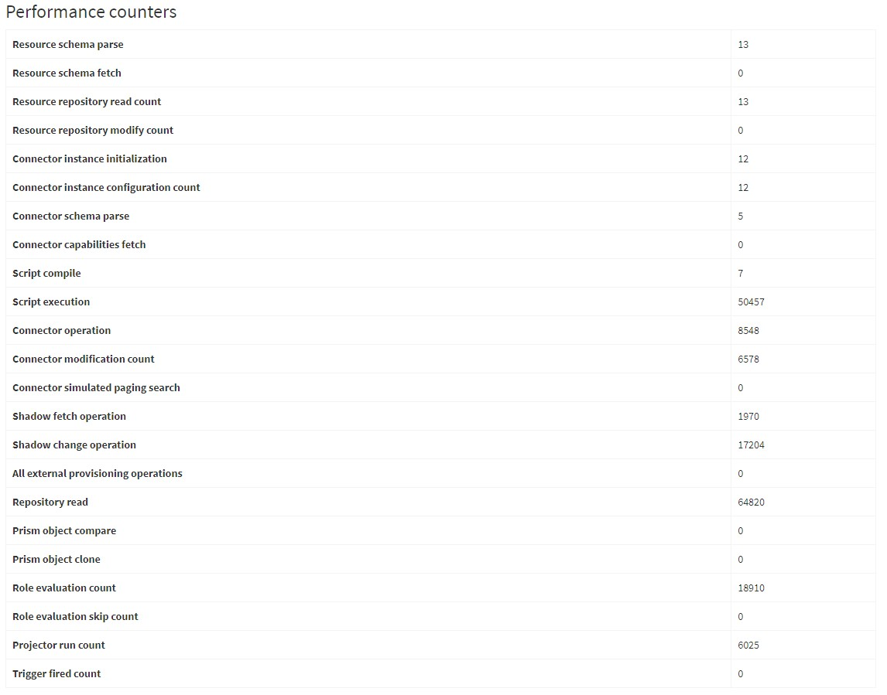
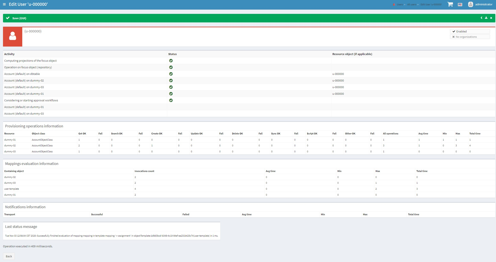

= Performance and state monitoring

Here we summarize existing mechanisms for performance and state monitoring of running midPoint:
either in production or during tests. The goal is to create an "inventory" before making
improvements and new features in this area.

Note that this is not a report from a design meeting - at least not yet.
It is just a "thinking aloud" thing.

////* Model profiling
////* GUI progress reporting
////* Performance traces and counters
////* Repository performance information
//* Cache usage (cache size)
//* Cache performance information
//* Methods performance information (operation result vs. AOP based)
//* Task: iteration information
//* Task: states of processed objects
//* Task: actions executed
//* Task: provisioning operations
//* Task: mapping evaluation
//* Task: notifications
//* Task: work buckets operations
//* Log collection feature

[%header]
[cols="20,40a,20,30,5,5,30"]
|===
| Feature
| Description
| Primary use
| Output
| G
| T
| Notes

| Repository performance information
|
The link:https://github.com/Evolveum/midpoint/blob/master/repo/repo-api/src/main/java/com/evolveum/midpoint/repo/api/perf/PerformanceMonitor.java[`PerformanceMonitor`]
keeps invocation/retries counts, time spent/wasted.
Categorized by repo operation and optionally by object type.
Individual invocations can be logged into special file.
|
In operation. Partially in selected tests.
|
Per task information is stored in task (visible e.g. via task GUI). Global information is visible
in "Internal configuration" -> "Performance", and also logged on system exit.
| Y | Y
|
-

| Profiling model inspector
|
Clockwork, projector, and repository cache send notifications
to link:https://github.com/Evolveum/midpoint/blob/master/model/model-common/src/main/java/com/evolveum/midpoint/model/common/util/ProfilingModelInspector.java[`ProfilingModelInspector`]
that collects basic performance statistics: duration of components' execution, and the total time spent
in mapping evaluation and repository.
|
In tests. It can be also enabled in running midPoint. footnote:[Via
"Internals configuration" -> "Internal configuration" tab -> "Model profiling" checkbox.]
|
Log record after each model operation.
| - | -
|
Statistics provided by this component are a subset of the ones available in traced operation result.
However, the potential of this mechanism is greater than giving performance counters.

| Performance counters and traces
|
The link:https://github.com/Evolveum/midpoint/blob/master/infra/schema/src/main/java/com/evolveum/midpoint/schema/internals/InternalMonitor.java[`InternalMonitor`]
class keeps number of invocations for expensive operations in the system. It is also able to trace (via log) individual
invocations of defined operations.
|
Used in tests to make sure selected operations are not executed more frequently than expected.
The counters are visible also in running midPoint; and individual tracing can be requested as well.
footnote:[Via "Internals configuration" -> "Counters" and "Traces" tabs.]
|
Counters contain the number of invocations. A trace log record contains operation name, parameters (optional),
invocation count, and place in code where it was executed. Sometimes also timing information.
| Y | -
|
Prism operations require link:https://github.com/Evolveum/midpoint/blob/master/infra/prism-api/src/main/java/com/evolveum/midpoint/prism/util/PrismMonitor.java[`PrismMonitor`]
to be set. This is usually not available during run time.

//| Cache performance information

| ... | ... | ... | ... | - | - | ...
| ... | ... | ... | ... | - | - | ...
| ... | ... | ... | ... | - | - | ...
| ... | ... | ... | ... | - | - | ...
| ... | ... | ... | ... | - | - | ...
| GUI progress reporting
|
Several components engaged in the operation execution (clockwork, projector, change executor, workflow hook,
notification code) provide information on the operation status by calling `onProgressAchieved` method
of `ProgressListener` interface. Besides model context this method consumes also specific `ProgressInformation`
object.
|
This mechanism is tailored to provide state information of the operation to GUI users.
|
List of expected or executed user-visible activities (projection, focus change execution, projections changes execution,
approval, notifications), along with their outcome status. However, the client is free to display any other information
available from model context or the task, like provisioning, mapping evaluation, or notification statistics.
| - | -
|
Quite old (2014), deserves updating.

|===

== Sample output

=== Model profiling

----
Clockwork: 303 ms
  INITIAL: 66 ms
    projector: 57 ms
      load: 5 ms
      focus: 14 ms
      inbound: 3 ms
      focusActivation: 0 ms
      objectTemplateBeforeAssignments: 1 ms
      assignments: 0 ms
      assignmentsOrg: 0 ms
      assignmentsMembershipAndDelegate: 0 ms
      assignmentsConflicts: 0 ms
      focusLifecycle: 0 ms
      objectTemplateAfterAssignments: 0 ms
      focusCredentials: 0 ms
      focusPolicyRules: 1 ms
      projection account(no ID, type 'default', resource:10000000-0000-0000-0000-000000000004(Dummy Resource)): 24 ms
      projectionValues account(no ID, type 'default', resource:10000000-0000-0000-0000-000000000004(Dummy Resource)): 14 ms
      projectionCredentials account(no ID, type 'default', resource:10000000-0000-0000-0000-000000000004(Dummy Resource)): 4 ms
      projectionReconciliation account(no ID, type 'default', resource:10000000-0000-0000-0000-000000000004(Dummy Resource)): 1 ms
      projectionValuesPostRecon account(no ID, type 'default', resource:10000000-0000-0000-0000-000000000004(Dummy Resource)): 2 ms
      projectionLifecycle account(no ID, type 'default', resource:10000000-0000-0000-0000-000000000004(Dummy Resource)): 2 ms
      objectTemplateAfterProjections: 1 ms
  PRIMARY: 3 ms
  SECONDARY: 194 ms
    projector: 33 ms
      execution: 0 ms
      load: 7 ms
      focus: 18 ms
      inbound: 13 ms
      focusActivation: 0 ms
      objectTemplateBeforeAssignments: 0 ms
      assignments: 0 ms
      assignmentsOrg: 0 ms
      assignmentsMembershipAndDelegate: 1 ms
      assignmentsConflicts: 0 ms
      focusLifecycle: 0 ms
      objectTemplateAfterAssignments: 0 ms
      focusCredentials: 0 ms
      focusPolicyRules: 2 ms
      projection account(no ID, type 'default', resource:10000000-0000-0000-0000-000000000004(Dummy Resource)): 1 ms
      objectTemplateAfterProjections: 0 ms
  FINAL: 40 ms
totalOperationTime: 311 ms
totalMappingTime: 1 ms
totalRepoTime: 111 ms
----

=== Performance counters and traces

Note that Prism object compare and Prism object clone are zero because of missing `PrismMonitor` in running midPoint.

----
2020-11-04 10:02:21,747 [] [pool-3-thread-25] INFO (com.evolveum.midpoint.schema.internals.InternalMonitor): MONITOR connectorOperation(getObject) (8549)
2020-11-04 10:02:21,766 [MODEL] [pool-3-thread-25] INFO (com.evolveum.midpoint.schema.internals.InternalMonitor): MONITOR shadowFetchOperationCount[shadowFetchOperations]() (1971)
2020-11-04 10:02:21,767 [] [pool-3-thread-25] INFO (com.evolveum.midpoint.schema.internals.InternalMonitor): MONITOR connectorOperation(getObject) (8550)
2020-11-04 10:02:21,769 [MODEL] [pool-3-thread-25] INFO (com.evolveum.midpoint.schema.internals.InternalMonitor): MONITOR shadowFetchOperationCount[shadowFetchOperations]() (1972)
2020-11-04 10:02:21,770 [] [pool-3-thread-25] INFO (com.evolveum.midpoint.schema.internals.InternalMonitor): MONITOR connectorOperation(getObject) (8551)
2020-11-04 10:02:21,771 [MODEL] [pool-3-thread-25] INFO (com.evolveum.midpoint.schema.internals.InternalMonitor): MONITOR shadowFetchOperationCount[shadowFetchOperations]() (1973)
2020-11-04 10:02:21,771 [] [pool-3-thread-25] INFO (com.evolveum.midpoint.schema.internals.InternalMonitor): MONITOR connectorOperation(getObject) (8552)
2020-11-04 10:02:21,772 [MODEL] [pool-3-thread-25] INFO (com.evolveum.midpoint.schema.internals.InternalMonitor): MONITOR shadowFetchOperationCount[shadowFetchOperations]() (1974)
2020-11-04 10:02:21,773 [] [pool-3-thread-25] INFO (com.evolveum.midpoint.schema.internals.InternalMonitor): MONITOR connectorOperation(getObject) (8553)
2020-11-04 10:02:21,775 [MODEL] [pool-3-thread-25] INFO (com.evolveum.midpoint.schema.internals.InternalMonitor): MONITOR shadowFetchOperationCount[shadowFetchOperations]() (1975)
2020-11-04 10:02:21,775 [] [pool-3-thread-25] INFO (com.evolveum.midpoint.schema.internals.InternalMonitor): MONITOR connectorOperation(getObject) (8554)
2020-11-04 10:02:21,776 [MODEL] [pool-3-thread-25] INFO (com.evolveum.midpoint.schema.internals.InternalMonitor): MONITOR shadowFetchOperationCount[shadowFetchOperations]() (1976)
2020-11-04 10:02:21,776 [] [pool-3-thread-25] INFO (com.evolveum.midpoint.schema.internals.InternalMonitor): MONITOR connectorOperation(getObject) (8555)
2020-11-04 10:02:21,777 [MODEL] [pool-3-thread-25] INFO (com.evolveum.midpoint.schema.internals.InternalMonitor): MONITOR shadowFetchOperationCount[shadowFetchOperations]() (1977)
2020-11-04 10:02:21,778 [] [pool-3-thread-25] INFO (com.evolveum.midpoint.schema.internals.InternalMonitor): MONITOR connectorOperation(getObject) (8556)
2020-11-04 10:02:21,779 [MODEL] [pool-3-thread-25] INFO (com.evolveum.midpoint.schema.internals.InternalMonitor): MONITOR shadowFetchOperationCount[shadowFetchOperations]() (1978)
2020-11-04 10:02:21,845 [MODEL] [pool-3-thread-25] INFO (com.evolveum.midpoint.schema.internals.InternalMonitor): MONITOR roleEvaluation(role:aa7ef9a6-9661-4c55-82cb-b108a13b4dc5(role-dummy)) (20687)
2020-11-04 10:02:21,873 [MODEL] [pool-3-thread-25] INFO (com.evolveum.midpoint.schema.internals.InternalMonitor): MONITOR roleEvaluation(role:aa7ef9a6-9661-4c55-82cb-b108a13b4dc5(role-dummy)) (20688)
----

=== Repository performance information

----
Repository performance information

+-------------------+-------+------------+-----------+-----------------+-----+-----+------+-----------+----------+---------+------------------+-----+-----+-----+----------+
| Operation         | Count | Count/iter | Count/sec | Total time (ms) | Min | Max |  Avg | Time/iter | Time/sec | Retries | Wasted time (ms) | Min | Max | Avg | Wasted % |
+-------------------+-------+------------+-----------+-----------------+-----+-----+------+-----------+----------+---------+------------------+-----+-----+-----+----------+
| addObject         | 2,891 |        5.0 |      27.8 |          10,462 |   0 |  46 |  3.6 |      18.1 |    100.6 |         |                  |     |     |     |          |
| audit             | 1,154 |        2.0 |      11.1 |          14,348 |   0 |  78 | 12.4 |      24.9 |    138.0 |         |                  |     |     |     |          |
| fetchExtItems     |    25 |        0.0 |       0.2 |              32 |   0 |  16 |  1.3 |       0.1 |      0.3 |         |                  |     |     |     |          |
| getObject         | 8,092 |       14.0 |      77.8 |          10,397 |   0 |  44 |  1.3 |      18.0 |    100.0 |         |                  |     |     |     |          |
| getVersion        |     5 |        0.0 |       0.0 |               0 |   0 |   0 |  0.0 |       0.0 |      0.0 |         |                  |     |     |     |          |
| modifyObject      | 6,386 |       11.1 |      61.4 |          29,745 |   0 |  35 |  4.7 |      51.6 |    286.0 |         |                  |     |     |     |          |
| searchObjects     | 1,154 |        2.0 |      11.1 |             926 |   0 |  62 |  0.8 |       1.6 |      8.9 |         |                  |     |     |     |          |
| searchShadowOwner |   577 |        1.0 |       5.5 |             454 |   0 |  16 |  0.8 |       0.8 |      4.4 |         |                  |     |     |     |          |
+-------------------+-------+------------+-----------+-----------------+-----+-----+------+-----------+----------+---------+------------------+-----+-----+-----+----------+
----

=== GUI progress reporting

// (of `ClockworkInspector` and `RepositoryPerformanceMonitor` interfaces)

//What is provided is
//
//Events collected:
//
//* `recordStart`, `recordFinish` (technically not a part of `ClockworkInspector`),
//* `clockworkStart`, `clockworkFinish`, `clockworkStateSwitch`,
//* `projectorStart`, `projectorFinish`,
//* `projectorComponentStart`, `projectorComponentFinish`, `projectorComponentSkip`,
//* `afterMappingEvaluation`,
//* `recordRepoOperation` (part of `RepositoryPerformanceMonitor`).
