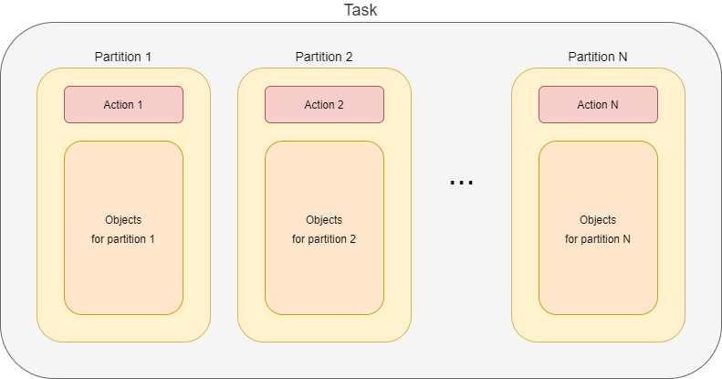

= Task state, progress, and error reporting

== What is a task, anyway?

A _task_ is a set of _actions_ that have to be executed on sets of _objects_.
A combination of an action and its object set is called _task partition_.footnote:[This term should be perhaps
replaced by something more appropriate. The word _partition_ has well-known meaning in the database domain.]
footnote:[The action includes _options_ that determine how exactly is the action executed. An example of
such options are _dry run_, _simulation_, or real _execution_.]

Usually, a task consists of a single such action. Examples are recomputation (of users),
import (of accounts), or perhaps deletion (of repository objects).

However, some tasks contain more actions. A typical case is the reconciliation task. It does the following:

1. First, it executes pending operations. So, the object set for this action is
_all shadows on a given resource with given object class that have pending operations_.

2. Then, it reads resource objects and synchronizes them with respective focal objects. The
object set is _all objects on a given resource with given object class_.

3. Finally, remaining shadows are refreshed. The object set is _all shadows on a given resource
with given object class that were not synchronized since this task started_.

There are other possible reasons for partitioning a task. For example, the validity scanner operates
on objects and their assignments whose validity boundary ("valid from" or "valid to") is in the specified
time interval. Because the database query that covers both objects and their assignments takes too much time
to evaluate (at least on some databases), validity scanner task can have two partitions: the first
looks after validity of the _objects_, and the second treats the validity of _objects' assignments_.

Another example of partitioning it use of
task link:https://wiki.evolveum.com/display/midPoint/Thresholds[thresholds]. Shortly speaking,
thresholds allow us to specify limit on defined operations, such as creation or deletion of a user
or account, modification of specified properties, and so on. Thresholds can be used either with
"do, then think" or "think, then do" approach. The former means that the respective task is run,
and after a specified threshold (number of watched operations) is reached, the execution is stopped.
The effects of operations carried out until that point are permanent. But the latter approach
divides the task into two partitions: _simulation_ and _execution_. The first partition
does not execute anything, just simulates the operations and watches the thresholds.
If none of them is reached, the second partition (i.e. the actual execution) is run.
Otherwise, the tasks stops after the first partition, without executing anything.

== Buckets

Sets of objects that are to be processed in individual partitions can be internally structured into
_buckets_. A bucket is the basic unit of work. The task knows which buckets were processed and therefore
it is able to be stopped and later restarted, continuing processing at the point of the first unprocessed
bucket. Moreover, individual buckets can be processed in parallel by worker subtasks (see later).

image::task-composition-buckets.png["Task composition (buckets)"]

The set of objects for partition 1 is divided into _x_ buckets (Bucket 1.1 to Bucket 1.x). Objects for
partition 2, which may or may not be the same as objects for partition 1, are divided into _y_ buckets
(Bucket 2.1 to Bucket 2.y). Even if the object sets are the same, division into buckets can be different.
Similarly, the buckets be created for remaining partitions.

== Worker tasks and worker threads

How are the actions executed? First, individual partitions are usually executed sequentially.
footnote:[Although it is technically possible to execute partitions in parallel, it should be done only
if the consequences of doing so are well understood.] The execution of individual partitions
takes place within so-called _worker tasks_. In the picture below, there are _x_ worker tasks for
partition 1, _y_ worker tasks for partition 2, and _z_ worker tasks for partition N.

image::task-composition-workers.png["Task composition (workers)"]

The worker tasks operate on individual buckets. It means that they try to obtain available buckets,
i.e. buckets that are not completed nor allocated to another worker task.

In the following picture we see two worker tasks that have to process 1000 buckets.

image::workers-and-buckets.png["Workers and buckets"]

Bucket 1 is already done (by either worker 1 or worker 2), bucket 2 is being processed by worker task 1,
bucket 3 is being processed by worker task 2, and the other buckets are waiting to be processed.

=== Threads

Each worker task contains one or more _threads_ that do the actual work.

The simplest situation is that there is a single thread for the task. The thread then does everything:
issues a query to obtain objects in the given bucket (either from the repository or from a resource),
receives the objects, and processes them one after another.

This works well, but often does not provide adequate performance. Therefore, the processing within
a worker task can be _multi-threaded_: there is a _coordinator thread_ that issues a query and receives the objects,
and there are _worker threads_ that executes specified action on individual objects.

image::worker-threads.png["Worker threads"]

These threads are bound together by an in-memory _queue_ where the coordinator places objects
after retrieving and pre-processing them, and from where individual worker threads take the objects
for definite processing.

The overall picture then looks like this:

image::task-composition-workers-and-threads.png["Task composition (workers and threads)"]

In summary, a task has the following hierarchy:

* partitions
  ** worker tasks
    *** worker threads

Each level in this hierarchy can be "a singleton", e.g. there can be tasks that have:

- single partition,
- single worker task,
- worker task with a single thread,

in all possible combinations.

== Non-standard tasks

The usual case for tasks is that there is a defined set of accessible objects. These objects
reside either in midPoint repository or on a resource. They can be retrieved using `searchObjects`
or `searchObjectIterative` call with an appropriate query. They can be usually also counted using
`countObjects` with the same query.

This also means that these objects can be divided into buckets by adding appropriate
clauses to the defining query.

However, there are some tasks that do not match this model: _live synchronization_ and
_asynchronous updates_ tasks. Let's have a look on them.

=== Live synchronization

Live synchronization task asks a resource for synchronization deltas, i.e. for information on what has
been changed since specified time (in most cases since last synchronization).
Then it processes the changes retrieved.

The task does not know in advance how many objects to be processed there are. Nor there is a possibility
to specify a query for selection a subset of the changes, except for object class name.
This means that division into buckets is not available. So there is:

- typically a single partition (but more are possible in case of thresholds, i.e. _simulate_ and _execute_),
- a single worker task (it is of no use to create more worker tasks, because there are no buckets to be divided among them),
- one or more threads within that single worker task.

The division of work among worker threads is a bit more complex than for standard tasks.
The reason is that ordinary tasks work with objects, while live synchronization works with _changes_.
The changes can have dependencies. Typically, if (earlier) change A and (later) change B both describe
the same object, they must be applied sequentially: first A, then B.footnote:[See link:https://github.com/Evolveum/midpoint/blob/8c0f1d810fcc106e2b77ee1cd70e49e80fe256d1/provisioning/provisioning-impl/src/main/java/com/evolveum/midpoint/provisioning/impl/sync/RequestsBuffer.java#L19-L31[RequestsBuffer] class]

=== Asynchronous updates

This is even more special task than live synchronization. It does not retrieve changes to be processed.
Instead, the changes arrive unpredictably, as they are generated by the resource.

So there cannot be even simulate/execute partitions. There is:

- a single partition,
- a single worker task,footnote:[If we had a situation in which change ordering is not important, we
could start multiple worker tasks against the same asynchronous update source, e.g. JMS queue.
The usual JMS mechanisms for load distribution would ensure distribution of change messages to these
worker tasks. Unfortunately, message ordering _is_ almost always important.]
- one or multiple threads.

The processing is similar to the one in live synchronization, including the need for processing changes
in the correct order.

== State and progress reporting

TODO ...