= Task state, progress, and error reporting

== What is a task, anyway?

A _task_ is a set of _actions_ that have to be executed on sets of _objects_.
A combination of an action and its object set is called _task part_.footnote:[This is a preliminary term.
In previous versions of midPoint we used the word _partition_ but it has a meaning colliding with the
domain of databases.]
footnote:[The action includes _options_ that determine how exactly is the action executed. Examples of
such options are _dry run_, _simulation_, or real _execution_.]

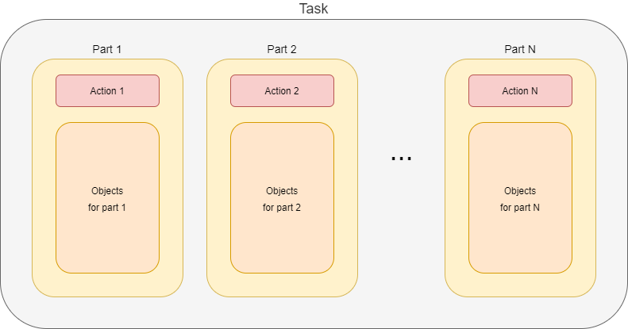

Usually, a task consists of a single such action. Examples are recomputation (of users),
import (of accounts), or perhaps deletion (of repository objects).

However, some tasks contain more actions. A typical case is the reconciliation task. It does the following:

1. First, it executes pending operations. So, the object set for this action is
_all shadows on a given resource with given object class that have pending operations_.

2. Then, it reads resource objects and synchronizes them with respective focal objects. The
object set is _all objects on a given resource with given object class_.

3. Finally, remaining shadows are refreshed. The object set is _all shadows on a given resource
with given object class that were not synchronized since this task started_.

There are other possible reasons for dividing a task into parts. For example, the validity scanner operates
on objects and their assignments whose validity boundary ("valid from" or "valid to") is in the specified
time interval. Because the database query that covers both objects and their assignments takes too much time
to evaluate (at least on some databases), validity scanner task can have two parts: the first
looks after validity of the _objects_, and the second treats the validity of _objects' assignments_.

Another example of task parts is use of
task link:https://wiki.evolveum.com/display/midPoint/Thresholds[thresholds]. Shortly speaking,
thresholds allow us to specify limit on defined operations, such as creation or deletion of a user
or account, modification of specified properties, and so on. Thresholds can be used either with
"do, then think" or "think, then do" approach. The former means that the respective task is run,
and after a specified threshold (number of watched operations) is reached, the execution is stopped.
The effects of operations carried out until that point are permanent. But the latter approach
divides the task into two parts: _simulation_ and _execution_. The first part
does not execute anything, just simulates the operations and watches the thresholds.
If none of them is reached, the second part (i.e. the actual execution) is run.
Otherwise, the tasks stops after the first part, without executing anything.

=== Task parts and task objects

The _part_ is a logical concept. It describes what has to be done, and how.
In running system, what we observe are _task objects_: instances of `TaskType` stored in
the repository. How are parts mapped to the task objects? There are the following options:

1. Each part is executed in its own task object.
2. All parts are executed within the same task object.

The former looks like this:

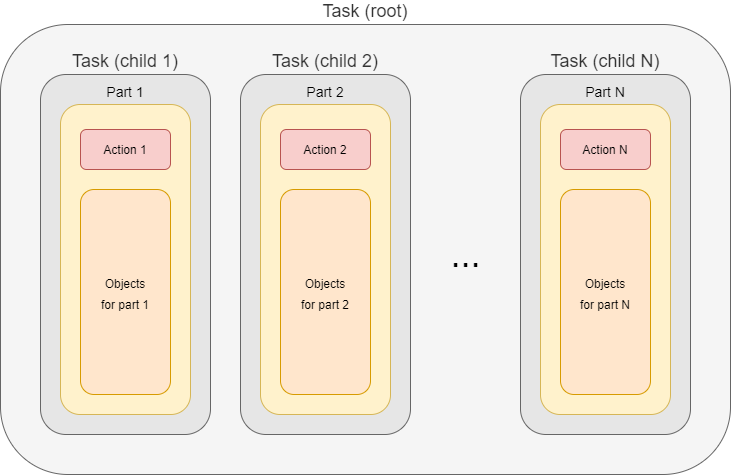

There is a root task object that holds information about the whole task, for example the description
of individual parts. It does not execute anything on its own: it just waits until all parts
are done.

Parts are executed in context of separate subtasks. They contain everything that is needed,
e.g. action and options specification, object set delineation, and so on. Each task can have its own
worker subtasks (see below). Everything is well-organized and clean, at the cost of creating
additional task objects.

The latter model, i.e. having single task object, looks like this:

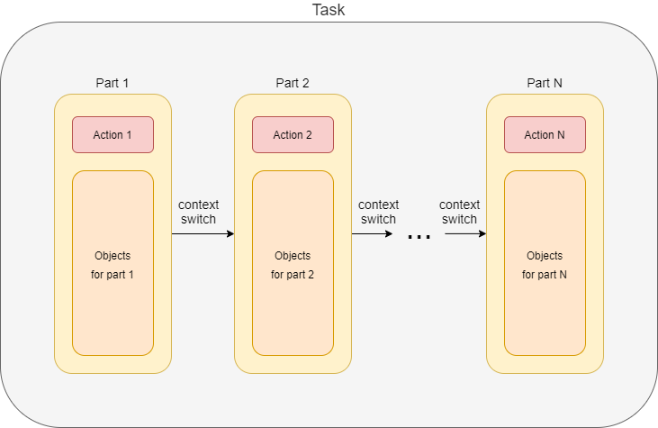

Here we have only a single task object that encapsulates the whole processing. Those elements
of configuration and task state that are specific for individual parts are "switched"
in the task object when the processing proceeds from a part to the following one. This fact
is denoted as "context switch" in the figure above.

This model is suitable for smaller tasks, namely in situations where there are no separate worker
tasks present.

== Buckets

Sets of objects that are to be processed in individual parts can be internally structured into
_buckets_. A bucket is the basic unit of work. The task knows which buckets were processed and therefore
it is able to be stopped and later restarted, continuing processing at the point of the first unprocessed
bucket. Moreover, individual buckets can be processed in parallel by worker subtasks (see later).

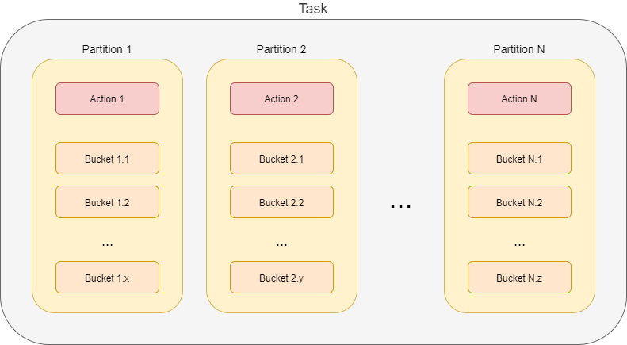

The set of objects for part 1 is divided into _x_ buckets (Bucket 1.1 to Bucket 1.x). Objects for
part 2, which may or may not be the same as objects for part 1, are divided into _y_ buckets
(Bucket 2.1 to Bucket 2.y). Even if the object sets are the same, division into buckets can be different.
Similarly, the buckets be created for remaining parts.

== Worker tasks and worker threads

How are the actions executed? First, individual parts are usually executed sequentially.
footnote:[Although it is technically possible to execute parts in parallel, it should be done only
if the consequences of doing so are well understood.] The execution of individual parts
takes place within so-called _worker tasks_. In the picture below, there are _x_ worker tasks for
part 1, _y_ worker tasks for part 2, and _z_ worker tasks for part N.

Note that there may or may not be per-part task objects, as described above. We do not show
them in the figure to keep things simple.

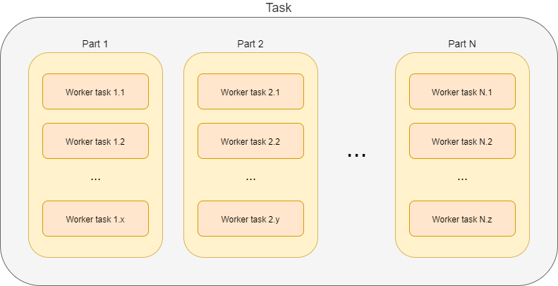

The worker tasks operate on individual buckets. It means that they try to obtain available buckets,
i.e. buckets that are not completed nor allocated to another worker task.

In the following picture we see two worker tasks that have to process 1000 buckets.

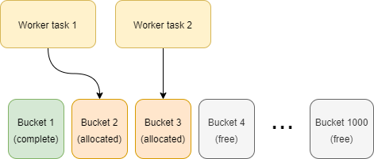

Bucket 1 is already done (by either worker 1 or worker 2), bucket 2 is being processed by worker task 1,
bucket 3 is being processed by worker task 2, and the other buckets are waiting to be processed.

=== Threads

Each worker task contains one or more _threads_ that do the actual work.

The simplest situation is that there is a single thread for the task. The thread then does everything:
issues a query to obtain objects in the given bucket (either from the repository or from a resource),
receives the objects, and processes them one after another.

This works well, but often does not provide adequate performance. Therefore, the processing within
a worker task can be _multi-threaded_: there is a _coordinator thread_ that issues a query and receives the objects,
and there are _worker threads_ that executes specified action on individual objects.

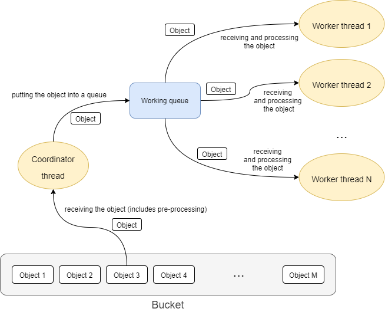

These threads are bound together by an in-memory _queue_ where the coordinator places objects
after retrieving and pre-processing them, and from where individual worker threads take the objects
for definite processing.

The overall picture then looks like this:

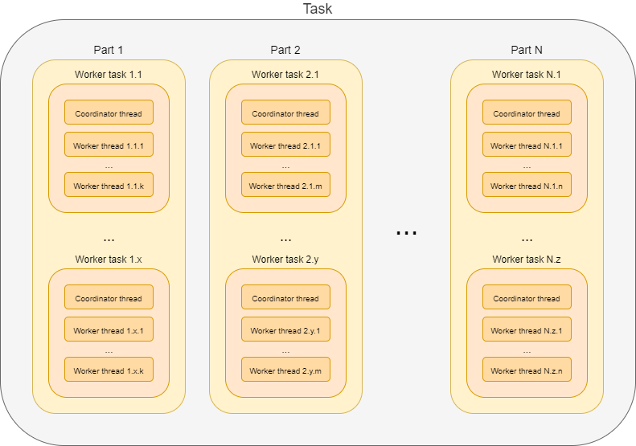

In summary, a task has the following hierarchy:

* parts
  ** worker tasks
    *** worker threads

Each level in this hierarchy can be "a singleton", e.g. there can be tasks that have:

- single part,
- single worker task (usually the same as part-containing task or the root task),
- worker task with a single thread,

in all possible combinations.

== Non-standard tasks

The usual case for tasks is that there is a defined set of accessible objects. These objects
reside either in midPoint repository or on a resource. They can be retrieved using `searchObjects`
or `searchObjectIterative` call with an appropriate query. They can be usually also counted using
`countObjects` with the same query.

This also means that these objects can be divided into buckets by adding appropriate
clauses to the defining query.

However, there are some tasks that do not match this model: _live synchronization_ and
_asynchronous updates_ tasks. Let's have a look on them.

=== Live synchronization

Live synchronization task asks a resource for synchronization deltas, i.e. for information on what has
been changed since specified time (in most cases since last synchronization).
Then it processes the changes retrieved.

The task does not know in advance how many objects to be processed there are. Nor there is a possibility
to specify a query for selection a subset of the changes, except for object class name.
This means that division into buckets is not available. So there is:

- typically a single part (but more are possible in case of thresholds, i.e. _simulate_ and _execute_),
- a single worker task (it is of no use to create more worker tasks, because there are no buckets to be divided among them),
- one or more threads within that single worker task.

The division of work among worker threads is a bit more complex than for standard tasks.
The reason is that ordinary tasks work with objects, while live synchronization works with _changes_.
The changes can have dependencies. Typically, if (earlier) change A and (later) change B both describe
the same object, they must be applied sequentially: first A, then B.footnote:[See link:https://github.com/Evolveum/midpoint/blob/8c0f1d810fcc106e2b77ee1cd70e49e80fe256d1/provisioning/provisioning-impl/src/main/java/com/evolveum/midpoint/provisioning/impl/sync/RequestsBuffer.java#L19-L31[RequestsBuffer] class]

=== Asynchronous updates

This is even more special task than live synchronization. It does not retrieve changes to be processed.
Instead, the changes arrive unpredictably, as they are generated by the resource.

So there cannot be even simulate/execute parts. There is:

- a single part,
- a single worker task,footnote:[If we had a situation in which change ordering is not important, we
could start multiple worker tasks against the same asynchronous update source, e.g. JMS queue.
The usual JMS mechanisms for load distribution would ensure distribution of change messages to these
worker tasks. Unfortunately, message ordering _is_ almost always important.]
- one or multiple threads.

The processing is similar to the one in live synchronization, including the need for processing changes
in the correct order.

== State reporting

====
*Requirements*

Task state should be reported in a clear and consistent way.

*Current state*

The task state is sometimes misleading. Especially for multi-node or multi-part tasks it shows
the state of the global task as "waiting", although the task is normally operating.
====

=== Global task state

Let's have a look in which states a task can be. We will describe states of global (conceptual) tasks, not
the ones of technical tasks (task objects).

[cols="1,4,4"]
[%header]
|===
| State | Description | Note
| Waiting | The task is waiting for a prerequisite task.
| In contrast to pre-4.3 model, the waiting state can occur only on the beginning of the
task lifecycle. There is also no idea of task waiting for its subtasks (at the conceptual level).

| Runnable | The task is ready to run. It waits for the scheduled time or for manual scheduling.
|

| Running | The task is executing, i.e. one or more of its parts are executing.
|

| Closed | The task is complete. This can occur either when the work is done (for single-run tasks),
or when an administrator cancels the task. This is the final state.
| Task cancellation is a new concept.

| Suspended | Execution of the task was suspended. It can be resumed later.
| See part suspension below.
|===

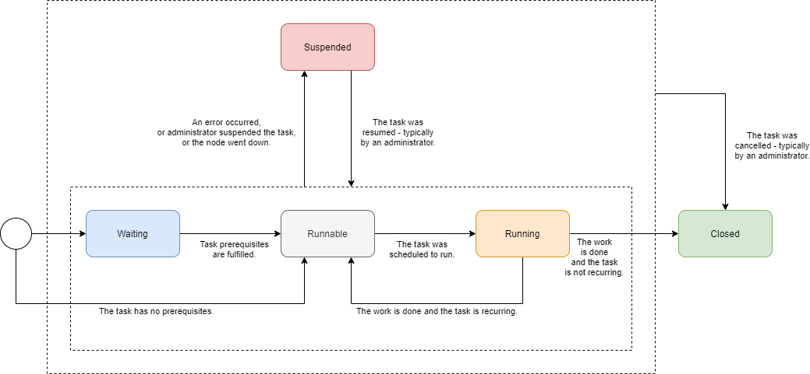

=== Task part state

The state of any task part can be:

[cols="1,4"]
[%header]
|===
| State | Description
| Waiting | The part is waiting to be started in the context of current task execution.
It waits for the previous (prerequisite) parts to be completed or cancelled.

| Running | The part is executing, i.e. processing objects.

| Closed | The part is complete. It processed all of its objects (successfully or not),
or it was cancelled by an administrator. It will not resume its execution as part of
this task run. This is the final state.

| Suspended | Execution of this part was suspended. It could happen either because an error
occurred, or it was requested by an administrator, or the executor node went down (and automatic
restart was not configured). The execution of this part can be resumed later.

|===

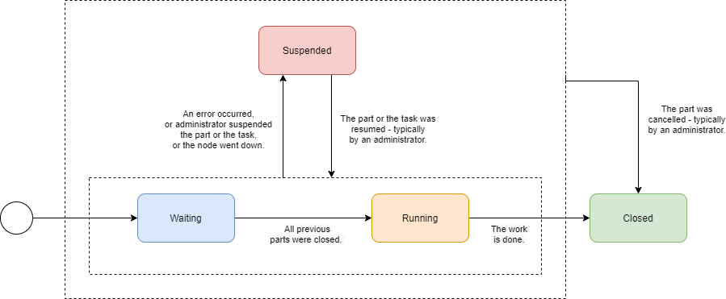

=== Worker task state

Worker tasks are simple. They start running when the respective part starts, and they work
until done, suspended, or cancelled. Note that the suspension or cancellation can occur at any
level: the whole task, current part, or individual worker task.

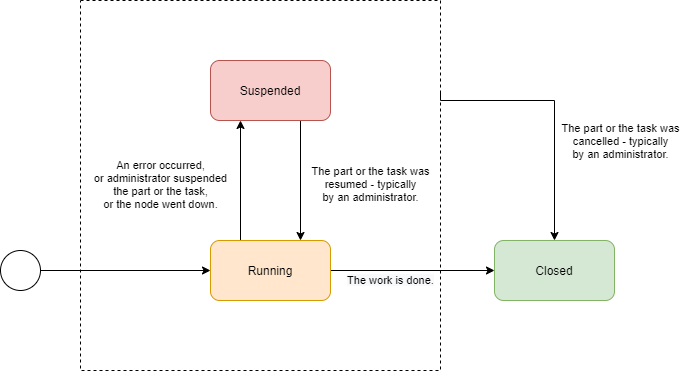

=== Worker thread state

Finally, worker threads are the simplest. They start running when their owner (a worker task)
starts. They stop only in three cases:

1. there is nothing more to do,
2. owning task stops,
3. or there is a fatal error.

(The third case should not occur, as it quietly reduces the number of worker threads, slowing down
the worker task progress.)

There is no concept of worker thread suspension or resuming.

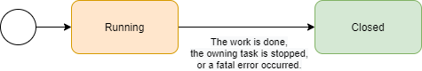

=== Compound state

Standard task lifecycle looks like this:

[cols="2,2,2,2,2,2,2"]
[%header]
|===
| Global task
| Previous parts
| Current part
| Next parts
| Workers in previous parts
| Workers in current part
| Workers in next parts

| waiting or runnable
3+| not existing
3+| not existing

| running
| closed | running | waiting
| closed | running | not existing

| suspended footnote:[Assuming suspension "from the top" i.e. that an administrator suspends the whole processing.]
| closed | suspended | waiting
| closed | suspended | not existing

| closed
| closed | closed | closed
| closed | closed | closed

|===

All parts are created when the global task execution starts. In contrast, worker tasks
are created only when the respective part starts. Completed parts and tasks remain in
the closed state e.g. to be available for inspection.

If the whole (global) task is suspended, the currently executing part and its workers are suspended as well.

What about suspensions that occur at lower levels? There can be e.g. the following situations:

* Some (but not all) of the workers in a task part are suspended: either because of administrator's action
or because of some unhandled fatal error. The task itself continues running, so there's no need to report
the state as anything other than "running" (maybe with additional information that the running capacity is reduced).

NOTE: There are some interesting questions: What if a node goes down? Worker tasks bound to that node
will be stuck in suspended or runnable state (depending on the setup). Also, what if a worker task
encounters a fatal error (like a misconfigured resource)? Should it suspend, hoping that all other workers
will suspend as well?

* All workers in a task part are suspended. The global task execution is therefore halted (assuming
there is no parallel execution of parts). We should report this somehow.

Maybe we could introduce some extra states?

[cols="2,8"]
[%header]
|===
| State | Description
| Running (reduced) | The global task, task part, or even worker task runs at a reduced speed, because
some of the worker tasks or worker threads are suspended or has died.
| Halted | The execution of the global task, task part, or worker task was halted because all the
worker tasks or worker threads are suspended or has died.
|===

These states are actually the same as the "running" state. They are only a kind of indication that there's
a condition that prevents the full speed of the execution. After the condition is over, the task/part
state is shown as "running".

*TODO think about this*

== Progress reporting

====
*Requirements*

It should be shown how much work has been done, and how much is yet to be done. Time per item,
throughput, and estimated completion time should be visible.

For tasks that run for hours or days it is crucial to see where we are on the road, and how long that road is.

*Current state*

There are several progress and performance indicators, e.g.

* "progress" vs "objects processed" vs "percent complete",
* "average time" vs. "wall-clock average time".

These are sometimes imprecise, or even outright conflicting. Estimated completion information
is missing. It is often not clear which counters are reset on task re-execution (e.g. for live
sync or async update tasks) and which are not.
====

=== Task parts progress

[cols="2,2,3,3"]
[%header]
|===
|Part type
|# of buckets: completed vs. total
|# of objects in current bucket: completed vs. total
|# of objects overall: completed vs. total

| Standard footnote:[One or more buckets. If a single bucket, then the first metric makes no sense,
and the second and third metrics are the same.]
| If more buckets.
| Yes footnote:[Knowing the total requires additional `countObjects` operation for each bucket.]
| Yes footnote:[Knowing the total requires additional large `countObjects` operation that might take a substantial time.]

| Live sync footnote:[No buckets available. Or this can be seen as a single-bucket case.]
| -
2+| Total is currently not known, see link:https://jira.evolveum.com/browse/MID-5840[MID-5840].

| Async update
| -
2+| Total is not known.
|===

=== Task progress

A reasonable way of displaying task progress looks like this:

[cols="2,2,2,2"]
[%header]
|===
| Task
| Metric
| Example (long form)
| Example (short form)

| Single part, more buckets
| Bucket percentage
| 10% (25 of 256)
| 10%

| Single part, single bucket
| Objects percentage
| 10% (2500 of 25000)
| 10%

| Multiple parts, more buckets
| Bucket percentage
| 10% in part 2 of 3
| 10% in 2/3

| No total known
| Objects processed
| 2500
| 2500
|===

=== Estimated time to complete

Given _t_ (processing time) and _pc_ (percent complete) we can calculate estimated time to complete
_ttc_ as

----
             100%
ttc = t x ( ------ - 1 )
              pc
----

(assuming 100% >= _pc_ > 0, _t_ > 0)

The problem is that if the task was suspended and resumed, the _t_ cannot be computed simply as
"current time - start time". We have to know the real ("net") processing time.

Another issue is that for multi-part tasks (like reconciliation) we can estimate the time-to-complete
only for the current part. Normally, this shouldn't be a big problem, because the most prominent
multi-part task is the reconciliation, and it has almost empty first part, significant second one,
and almost empty third one.

== Error reporting

====
*Requirements*

Failures inevitably occur. They are not only caused by configuration issues, but often by external
factors: wrong data, infrastructure outages, and so on. Failures and their effects have to be
diagnosed and fixed quickly, and without inappropriate effort.

*Current state*

There are some mechanisms for error reporting: audit records, operation execution records,
iterative task information, operation result. They sometimes complement each other,
sometimes they overlap, often leading to inconsistent overall view.

See:

* MID-4832 (still relevant?),
* MID-4991,
* ...

====

The processing of objects goes through the following main phases. Let us deal with
tasks that operate on resource objects, because their processing is the most complex.
(For repository objects, phases of provisioning and synchronization service processing
are skipped.)

[cols="1,3"]
[%header]
|===
| Phase | Description
| Provisioning (preprocessing)
| A ConnId object is converted into midPoint resource object,
a shadow is found and updated (or not found and created).
After this phase an object is presented to the processing task.

| Synchronization service
| A resource object is matched against synchronization rules.
This includes looking up object owner. An appropriate action is selected.

| Clockwork processing, part 1: Projector
| Here midPoint computes changes
that are to be applied to the focal object and to the projections.

| Clockwork processing, part 2: Change execution
| Computed changes are applied.

| Embedded clockwork execution
| During clockwork processing it is possible that a more or less related clockwork run
is started. This occurs typically as a result of handling errors during change execution
(like "object already exists"). But it can be also because of on-demand assignment target
creation, policy rules execution, and so on.
|===

=== Current state

Currently we have the following error reporting mechanisms:

[cols="1,3,1"]
[%header]
|===
| Mechanism | Description | Covers

| Audit
| Any operation in the clockwork is audited: both at the beginning ("request")
and at the end ("execution"). The user can then display e.g. all executions in the last 24 hours
that resulted in an error.
| Clockwork only

| Operation execution records
| Any midPoint object keeps a list of N last operations executions, including related task OID
and the result status. This allows midPoint to display all objects that failed to be processed
by a task.footnote:[There are two kinds of errors shown here: errors occurring during a target
resource object operation (e.g. when adding, modifying, or deleting an account), and general errors
occurring during clockwork processing. Currently, we do not distinguish between these two kinds.
Both are recorded in respective objects in the same way. TODO: describe this in more details.]
| Clockwork only

| Iterative task information
| Iterative task handlers record the information on objects processed (including final status)
into the task. These information are not detailed, though. Only the number of failed objects
and the last object identification are recorded. As a hack, information about last 30 failed
objects are written to the operation result upon task completion.
| Task operation

| Operation result
| Contains detailed information about failed operations. Unfortunately, these information
are summarized because of space constraints, so they are not usable for later diagnostics.
| The whole operation
|===

The current state of error reporting mechanisms is like this:

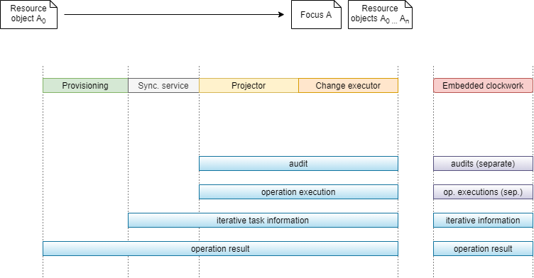

As we can see, audit and operation execution do not cover errors occurring in provisioning
or synchronization service. Moreover, they are written separately for each embedded clockwork
operation.

Iterative task information does not record each failed object. On the other hand, it covers
the synchronization service processing, and also all embedded clockwork executions.

The operation result covers all parts of the operation, but it is not suitable for comprehensive
error reporting because of the summarization. Moreover, errors occurring during provisioning
pre-processing are in a different parts of the operation result tree than the errors occurring
in the synchronization service and clockwork components.

=== The way forward

The audit and operation execution recording are good mechanisms. But they need to be extended
to cover also provisioning pre-processing and synchronization service phases of the process.

We should start with the operation execution records. They should be written not only by the clockwork
but also by the task handler involved. The details have to be thought out.

As for the audit records, the errors in provisioning and synchronization service do not match
well the existing "request-execution" style of auditing. So, most probably, the audit will not catch
these errors in the near future.

The iterative task information will need to be extended to cover provisioning pre-processing,
but it will - most probably - maintain only statistical information (# of failures, last failed object).
After operation execution is fixed, we will remove "last 30 failed objects" hack from this data structure.

Finally, the operation result can stay as it is. It will have no role to play for routine error
reporting. (But for diagnostics of unusual errors it will be probably the first choice.)

== Other statistics

TODO