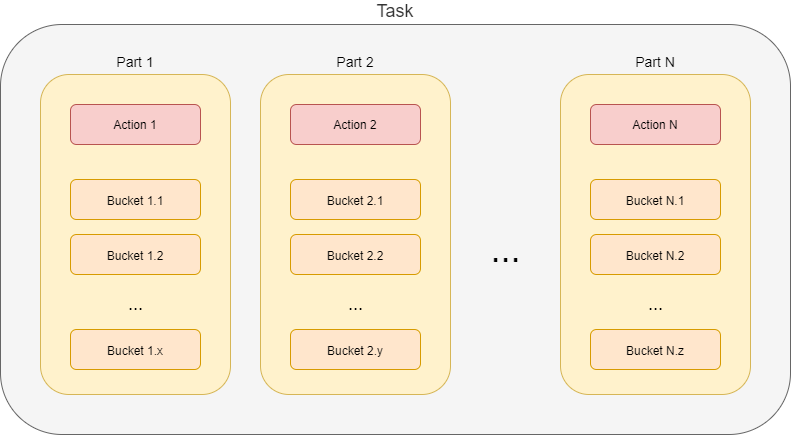
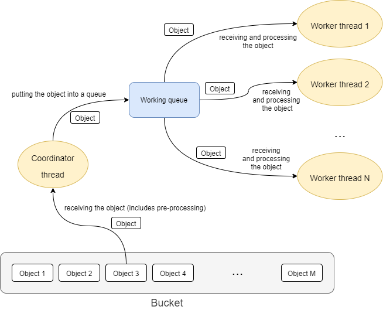

= Task state, progress, and error reporting

== What is a task, anyway?

A _task_ is a set of _actions_ that have to be executed on sets of _objects_.
A combination of an action and its object set is called _task partition_.footnote:[This term should be perhaps
replaced by something more appropriate. The word _partition_ has well-known meaning in the database domain.]
footnote:[The action includes _options_ that determine how exactly is the action executed. An example of
such options are _dry run_, _simulation_, or real _execution_.]

image::task-composition-partitions.png["Task composition (partitions)"]

Usually, a task consists of a single such action. Examples are recomputation (of users),
import (of accounts), or perhaps deletion (of repository objects).

However, some tasks contain more actions. A typical case is the reconciliation task. It does the following:

1. First, it executes pending operations. So, the object set for this action is
_all shadows on a given resource with given object class that have pending operations_.

2. Then, it reads resource objects and synchronizes them with respective focal objects. The
object set is _all objects on a given resource with given object class_.

3. Finally, remaining shadows are refreshed. The object set is _all shadows on a given resource
with given object class that were not synchronized since this task started_.

There are other possible reasons for partitioning a task. For example, the validity scanner operates
on objects and their assignments whose validity boundary ("valid from" or "valid to") is in the specified
time interval. Because the database query that covers both objects and their assignments takes too much time
to evaluate (at least on some databases), validity scanner task can have two partitions: the first
looks after validity of the _objects_, and the second treats the validity of _objects' assignments_.

Another example of partitioning it use of
task link:https://wiki.evolveum.com/display/midPoint/Thresholds[thresholds]. Shortly speaking,
thresholds allow us to specify limit on defined operations, such as creation or deletion of a user
or account, modification of specified properties, and so on. Thresholds can be used either with
"do, then think" or "think, then do" approach. The former means that the respective task is run,
and after a specified threshold (number of watched operations) is reached, the execution is stopped.
The effects of operations carried out until that point are permanent. But the latter approach
divides the task into two partitions: _simulation_ and _execution_. The first partition
does not execute anything, just simulates the operations and watches the thresholds.
If none of them is reached, the second partition (i.e. the actual execution) is run.
Otherwise, the tasks stops after the first partition, without executing anything.

== Buckets

Sets of objects that are to be processed in individual partitions can be internally structured into
_buckets_. A bucket is the basic unit of work. The task knows which buckets were processed and therefore
it is able to be stopped and later restarted, continuing processing at the point of the first unprocessed
bucket. Moreover, individual buckets can be processed in parallel by worker subtasks (see later).

The set of objects for partition 1 is divided into _x_ buckets (Bucket 1.1 to Bucket 1.x). Objects for
partition 2, which may or may not be the same as objects for partition 1, are divided into _y_ buckets
(Bucket 2.1 to Bucket 2.y). Even if the object sets are the same, division into buckets can be different.
Similarly, the buckets be created for remaining partitions.

== Worker tasks and worker threads

How are the actions executed? First, individual partitions are usually executed sequentially.
footnote:[Although it is technically possible to execute partitions in parallel, it should be done only
if the consequences of doing so are well understood.] The execution of individual partitions
takes place within so-called _worker tasks_. In the picture below, there are _x_ worker tasks for
partition 1, _y_ worker tasks for partition 2, and _z_ worker tasks for partition N.

image::task-composition-workers.png["Task composition (workers)"]

The worker tasks operate on individual buckets. It means that they try to obtain available buckets,
i.e. buckets that are not completed nor allocated to another worker task.

In the following picture we see two worker tasks that have to process 1000 buckets.

image::workers-and-buckets.png["Workers and buckets"]

Bucket 1 is already done (by either worker 1 or worker 2), bucket 2 is being processed by worker task 1,
bucket 3 is being processed by worker task 2, and the other buckets are waiting to be processed.

=== Threads

Each worker task contains one or more _threads_ that do the actual work.

The simplest situation is that there is a single thread for the task. The thread then does everything:
issues a query to obtain objects in the given bucket (either from the repository or from a resource),
receives the objects, and processes them one after another.

This works well, but often does not provide adequate performance. Therefore, the processing within
a worker task can be _multi-threaded_: there is a _coordinator thread_ that issues a query and receives the objects,
and there are _worker threads_ that executes specified action on individual objects.

These threads are bound together by an in-memory _queue_ where the coordinator places objects
after retrieving and pre-processing them, and from where individual worker threads take the objects
for definite processing.

== Non-standard tasks

There are two tasks that cannot work with buckets, and therefore do not exactly match the model
described above. They are _live synchronization_ and _asynchronous updates_ tasks.

=== Live synchronization

Live synchronization task asks a resource for synchronization deltas, i.e. information on what has
been changed since specified time (usually since last synchronization). Then it processes changes retrieved.
So it is a coordinator/worker threads case, with some additional constraints.footnote:[For example,
we have to ensure that changes are processed in the same order as they were provided by the resource.]

No buckets are available, so there can be only single worker task in this case.

=== Asynchronous updates

This is a quite special task. It does not have known objects (or changes) to be processed. Instead,
the changes arrive unpredictably, as they appear on the resource. The processing is similar to the one
in live synchronization.

Again, no buckets are there, so we can have only single worker task.footnote:[If message ordering was not
important, we could start multiple worker tasks against the same asynchronous update source, e.g. JMS
queue. Built-in mechanisms for load distribution would ensure distribution of change messages to these
worker tasks.]

== State and progress reporting

TODO ...