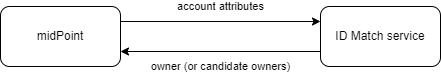
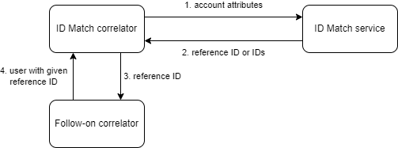

= Identity Matching (Correlation) Implementation

This is a description of an implementation of so-called _identity matching_
using link:https://spaces.at.internet2.edu/display/cifer/SOR-Registry+Strawman+ID+Match+API[ID Match API].

NOTE: The midPoint term for matching resource objects with midPoint user population
is _correlation_. In this document we will use the terms of "identity matching" and "correlation"
interchangeably; preferring the latter one.

== Introduction

Before midPoint 4.5, the correlation process was quite limited: It was possible to provide a
xref:/midpoint/reference/synchronization/correlation-and-confirmation-expressions/[query] -
or a set of queries - along with optional confirmation expression.
These were evaluated against midPoint repository,
and produced zero, one, or more _candidate owners_. If this process resulted in a single candidate,
it was perceived as the owner of the account. If no object was found, this meant that an owner
should be created (if appropriate reaction was set). And if multiple objects were found,
the synchronization situation was said to be _disputed_, and practically no further processing
was possible.

Starting with midPoint 4.5, the correlation process is much richer. First, midPoint can deal with
multiple candidate owners. In such situation - if configured so - it can create a _correlation case_,
i.e. something that can be manually resolved. The case contains a list of candidate owners,
and asks the human operator to choose among them. Second, midPoint is no longer restricted
to internal actions when doing the correlation. It can now invoke external ID Match API provider
that does the matching, and returns the owner (or a list of candidate owners) to midPoint.

.Communication between midPoint and ID Match service

== Sample Scenario

Let us now describe how the matching is configured.

We will use the most basic scenario, where we have a single source resource (Student Information System),
supplying user personal data: given name, family name, date of birth, and national ID. We ignore
other attributes for now.

We will match accounts from this resource to midPoint users using the
xref:sample-id-match-service.adoc[sample ID Match Service], pre-configured with three simple matching rules.

Before specifying the correlation details themselves, please have a look at
xref:correlation-time-mappings.adoc[correlation-time mappings].
We'll use them in the description below.

== Configuring the Correlation

The correlation definition is written in new `correlationDefinition` item, which is eventually
going to supersede both `correlation` and `confirmation` items.

The most simple definition of ID Match-based correlation looks like this:

[#listing1]
.Listing 1. Simple definition of ID Match-based correlation
[source,xml]
----
<correlationDefinition>
    <correlators>
        <idMatch>
            <url>http://localhost:9090/match/api/2</url>
            <username>administrator</username>
            <password><t:clearValue>5ecr3t</t:clearValue></password>
            <followOn>
                <filter>
                    <ownerFilter>
                        <q:equal>
                            <q:path>extension/referenceId</q:path>
                            <expression>
                                <path>$correlatorState/referenceId</path>
                            </expression>
                        </q:equal>
                    </ownerFilter>
                </filter>
            </followOn>
        </idMatch>
    </correlators>
    <cases/>
</correlationDefinition>
----

Let us describe it in detail.

=== The `correlators` Section

This section specifies how the correlation should take place. You can define a lot of various correlators here.
However, the only one that is officially supported in 4.5 is `idMatch` correlator.

==== ID Match Correlator Configuration

The configuration contains the URL of the ID Match service to be used, along with the credentials.

Then it contains so-called _follow-on_ correlator. What's its purpose?

ID Match service does _not_ know about midPoint users nor their OIDs. It works with the concept of _reference IDs_ - globally-unique
identifiers assigned by the service to individual persons. Therefore, the result of a matching process can be threefold:

1. Either the reference ID of already known person is returned,
2. or a new reference ID is generated,
3. or a list of reference IDs (candidate matches) is returned.

MidPoint then must somehow deal with this information.

The most natural way of using reference IDs is this:

1. A reference ID for a person is stored somewhere in the user object. It can be in a selected standard property
(like `employeeNumber` or `name`), or in an extension property (e.g. `extension/referenceId` as in our example).

2. When ID Match service returns a reference ID or IDs (either as a definite match, or as part of the list
of match candidates), the follow-on correlator looks up user or users by looking for these values in the
user population. In our example, midPoint tries to find a user with `extension/referenceId` equal
to the ID obtained, which is available in `$correlatorState/referenceId` property.

.Reference ID resolution process

As we describe later, there is a mapping that puts the reference ID to this property. See xref:#sisId[Listing 4] below.

[NOTE]
====
Besides ID Match, there are the following _experimental_ correlators:

[%autowidth]
[%header]
|===
| Correlator | Description
| `items` | Correlate using specified set of items (computed by xref:correlation-time-mappings.adoc[correlation-time inbound mappings]).
| `filter` | Traditional filter-based correlation.
| `expression` | Correlation that uses custom expression.
| `composite` | Composite correlation that invokes a set of child correlators (with a different level of authority)
and combines their results.
| `none` | Always returns "no owner" response. For development/testing purposes.
|===

You may use them on your own risk. But beware, the supported way of correlating (except for ID Match)
is still to use `correlation` and `confirmation` items.
====

=== The `cases` Section

When multiple potential owners are found, the default midPoint behavior is to simply store them in the shadow object.
(In the `correlation` item.) This may be useful in the initial stages of midPoint deployment when the correlation
rules are not tuned enough, and may provide a lot of false matches. But, as you became more confident in your
correlation rules, you may turn on the creation of _case_ objects that trigger human resolution
of correlation-related questions.

You do that by including (empty) `<cases>` item in your `<correlationDefinition>`, as can be seen in xref:#listing1[Listing 1].

=== The `items` Section (Optional)

By default, midPoint sends to ID Match service all single-valued properties that it finds in the focus
object computed by "before-correlation" inbound mappings. This may or may not be suitable in your case.
If you need to customize this information, you can specify these properties explicitly.

The basic configuration may look like this:

.Listing 2. Specification of items to be sent to ID Match service
[source,xml]
----
<definitions>
    <items>
        <item>
            <path>givenName</path>
        </item>
        <item>
            <path>familyName</path>
        </item>
        <item>
            <path>extension/dateOfBirth</path>
        </item>
        <item>
            <path>extension/nationalId</path>
        </item>
    </items>
</definitions>
----

This simply tells midPoint to take the values of `givenName`, `familyName`, `extension/dateOfBirth`, and `extension/nationalId`,
and send them to ID Match service under respective names: `givenName`, `familyName`, `dateOfBirth`, and `nationalId`.

=== Mappings

Now let us see how attributes from resource accounts (along with reference ID from ID Match service) are mapped
to midPoint user properties.

Let us describe sample `objectType` definition from the resource. The start of the definition is quite standard:

.Listing 3. Start of the object type definition
[source,xml]
----
<objectType>
    <kind>account</kind>
    <intent>default</intent>
    <default>true</default>
    <objectClass>ri:AccountObjectClass</objectClass>
    <!-- ... -->
</objectType>
----

==== Mappings for `sisId` and `referenceId`

Here is the first attribute of `sisId` (a unique account identifier):

[#sisId]
.Listing 4. Declaration of `sisId` attribute
[source,xml]
----
<attribute>
    <ref>ri:sisId</ref>
    <inbound> <!--1-->
        <strength>strong</strength>
        <target>
            <path>extension/sisId</path>
        </target>
    </inbound>
    <inbound> <!--2-->
        <strength>strong</strength>
        <expression>
            <path>$shadow/correlation/correlatorState/referenceId</path>
        </expression>
        <target>
            <path>extension/referenceId</path>
        </target>
        <evaluationPhases>
            <!-- Before correlation, this ID may not be known. -->
            <exclude>beforeCorrelation</exclude>
        </evaluationPhases>
    </inbound>
</attribute>
----
<1> Mapping of `sisId` attribute to the user extension property.
<2> Mapping of `referenceId` property (not an attribute!) to the user extension property.

There are two mappings here.

The first one is quite standard one: we store the ID in specific extension property (`sisId`).

The second one is - in fact - not related to `sisId` at all. It stores the referenceId obtained from the ID Match service
(and stored in the shadow in `correlation/correlatorState/referenceId` property) in user `extension/referenceId` property.
We have to do this to allow this user be correlated by this ID later.

We explicitly _forbid_ execution of this mapping before the correlation. It is because at that time we have (obviously)
no reference ID.

==== Mappings for other (regular) attributes

Mappings for other attributes are fairly standard. An example:

.Listing 5. Declaration for a regular attribute
[source,xml]
----
<attribute>
    <ref>ri:firstName</ref>
    <inbound>
        <strength>strong</strength>
        <target>
            <path>givenName</path>
        </target>
    </inbound>
</attribute>
----

==== Enabling processing of mappings before the correlation

Finally, we have to ensure that the regular mappings are executed _both_ before correlation and in regular clockwork processing:

.Listing 6. Enabling execution of inbound mappings both before correlation and during clockwork
[source,xml]
----
<mappingsEvaluation>
    <inbound>
        <defaultEvaluationPhases>
            <phase>clockwork</phase>
            <phase>beforeCorrelation</phase>
        </defaultEvaluationPhases>
    </inbound>
</mappingsEvaluation>
----

== For More Information

The whole resource definition can be seen link:https://github.com/Evolveum/midpoint/blob/master/testing/story/src/test/resources/correlation/idmatch/simple/resource-sis.xml[on GitHub].

There are two more complex scenarios available:

1. Medium-complexity scenario, covering three source systems.
2. Multi-accounts scenario, covering a single resource with potentially more accounts per user.
