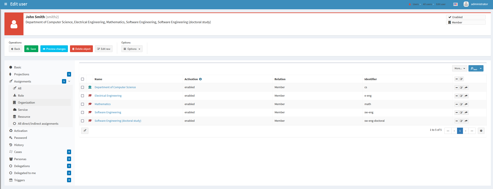
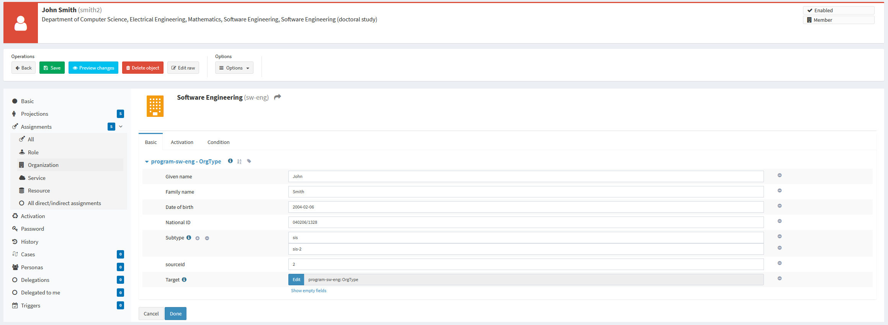
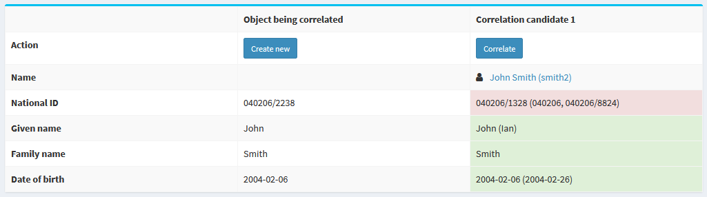

= Identity Matching: Multi-Accounts Scenario

Here we demonstrate ID Match API integration on a scenario that uses multiple accounts for a given user.

WARNING: Majority of the functionality described here is xref:/midpoint/versioning/experimental.adoc[experimental].
It may or may not work in your particular case, and - what is even more important - the way of its configuration
will change in the future.

NOTE: This page assumes you are familiar with the xref:implementation.adoc[simple matching scenario]. Please
read its description first.

== Overview

There are situations when you have _multiple sources of data_. For example, a student can study at multiple
faculties at once, and additionally work for a department or departments. At some institutions, this may
mean that we have multiple sources of data about the given person: from each faculty and from each department.
footnote:[The details depend on how the information systems are organized, e.g. if there is a centralized
student information system that supports identity matching itself, or not.]

In this scenario let's assume we have a Student Information System that does not attempt to match identities
itself, so it may keep various (not connected) records for a single physical person.

The goal of midPoint is to:

1. Correlate all records belonging to a single physical person.
2. Keep the records, and somehow select the "official" data from them.

== Student Information System

In this case, the Student Information System is represented by a CSV file with the following structure:

.Student Information System data structure
[%autowidth]
[%header]
|===
| sisId | firstName | lastName | born | nationalId | studyProgram
| 1 | Mary | Smith | 2006-04-10 | 060410/1993 | bioch
| 2 | John | Smith | 2004-02-06 | 040206/1328 | sw-eng
| 3 | John | Smith | 2004-02-06 | 040206 | e-eng
| ... | ... | ... | ... | ... | ...
|===

There is an identifier, given name, family name, date of birth, national ID, and the symbol for the study program.

NOTE: Records 2 and 3 most probably belong to the same person (John Smith). The only difference is that the latter one
contains incomplete national ID.

== Design

Unlike in xref:implementation.adoc[the simple scenario], we have to solve two distinct - but interdependent - issues here:

1. Correlation of accounts to users
2. Maintenance of all variants of the data (not only the "official" ones)

The latter point is not directly supported by midPoint for now, so we have to work a little to implement it. The basic
question is: where to put the data? The usual answer is "use extension items", but it seems to be not applicable here. We
don't know how many accounts would a user have, so it's not feasible to have items like `givenName1`, `givenName2`, etc.
footnote:[It would be possible to create multivalued extension container for the data, of course. The design would
be similar to the one we chose.]

Therefore, we have decided to use assignments for the storage of data variants. Each SIS account is mapped to an assignment
that keeps the given name, family name, date of birth, and national ID from the account. And, of course, it points to
appropriate study program.

Let's have a look at this very busy student that studies four programs, and works for the Department of Computer Science:

.User `smith2` with five assignments

Each assignment contains the personal data from the particular account.

.Details of the assignment

Therefore, personal data about a student are stored in various places in the user record:

1. The "official" data (selected from the most relevant account) are stored at the root level: in
`givenName`, `familyName`, `extension/dateOfBirth`, and `extension/nationalId` properties.
2. The partial data (copied from individual accounts) are stored in assignments: in
`assignment[x]/extension/givenName`, `assignment[x]/extension/familyName`, `assignment[x]/extension/dateOfBirth`,
and `assignment[x]/extension/nationalId`, where `x` is the internal identifier of given assignment
(unrelated to the SIS ID!).

== Implementation

=== Correlation

The correlation definition contains three parts:

1. Definition of correlation items - i.e. what should be sent to ID Match service and then displayed
within the correlation case.
2. ID Match correlator configuration.
3. Specification whether correlation cases should be created.

.Listing 1. Correlation definition
[source,xml]
----
<correlationDefinition>
    <correlators>
        <definitions>
            <items> <!--1-->
                <item>
                    <source>
                        <path>assignment/extension/givenName</path>
                    </source>
                    <target>
                        <path>givenName</path>
                    </target>
                    <target>
                        <qualifier>systems</qualifier>
                        <path>assignment/extension/givenName</path>
                    </target>
                </item>
                <item>
                    <source>
                        <path>assignment/extension/familyName</path>
                    </source>
                    <target>
                        <path>familyName</path>
                    </target>
                    <target>
                        <qualifier>systems</qualifier>
                        <path>assignment/extension/familyName</path>
                    </target>
                </item>
                <item>
                    <source>
                        <path>assignment/extension/dateOfBirth</path>
                    </source>
                    <target>
                        <path>extension/dateOfBirth</path>
                    </target>
                    <target>
                        <qualifier>systems</qualifier>
                        <path>assignment/extension/dateOfBirth</path>
                    </target>
                </item>
                <item>
                    <source>
                        <path>assignment/extension/nationalId</path>
                    </source>
                    <target>
                        <path>extension/nationalId</path>
                    </target>
                    <target>
                        <qualifier>systems</qualifier>
                        <path>assignment/extension/nationalId</path>
                    </target>
                </item>
            </items>
        </definitions>
        <idMatch> <!--2-->
            <sorIdentifierPrefix>sis-</sorIdentifierPrefix>
            <url>http://localhost:9090/match/api/1</url>
            <username>administrator</username>
            <password><t:clearValue>5ecr3t</t:clearValue></password>
            <followOn>
                <filter>
                    <ownerFilter>
                        <q:text>extension/referenceId = $correlatorState/referenceId</q:text>
                    </ownerFilter>
                </filter>
            </followOn>
        </idMatch>
    </correlators>
    <cases/> <!--3-->
</correlationDefinition>
----
<1> definition of correlation items
<2> ID Match correlator configuration
<3> specification that correlation cases should be created

The correlator and cases configurations are the same as in the xref:implementation.adoc[simple matching scenario], with one
slight addition: `sorIdentifierPrefix` can be used when there are multiple "systems of records" (source resources in midPoint speak).
The reason is that ID Match service stores individual records under so-called SOR identifiers. MidPoint derives these identifiers
from primary identifiers of respective accounts. But multiple source resources map to single SOR from the point of view of ID Match.
Therefore, to avoid collisions, you may specify a prefix for each midPoint resource to be used.

==== Items configuration

The `items` configuration is a bit more complex here.

First, as we have said above, personal data are stored at various places in the user object. One of the places
is for "official" datum, and the others are for partial ones.

The item definition reflects this.

.Listing 2. An example item in the correlation definition
[source,xml]
----
<item>
    <source> <!--1-->
        <path>assignment/extension/givenName</path>
    </source>
    <target> <!--2-->
        <path>givenName</path>
    </target>
    <target> <!--3-->
        <qualifier>systems</qualifier>
        <path>assignment/extension/givenName</path>
    </target>
</item>
----
<1> to be sent to ID Match service
<2> the official data
<3> the partial data

The `source` part specifies where we find the information that should be sent to the ID Match service.
It must be from the assignment, because this is where inbound mappings put the data from accounts.

The `target` part is not relevant for the matching itself. It is used to display the correlation case.

.The correlation case

In particular, the `target` part specifies what should be displayed for correlation candidates.
The data before parentheses (like the given name of `John`) are the official ones,
the data in parentheses (like `Ian`) are unofficial ones.

According to the definition, the former are taken from `givenName` property, while the latter from
`assignment/extension/givenName` properties. (Collected over all the assignments.)

=== Inbound Mappings

There are two inbound mappings. The first one deals with the reference ID, just like in xref:implementation.adoc[the simple matching scenario].
The second one is more complex: it transforms the whole account into a single assignment. It uses a custom library function to do that.

.Listing 3. Attribute mappings
[source,xml]
----
<attribute>
    <ref>ri:sisId</ref>
    <inbound> <!--1-->
        <strength>strong</strength>
        <expression>
            <path>$shadow/correlation/correlatorState/referenceId</path>
        </expression>
        <target>
            <path>extension/referenceId</path>
        </target>
        <evaluationPhases>
            <!-- Before correlation, this ID may not be known. -->
            <exclude>beforeCorrelation</exclude>
        </evaluationPhases>
    </inbound>
    <inbound> <!--2-->
        <strength>strong</strength>
        <source>
            <path>$shadow/attributes/ri:firstName</path>
        </source>
        <source>
            <path>$shadow/attributes/ri:lastName</path>
        </source>
        <source>
            <path>$shadow/attributes/ri:born</path>
        </source>
        <source>
            <path>$shadow/attributes/ri:nationalId</path>
        </source>
        <source>
            <path>$shadow/attributes/ri:studyProgram</path>
        </source>
        <expression>
            
        </expression>
        <target>
            <path>assignment</path>
            <set>
                <condition>
                    
                </condition>
            </set>
        </target>
    </inbound>
</attribute>
----
<1> mapping for `referenceId`
<2> mapping that creates an assignment for the source account

The custom library function can be seen link:https://github.com/Evolveum/midpoint/blob/12a9dc808d3ab5ed60c4e3c94d2f75404408708d/testing/story/src/test/resources/correlation/idmatch/multi-accounts/005-function-library-idmatch.xml#L13-L86[on GitHub].

=== Other Mappings

Besides filling-in assignments, we have to provide the "official" version of the personal information.
There may be - sometimes very complex - algorithms that determine what sources are considered to be
the most reliable, but they are usually institution-dependent. Here we simply take the record with
the numerically lowest SIS ID as the source of the official data.

.Listing 4. Sample mapping for a piece of personal information
[source,xml]
----
<mapping>
    <strength>strong</strength>
    <source>
        <path>assignment</path>
    </source>
    <expression>
        
    </expression>
    <target>
        <path>givenName</path>
    </target>
</mapping>
----

We take all the assignments, and use library function `getPersonalDataItem` to select the correct given name.

The function uses the above algorithm of finding the lowest SIS ID.

.Listing 5. Selecting the most reliable source of personal data items
[source,xml]
----
<function>
    <name>getPersonalDataItem</name>
    <documentation>
        Selects the assignment that contains the most authoritative personal data.
    </documentation>
    <parameter>
        <name>assignments</name>
        <type>c:AssignmentType</type>
    </parameter>
    <parameter>
        <name>itemName</name>
        <type>xsd:string</type>
    </parameter>
    <returnType>xsd:string</returnType>
    <returnMultiplicity>single</returnMultiplicity>
    
</function>
----

There are other mappings, like ones that generate the full name of a user (by combining given name and family name),
and the name of the user (by using family name plus an iterator). The details are link:https://github.com/Evolveum/midpoint/blob/c219648ff142d645de0f20a39f753a90a588280e/testing/story/src/test/resources/correlation/idmatch/multi-accounts/020-object-template-user.xml#L14-L31[on GitHub].

== Other Features

There are other features, like notifications about correlation cases created, or reports and dashboards displaying
the correlation state.

Some of all are implemented in the configuration that can be found link:https://github.com/Evolveum/midpoint/blob/c219648ff142d645de0f20a39f753a90a588280e/testing/story/src/test/resources/correlation/idmatch/multi-accounts#L118-L118[on GitHub], while others will be part
of the sample Docker deployment that is being prepared.
