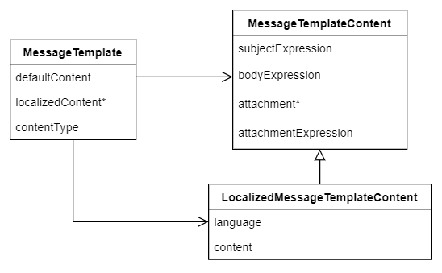
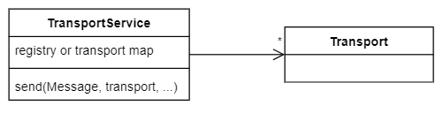
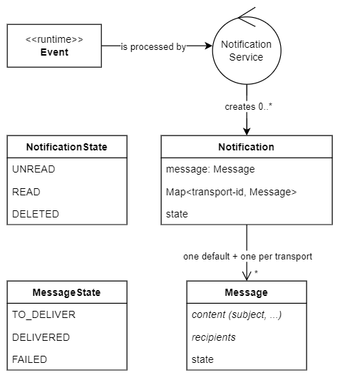

= Hypothetical Notification Design
:page-toc: top

This document is related to xref:notification-redesign.adoc[Notification Redesign] effort.
It is a hypothetical future design.

== Main design points

* Message template is separate, potentially usable outside notifications, and supports localized messages.
* Transports are configured separately (can be used by reporting as well) and only referenced from notification configuration.
Transport configuration for all notifications can still be amended, e.g. to add file debugging.
* Notification configuration can be roughly similar, just using the things above, but template can be chosen per transport.
* Runtime-wise, instead of Messages being created from an Event, the service will first create Notifications
and then Messages for them - both of these are persisted.
** Notifications are created from events after filtering and are created per recipient.
** Messages are created per transport using either the default notification template or specific template for the transport.
* Messages are not part of notification, but part of message/transport mechanism, shared with reporting and possibly other parts of midPoint.
* Notifications are inherently presentable in UI, even without transports, so tranport need not be configured for purely in-app notifications.
** Default message (used for UI) is created using the template referenced in the notification.
It is unclear whether this should be separately stored `Message` (as it is not transport related) or somehow inlined in the Notification.
I prefer the latter, also delivery state of such "message" can clearly be ignored as the notification state is enough.
* Aggregate notifications are created from stored notification - no detailed design yet.
** Additional template for aggregate notification is needed, but how to provide the input info again (original Events are not available anymore, unless stored, which is questionable).
** Alternatively, there can be just some summary info like "n notifications total, x of this type, first one was ..., last one was ...".
Summary text would not require any additional event info.
* Message delivery timing is configured for transport, user can override the config for his messages - no detailed design yet.

== Configuration

`MessageTemplate` configuration is based on newly introduced object stored in the repository.
It is not part of the system configuration anymore - templates are referenced by OID (or by name from user's perspective).

.Structures for message template configuration

Can we get rid of `subjectPrefix`?
See xref:/midpoint/reference/misc/notifications/configuration/index.adoc[Notification config] for its description.

*Transport configuration* differences from current version:

* Transport config is placed outside notification configuration in its own section.
* Multiple transports of the same type must be possible.
* Custom/file transport can still be supported just like in current version.

Whole transport mechanism should be in separate module, or at least separate API.
`Message` is concept from transport package/module.

*Notification* configuration can be similar to the current one, supporting the existing features.
Main changes are:

* Notification configuration specifies template reference instead of defining it.
** Do we want to allow inlining content of the template specification there?
I'd rather not and provide some elegant solution in the GUI.
* Template can be specified per transport, otherwise default template is used.
* Debug or other options can be added per transport.
This is important to be able to debug for instance email notifications without affecting email reports.
(Debug on transport level is possible too, of course.)
These transport options can be specified for all notifications, it's probably overkill to do so for each notification handler
and it would definitely be impractical if there was no option to do it globally for all notifications.

== Transport

Transport support in midPoint can be represented by a service which can be called from other parts (reports).
This service acts as a registry and knows how to dispatch the `Message` to the specified transport (by its name or some kind of id or key).
Current implementation uses `@Component` annotation on various transport implementations which is not flexible.
Instead, transports should be various implementations instantiated as required by the configuration and registered with the `TransportService`.

.Transport service

== Notifications

The major difference compared to the current implementations are:

* In addition to `Message` objects, there are also `Notification` objects created from the notification `Event`.
* Both `Notification` and `Message` objects are stored - they are now prism structures (probably just containers).
* Storage details are less important now, but it would be something similar to audit, possibly with partitioning.

.Notification service

* Message association is possibly aggregation or composition, perhaps we don't need notification messages when notification is deleted.
* Message type is not exclusive for Notification, the same structure can be used for sending for instance email reports.
This dictates the association direction, Notification knows about its messages, but the Message does not care.
* State of the notification and messages are tracked separately and their semantics is slightly different.
Messages are all about being delivered, notifications can be read in GUI and marked as such or even deleted.
