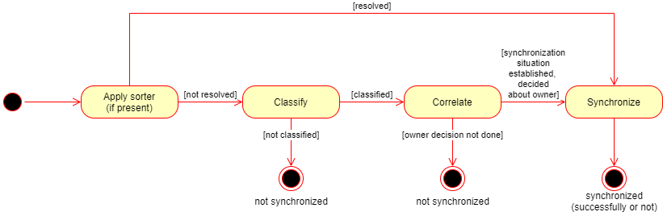

= Synchronization Flow

The whole synchronization process consists of three main sub-processes:

* resource object _classification_,
* resource object _correlation_,
* resource object _synchronization_ (in the narrow sense of the world).

The classification consists of determining xref:/midpoint/reference/resources/shadow/kind-intent-objectclass/['_kind_, _intent_, and _tag_']
values for given resource object. The correlation tries to find an owner for the object - or to determine that a new record for the owner
should be created. Finally, the synchronization propagates the information from the resource object to the owner (stored in midPoint repository)
and optionally to its projections (linked resource objects)footnote:[Potentially including the source object itself.].

The first two conceptual steps can be executed at once when so-called
xref:/midpoint/reference/synchronization/synchronization-sorter.adoc[_synchronization sorter_] is used.footnote:[The name of this component
is quite technical and may be changed in the future.]

== Classification

The classification is currently done by examining each of defined

== Correlation