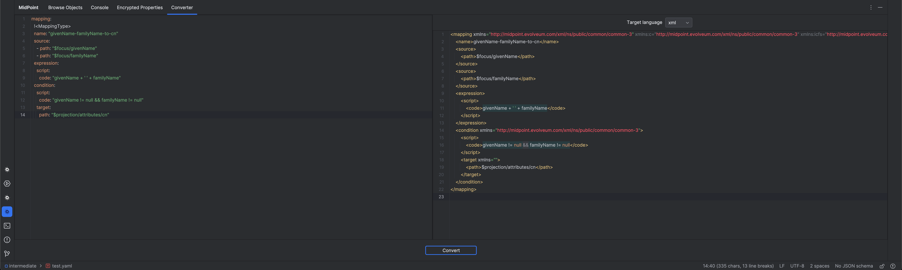

= Technical documentation MidPilot Validator Service REST API

Validation and Conversion of midPoint objects using the Prism Framework.
The MidPilot Validator REST API exposes validation-related capabilities of objects midPoint through a REST interface. These capabilities are implemented on top of the Prism framework, which is the core data modeling and schema engine used by midPoint.
Prism serves as the execution engine behind the Validator REST API.
The API itself is relatively thin: it accepts input, invokes Prism functionality, and returns structured results.

Through Prism, the Validator REST API provides two primary services:

* Validation of midPoint objects
* Conversion (serialization) of midPoint objects

In MidPoint, validation of objects is tightly integrated with the Prism framework.
Prism is responsible not only for parsing objects from XML, JSON, or YAML, but also for schema aware validation during and after parsing.

== Validation objects of Midpoint

The Prism framework supports localization aware parsing and validation of midPoint objects represented in XML, JSON, and YAML formats.
Localization information (such as line number, column number, and source location) is captured during parsing and attached to Prism’s internal representation `xNode`.
This information is then reused during validation to produce precise, source aware validation logs (the validation log is represented by the `ValidationLog` record object), significantly improving diagnostics, troubleshooting, and user feedback.

`xNode` is Prism’s low level, format neutral representation of parsed data.
Before schema binding occurs, all parsed content exists as an XNode tree.

NOTE: for XML analysis is performed using the stream method to obtain the position of tokens (most DOM APIs lose exact line/column numbers). In the future, it is best practice to replace the entire DOM analysis with Stream method (SAX or StAX)

Now, prism can also analyze incomplete objects (snippets).
Using the heuristics described below, PRISM tries to guess the correct root definition based on the information from the snippet in order to analyze it.
In case the definition of a child element is unclear, the technical report of validation log returns a list of possible item definitions.

=== Heuristic of automatic assignment Root definitions of snippet
In midPoint, PRISM sometimes receives object snippets whose root element definition is unknown.
To handle this, the heuristic method `findSupposedDefinitionByElement` in the `PrismUnmarshaller` class attempts to identify possible definitions for the root element based on:

* The name of the root element

* Its child elements

* The available definitions from schemas

This is particularly useful for:

* Partial or snippet-based input

* Pre-validation of unknown objects

* REST API input handling from validation service

* Conversion between formats (XML, JSON, YAML)

Method returns `List<ItemDefinition<?>>` – a list of candidate root definitions that match the snippet, possibly empty.
If the method returns a list with only one definition, it is assigned as the root definition and the analysis continues with the found definition.
If the list contains multiple definitions, this list is returned in the technical report as an argument in the validation protocol for further processing with precise localization.
The method for searching for a definition and automatically assigning a definition only works in `validation` mode.

=== Example validate request

==== Validate without parameters
[source,bash]
----
curl -X POST "localhost:8080/validate" \
  -H "Content-Type: application/xml" \
  -d '<schemaHandling>
    <objectType>
        <kind>account</kind>
        <intent>default</intent>
        <default>true</default>
        <delineation>
            <objectClass>user</objectClass>
        </delineation>
        <focus>
        <type>UserType</type>
        </focus>
        <attribute>
            <ref>name</ref>
            <correlator/>
            <inbound>
            <strength>strong</strength>
            <target>
            <path>name</path>
            </target>
            </inbound>
            <outbound>
            <strength>strong</strength>
            <source>
                <path>name</path>
            </source>
            </outbound>
        </attribute>
    </objectType>
</schemaHandling>'
----

==== Validate with objectType & itemPath params
[source,bash]
----
curl -X POST "localhost:8080/validate?objectType=ResourceType&itemPath=schemaHandling/objectType" \
  -H "Content-Type: application/json" \
  -d '<attribute>
        <ref>name</ref>
        <correlator/>
        <inbound>
            <strength>strong</strength>
            <target>
              <path>name</path>
            </target>
        </inbound>
        <outbound>
        <strength>strong</strength>
        <source>
          <path>name</path>
          </source>
        </outbound>
      </attribute>'
----

== Conversion objects of Midpoint
Object conversion is done using PRISM serialization.
Conversion between XML, JSON, YAML types works.

=== Example convert request
[source,bash]
----
curl -X POST "http://localhost:8080/convert?targetLanguage=xml" \
  -H "Content-Type: application/json" \
  -d '{
  "mapping": {
    "@type": "MappingType",
    "name": "givenName-familyName-to-cn",
    "source": [
      { "path": "$focus/givenName" },
      { "path": "$focus/familyName" }
    ],
    "expression": {
      "script": {
        "code": "givenName + \" \" + familyName"
      }
    },
    "condition": {
      "script": {
        "code": "givenName != null && familyName != null"
      }
    },
    "target": {
      "path": "$projection/attributes/cn"
    }
  }
}'
----

== Commands

Validate object (full or snippet) input as string.

[source,bash]
----
java -jar validation-services.jar validate <code>
----

Validate object (all or snippet) input as path of file.
Required flag -f.

[source,bash]
----
java -jar validation-services.jar validate <path-of-file> -f
----

Validate all objects (xml, json, yaml) from midpoint-samples maven repository.

[source,bash]
----
java -jar validation-services.jar validate -midpoint-samples
----

NOTE: or shortcut of -midpoint-samples

[source,bash]
----
java -jar validation-services.jar validate -ms
----

Convert object (full or snippet) input as string.
[source,bash]
----
java -jar validation-services.jar convert <code>
----

== Integrate Validate & Converter to Midpoint Studio plugin
=== Validate
Object validation takes place in the editor in the standard way provided by IntelliJ IDEA.

=== Converter

It's possible convert objects as string and file in Studio plugin.

*Convert object as file by action:*

Right-click on the selected file and select *MidPoint Actions -> Convert -> XML | JSON | YAML*

*Convert object as string:*

