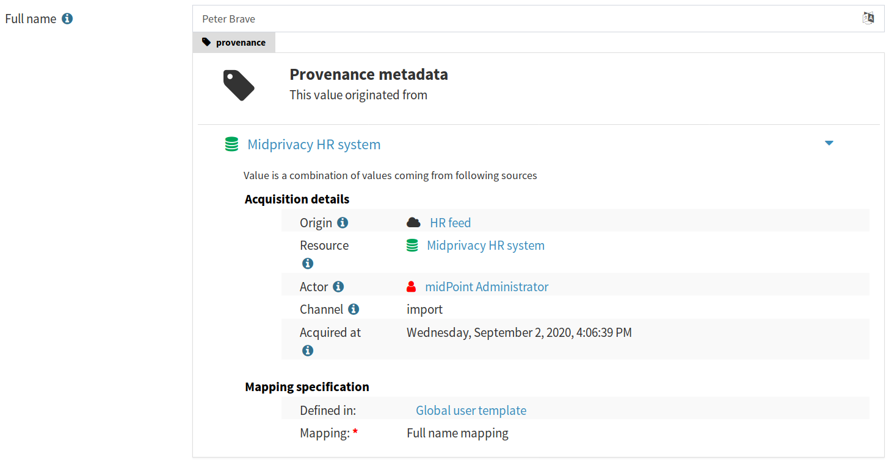

= Identity Metadata In A Nutshell
:page-toc: top

Metadata are both old and new concept in identity management.
It is an old concept as identity management systems were always dealing with some identity matadata, although the metadata were usually very simple.
Metadata is also a new concept that just being explored in depth quite recently.
The concept of metadata may be slightly confusing and difficult to understand.
But it is even harder to properly integrate it into identity management systems and understand the consequences of such integration.

This document provides introduction to identity metadata concepts, especially in context of data protection.
But more importantly it provides an overview of how metadata were implemented in midPoint, an open source identity management and governance system.
This effort is part of https://docs.evolveum.com/midpoint/midprivacy/[midPrivacy initiative] that is aimed at improvement of data protection features of midPoint.

== Data In Motion

Identity management is all about identity *data in motion*.
This may be quite surprising especially for people that are new to identity management.
Of course, identity management also deals with data at rest.
But that is not the interesting part.
Data at rest are mostly a concern for database technologies and directory services.
Identity management gets involved when the data need to _change_: when new accounts need to be created, when user needs to be disabled, new roles needs to be assigned and so on.
That is where things get interesting.

There are always many copies and forms of identity data.
You may think that your name is `Jane Doe` and that is it.
But if you need an LDAP account, the record looks like this:

[source,ldif]
----
dn:uid=jdoe,ou=people,dc=example,dc=com
...
cn: Jane Doe
givenName: Jane
sn: Doe
----

The HR application can see your name like this:

[source,csv]
----
"empno","first_name","middle_name","last_name","academic_title"
"01234",'Jane","Random","Doe","PhD."
----

Your simple web applications know you simply as `jdoe`, fancier apps may know that you are in fact `Jane Doe`, academic applications will probably need to give you credit as `Jane R. Doe, PhD. <jrd@example.edu>` and third-party applications will probably address you as `Dr. Doe`.

Most of those applications will need to store your name in its own data store.
Each of them may use slightly different variation or format.
There will be copies of the data in various application using various forms.
It is a job of identity management systems to set up those copies and to _maintain_ them.
Especially the maintenance part is where the story gets really interesting.

One day Jane meets John, they fall in love and decide to get married.
Now we have `Jane Smith` instead of `Jane Doe`.
All the copies of the data need to be updated.
There will be `jsmith`, `Jane R. Smith, PhD.` and `Dr. Smith` from now on.
This happens all the time.
Even though the data seem to be calm and serene, this is just an illusion.
Data are in a constant state of flux.
They need to be copied, transformed, combined, transferred, received, forwarded, compared, refreshed, updated, corrected and, finally, erased.
Data are in _motion_ all the time.

== Metadata and Data Protection

Data move around all the time.
And as they move, they leave traces.
Such traces are also data.
Or, more precisely, they are _data about data_.
That is what we call _metadata_.

Let's suppose that our scientific institute has a research project that is open to participation from a broad scientific community.
We want to welcome new researcher `Dr. Jane Doe` in our team.
We need to set up accounts for her, allow remote access to scientific equipment, grant access to data sets and so on.
Which means that we will maintain copies of some of Jane's personal data.
But we want to know more than that this account belongs to `Dr. Jane Doe`.
We want to know:

* When the account was created.

* Where the information came from.

* Who says that this person is Jane Doe and how reliable that information is.

* How fresh the information is, when was the last time that we have checked.

* How sensitive the information is and how we are supposed to protect it.

* Whether we do have a legal reason to process this item of personal data.

* ... and much more.

These are the _metadata_, the data that we keep about data.

Many of these things may be specified by simple global _polices_.
For example, we can say that:

____
Full name of a person is always considered public information.
It is not sensitive from confidentiality perspective, we only need to protect its integrity.
____

Such approach might work in the past.
But it is 21^st^ century already.
People may not like such a public exposure of their names.
They may not approve.
Or you may have a legal reason to process information about some persons, but you may not have the right to publicly expose such information.
This may vary on case-by-case basis.
And we may need to know where the data came from, how they were processed and what were the person's decisions about the data to tell which case it is.
As our world becomes more complex and more dynamic, it is difficult to imagine any privacy-preserving application that does not need to care about metadata.

Perhaps the most important reason that we need to maintain metadata is *accountability*.

Many people believe that the primary and most important mechanism for data protection is secrecy.
While reasonable confidentiality of data is undoubtedly important, secrecy is not going to work for data protection as the primary mechanism.
There is an old saying that two people can keep a secret if one of them is dead.
The whole point of secrecy is to *not* share data with anyone.
But secret data are not really useful.
They will do no harm, but they will do no good either.

Therefore data protection is based on controlled sharing and processing of data.
There is a legal obligation to process the data only in certain ways and only under certain conditions.
This usually means that we can process personal data only when it is necessary or when we have explicit consent.
Any other processing of personal data is illegal.
Therefore whenever we process personal data we need to be sure that we are doing that legally.
Metadata play a key role in this process.
The metadata can demonstrate that we have obtained the data from a legal source.
There can be a metadata record for all processing of the data, describing the path from the origin to target.
Metadata can point to the legal basis that is used to process the data, such as employment contract or participation agreement.
Metadata can record when and how we have obtained user's consent to use the data.
And metadata can tell us which data we need to erase when such consent is revoked.
Metadata are an essential building block for data protection mechanisms.

Also, we are under an obligation to the user to be able to demonstrate that we are processing the data legally.
User can request a report about our processing of his or her data, known as the dreaded _subject access request_ (SAR).
But in case that we keep proper metadata, answer to the most difficult parts of SAR are mostly easy.
We know where the data came from, we know how they were transformed and processed, we know whether we can process them.

Some metadata can be handled indirectly.
For example midPoint records metadata about _assignment_, which represents user's relation to organizations and roles.
This mechanism was also used to record relations to legal basis of data processing, such as contracts, agreements and consents.
Such relations can be used as a partial replacement for full metadata.
It works to some degree, but there are inherent limitations.
Full metadata support is going to be necessary, sooner or later.

== Data Model Gains New Dimension

The difficult thing about metadata is that they are adding a whole new dimension to our data model.
We need to keep metadata for every _value_ of every item in our data.

Let's have a look at a very simple JSON data about a user:

[source,json]
----
{
  "username" : "jdoe",
  "fullName" : "Jane Doe",
  "title" : "Data Protection Specialist"
}
----

This is a nice and simple data model.
We have three data items, they are all simple strings, life is nice and easy.
Even junior developers won't have much trouble describing this in any schema language, such as JSON Schema.
This example is way too simple for practical use.
But even here we can see how metadata can complicate the model:

[source,json]
----
{
  "username" : {
    "@value" : "jdoe",
    "@metadata" : {
      "timestamp" : "2020-06-22T15:29:35Z",
      "origin" : "system-generated",
      "actor" : "sync-agent-0543"
    }
  },
  "fullName" : {
    "@value" : "Jane Doe",
    "@metadata" : {
      "timestamp" : "2020-06-22T15:29:28Z",
      "origin" : "federation",
      "actor" : "idp.example.edu"
    }
  },
  "title" : {
    "@value" : "Data Protection Specialist",
    "@metadata" : {
      "timestamp" : "2020-06-24T15:31:06Z",
      "origin" : "user-provided",
      "actor" : "asmith"
    }
  }
}
----

We have three data items (`username`, `fullName` and `title`) and we have three metadata items (`timestamp`, `origin` and `actor`).
However, the resulting data structure is very complex.
If you wanted to use JSON Schema to model this data structure you will end up with a complicated definition with a lot of boilerplate.
And it gets worse.
Let's consider that `title` can have multiple values:

[source,json]
----
{
  "username" : {
    "@value" : "jdoe",
    "@metadata" : {
      "timestamp" : "2020-06-22T15:29:35Z",
      "origin" : "system-generated",
      "actor" : "sync-agent-0543"
    }
  },
  "fullName" : {
    "@value" : "Jane Doe",
    "@metadata" : {
      "timestamp" : "2020-06-22T15:29:28Z",
      "origin" : "federation",
      "actor" : "idp.example.edu"
    }
  },
  "title" : [
    {
      "@value" : "Data Protection Specialist",
      "@metadata" : {
        "timestamp" : "2020-06-24T15:31:06Z",
        "origin" : "user-provided",
        "actor" : "asmith"
      }
    },
    {
      "@value" : "Meta-wizard",
      "@metadata" : {
        "timestamp" : "2020-07-14T10:02:54Z",
        "origin" : "user-provided",
        "actor" : "jdoe"
      }
    }
   ]
  }
}
----

This is still quite a simple example - three data items, three metadata items.
Typical data models have hundreds of data items and tens of metadata items.
Metadata are _orthogonal_ to data, therefore they add a whole new dimension to data model.
The resulting data structure is effectively a cartesian product of data and metadata models.
Which makes it huge and complex.
This is clearly beyond the capabilities of any conventional schema language.
We do not recommend trying to model real scenarios in JSON Schema - for the sake of your sanity.

== Bad News For Schema-Based Systems

New data modeling dimension needed to support metadata can be quite nasty.
But what is even worse is its impact on schema-based systems.
It is a big problem for systems that are completely based on a data modeling principles.
Such as midPoint.

Every important data structure in midPoint is modeled using a data modeling language.
This has huge benefits.
Code can be generated from the data model description, making sure that code and data are aligned.
Data model documentation can be maintained in a structured form aligned with the model.
User interface can automatically adapt to data model.
It makes the system easy to extend and customize.
There are significant benefits for interfaces (APIs), data storage, authorizations and so on.
It is a huge difference for long-term maintainability and sustainability of the system.
But all of this breaks down when metadata are added to the mix.

Historically, midPoint schema was expressed in XML Schema Definition (XSD) language.
Even though this is technically a schema for XML data, midPoint has grown beyond XML many years ago.
MidPoint schema can be used to describe JSON data structure, even though the schema is technically encoded in XSD.
We have made many abstractions and extensions of XSD and we have re-engineered a good part of the old code to make this possible.
This effort has brought us almost to the point where we can support metadata.
But actually _supporting_ metadata would push XSD beyond the point where it makes sense.
It would be too much.
Change of schema language to something like JSON Schema would not help either.
JSON Schema and XSD are mostly equivalent.
Where XSD breaks, JSON Schema is going to break as well.

We are no big fans of re-invention of a wheel.
We can easily prove that as we have lived with XSD for almost a decade and we have never switched to JSON Schema.
But no link:../axiom/existing-languages-analysis/[existing schema language] that we could find seems to be suitable for our needs.
This time we just need to invent something new.
We have decided to call it _Axiom_.

== Axiom

Axiom is a data modeling language.
Primary goal of Axiom is to model data in a way that is independent of any specific representation format, such as JSON or XML.
That makes Axiom quite different from JSON Schema and XSD.
But there is yet another fundamental difference.
Axiom has a concept of _inframodel_, which means that it allows to change the fundamental infrastructure of data.
Inframodel can be used to add metadata to the data in a very systemic and clean way.

The metadata case above can be easily modeled in Axiom:

[source,axiom]
----
model identity {

    type User {
        item username { type String }
        item fullName { type String }
        item title {
            type String;
            maxOccurs unbounded;
        }
    }

    metadata IdentityMetadata {
        item timestamp { type DateTime }
        item origin { type String }
        item actor { type String }
    }
}
----

Data and metadata concepts are neatly separated in Axiom.
The code that is processing the model can generate nice and readable code for data that is not polluted by metadata concepts.
Metadata concepts can be "weaved" orthogonally to the data by data access frameworks.
This makes work with complex data and metadata feasible.

This may look simple, maybe even too simple.
But creating Axiom was a significant amount of work.
We could not simply copy and reuse concepts from XSD the same way as JSON Schema did.
That would not work for metadata.
We had to build up a whole new link:../axiom/concepts/[conceptual model].
On the other hand we still need data compatibility with JSON and XML.
It was not easy to fit all the concepts together to avoid hacks and contradictions.
But the effort was successful and link:../axiom/spec/[Axiom 0.1] was born.

Axiom is still very experimental, it is still in development.
And it is expected that it will be in development for quite some time until it can be proclaimed to be _stable_.
There is still a long way to get to Axiom 1.0.
We really want to make sure that Axiom works before we "standardize" it.

Even though Axiom is still in its early life, it is already used in midPoint to implement metadata concepts.

== Metadata In MidPoint

MidPoint is an open source identity management and governance platform.
MidPoint is a very comprehensive platform, it is perhaps the most substantial identity management solution that open source world have ever seen.
The data model of midPoint is very rich, tens of thousands lines are used just to specify the basic data model.

MidPoint is using XSD for data model specification.
Using XSD for _metadata_ would not really be feasible - not without a huge pile of ugly hacks.
But Axiom makes this a different story entirely.
While the main midPoint data model sticks to the XSD definition for the time being, Axiom will be used to add metadata to it.

MidPoint 4.2 has a build-in metadata model for basic metadata items - those that are tightly bound with midPoint processing.
When metadata processing is enabled, midPoint will store metadata for every value:

[source,json]
----
{
  "@ns" : "http://midpoint.evolveum.com/xml/ns/public/common/common-3",
  "user" : {
    "oid" : "4afaf483-bd10-4ff5-bea9-b380bd6ce500",
    "name" : {
      "@value" : "aanderson",
      "@metadata" : [
        {
          "storage" : {
            "creation" : {
              "timestamp" : "2020-06-23T14:45:12Z",
              "actorRef" : {
                "oid" : "00000000-0000-0000-0000-000000000002",
                "type" : "UserType"
              },
              "channel" : "http://midpoint.evolveum.com/xml/ns/public/gui/channels-3#user",
              ...
            }
          }
        }
      ]
    },
    "fullName" : {
      "@value" : "Alice Anderson",
      "@metadata" : [
        {
          "storage" : {
            "creation" : {
              "timestamp" : "2020-06-23T15:05:42Z",
              "actorRef" : {
                "oid" : "00000000-0000-0000-0000-000000000002",
                "type" : "UserType"
              },
              "channel" : "http://midpoint.evolveum.com/xml/ns/public/gui/channels-3#user",
              ...
            }
          }
        }
      ]
    },
    ...
  }
}
----

The object above was simply added to midPoint and then `fullName` was modified shortly after.
It shows only _storage_ metadata, that describe how the object was stored and modified in midPoint repository.
But there are other metadata types:

* *Provenance* metadata provide high-level information about origin of the value.
It specifies system, process, partner or organization that was used to obtain the data.
This is a high-level information without excessive details, designed for long-term storage with the data.

* *Storage* metadata tell about storing and modifications of objects in midPoint repository.

* *Process* metadata provide details about the business process in which the value was processed.
It specifies the person who requested the change, a person who approved it, when the value was re-certified and so on.

* *Transformation* metadata provide the details of how the value was transformed, which mappings were used and so on.
This is a detailed information meant mostly for diagnostic purposes.
It is unlikely that this will be massively stored for a long time.

* *Provisioning* metadata provide details about provisioning of the value to other systems.

== Provenance Metadata

Perhaps the most interesting part from data protection perspective is the _provenance_ part of metadata:

[source,json]
----
{
  "user" : {
    ...
    "employeeNumber" : {
      "@value" : "012345",
      "@metadata" : [
        {
          "provenance" : {
            "acquisition" : {
              "timestamp" : "2020-06-23T14:45:12Z",
              "channel" : "liveSync",
                "resourceRef" : {
                  "oid" : "52230868-b555-11ea-887a-93a6d192ea87"
                }
              },
              "originRef" : {
                # points to "HR employee feed" service to specify origin  from HR system
                "oid" : "fe330038-b562-11ea-ac2f-c344cd591e26",
                "type" : "ServiceType"
              }
            }
          }
        ]
      }
    },
    "givenName" : {
      "@value" : "Bob",
      "@metadata" : [
        {
          "provenance" : {
            "acquisition" : {
              "timestamp" : "2020-06-25T17:02:38Z",
              "channel" : "user",
              "actorRef" : {
                "oid" : "86297ce0-b556-11ea-a2d8-bb97a1c03570",
                "type" : "UserType"
              },
              "originRef" : {
                # points to "Self-service user entry" service to specify that this was entered by the user
                "oid" : "d6064cb8-b563-11ea-aabf-cb0e70300dd1",
                "type" : "ServiceType"
              }
            }
          }
        }
      ]
    },
    "fullName" : {
      "@value" : "Bob Brown",
      "@metadata" : [
        {
          "provenance" : {
            # Two acquisition values, as this value was composed from two sources
            "acquisition" : [
              {
                "timestamp" : "2020-06-23T14:45:12Z",
                "channel" : "liveSync",
                "resourceRef" : {
                  "oid" : "52230868-b555-11ea-887a-93a6d192ea87"
                }
                "originRef" : {
                  # points to "HR employee feed" service to specify origin from HR system
                  "oid" : "fe330038-b562-11ea-ac2f-c344cd591e26",
                  "type" : "ServiceType"
                }
              },
              {
                "timestamp" : "2020-06-25T17:02:38Z",
                "channel" : "user",
                "actorRef" : {
                  "oid" : "86297ce0-b556-11ea-a2d8-bb97a1c03570",
                  "type" : "UserType"
                },
                "originRef" : {
                  # points to "Self-service user entry" service to specify that this was entered by the user
                  "oid" : "d6064cb8-b563-11ea-aabf-cb0e70300dd1",
                  "type" : "ServiceType"
                }
              }
            ]
          }
        }
      ]
    },
    ...
  }
}
----

The example above shows metadata for two items: `employeeNumber` and `fullName`.
The `employeeNumber` was obtained from the HR system using an automated data feed.
The `fullName` value is a combination of two values.
One of them (probably last name) was obtained from HR data feed, the other (probably first name) was entered by the user.
You can see that _provenance_ metadata do not specify all the details, they just provide a high-level overview of data origin.
The details can be recorded in _transformation_ metadata if needed.

Key concept of data provenance is a concept of _origin_.
However, _origin_ is a very abstract concept, it is many things to many people.
It is very hard to design one unified conceptual model for provenance that will suit every need.
Therefore we have left a considerable leeway in what can be an _origin_ in midPoint provenance metadata.

The above example is using midPoint _service_ objects to specify data origins:

[source,json]
----
{
  "service" : {
    "oid" : "d6064cb8-b563-11ea-aabf-cb0e70300dd1",
    "name" : "Self-service data entry",
    "description" : "Data entered by the user using a self-service user interface."
  }
}
----

[source,json]
----
{
  "service" : {
    "oid" : "fe330038-b562-11ea-ac2f-c344cd591e26",
    "name" : "HR employee feed",
    "description" : "Automated feed of employee data from the HR system."
  }
}
----

Services may be a suitable choice as they are designed to represent such abstract concepts.
Service objects are first-class citizen in midPoint, therefore they may have associated policies,
owner may be assigned to the service to represent a responsible person, services may have lifecycle and so on.
All of that may contribute to a proper governance procedures for data sources.

However, other midPoint objects may be used to represent data origins if needed.
_Orgs_ that represent organizational units or organizations can be used instead.
Use of _roles_, especially those that represent data protection scopes may be a good choice too.
Data origins are also completely optional.
Specification of source resource for the data may be sufficient provenance information for simpler midPoint deployments.

_Origin_ is one aspect of data provenance.
It specifies where the data came from.
However, mere availability of the data does not mean we can legally process the data.
Therefore origin is related to other data protection concepts, most notable concept of _basis for data processing_.
But more on that later.

== Metadata Multiplicity

There is quite surprising and mostly counter-intuitive fact about metadata:
link:../metadata-multiplicity-problem/[metadata are inherently multi-valued].
Data may come from many sources.
For example, value of person's name may originate from HR system.
But the same value may have been entered manually by system administrators before it was synchronized with the HR system.
And the same value may come from social login process or identity provider in identity federation.
Each value may come from different place, at different time, under different circumstances.
We need to track metadata for all those data sources independently.

Therefore the metadata are modeled as multi-valued data structure.
Each metadata value represents to one source of data that we call _yield_.
Yield may represent a data source that is external to midPoint.
But it may also represent a result of midPoint mapping.
The _yields_ are identified by provenance metadata.
If a mapping produces a value that has provenance metadata equivalent to provenance metadata of any of the existing _yields_ then we consider the value (and the yield) to be the same.
Therefore provenance metadata have a special place amongst all other metadata.

== Extensible Metadata

Data model extensibility was always a crucial feature for midPoint deployments.
No two identity management deployments are the same.
There are often custom data items, data types, schemas.
Identity management deployments would not be possible without data model extensibility.

As there are data model extensions, there will be metadata model extensions.
We cannot predict all possible metadata that identity management deployments are going to use.
Therefore the metadata model is extensible in a similar way that the data model is extensible.

Axiom model can be used to extend metadata schema:

[source,axiom]
----
model loa {
    namespace "https://schema.example.com/ns/loa";

    metadata Assurance {
        itemName assurance;
        item degree { type Integer }
        item evidence { type Evidence }
    }

    type Evidence { ... }
}
----

When this model is added to midPoint schema, value metadata model is extended:

[source,json]
----
{
  "user" : {
    ...
    "givenName" : {
      "@value" : "Bob",
      "@metadata" : [
        {
          "provenance" : { ... },
          "storage" : { ... },
          "loa:assurance" : {
            "degree" : 1,
            "evidence" : "user entry"
          }
        }
      ]
    },
    ...
  }
}
----

== Metadata Mappings

Data are always in motion.
Data are copied, transferred, transformed and combined.
As the data move, metadata must move with them.

MidPoint is using a concept of _mapping_ to move data around.
It is quite natural that the same concept will be applied to metadata as well.

However, there are subtle differences between data transformation and metadata transformation.
We usually want to be quite specific about data transformations.
For example, we want our `fullName` to be a concatenation of `givenName` and `familyName`.
But we usually want to be very generic with metadata.
For example, we always want to set confidentiality label of any value to the highest label of all source values.
It does not matter whether we are computing `fullName`, `emailAddress` or any other item, we do not care which items are used as an input or what expression was used to create the output.
We will always determine confidentiality labels using the same algorithm.

The usual place where custom metadata mappings are configured is midPoint object template:

[source,json]
----
{
  "objectTemplate" : {
    ... data mappings will be here ...
    "meta" : {
      "item" : {
        "ref" : "extension/sensitivity",
        "mapping" : {
          "expression" : { ... }
        }
      }
    },
    ...
  }
}
----

Object template applies to all midPoint objects that it is configured for.
Therefore also this metadata mapping will apply to all such objects.
The mapping itself applies to `sensitivity` metadata item.
Mapping expression will be applied whenever there is need to pass `sensitivity` metadata from one value to another.

Policy-based metadata mappings such as the example above are likely to handle almost all cases of metadata transformation.
However, there may be exceptions.
Therefore there is a way how to specify metadata mapping for each particular data mapping:

[source,json]
----
{
  "objectTemplate" : {
    ...
    "mapping" : {
      "source" : [
        {
          "path" : "givenName"
        },
        {
          "path" : "familyName"
        }
      ],
      "expression" : {
        ... data mapping expression will be here ...
      },
      "target" : {
        "path" : "fullName"
      },
      "metadataMapping" : {
        "source" : {
          "path" : "extension/loa"
        },
        "expression" : { ... medata mapping expression will be here ... }
        "target" : {
          "path" : "extension/loa"
        }
      }
    },
    ...
  }
}
----

== Using Metadata

Metadata do not exist just for the sake of metadata.
Metadata are here to be _used_.
It is still not a common practice to share metadata between systems.
Almost no target system has an option to provision data accompanied by metadata.
Therefore the primary use of metadata is to provide information to the user.
At least for the time being.

Displaying metadata is still very important feature.
Metadata can support decision-making, they are foundation of accountability, and the use of metadata in troubleshooting is almost impossible to overstate.
Therefore even "simple" recording and displaying of metadata can bring significant value.

MidPoint stores metadata, therefore midPoint can display metadata in its user interface.
MidPoint is a schema-based system, behavior of midPoint is controlled by data models.
Thank to Axiom we have a model for metadata.
Therefore it is (technically) quite easy to display metadata in midPoint user interface, as it is demonstrated by a following prototype:

However, one thing is to display metadata, quite a different thing is to show them in a user-friendly and readable way.
The screenshot above shows an early prototype that received next to no user experience attention.
We plan to improve the user interface during next steps of the project.

All metadata are not created equal.
Some metadata are meant to be remembered.
They are _persistent_.
They describe aspects that do not change frequently and are worth storing.
Such as identity provenance metadata.
Then there are metadata that are ephemeral.
It is nice to compute them, we would like to show them, but we do not want to store them.
They are _transient_.
They do not provide long-term value.
Or they are just too big to be stored.
Such as troubleshooting metadata.
MidPoint has to support both metadata regimes.

[source,json]
----
{
  "objectTemplate" : {
    ...
    "meta" : {
      "item" : {
        "ref" : "extension/sensitivity",
        "persistence" : "persistent"
        }
      }
    },
    ...
  }
}
----

== Future Of MidPoint Metadata

Metadata implementation in midPoint 4.2 is just a first step to get essential metadata functionality.
There are always aspects that can be extended or improved.
Such as:

* Metadata for empty or incomplete values.
For example we may want to express that we are sure that a person does not have any criminal records.
This requires change in handling of data items, as we need to express metadata about empty data items.

* We may need to express metadata about values that does not exist, a.k.a. _negative values_.
For example, we may want to see metadata about values that were removed by mappings, including all the transformation metadata that explain why the value was removed.

Current extent of midPoint metadata is limited to essential metadata structures.
It is quite difficult to create pre-defined metadata schemas for anything else just now.
Every system is using a different set of metadata, expressing similar concepts in different schemas.
Metadata standardization process is just starting.
Therefore we have to leave most of the metadata schemas for case-by-case customization.

However, we expect that metadata standardization will progress in the future.
We may be adding more standard metadata schemas in the future.

Metadata implementation is foundation for other features, especially for data protection functionality.
Metadata can be used to implement following features in the future:

* Data retention and updates.
Metadata record the last times the data were updated.
Therefore we can determine when the data are fresh and when we need to update them.
We can also use metadata to avoid keeping data for too long.

* Legal basis evaluation.
Metadata may be used to record legal basis for data processing.
Therefore such metadata may provide information whether the data are stored and processed in accord with regulations.

* Subject access request (SAR) automation.
Part of the information needed to process SAR can be taken directly from metadata.
Therefore SAR process can be automated or semi-automated.

* Management of sensitive data.
Metadata can be used to flag sensitive data.
Metadata processing rules can also be used to make sure that data that are derived from sensitive data are automatically flagged.
Sensitivity flags can be used to focus attention of data protection personnel to the items and policies that may become a source of problems with severe impact.

Metadata mechanisms take significant part in other features:

* Progressive user profiles.

* Compliance evaluation (accountability) and compliance reporting.

* Multi-affiliation scenarios.

We expect that those features will get implemented in midPoint in the future under the umbrella of midPrivacy initiative.

== Future Of MidPoint Data Model

MidPoint project started almost a decade ago.
It has grown to the most comprehensive open source identity management platform that is currently available.
Therefore it is perhaps no big surprise that midPoint has quite a substantial data model.
The ultimate goal is to completely migrate midPoint to Axiom, both for metadata and data.
But considering such a big data model and all the complexities, we need to proceed with care.
Axiom is a new concept and it is to be expected that it is not yet perfect.
Switching midPoint data model to Axiom will be a great test for Axiom capabilities.
But we also expect that it will uncover hidden problems of current Axiom design.
We are sure that such problems can be resolved, but it will take time.
Therefore we have decided to proceed in steps.

MidPoint 4.2 will use Axiom only for metadata models (schemas), including custom metadata extensions.
All other parts of midPoint will still be using XSD.
We will try to migrate the entire midPoint data model to Axiom in future midPoint versions.
Our deepest hope is that midPoint 4.4 will run completely on Axiom, but this is still far from being certain.
Even though we migrate to Axiom, XSD will still be supported, at least for extension schemas.
We value compatibility and we need to provide MidPoint users sufficient time to migrate to Axiom.
But we hope that XSD will disappear from midPoint eventually.

== Additional Information

* link:/midpoint/midprivacy[MidPrivacy initiative home]

* link:../axiom/spec/[Axiom specification]

* link:../metadata-multiplicity-problem/[Metadata Multiplicity Problem]

* link:../outcomes/[Outcomes of midPrivacy: Data Provenance Project]
