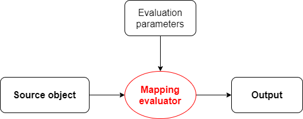

= Processing mappings

See link:https://wiki.evolveum.com/display/midPoint/Mapping[Mapping] for background information.

A mapping maps specified items in _source object_ to a change for _target item_ in target object using a _mapping evaluator_.

The main output is basically the same as in xref:../expressions/[expression evaluation]: a delta set triple. However, mapping
evaluation (compared with expression evaluation) brings the following features:

1. binding expression sources and output to object items - including features like domain and range specification,
2. condition evaluation modifying the output triple set,
3. time applicability.

== Source object
[cols="2,8a"]
|===
| Overview | Object on which the mapping is evaluated. Typically a focus or a projection.
| Type | Object-delta-object
| Multiplicity | Exactly one (for regular data mappings) or none (for metadata mappings).
|===

Mapping evaluator derives sources for the expression evaluator from the source object, using definition of _sources_
in the mapping definition (`MappingType`).

== Main output
[cols="2,8a"]
|===
| Overview | Output of the mapping evaluation.
| Type | Delta set triple
| Structure |
* plus set
* minus set
* zero set
| Multiplicity | There is a single output delta set triple. (Each set can contain zero, single, or multiple values.)
|===

== Other outputs

=== Condition output
[cols="2,8a"]
|===
| Overview | Output of the mapping evaluation condition.
| Type | Delta set triple of Boolean values
| Structure |
* plus set
* minus set
* zero set
| Multiplicity | There is a single condition output delta set triple. (Each set can contain zero, single, or multiple values.)
|===

=== Time constraints evaluation output
[cols="2,8a"]
|===
| Overview | Output of the time constraints evaluation.
| Structure |
* time constraints valid (Boolean value)
* next recompute time (timestamp)
| Multiplicity | Single value for both components.
|===

== Evaluation parameters

There is a lot of parameters, defined both statically - i.e. as part of `MappingType` - or dynamically, i.e. when mapping
evaluation is requested.

=== Statically defined evaluation parameters

==== Definition of source items
[cols="2,8a"]
|===
| Overview | Definition of mapping sources
| Type | `VariableBindingDefinitionType`
| Structure |
* `path`: specification of item within source object (may be implicit),
* `set`: specification of mapping domain i.e. values from the source item that are taken into account when evaluating the mapping,
* auxiliary information: `name`, `description`, `documentation`.
| Multiplicity | Zero, one, or more. (May be implicit.)
|===

==== Definition of target item
[cols="2,8a"]
|===
| Overview | Definition of mapping target item
| Type | `VariableBindingDefinitionType`
| Structure |
* `path`: specification of item within target object (may be implicit),
* `set`: specification of mapping range i.e. values that are expected to be managed by this mapping,
* auxiliary information: `name`, `description`, `documentation`.
| Multiplicity | Exactly one. (May be implicit.)
|===

==== Definition of the expression
[cols="2,8a"]
|===
| Overview | Definition of mapping expression
| Type | `ExpressionType`
| Multiplicity | Exactly one. (May be implicit.)
|===

See xref:../expressions/[Expression evaluation] description.

==== Condition
[cols="2,8a"]
|===
| Overview | Definition of mapping condition (see below for detailed description)
| Type | `ExpressionType`
| Multiplicity | Zero or one.
|===

==== Constraints
[cols="2,8a"]
|===
| Overview | Situations where the mapping is applied
| Structure |
* `channel` if present, denotes channel(s) that cause this mapping to be applied
* `exceptChannel` if present, denotes channel(s) that cause this mapping _not_ to be applied
|===

==== Execution properties
[cols="2,8a"]
|===
| Property | Meaning
| `authoritative` | TODO
| `exclusive` | TODO
| `strength` | TODO
|===

==== Time validity specification
[cols="2,8a"]
|===
| Item | Meaning
| `timeFrom` | TODO
| `timeTo` | TODO
|===

===== Auxiliary and unused parameters
Just for completeness let's mention here parameters that have no effect on the computation at this
level of abstraction or are not implemented at all.

[%header]
[cols="2,8a"]
|===
| Parameter | Meaning
| `extension` | Currently not used.
| `trace` | Records evaluation information to the log.
| `name`, `description`, `documentation` | For documentation purposes.
|===

=== Dynamically defined evaluation parameters

==== Context variables
[cols="2,8a"]
|===
| Overview | Context variables to be used during mapping evaluation.
| Type | Named item-delta-item or named object
| Structure |
* name (potentially null)
* object
** item-delta-item (let's call such variable _relativistic_)
** or any object: item, value, plain Java object, etc.
| Multiplicity | There can be zero, single, or multiple variables.
|===

==== Original target item values
[cols="2,8a"]
|===
| Overview | Original values of the mapping target. Currently used for range checking.
| Type | Values.
| Multiplicity | 0..n
|===

==== Condition masks
[cols="2,8a"]
|===
| Overview | Additional clause for condition evaluation.
| Type | Two boolean values
| Structure |
* `conditionMaskOld`: If set to "false" then condition for old state is considered to be false.
Used to skip evaluation for old state if we know there's nothing reasonable to be evaluated.
* `conditionMaskNew`: If set to "false" then condition for new state is considered to be false.
Used to skip evaluation for new state if we know there's nothing reasonable to be evaluated.
| Multiplicity | 1
|===

== Mapping evaluation algorithm

There are two basic steps:

1. Mapping preparation
2. Prepared mapping evaluation

=== Mapping preparation

1. Prepares values for individual sources (for condition and main expression evaluation)
 - Accepts pre-prepared `defaultSource`.
 - Prepares other sources based on their definitions and on the current state of _source object_. (This step is skipped
   for metadata mappings. There is no source object as such.) As part of source preparation, the _domain_ of the source
   (if defined) is evaluated. Any out-of-domain values are removed from the source.

2. Prepares target path and definition. This is basically a clean-up and verification of caller-provided values.

=== Prepared mapping evaluation

1. Evaluates time constraints validity (computes "valid/not-valid" flag and next recompute time, if applicable).
2. Evaluates the condition. Note that we have to evaluate condition even for mappings that are not time-valid.
This is because we want to skip trigger creation for mappings that do not satisfy the condition (see
link:https://jira.evolveum.com/browse/MID-6040[MID-6040]).

3. If time constraints are valid _and_ the condition is satisfied (i.e. either evaluated to
`true` -> `true`, or `true` -> `false` or `false` -> `true`) then:
 - Evaluates the expression, and reflects eventual condition change:
   * for `true` -> `false`, new output triple looks like this:
     ** plus set = empty
     ** minus set = original minus + original zero
     ** zero set = empty
   * for `false` -> `true`, new output triple looks like this:
     ** plus set = original plus + original zero
     ** minus set = empty
     ** zero set = empty
 - Adjusts `authoritative` = `false` setting: if present, removes output minus set, i.e. no values will be removed
   by this mapping.

4. If time constraints are valid (and regardless of condition status):
 - Evaluates the range. All original values that are found to belong to the range but are not present in output zero or plus
set, are added to the output minus set, i.e. are marked to be removed. Note that we check the range even
for not-applicable mappings i.e. those that have condition of `false` -> `false`. See also
link:https://jira.evolveum.com/browse/MID-5953[MID-5953].

Note that this algorithm does not take mapping strength (strong, normal, weak) or exclusiveness into account.
These parameters are part of mapping definition but are treated by upper layers. See xref:../mapping-sets/[mapping set
evaluation].
