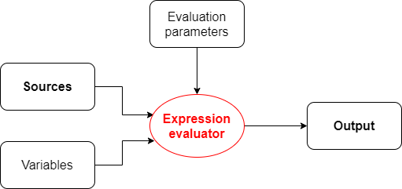

= Thoughts on integration of data and metadata processing

To recall, an _expression evaluator_ converts _sources_ and _input variables_ to _output values_ (under given evaluation parameters).

Each value being processed can have its own _value metadata_ and, therefore, we have to process this metadata
along with the data.

Metadata can be present on values from both sources and variables but for the time being we will explicitly
deal with metadata from sources only.

== Where to put metadata support?

*Should the metadata support start at the level of expression, or it is sufficient to support it for mappings?*

The answer depends on whether there are mapping-less expressions that produce values that ultimately end
somewhere in midPoint objects. It seems like there are some:

=== Category 1: Usually covered by "outer" mapping

* `PopulatorUtil.evaluatePopulateExpression` It is called when populating assignment in auto-assignment scenarios,
and also when creating assignments and/or objects in target search expression evaluators. However, the execution of
these expressions is usually done in the context of a mapping.
* `ExpressionUtil.evaluateFilterExpressionsInternal` We use expressions to evaluate filters that might be used
e.g. for target search in other expressions. Values in the filters are not important per se. What is important are
objects that result from these searches. (Like roles when we are searching them by name.) Fortunately, the most probable
context for these filter expression evaluation (that leads to inclusion of some values in objects) is target search
expression i.e. something done in the context of a mapping.

=== Category 2: Generating item values for objects but not executing in a mapping (probably need to process metadata)

* `LensUtil.formatIterationToken` Iteration token itself can contain sensitive information.
* `ObjectMerger` It computes merged values via expressions.

=== Category 3: Generating item values for objects, but probably not requiring metadata processing, at least not now

* `VariablesUtil` - evaluation of variables for bulk actions (can somehow sneak into objects)
* `ScriptingTaskCreator` - customizes scripting task (the task will contain generated values)
* `SynchronizationExpressionEvaluator.createTag` - creates tag for a projection (multi-intents)
* `PerformerCommentsFormatterImpl` - provides approver comments in string form - this is really ugly case but still valid.
* `ClockworkAuditHelper.auditEvent` - values for custom audit columns (not important for now, maybe in the future)
* Individual scripting actions that modify objects using custom values (`execute-script`, `modify`, ...)

So, metadata processing will be declared and executed at the level of mapping evaluation.
But there will be some support from expression evaluators, mainly because of the combinatorial (relative) evaluation
of scripts and other value-transforming expression evaluators.

